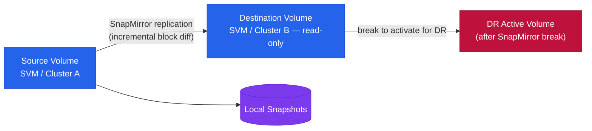

---
tags:
  - architecture
  - netapp
---
# SnapMirror — Architecture

<div class="kb-summary">
SnapMirror architecture reference — replication types (Async, Sync, SMBC, XDP), components, connectivity requirements, and DR failover procedures.

*Applies to: SnapMirror*
</div>

```text
┌──────────────────────────── NetApp SnapMirror — Replication Architecture ─────────────────────────────┐
│                                                                                                       │
│  ONTAP replication technology: async for DR, sync for Metro zero-RPO, SMBC for                        │
│  active-active; Cloud SnapMirror tiers to CVO on AWS/Azure/GCP.                                       │
│                                                                                                       │
│   ┌──────────────────────────────────────────────┐  ┌─────────────────────────────────────────────┐   │
│   │              Replication Modes               │  │                  Use Cases                  │   │
│   │          Async: low RPO, remote DR           │  │          DR: failover to secondary          │   │
│   │          Sync: 0 RPO; metro stretch          │  │             Metro: cross-site HA            │   │
│   │          SMBC: active-active; 0 RPO          │  │            Cloud: tier or migrate           │   │
│   │          Vault: long-term retention          │  │           Backup: SnapVault copies          │   │
│   │          Unified: data + protection          │  │         Dev/test: clone from mirror         │   │
│   └──────────────────────────────────────────────┘  └─────────────────────────────────────────────┘   │
│                                                                                                       │
│  SMBC requires ONTAP Mediator for automated failover without manual intervention.                     │
│                                                                                                       │
│                          ▼                                                 ▼                          │
│                                                                                                       │
│   ┌──────────────────────────────────────────────┐  ┌─────────────────────────────────────────────┐   │
│   │              Async Architecture              │  │           Sync / SMBC Architecture          │   │
│   │       Snapshots transferred as deltas        │  │          Write completes both sites         │   │
│   │          Schedule: hourly/daily/etc          │  │           RPO: zero (synchronous)           │   │
│   │         Mirror: secondary read-only          │  │          SMBC: both sides serve IO          │   │
│   │        Failover: manual break-mirror         │  │           Mediator: auto failover           │   │
│   │         Lag: RPO = transfer interval         │  │            Max distance: 10ms RTT           │   │
│   └──────────────────────────────────────────────┘  └─────────────────────────────────────────────┘   │
│                                                                                                       │
│  Physical Infrastructure (the hardware everything above runs on):                                     │
│  Primary ONTAP cluster and secondary ONTAP cluster (or CVO in cloud); intercluster                    │
│  LIFs on dedicated ports; WAN or DCI link between sites for replication traffic.                      │
│                                                                                                       │
│  Key terms:                                                                                           │
│                                                                                                       │
│  SnapMirror     = ONTAP replication technology; async, sync, or vault modes                           │
│  Async          = delta Snapshot transfers on schedule; best for remote DR sites                      │
│  Sync SnapMirror= write confirmed on both nodes before ACK; 0 RPO; requires low RTT                   │
│  SMBC           = SnapMirror Business Continuity; active-active; both serve reads/writes              │
│  SnapVault      = vault mode; secondary keeps more snapshots than primary                             │
│  RPO            = Recovery Point Objective; how much data you can afford to lose                      │
│  Break mirror   = convert secondary from read-only to writable; DR activation step                    │
│  Mediator       = ONTAP Mediator VM; tiebreaker for SMBC automated failover                           │
│  Intercluster LIF= dedicated IP address for cluster-to-cluster replication traffic                    │
│  Cloud SnapMirror= replicate ONTAP volumes to Cloud Volumes ONTAP (CVO) on cloud                      │
│  Lag time       = how far behind the secondary is; = RPO in async mode                                │
│  CVO            = Cloud Volumes ONTAP; ONTAP on public cloud; SnapMirror target                       │
│                                                                                                       │
└───────────────────────────────────────────────────────────────────────────────────────────────────────┘
```




<div class="kb-grid kb-grid-3">
<a class="kb-card" href="how-it-works/"><strong>How It Works</strong><span>Replication types, components, connectivity, CLI commands, DR failover sequence, and SVM-level replication.</span></a>
<a class="kb-card" href="integrations/"><strong>Integrations</strong><span>Integration with other platforms and external systems.</span></a>
<a class="kb-card" href="design-standards/"><strong>Design Standards</strong><span>Naming conventions, policy baseline, and configuration checklist.</span></a>
</div>

| Type | RPO | Description |
|---|---|---|
| SnapMirror Async | Configurable, minutes to hours | Standard volume replication; transfers run on a schedule; destination read-only DP volume |
| SnapMirror Sync | Zero RPO | Every write acknowledged on both source and destination; requires <5ms RTT |
| SMBC (AutomatedFailOver) | Zero RPO, transparent failover | Consistency group-based; mediator-assisted automatic failover; no host reconfiguration |
| SnapVault / XDP | Daily/weekly backup copies | Extended data protection; independent retention on destination |


