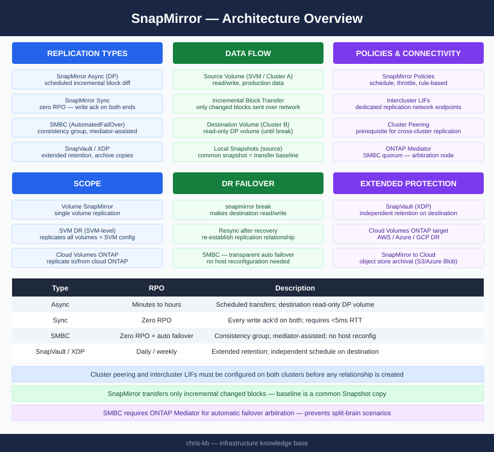
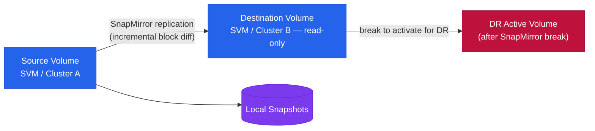

# SnapMirror — Architecture

<div class="kb-summary">
SnapMirror architecture reference — replication types (Async, Sync, SMBC, XDP), components, connectivity requirements, and DR failover procedures.
</div>
```text
┌────────────────────────────────── NetApp SnapMirror — Architecture ───────────────────────────────────┐
│                                                                                                       │
│   ┌───────────────────────────────────────────────────────────────────────────────────────────────┐   │
│   │ SnapMirror architecture overview: ONTAP replication technology for DR, backup, and business c │   │
│   │     Protocols: SnapMirror protocol (encrypted) · NFS/SMB/iSCSI at destination after break     │   │
│   │             Key components: Intercluster LIFs, SnapMirror engine, Mediator, SM-BC             │   │
│   │          Design principles: HA, scalability, non-disruptive operations, and security          │   │
│   └───────────────────────────────────────────────────────────────────────────────────────────────┘   │
│                                                                                                       │
│    Design → deploy → configure → validate → monitor → optimise                                        │
│                                                                                                       │
│                  ▼                                ▼                                ▼                  │
│                                                                                                       │
│   ┌─────────────────────────────┐  ┌─────────────────────────────┐  ┌─────────────────────────────┐   │
│   │            Layer            │  │          Component          │  │            Notes            │   │
│   │            Async            │  │        Periodic sync        │  │         RPO: minutes        │   │
│   │             Sync            │  │           Zero RPO          │  │          Sub-ms lag         │   │
│   │            SM-BC            │  │        Active-active        │  │        Transparent FO       │   │
│   │            Vault            │  │        Long retention       │  │         Backup copy         │   │
│   │            Cloud            │  │         ONTAP → CVO         │  │       Cloud DR/backup       │   │
│   └─────────────────────────────┘  └─────────────────────────────┘  └─────────────────────────────┘   │
│                                                                                                       │
│                          ▼                                                 ▼                          │
│                                                                                                       │
│   ┌───────────────────────────────────────────────────────────────────────────────────────────────┐   │
│   │    Component     │     Purpose      │      Protocol     │       Auth       │      Notes       │   │
│   │ Async SnapMirror │  DR replication  │    SM protocol    │   Certificate    │   RPO minutes    │   │
│   │ Sync SnapMirror  │  Zero-RPO sync   │    SM protocol    │   Certificate    │ StrictSync/Sync  │   │
│   │      SM-BC       │ Active-active SA │    SM protocol    │     Mediator     │    No RPO/RTO    │   │
│   │    SnapVault     │ Backup retention │    SM protocol    │   Certificate    │ Longer retentio  │   │
│   └───────────────────────────────────────────────────────────────────────────────────────────────┘   │
│                                                                                                       │
│    Physical: Source ONTAP cluster · destination ONTAP cluster · intercluster LIFs · WAN link          │
│                                                                                                       │
│    Key terms:                                                                                         │
│                                                                                                       │
│    SnapMirror         = ONTAP replication; transfers only changed blocks after initial baseline sync  │
│    Intercluster LIF   = dedicated logical interface for SnapMirror traffic between clusters           │
│    SnapMirror policy  = defines schedule, retention, and transfer type (async/sync/vault)             │
│    Baseline transfer  = first full snapshot transfer establishing the SnapMirror relationship         │
│    Update             = incremental transfer; only sends new or changed blocks since last successfu...│
│    Snapmirror break   = breaks the DR relationship; activates destination volume for read-write       │
│    Resync             = re-establishes a broken SnapMirror relationship from the last common snapshot │
│    SM-BC              = SnapMirror Business Continuity; synchronous zero-RPO active-active SAN volumes│
│    Mediator           = ONTAP Mediator; quorum service for SM-BC running on Linux VM at third site    │
│    SnapVault          = SnapMirror variant for backup retention; destination has independent schedule │
│    MirrorAndVault     = policy combining SnapMirror DR and SnapVault backup retention copies          │
│    Fanout             = single source volume replicating to multiple destination clusters simultane...│
│                                                                                                       │
└───────────────────────────────────────────────────────────────────────────────────────────────────────┘
```




<div class="kb-grid kb-grid-3">
<a class="kb-card" href="how-it-works/"><strong>How It Works</strong><span>Replication types, components, connectivity, CLI commands, DR failover sequence, and SVM-level replication.</span></a>
<a class="kb-card" href="integrations/"><strong>Integrations</strong><span>Integration with other platforms and external systems.</span></a>
<a class="kb-card" href="design-standards/"><strong>Design Standards</strong><span>Naming conventions, policy baseline, and configuration checklist.</span></a>
</div>

| Type | RPO | Description |
|---|---|---|
| SnapMirror Async | Configurable, minutes to hours | Standard volume replication; transfers run on a schedule; destination read-only DP volume |
| SnapMirror Sync | Zero RPO | Every write acknowledged on both source and destination; requires <5ms RTT |
| SMBC (AutomatedFailOver) | Zero RPO, transparent failover | Consistency group-based; mediator-assisted automatic failover; no host reconfiguration |
| SnapVault / XDP | Daily/weekly backup copies | Extended data protection; independent retention on destination |


