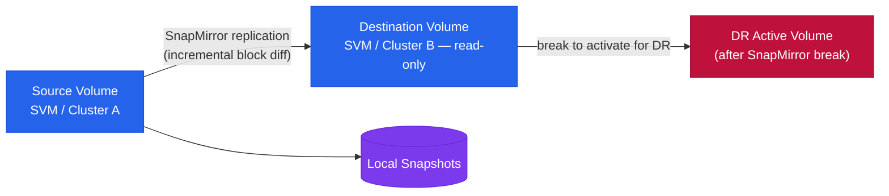

# SnapMirror — Architecture

SnapMirror architecture reference — replication types (Async, Sync, SMBC, XDP), components, connectivity requirements, and DR failover procedures.

<a class="kb-card" href="how-it-works/"><strong>How It Works</strong>Replication types, components, connectivity, CLI commands, DR failover sequence, and SVM-level replication.</a>
<a class="kb-card" href="integrations/"><strong>Integrations</strong>Integration with other platforms and external systems.</a>
<a class="kb-card" href="design-standards/"><strong>Design Standards</strong>Naming conventions, policy baseline, and configuration checklist.</a>

| Type | RPO | Description |
|---|---|---|
| SnapMirror Async | Configurable, minutes to hours | Standard volume replication; transfers run on a schedule; destination read-only DP volume |
| SnapMirror Sync | Zero RPO | Every write acknowledged on both source and destination; requires <5ms RTT |
| SMBC (AutomatedFailOver) | Zero RPO, transparent failover | Consistency group-based; mediator-assisted automatic failover; no host reconfiguration |
| SnapVault / XDP | Daily/weekly backup copies | Extended data protection; independent retention on destination |

