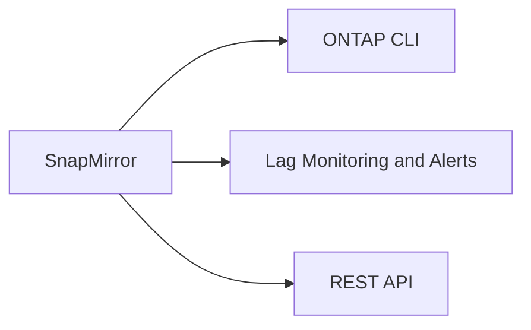

# SnapMirror CLI Reference

> Part of the [SnapMirror](../) reference.



---

## ONTAP CLI

All commands are run from the ONTAP cluster shell. Use `cluster1::>` prompt notation.

| Command | Purpose |
|---|---|
| `snapmirror show` | Display all SnapMirror relationships |
| `snapmirror status` | High-level status of all relationships |
| `snapmirror update` | Trigger an incremental transfer |
| `snapmirror initialize` | Baseline transfer for a new relationship |
| `snapmirror resync` | Re-establish a broken relationship |
| `snapmirror break` | Quiesce and break the mirror (R/W at destination) |
| `snapmirror quiesce` | Pause transfers without breaking the relationship |
| `snapmirror abort` | Stop an in-progress transfer |
| `snapmirror delete` | Remove a relationship |
| `snapmirror create` | Define a new SnapMirror relationship |

### Status and Inspection

```bash
# Show all relationships with key fields
snapmirror show -fields source-path,destination-path,relationship-status,mirror-state,lag-time,healthy

# Show only unhealthy relationships
snapmirror show -fields source-path,destination-path,lag-time,unhealthy-reason -healthy false

# Show a specific relationship
snapmirror show -destination-path svm_dr:vol_data

# Verbose relationship detail
snapmirror show -destination-path svm_dr:vol_data -instance

# Lag time and health for threshold alerting
snapmirror show -fields lag-time,healthy | grep -v true
```

### Create and Initialize

```bash
# Create an async SnapMirror relationship (XDP — preferred for SVM-DR and volume DR)
snapmirror create -source-path svm_prod:vol_data \
  -destination-path svm_dr:vol_data \
  -policy MirrorAllSnapshots -schedule hourly

# Create with a custom throttle (KB/s)
snapmirror create -source-path svm_prod:vol_data \
  -destination-path svm_dr:vol_data \
  -policy MirrorAllSnapshots -max-transfer-rate 51200

# Initialize (baseline copy — can take hours for large volumes)
snapmirror initialize -destination-path svm_dr:vol_data

# Initialize all relationships on a specific destination SVM
snapmirror initialize -destination-path svm_dr:*

# Check initialization progress
snapmirror show -destination-path svm_dr:vol_data -fields transfer-progress,bytes-transferred
```

### Updates and Quiesce

```bash
# Manual incremental update
snapmirror update -destination-path svm_dr:vol_data

# Update all volumes on a destination SVM
snapmirror update -destination-path svm_dr:*

# Quiesce (stop new transfers, allow current to finish)
snapmirror quiesce -destination-path svm_dr:vol_data

# Abort an in-progress transfer
snapmirror abort -destination-path svm_dr:vol_data -h
```

### DR Failover Procedure

```bash
# Step 1: Quiesce (allow final transfer to finish if possible)
snapmirror quiesce -destination-path svm_dr:vol_data

# Step 2: Update to minimise RPO
snapmirror update -destination-path svm_dr:vol_data

# Step 3: Break the mirror (destination becomes read-write)
snapmirror break -destination-path svm_dr:vol_data

# Step 4: Mount the destination volume
volume mount -vserver svm_dr -volume vol_data -junction-path /vol_data

# Step 5: Create/update NFS export or CIFS share on DR SVM as needed
# Update DNS to point to DR SVM LIF
vserver services name-service dns hosts create -vserver svm_dr \
  -address 10.10.20.50 -hostname app.example.com
```

### Failback Sequence

```bash
# After source is recovered — re-establish reverse mirror from DR back to source

# Step 1: Resync (source becomes destination, DR stays R/W)
snapmirror resync -source-path svm_dr:vol_data \
  -destination-path svm_prod:vol_data

# Step 2: Wait for sync, then quiesce DR side
snapmirror update -destination-path svm_prod:vol_data
snapmirror quiesce -destination-path svm_prod:vol_data

# Step 3: Break from DR back to prod
snapmirror break -destination-path svm_prod:vol_data

# Step 4: Re-establish original direction
snapmirror resync -destination-path svm_dr:vol_data

# Step 5: Verify
snapmirror show -destination-path svm_dr:vol_data -fields mirror-state,lag-time
```

### Delete a Relationship

```bash
# Must quiesce/break first if Snapmirrored
snapmirror quiesce -destination-path svm_dr:vol_data
snapmirror break  -destination-path svm_dr:vol_data
snapmirror delete -destination-path svm_dr:vol_data

# Remove destination volume snapshots left behind
snapshot delete -vserver svm_dr -volume vol_data -snapshot "snapmirror*" -force
```

---

## Lag Monitoring and Alerts

```bash
# List all relationships with lag over 2 hours (manual check)
snapmirror show -fields source-path,destination-path,lag-time | \
  awk '$3 > "0:2:0:0"'

# Show RDF group / policy schedule (to cross-check expected lag)
snapmirror policy show -policy MirrorAllSnapshots
snapmirror schedule show

# EMS-based alert (set threshold at 4 hours)
event notification destination create -name snap-lag-email \
  -mail admin@example.com
event notification create -filter-name SnapMirrorLag \
  -destinations snap-lag-email
```

---

## REST API

Base URL: `https://<cluster-mgmt-ip>/api`

```bash
# Authenticate (basic auth inline — use stored creds in production)
BASEURL="https://ontap-cluster.example.com/api"
AUTH="-u admin:password"

# List all SnapMirror relationships
curl -sk $AUTH "$BASEURL/snapmirror/relationships" | \
  python3 -m json.tool

# Filter by state (broken-off)
curl -sk $AUTH "$BASEURL/snapmirror/relationships?mirror_state=broken_off" | \
  python3 -m json.tool

# Get a single relationship by UUID
curl -sk $AUTH "$BASEURL/snapmirror/relationships/<uuid>" | python3 -m json.tool

# Trigger an update (PATCH state to snapmirrored)
curl -sk -X PATCH $AUTH "$BASEURL/snapmirror/relationships/<uuid>" \
  -H "Content-Type: application/json" \
  -d '{"state":"snapmirrored"}' | python3 -m json.tool

# Break a relationship (PATCH state to broken_off)
curl -sk -X PATCH $AUTH "$BASEURL/snapmirror/relationships/<uuid>" \
  -H "Content-Type: application/json" \
  -d '{"state":"broken_off"}' | python3 -m json.tool

# Initialize a new relationship
curl -sk -X POST $AUTH "$BASEURL/snapmirror/relationships/<uuid>/transfers" \
  -H "Content-Type: application/json" -d '{}' | python3 -m json.tool

# Check active transfers
curl -sk $AUTH "$BASEURL/snapmirror/relationships/<uuid>/transfers" | python3 -m json.tool
```
