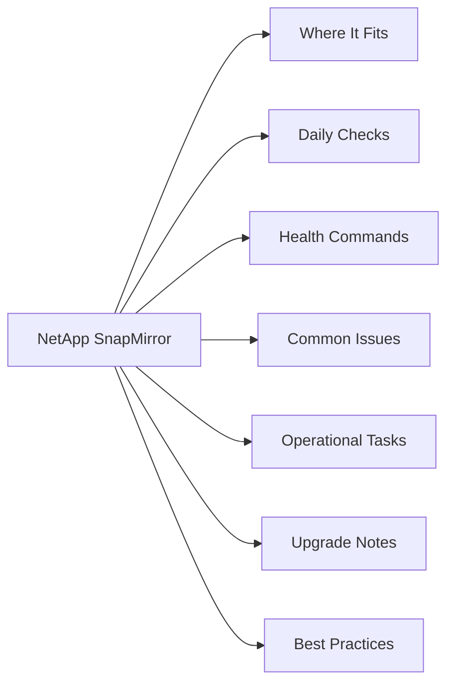

# NetApp SnapMirror

<a class="kb-card" href="architecture/"><strong>Architecture</strong>HA topology, components, connectivity, and sizing.</a>
<a class="kb-card" href="standards/"><strong>Standards</strong>Naming conventions, build baseline, and configuration checklist.</a>
<a class="kb-card" href="lifecycle/"><strong>Lifecycle</strong>Version matrix, upgrade paths, EOL tracking, and refresh planning.</a>
<a class="kb-card" href="operations/"><strong>Operations</strong>Daily checks, health monitoring, maintenance tasks, and runbooks.</a>
<a class="kb-card" href="cli-reference/"><strong>CLI Reference</strong>Command reference by category with syntax and examples.</a>
<a class="kb-card" href="scripts/"><strong>Scripts</strong>Automation scripts for daily checks, health, health, incident triage, and validation.</a>
<a class="kb-card" href="troubleshooting/"><strong>Troubleshooting</strong>Common issues, diagnostic commands, log locations, and error codes.</a>
<a class="kb-card" href="integration/"><strong>Integration</strong>VMware, backup tools, monitoring, authentication, and API integration.</a>
<a class="kb-card" href="security/"><strong>Security</strong>Hardening checklist, RBAC, encryption, audit logging, and compliance.</a>
<a class="kb-card" href="vendor-support/"><strong>Vendor Support</strong>Opening a case, information to collect, support portal, and SLA tiers.</a>

<a class="kb-card" href="relationship-health/">
  <strong>Relationship Health</strong>
  Relationship Health notes, checks, commands, and references.
</a>

## Overview

NetApp SnapMirror is ONTAP's native replication engine for volume and SVM-level data protection, supporting disaster recovery and long-term backup retention. It operates in asynchronous mode (RPO-based, most common), synchronous mode (zero RPO, requires sub-10ms inter-site latency), and XDP mode (extended data protection, replacing legacy SnapVault for disk-to-disk backup with independent retention). Relationships are always managed from the destination cluster, and SnapMirror Business Continuity (SMBC/AutomatedFailOver) extends synchronous replication with transparent host-level failover for SAN workloads.

## Where It Fits

| Use Case |
|---|
| Disaster recovery replication between primary and secondary ONTAP clusters (async, RPO in minutes) |
| Zero-RPO synchronous replication for tier-1 SAN workloads requiring no data loss (SnapMirror Synchronous) |
| Long-term backup retention on secondary storage using XDP relationships with vault policies (replacing SnapVault) |
| SVM-level disaster recovery to replicate an entire data SVM including volumes, LIF configuration, and CIFS shares |
| SnapMirror Business Continuity (SMBC) for metro-cluster-like transparent failover without host-side changes |
| Cloud tiering and replication to ONTAP Select or Cloud Volumes ONTAP using the same SnapMirror interface |

## Daily Checks

| Check | Command | Notes |
|---|---|---|
| Check all relationship health and lag times | `snapmirror show -fields lag-time,healthy` |  |
| Confirm no relationships are in `broken-off` state after a DR test tha | `broken-off` |  |
| Verify scheduled transfers completed successfully; look for `Last Transfer Type | `Last Transfer Type: scheduled` |  |
| Review the lag time on critical volumes against your defined RPO thres |  |  |
| Check for any `unhealthy` relationships and review the reason field fo | `unhealthy` |  |
| Confirm SnapMirror synchronous relationships show `In-Sync` status | `In-Sync` |  |
| Review transfer queue depth on the destination cluster for any backlog |  |  |
| Verify SMBC mediator connectivity if AutomatedFailOver policies are in |  |  |

## Health Commands

~~~bash
# Show all SnapMirror relationships with lag time and health status
snapmirror show -fields lag-time,healthy,last-transfer-end-timestamp

# Show full detail for a specific relationship
snapmirror show -destination-path svm_dst:vol_dst

# Show relationships currently in broken-off state
snapmirror show -relationship-status broken-off

# Trigger an immediate incremental update to a destination volume
snapmirror update -destination-path svm_dst:vol_dst

# Resync a broken-off relationship (direction: dst -> src re-established)
snapmirror resync -destination-path svm_dst:vol_dst

# Break a relationship for DR failover (makes destination read-write)
snapmirror break -destination-path svm_dst:vol_dst

# Initialize a new relationship (baseline transfer)
snapmirror initialize -destination-path svm_dst:vol_dst

# Quiesce a relationship (pause future transfers, finishes current)
snapmirror quiesce -destination-path svm_dst:vol_dst

# Show transfer history and last transfer size
snapmirror show-history -destination-path svm_dst:vol_dst
~~~

## Common Issues

| Symptom | Likely Cause | Action |
|---|---|---|
| Lag time growing beyond RPO | Insufficient network bandwidth, large change rate, or transfer schedule too infrequent | Check `snapmirror show -fields transfer-bytes,lag-time`; increase transfer frequency or throttle competing traffic |
| Relationship in `broken-off` state | DR test was run (`snapmirror break`) and relationship was never resynced | Run `snapmirror resync -destination-path svm:vol` from the destination cluster; verify data direction before resyncing |
| Initialize failing with "destination volume is not of type DP" | Destination volume was created as a RW volume instead of DP type | Delete and recreate the destination volume with `-type DP`; rerun `snapmirror initialize` |
| XDP relationship unhealthy — source snapshot missing | Source snapshot used as a common base was deleted before the XDP transfer completed | Run `snapmirror resync` to establish a new common snapshot baseline; monitor next scheduled transfer |
| SnapMirror Synchronous showing `Out-of-Sync` | Network interruption between sites caused synchronous RPO breach | Check inter-cluster LIF connectivity; relationship will auto-resync once connectivity restores if within the resync window |
| SVM DR relationship update failing | SVM configuration change on source (new LIF, volume) not yet reflected on destination | Run `snapmirror update -destination-path svm_dst:` at SVM level to force a configuration sync |

## Operational Tasks

| Task | Command |
|---|---|
| Create new async XDP relationship | `snapmirror create -type XDP -policy MirrorAllSnapshots` |
| Break a relationship for DR failover | `snapmirror quiesce`, `snapmirror break` |
| Resync after DR test | `snapmirror resync -destination-path` |
| Update lag-critical volumes outside schedule | `snapmirror update` |
| Reverse resync for failback | `snapmirror resync` |
| Modify transfer schedule or throttle bandwidth by updating the SnapMirror policy |  |
| Monitor all relationships centrally from ONTAP System Manager or use the ONTAP R |  |
| Delete a relationship cleanly | `snapmirror quiesce`, `snapmirror break` |

## Upgrade Notes

| Step | Action |
|---|---|
| 1 | Review the ONTAP Interoperability Matrix — SnapMirror requires the destination cluster ONTAP version to be equal to or newer than the source; never replicate to a lower version |
| 2 | Quiesce non-critical SnapMirror relationships before upgrading the source cluster to avoid transfer failures during the rolling upgrade |
| 3 | Upgrade the destination cluster first if upgrading both clusters, then upgrade the source — this maintains replication compatibility |
| 4 | After ONTAP upgrade, verify all relationships return to healthy state: `snapmirror show -fields healthy` should show `true` for all |
| 5 | For SMBC/AutomatedFailOver relationships, confirm the ONTAP Mediator service is updated to the version compatible with the new ONTAP release before upgrading clusters |
| 6 | Test a manual `snapmirror update` on a representative volume post-upgrade to confirm transfers are functioning correctly |
| 7 | Review the ONTAP release notes for any SnapMirror policy or command deprecations that affect your automation scripts |

## Best Practices

| Recommendation | Detail |
|---|---|
| Always monitor lag time against your defined RPO | set ONTAP EMS alerts on `snapmirror.lag.warn` thresholds so you know before an RPO breach |
| Use consistency groups (CGs) for multi-volume workloads | Use consistency groups (CGs) for multi-volume workloads (e.g., database data + log volumes) to ensure crash-consistent replication across related volumes |
| Never leave a relationship in `broken-off` state after a DR test | resync immediately to restore protection; track DR tests in a runbook with mandatory resync steps |
| Use XDP with `MirrorAndVault` policy for DR relationships | Use XDP with `MirrorAndVault` policy for DR relationships that also need long-term snapshot retention on the destination, avoiding the need for a separate SnapVault relationship |
| Test complete failover and failback procedures (not just `snapmirror break`) at least annually | include host-side mount, application start, and failback steps |
| For SnapMirror Synchronous, validate that inter-site latency is consistently below 10ms RTT | sustained latency above this threshold forces an automatic demotion to async mode |
| Label relationships with comments using `-comment` to | Label relationships with comments using `-comment` to document ownership, RPO tier, and last test date for operational visibility |
| Use SVM-DR (not just volume-level relationships) for | Use SVM-DR (not just volume-level relationships) for workloads where full SVM configuration (shares, exports, LIFs) must be recoverable at the DR site |
