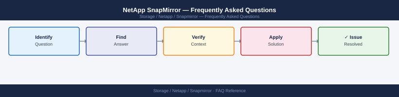

---
tags:
  - netapp-snapmirror
  - faq
  - operations
---
# NetApp SnapMirror — Frequently Asked Questions

<div class="kb-summary">
Common questions about NetApp SnapMirror operations, configuration, and troubleshooting. For step-by-step procedures, see the <a href="index.md">Operations</a> section.
</div>



```d2
direction: right

hub: "SnapMirror\nOperations" {shape: hexagon}
general: "General" {shape: rectangle}
configuration: "Configuration" {shape: rectangle}
operations: "Operations" {shape: rectangle}
troubleshooting: "Troubleshooting" {shape: rectangle}
backup_and_recovery: "Backup and Recovery" {shape: rectangle}

hub -> general
hub -> configuration
hub -> operations
hub -> troubleshooting
hub -> backup_and_recovery
```

## General

**Q: How do I check SnapMirror relationship status across all volumes?**
A: `snapmirror show -fields state,lag-time,health` from ONTAP CLI. Use SnapCenter or BlueXP for a GUI view. All relationships should show `Snapmirrored` state with lag below the RPO target.

**Q: How do I check the current NetApp SnapMirror version?**
A: `snapmirror show -fields state,lag-time,health`

## Configuration

**Q: What is the default SnapMirror schedule and when should it change?**
A: No default schedule is set — you define the schedule per relationship. Typical baseline: hourly for critical volumes, daily for standard. For near-zero RPO, use SnapMirror Synchronous (SM-S).

**Q: How do I enable SnapMirror throttling to avoid WAN saturation?**
A: `snapmirror modify -destination-path <path> -max-transfer-rate 100MB`. Throttle during business hours and release overnight. Use `snapmirror show -fields transfer-size` to monitor transfer rates.

## Operations

**Q: How do I pause SnapMirror during an ONTAP upgrade and resume without resync?**
A: Quiesce before upgrade: `snapmirror quiesce -destination-path <path>`. After upgrade, resume: `snapmirror resume -destination-path <path>`. Resync is not needed unless the relationship is broken.

**Q: What is the correct procedure to set up a new SnapMirror relationship?**
A: Create destination volume (DP type): `volume create -vserver dst -volume dst_vol -type DP`. Initialize relationship: `snapmirror create -source-path src:src_vol -destination-path dst:dst_vol -type XDP -policy MirrorAllSnapshots`. `snapmirror initialize`.

## Troubleshooting

**Q: SnapMirror shows 'lag-time > RPO target'. What does it mean?**
A: The replica is behind the defined recovery point objective. Check transfer status: `snapmirror show -instance`. Look for errors. Manually trigger update: `snapmirror update -destination-path <path>`. Check network bandwidth.

**Q: SnapMirror transfers are not completing within the schedule interval — where do I start?**
A: Check transfer rate vs data change rate. Increase throttle limit or reduce change rate. Enable compression: `snapmirror modify -compression true`. Switch to XDP with `MirrorAndVault` policy to reduce initial baseline transfers.

## Backup and Recovery

**Q: How often should I verify SnapMirror relationship health?**
A: Daily automated check via `snapmirror show -health false` in a monitoring script. Alert on any unhealthy relationship. Test failover quarterly by breaking and resyncing a non-production relationship.

**Q: How do I restore from SnapMirror when the source volume is lost?**
A: Break the SnapMirror relationship on the destination: `snapmirror break -destination-path <path>`. The destination becomes read-write. Mount it on the target host. After source recovery, reverse-resync: `snapmirror resync -source-path dst:dst_vol -destination-path src:src_vol`.

## See Also

- [NetApp SnapMirror Operations](index.md)
- [NetApp SnapMirror Troubleshooting](../../../troubleshooting/index.md)
