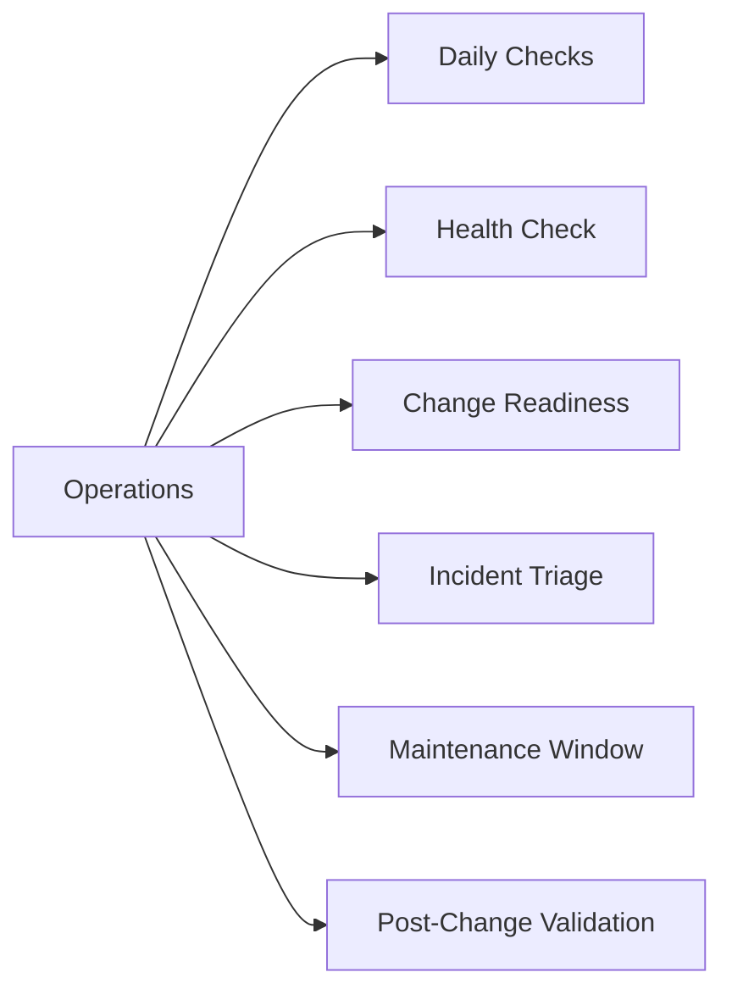

# Operations

> Part of the [NetApp SnapMirror](../) reference.

---

## Daily Checks

| Check | Command | Notes |
|---|---|---|
| [ ] Run `snapmirror show -fields lag-time,healthy,state` | `snapmirror show -fields lag-time,healthy,state` | confirm all relationships are healthy with lag within RPO thresholds |
| [ ] Flag any relationship with `healthy | `healthy: false` | review the reason field for root cause |
| [ ] Flag any relationship with lag exceeding the defined RPO (typicall |  |  |
| [ ] Check for relationships in `broken-off` state from DR tests that have not been resynced | `snapmirror show -relationship-status broken-off` |  |
| [ ] Check XDP (SnapVault) relationships are up to date | `snapmirror show -type XDP -fields lag-time,healthy` |  |
| [ ] Verify transfer schedules are running as expected | `snapmirror show -fields schedule,last-transfer-end-timestamp` |  |
| [ ] For SMBC/AutomatedFailOver |  |  |

## Health Check

- [ ] All relationships show `healthy: true`
- [ ] No relationships in `broken-off` state
- [ ] All lag times are within the defined RPO for their relationship type
- [ ] SnapMirror Synchronous relationships show `In-Sync` (not `Out-of-Sync`)
- [ ] SMBC mediator is reachable if AutomatedFailOver policies are configured
- [ ] Destination aggregate has sufficient free space for incoming transfers
- [ ] No transfer queue backlog on the destination cluster

~~~bash
# Show all relationships with lag time, health, and state
snapmirror show -fields source-path,destination-path,lag-time,healthy,state,last-transfer-end-timestamp

# Show only unhealthy relationships
snapmirror show -fields lag-time,healthy -health-status unhealthy

# Show relationships in broken-off state
snapmirror show -relationship-status broken-off

# Show XDP (SnapVault) relationships specifically
snapmirror show -type XDP -fields lag-time,healthy,state

# Show transfer history — check for failures in the last 24 hours
snapmirror history show -fields source-path,destination-path,status,transfer-size

# Show SnapMirror Synchronous relationships and sync state
snapmirror show -type sync -fields lag-time,healthy,is-healthy
~~~

## Change Readiness

- [ ] All relationships are healthy before quiescing — check `snapmirror show -fields healthy` returns `true` for all
- [ ] Lag is within RPO on all critical volumes — document baseline lag before the change
- [ ] No relationships are in `broken-off` state from a prior DR test — resync before entering the change window
- [ ] Destination aggregate has at least 20% free space to continue receiving transfers after the change
- [ ] Transfer schedules reviewed — plan the maintenance window to avoid overlapping with scheduled large transfers
- [ ] SnapMirror quiesce plan documented for source volumes involved in the change: `snapmirror quiesce -destination-path <svm:vol>`
- [ ] SMBC mediator reachable and pod state healthy before any change to synchronous relationships

| Item | Status | Notes |
|---|---|---|
| All relationships healthy | | |
| Lag within RPO on all critical volumes | | |
| No broken-off relationships | | |
| Destination aggregate has free space | | |
| SMBC mediator reachable (if applicable) | | |

## Incident Triage

- [ ] Run `snapmirror show -fields lag-time,healthy,state` — identify which relationships are affected
- [ ] Check the `reason` field on unhealthy relationships: `snapmirror show -destination-path <svm:vol>` for full detail
- [ ] Check network bandwidth between source and destination — large lag increases often point to bandwidth saturation: `network port show` and review inter-cluster LIF stats
- [ ] Check destination volume space: `volume show -vserver <dst-svm> -volume <dst-vol> -fields used-percent` — a full destination volume blocks transfers
- [ ] For `broken-off` state: determine if this was an intentional DR test or an unplanned break; do not resync without confirming data direction first
- [ ] For SnapMirror Synchronous `Out-of-Sync`: check inter-cluster LIF connectivity; relationship will attempt auto-resync once connectivity is restored
- [ ] For SMBC: run `snapmirror mediator show` to verify mediator health; check pod state with the source-cluster `snapmirror show` command

| Question | Answer |
|---|---|
| Which relationships are unhealthy or lagging? | |
| What is the reason field showing? | |
| Is this broken-off intentional (DR test) or unplanned? | |
| Is the destination volume full? | |
| Is the network path between sites healthy? | |

## Maintenance Window

1. Identify all SnapMirror relationships for source volumes involved in the change
2. Quiesce relationships to pause future transfers while finishing any in-progress transfer: `snapmirror quiesce -destination-path <svm:vol>`
3. Confirm quiesce completes — `snapmirror show -destination-path <svm:vol>` should show `Quiesced`
4. Perform the planned source-side change (ONTAP upgrade, volume move, aggregate maintenance, etc.)
5. Resume relationships after the change is complete: `snapmirror resume -destination-path <svm:vol>`
6. Trigger an immediate incremental update to minimize lag catch-up: `snapmirror update -destination-path <svm:vol>`
7. Monitor lag recovery: `snapmirror show -fields lag-time` — confirm lag returns to within RPO
8. For SMBC: confirm pod state returns to `InSync` after resuming; verify mediator is registering both arrays

## Post-Change Validation

- [ ] Run `snapmirror show -fields healthy` — all relationships show `healthy: true`
- [ ] Run `snapmirror show -relationship-status broken-off` — returns no results
- [ ] Lag time is recovering and trending back within RPO on all critical relationships
- [ ] `snapmirror show -type sync -fields is-healthy` — all synchronous relationships show `In-Sync`
- [ ] Transfer history shows successful incremental transfers post-change: `snapmirror history show`
- [ ] Destination aggregate has sufficient free space — no space-related transfer errors
- [ ] SMBC pod state is healthy and mediator connectivity confirmed (if applicable)
