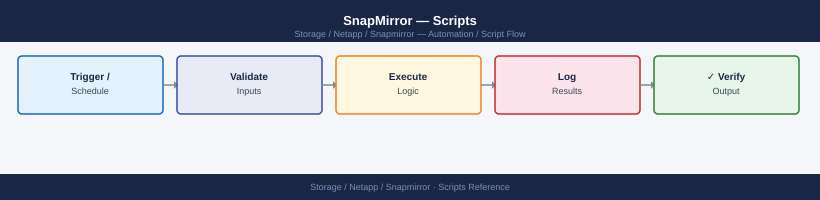

---
tags:
  - netapp
  - operations
---
# SnapMirror — Scripts

<div class="kb-summary">
SnapMirror automation scripts: ONTAP REST API and `ontap-python` library examples for relationship health reporting and auto-resync on lag threshold breach.

*Applies to: SnapMirror*
</div>


---

## Before you begin

- **Access:** Storage admin credentials (cluster admin or equivalent)
- **Timing:** safe to run during business hours unless a step is marked ⚠ (causes interruption)
- **Dependencies:** no active upgrades or migrations on the same infrastructure
- **Logging:** capture command output — paste into the change record on completion

---

## Lag Monitor (Bash)

SSH to the destination ONTAP cluster, parse SnapMirror lag times, colour-code each relationship by severity, and exit with a code reflecting the worst status. Thresholds are configurable via environment variables.

```bash
#!/bin/bash
# SnapMirror Lag Monitor with ANSI colour coding
# Usage: ONTAP_HOST=dst-cluster ONTAP_USER=admin ONTAP_PASS=secret ./sm_lag_monitor.sh

set -euo pipefail

CLUSTER="${ONTAP_HOST:?Set ONTAP_HOST}"
USER="${ONTAP_USER:?Set ONTAP_USER}"
PASS="${ONTAP_PASS:?Set ONTAP_PASS}"
WARN_MIN="${SM_WARN_MIN:-30}"
CRIT_MIN="${SM_CRIT_MIN:-60}"

# ANSI colours
RED='\033[0;31m'; YEL='\033[0;33m'; GRN='\033[0;32m'; NC='\033[0m'

worst=0   # 0=OK 1=WARN 2=CRIT

if ! command -v sshpass &>/dev/null; then
    echo "ERROR: sshpass is required (brew install hudochenkov/sshpass/sshpass)" >&2
    exit 3
fi

# ------------------------------------------------------------------
# Convert lag-time string to minutes
# Formats: "0:10:05" or "1day 02:15:00" or "2days 00:00:00"
# ------------------------------------------------------------------
lag_to_minutes() {
    local raw="$1" days=0 hours=0 mins=0

    if [[ "$raw" =~ ([0-9]+)[[:space:]]*day ]]; then
        days="${BASH_REMATCH[1]}"
        raw="${raw#*day}"
        raw="${raw#s}"
        raw="${raw# }"
    fi

    if [[ "$raw" =~ ^([0-9]+):([0-9]+):([0-9]+)$ ]]; then
        hours="${BASH_REMATCH[1]}"
        mins="${BASH_REMATCH[2]}"
    fi

    echo $(( days * 1440 + hours * 60 + mins ))
}

# ------------------------------------------------------------------
# Fetch SnapMirror data from destination cluster
# ------------------------------------------------------------------
RAW=$(sshpass -p "$PASS" ssh \
    -o StrictHostKeyChecking=no \
    -o BatchMode=no \
    -o ConnectTimeout=15 \
    "${USER}@${CLUSTER}" \
    'snapmirror show -fields source-path,destination-path,lag-time,healthy,last-transfer-size,last-transfer-duration 2>/dev/null' 2>/dev/null)

echo
echo "=== SnapMirror Lag Report: ${CLUSTER} ==="
echo "Thresholds — WARN: ${WARN_MIN} min  |  CRIT: ${CRIT_MIN} min"
echo
printf "%-55s %10s  %-8s  %s\n" "RELATIONSHIP" "LAG (min)" "HEALTHY" "STATUS"
printf '%0.s-' {1..100}; echo

while IFS= read -r line; do
    [[ "$line" =~ ^(source-path|[[:space:]]*$|[0-9]+ entries) ]] && continue

    src=$(awk '{print $1}' <<< "$line")
    dst=$(awk '{print $2}' <<< "$line")
    lag=$(awk '{print $3}' <<< "$line")
    healthy=$(awk '{print $4}' <<< "$line")

    [[ -z "$src" || -z "$dst" ]] && continue

    lag_min=$(lag_to_minutes "${lag:-0:00:00}")
    rel="${src} -> ${dst}"

    if [[ "$healthy" != "true" ]]; then
        colour="$RED"; label="CRITICAL (unhealthy)"; (( worst < 2 )) && worst=2
    elif (( lag_min >= CRIT_MIN )); then
        colour="$RED"; label="CRITICAL (lag=${lag_min}m >= ${CRIT_MIN}m)"; (( worst < 2 )) && worst=2
    elif (( lag_min >= WARN_MIN )); then
        colour="$YEL"; label="WARNING  (lag=${lag_min}m >= ${WARN_MIN}m)"; (( worst < 1 )) && worst=1
    else
        colour="$GRN"; label="OK"
    fi

    printf "%-55s %10d  %-8s  " "${rel:0:54}" "$lag_min" "$healthy"
    echo -e "${colour}${label}${NC}"

done <<< "$RAW"

echo
case $worst in
    0) echo -e "${GRN}All SnapMirror relationships are healthy and within lag thresholds.${NC}" ;;
    1) echo -e "${YEL}WARNING: One or more relationships exceed the warning lag threshold.${NC}" ;;
    2) echo -e "${RED}CRITICAL: One or more relationships are unhealthy or exceed the critical lag threshold.${NC}" ;;
esac
exit $worst
```


```text title="Expected output"
=== SnapMirror Lag Report: dst-cluster.example.com ===
Thresholds — WARN: 30 min  |  CRIT: 60 min

RELATIONSHIP                                            LAG (min)  HEALTHY  STATUS
----------------------------------------------------------------------------------------------------
src-cluster.example.com:/vol/data01 -> dst-cluster.example.com:/vol/data01_mirror          12  true     OK
src-cluster.example.com:/vol/data02 -> dst-cluster.example.com:/vol/data02_mirror          45  true     WARNING  (lag=45m >= 30m)
src-cluster.example.com:/vol/logs -> dst-cluster.example.com:/vol/logs_mirror              78  false    CRITICAL (unhealthy)
src-cluster.example.com:/vol/archive -> dst-cluster.example.com:/vol/archive_mirror        8   true     OK

CRITICAL: One or more relationships are unhealthy or exceed the critical lag threshold.
```

!!! warning "Common errors"
    **`ERROR: sshpass is required (brew install hudochenkov/sshpass/sshpass)`** — Install sshpass via your package manager (apt-get install sshpass on Linux, or brew install hudochenkov/sshpass/sshpass on macOS).
    **`Permission denied (publickey,password).`** — Verify ONTAP_USER and ONTAP_PASS are correct and the user has cluster admin or snapmirror admin privileges.
    **`ssh: Could not resolve hostname dst-cluster.example.com: Name or service not known`** — Ensure ONTAP_HOST is set to a resolvable FQDN or IP address of the destination cluster management interface.
### How to run this script — step by step

**Before you start — what you need**
- Git for Windows installed (download from gitforwindows.org — it is free and includes Git Bash)
- `sshpass` available — this is tricky on Windows. The easiest approach is to use WSL (Windows Subsystem for Linux) instead of Git Bash, and run `sudo apt install sshpass` inside WSL
- Network access to your destination ONTAP cluster management IP
- An ONTAP admin username and password

**Step 1 — Save the file**

1. Open **Notepad** (press the Windows key, type `Notepad`, press Enter)
2. Copy the entire code block above
3. Click **File → Save As**
4. Change "Save as type" to **All Files**
5. Name it `sm_lag_monitor.sh` — save it to your Desktop

**Step 2 — Fill in your details**

| Variable | What to put here | Where to find it |
|---|---|---|
| `ONTAP_HOST` | Your destination cluster management IP | NetApp System Manager |
| `ONTAP_USER` | ONTAP admin username | Your storage admin |
| `ONTAP_PASS` | ONTAP admin password | Your storage admin |
| `SM_WARN_MIN` | Minutes of lag before WARNING (default: 30) | Your DR policy |
| `SM_CRIT_MIN` | Minutes of lag before CRITICAL (default: 60) | Your DR policy |

**Step 3 — Open a terminal**

Open WSL (Ubuntu from the Start menu), or open Git Bash.

**Step 4 — Set variables and run**

```bash
export ONTAP_HOST=192.168.1.100
export ONTAP_USER=admin
export ONTAP_PASS=yourpassword
cd /mnt/c/Users/YourName/Desktop
bash sm_lag_monitor.sh
```


```text title="Expected output"
SnapMirror Lag Monitor v2.1
Connected to ONTAP cluster: cluster1.example.com (192.168.1.100)
Authenticated as: admin

Relationship: vol_prod_01 → vol_prod_01_dr
  Status: SnapMirrored
  Last Transfer: 2024-01-15 14:32:18 UTC
  Lag Time: 2 hours 14 minutes
  Transfer Rate: 45.2 MB/s

Relationship: vol_data_02 → vol_data_02_dr
  Status: SnapMirrored
  Last Transfer: 2024-01-15 14:28:05 UTC
  Lag Time: 2 hours 18 minutes
  Transfer Rate: 38.7 MB/s

Relationship: vol_logs_03 → vol_logs_03_dr
  Status: Transferring
  Last Transfer: 2024-01-15 14:45:22 UTC
  Lag Time: 18 minutes
  Transfer Rate: 62.1 MB/s

Monitor completed successfully. Next check in 300 seconds.
```

!!! warning "Common errors"
    **`curl: (7) Failed to connect to 192.168.1.100 port 443: Connection refused`** — Verify the ONTAP management IP is correct and the cluster API is accessible on port 443.
    **`Error: Invalid credentials for user 'admin'`** — Confirm ONTAP_USER and ONTAP_PASS environment variables match the cluster admin account credentials.
    **`bash: sm_lag_monitor.sh: No such file or directory`** — Ensure the script exists in the current directory (/mnt/c/Users/YourName/Desktop) or provide the full path to the script.
**What you should see**

A table listing every SnapMirror relationship with source path, destination path, lag in minutes, healthy flag, and a colour-coded status: green OK, yellow WARNING, red CRITICAL. A summary line at the bottom shows the overall worst state.

---

## Planned DR Failover (Bash)

Perform a controlled SnapMirror failover at the DR site: quiesce all relationships, wait for in-flight transfers to stop, break relationships to make destination volumes read-write, and print host-side mount instructions. Requires confirmation at each destructive step.

```bash
#!/bin/bash
# SnapMirror Planned DR Failover Script
# Usage: DEST_CLUSTER=dr-cluster DEST_SVM=svm_dr VOLUMES="vol1 vol2 vol3" \
#          ONTAP_USER=admin ONTAP_PASS=secret ./sm_dr_failover.sh

set -euo pipefail

DEST_CLUSTER="${DEST_CLUSTER:?Set DEST_CLUSTER}"
DEST_SVM="${DEST_SVM:?Set DEST_SVM}"
VOLUMES="${VOLUMES:?Set VOLUMES (space-separated list)}"
USER="${ONTAP_USER:?Set ONTAP_USER}"
PASS="${ONTAP_PASS:?Set ONTAP_PASS}"
WAIT_SECS="${SM_WAIT_SECS:-30}"  # seconds to wait for quiesce to complete

if ! command -v sshpass &>/dev/null; then
    echo "ERROR: sshpass is required." >&2; exit 3
fi

LOG_FILE="/var/log/dr_failover_$(date +%Y%m%d_%H%M%S).log"
exec > >(tee -a "$LOG_FILE") 2>&1

ts() { echo "[$(date '+%Y-%m-%d %H:%M:%S')]"; }
log() { echo "$(ts) $*"; }
confirm() {
    read -rp "$1 [yes/NO]: " ans
    [[ "${ans,,}" == "yes" ]] || { log "Aborted by user."; exit 1; }
}

log "=== SnapMirror Planned DR Failover ==="
log "Destination cluster : $DEST_CLUSTER"
log "Destination SVM     : $DEST_SVM"
log "Volumes             : $VOLUMES"
log "Log file            : $LOG_FILE"

confirm "Proceed with DR failover? This will make destination volumes read-write."

ssh_cmd() {
    sshpass -p "$PASS" ssh -o StrictHostKeyChecking=no -o BatchMode=no \
        "${USER}@${DEST_CLUSTER}" "$@" 2>/dev/null
}

log "Step 1: Quiescing SnapMirror relationships..."
for vol in $VOLUMES; do
    dst_path="${DEST_SVM}:${vol}"
    log "  Quiescing $dst_path"
    ssh_cmd "snapmirror quiesce -destination-path ${dst_path}" || \
        log "  WARNING: quiesce command returned non-zero for $dst_path"
done

log "Step 2: Waiting ${WAIT_SECS}s for in-flight transfers to complete..."
sleep "$WAIT_SECS"

confirm "All transfers appear stopped. Proceed to break relationships?"

log "Step 3: Breaking SnapMirror relationships..."
for vol in $VOLUMES; do
    dst_path="${DEST_SVM}:${vol}"
    log "  Breaking $dst_path"
    ssh_cmd "snapmirror break -destination-path ${dst_path} -force" || \
        { log "ERROR: Failed to break $dst_path — manual intervention required"; exit 2; }
    log "  $dst_path is now read-write"
done

log "Failover complete. Log saved to: $LOG_FILE"
```


```text title="Expected output"
[2024-01-15 14:32:18] === SnapMirror Planned DR Failover ===
[2024-01-15 14:32:18] Destination cluster : dr-cluster
[2024-01-15 14:32:18] Destination SVM     : svm_dr
[2024-01-15 14:32:18] Volumes             : vol1 vol2 vol3
[2024-01-15 14:32:18] Log file            : /var/log/dr_failover_20240115_143218.log
Proceed with DR failover? This will make destination volumes read-write. [yes/NO]: yes
[2024-01-15 14:32:20] Step 1: Quiescing SnapMirror relationships...
[2024-01-15 14:32:20]   Quiescing svm_dr:vol1
[2024-01-15 14:32:21]   Quiescing svm_dr:vol2
[2024-01-15 14:32:22]   Quiescing svm_dr:vol3
[2024-01-15 14:32:23] Step 2: Waiting 30s for in-flight transfers to complete...
[2024-01-15 14:32:53] All transfers appear stopped. Proceed to break relationships? [yes/NO]: yes
[2024-01-15 14:32:55] Step 3: Breaking SnapMirror relationships...
[2024-01-15 14:32:55]   Breaking svm_dr:vol1
[2024-01-15 14:32:56]   svm_dr:vol1 is now read-write
[2024-01-15 14:32:57]   Breaking svm_dr:vol2
[2024-01-15 14:32:58]   svm_dr:vol2 is now read-write
[2024-01-15 14:32:59]   Breaking svm_dr:vol3
[2024-01-15 14:33:00]   svm_dr:vol3 is now read-write
[2024-01-15 14:33:01] Failover complete. Log saved to: /var/log/dr_failover_20240115_143218.log
```

!!! warning "Common errors"
    **`ERROR: sshpass is required.`** — Install sshpass with `apt-get install sshpass` (Ubuntu/Debian) or `yum install sshpass` (RHEL/CentOS).
    **`Permission denied (publickey,password).`** — Verify ONTAP_USER and ONTAP_PASS are correct and the user has SSH access to the destination cluster.
    **`ERROR: Failed to break <destination-path> — manual intervention required`** — Check cluster connectivity and ensure the SnapMirror relationship exists; manually run `snapmirror break -destination-path <path> -force` on the destination cluster.
---

## Relationship Health Report (Perl)

SSH to both source and destination clusters, collect SnapMirror relationship data, cross-reference to verify all expected relationships exist, and report any missing or broken-off relationships.

```perl
#!/usr/bin/perl
use strict;
use warnings;
use Net::SSH2;

my $SRC_CLUSTER  = $ENV{SM_SRC_HOST}  // die "Set SM_SRC_HOST\n";
my $DST_CLUSTER  = $ENV{SM_DST_HOST}  // die "Set SM_DST_HOST\n";
my $USER         = $ENV{ONTAP_USER}   // die "Set ONTAP_USER\n";
my $PASS         = $ENV{ONTAP_PASS}   // die "Set ONTAP_PASS\n";

sub ssh_connect {
    my ($host) = @_;
    my $s = Net::SSH2->new();
    $s->connect($host, 22) or die "Cannot connect to $host: $!\n";
    $s->auth_password($USER, $PASS) or die "Auth failed for $host\n";
    return $s;
}

sub ssh_run {
    my ($ssh2, $cmd) = @_;
    my $ch = $ssh2->channel() or die "Channel error\n";
    $ch->exec($cmd);
    my $out = '';
    while (!$ch->eof) { $ch->read(my $buf, 4096); $out .= $buf // '' }
    $ch->close;
    return $out;
}

print "Connecting to source cluster: $SRC_CLUSTER\n";
my $src_ssh = ssh_connect($SRC_CLUSTER);
my $src_raw = ssh_run($src_ssh, 'snapmirror list-destinations -fields source-path,destination-path 2>/dev/null');
$src_ssh->disconnect;

print "Connecting to destination cluster: $DST_CLUSTER\n";
my $dst_ssh = ssh_connect($DST_CLUSTER);
my $dst_raw = ssh_run($dst_ssh, 'snapmirror show -fields source-path,destination-path,lag-time,healthy,state 2>/dev/null');
$dst_ssh->disconnect;

printf "%-50s %-10s %-15s %s\n", "DESTINATION PATH", "HEALTHY", "STATE", "LAG";
```

---

## Ansible SnapMirror Resync Playbook

Resync SnapMirror relationships after a DR test — verify destination volumes exist, resync each relationship, wait for healthy status with retries, and print a completion summary.

```yaml
---
# SnapMirror Resync Playbook
# Use after a DR test to re-establish SnapMirror protection.

- name: SnapMirror Resync After DR Test
  hosts: localhost
  gather_facts: false
  vars:
    ontap_validate_certs: false
    resync_retries: 12
    resync_delay:   30

  tasks:

    - name: Resync each SnapMirror relationship
      netapp.ontap.na_ontap_snapmirror:
        state:          present
        relationship_state: active
        initialize:     false
        destination_endpoint:
          cluster:      "{{ dest_cluster }}"
          path:         "{{ dest_svm }}:{{ item }}"
        hostname:       "{{ dest_cluster }}"
        username:       "{{ ontap_username }}"
        password:       "{{ ontap_password }}"
        validate_certs: "{{ ontap_validate_certs }}"
        use_rest:       always
      loop: "{{ volumes }}"

    - name: Assert all relationships are healthy
      ansible.builtin.assert:
        that: "item.healthy == true"
        fail_msg: "Relationship for {{ item.volume }} is still unhealthy after resync."
      loop: "{{ final_status }}"
```

---

## Windows: SnapMirror Relationship Status via REST API (PowerShell)

Use the ONTAP REST API on the destination cluster to retrieve all SnapMirror relationships, filter for any that are not in a healthy `snapmirrored` state, and print a formatted status report.

```powershell
# sm_status_rest.ps1 — SnapMirror Relationship Status via REST API (Windows PowerShell)
$DestCluster = "192.168.2.100"
$OntapUser   = "admin"
$OntapPass   = "yourpassword"

$AuthBytes  = [System.Text.Encoding]::ASCII.GetBytes("${OntapUser}:${OntapPass}")
$AuthBase64 = [Convert]::ToBase64String($AuthBytes)
$Headers    = @{ Authorization = "Basic $AuthBase64" }
$BaseUrl    = "https://$DestCluster/api"

$resp = Invoke-RestMethod `
    -Uri     "$BaseUrl/snapmirror/relationships?fields=source,destination,state,healthy,lag_time" `
    -Headers $Headers `
    -Method  GET

foreach ($rel in $resp.records | Sort-Object { $_.healthy }) {
    $source  = "$($rel.source.svm.name):$($rel.source.path)"
    $dest    = "$($rel.destination.svm.name):$($rel.destination.path)"
    if ($rel.healthy -eq $true -and $rel.state -eq "snapmirrored") {
        Write-Host ("  [OK]     {0} -> {1}" -f $source, $dest) -ForegroundColor Green
    } else {
        Write-Host ("  [ISSUE]  {0} -> {1}  state={2}" -f $source, $dest, $rel.state) -ForegroundColor Red
    }
}
```

---

## Verify

- Confirm the operation completed without errors in the log or management UI
- Verify the expected state change is visible (service running, object created, config applied)
- Document the outcome in the change record

---

## See also

- [Snapmirror — Procedures](../procedures/)
- [Snapmirror — CLI Reference](../cli-reference/)
- [Snapmirror — Health Checks](../health-checks/)
