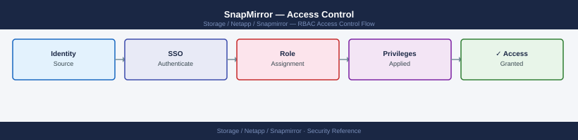

---
tags:
  - netapp
  - security
---
# SnapMirror — Access Control


<div class="kb-summary">
SnapMirror access control: ONTAP RBAC role with `snapmirror-*` privileges, SVM admin scoping, intercluster peer authentication, and audit trail review.

*Applies to: SnapMirror*
</div>



---

```d2
direction: down

external: External / Untrusted {shape: rectangle}
rbac: "RBAC" {shape: rectangle}
destination_volume_protection: "Destination Volume Protection" {shape: rectangle}
audit_logging: "Audit Logging" {shape: rectangle}
core: "SnapMirror Core" {shape: hexagon}

external -> rbac: traffic in
rbac -> destination_volume_protection
destination_volume_protection -> audit_logging
audit_logging -> core: secured path
```

## Before you begin

- **Access:** Storage admin credentials (cluster admin or equivalent)
- **Change management:** security changes require CAB approval in most environments
- **Rollback plan:** document current state before any security control change
- **Testing:** validate in a non-production environment first where possible

---

## RBAC

- SnapMirror operations (`update`, `initialize`, `resync`, `show`) require `vsadmin` or cluster admin role
- `snapmirror break` and `snapmirror resync` must be restricted to designated DR admins — these operations change data access and replication direction
- Create a custom ONTAP role scoped to SnapMirror-only operations for teams that need monitoring access without the ability to break or resync relationships:

```bash
security login role create -role snapmirror-monitor -cmddirname "snapmirror show" -access readonly
security login role create -role snapmirror-monitor -cmddirname "snapmirror show-history" -access readonly
```

## Destination Volume Protection

Destination (DP) volumes are read-only by design — the replication engine enforces this at the WAFL layer. No client or user can write to a destination volume while a SnapMirror relationship is active. This eliminates the risk of accidental data modification on the replication target. Access to the destination volume is restricted to the replication engine and cluster admin operations; no data LIFs serve the destination volume until a `snapmirror break` is explicitly run.

## Audit Logging

- All SnapMirror relationship changes (create, modify, delete, break, resync) are recorded in the ONTAP audit log
- EMS generates events for all transfer completions, failures, and lag threshold breaches — route these to your SIEM or syslog server
- Review audit logs after any DR test to confirm only authorized operations were performed

```bash
# Show recent SnapMirror-related EMS events
event log show -message-name snapmirror.*

# Show security audit log for relationship changes
security audit log show
```

---

## See also

- [Snapmirror — Authentication](authentication/)
- [Snapmirror — Hardening](hardening/)
- [Snapmirror — Encryption](encryption/)
