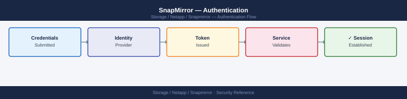

---
tags:
  - netapp
  - security
---
# SnapMirror — Authentication

<div class="kb-summary">
SnapMirror authentication: intercluster cluster peer passphrase management, `cluster peer modify -auth-status ok`, and certificate-based peer authentication.

*Applies to: SnapMirror*
</div>


---

## Before you begin

- **Access:** Storage admin credentials (cluster admin or equivalent)
- **Change management:** security changes require CAB approval in most environments
- **Rollback plan:** document current state before any security control change
- **Testing:** validate in a non-production environment first where possible

---

## Intercluster Authentication

Cluster peering is the authentication foundation for all SnapMirror replication. Two ONTAP clusters establish a trust relationship using a pre-shared passphrase negotiated once at peer creation time. The passphrase is exchanged out-of-band and is never transmitted in plaintext; the resulting peer relationship uses TLS-encrypted channels for all subsequent replication traffic. From ONTAP 9.6 onwards, all intercluster communication is TLS 1.2+ encrypted by default — no additional configuration is required.

### Establishing a Cluster Peer Relationship

```bash
# On the source cluster — initiate the peer relationship
cluster peer create -generate-passphrase -offer-expiration 2days \
    -peer-addrs <dst-intercluster-lif-ip>

# Copy the generated passphrase, then on the destination cluster:
cluster peer create -peer-addrs <src-intercluster-lif-ip> \
    -passphrase <generated-passphrase>

# Verify the peer relationship is established and authenticated
cluster peer show
# Expected: Auth-Status: ok, Availability: Available
```


```text title="Expected output"
cluster peer create -generate-passphrase -offer-expiration 2days -peer-addrs 192.168.1.50
Passphrase: XK9mL2pQ7vN4rT8wJ5bH6cF3dE1sA9gK

cluster peer create -peer-addrs 192.168.1.40 -passphrase XK9mL2pQ7vN4rT8wJ5bH6cF3dE1sA9gK
(no output — command completes silently)

cluster peer show
Peer Cluster Name         Cluster UUID                 Availability   Authentication Status
------------------------- ---------------------------- -------------- ----------------------
dst-cluster-02            4a3c5e8b-9f2d-11ed-a1eb-00505682f89e Available      ok
```

!!! warning "Common errors"
    **`Error: command failed: Cluster peer create failed. Reason: Connection refused to peer address 192.168.1.50`** — Verify the destination intercluster LIF IP is correct and reachable by pinging it from the source cluster.
    **`Error: command failed: Cluster peer create failed. Reason: Authentication failed. Invalid passphrase`** — Ensure the passphrase was copied exactly without whitespace and that it matches the one generated on the source cluster.
### Establishing an SVM Peer Relationship

SVM peering is required before any volume-level relationship can be created. It uses the already-authenticated cluster peer channel and adds SVM-scope trust.

```bash
# Create an SVM peer relationship (run on source cluster)
vserver peer create -vserver svm_prod -peer-vserver svm_dr \
    -peer-cluster dr-cluster -applications snapmirror

# Confirm the SVM peer is in the peered state
vserver peer show -vserver svm_prod
# Expected: Peer State: peered
```


```text title="Expected output"
Vserver Peer: svm_prod
           Peer Vserver: svm_dr
           Peer Cluster: dr-cluster
           Peer State: peered
           Peer Applications: snapmirror
           State Description: -
           First Seen: 2024-01-15 09:23:14 -05:00

Vserver Peer: svm_prod
           Peer Vserver: svm_dr
           Peer Cluster: dr-cluster
           Peer State: peered
           Peer Applications: snapmirror
           State Description: -
           First Seen: 2024-01-15 09:23:14 -05:00
```

!!! warning "Common errors"
    **`Error: command failed: Vserver peer relationship already exists.`** — Check existing peer relationships with `vserver peer show` and remove the old one using `vserver peer delete` if needed.
    **`Error: command failed: Peer cluster dr-cluster is not reachable.`** — Verify cluster peering exists first with `cluster peer show` and ensure network connectivity between clusters on port 11104.
    **`Error: command failed: Vserver svm_dr does not exist on peer cluster dr-cluster.`** — Confirm the SVM name and cluster name are correct, and create the SVM on the DR cluster if it doesn't exist.
### Reviewing and Rotating Peer Authentication

Stale or unused cluster peer relationships should be reviewed annually and removed. Peer relationships persist indefinitely; removing an unused peer eliminates unnecessary trust scope.

```bash
# List all cluster peer relationships and their authentication status
cluster peer show -fields peer-cluster-name,auth-status,availability

# Remove a stale cluster peer relationship
cluster peer delete -cluster <stale-peer-cluster>
# Note: all SVM peers and SnapMirror relationships must be deleted first
```

---

## ONTAP Credential Security for Replication Management

All SnapMirror management operations (create, update, break, resync) require an authenticated ONTAP session. Follow these controls for service accounts that manage replication:

- Automation and monitoring tools must use dedicated service accounts — not personal admin accounts
- Service accounts used for SnapMirror management should be scoped to the minimum required commands using a custom RBAC role
- Credentials for service accounts must be stored in a secrets vault (HashiCorp Vault, CyberArk) or the automation platform's credential store — never in plaintext scripts or environment variables in source control

### Minimum-Privilege RBAC Role for SnapMirror Automation

```bash
# Create a role that allows SnapMirror operations but nothing else
security login role create -role snapmirror-ops \
    -cmddirname "DEFAULT" -access none -vserver <cluster-name>

security login role create -role snapmirror-ops \
    -cmddirname "snapmirror show" -access readonly -vserver <cluster-name>

security login role create -role snapmirror-ops \
    -cmddirname "snapmirror update" -access all -vserver <cluster-name>

security login role create -role snapmirror-ops \
    -cmddirname "snapmirror initialize" -access all -vserver <cluster-name>

security login role create -role snapmirror-ops \
    -cmddirname "snapmirror resync" -access all -vserver <cluster-name>

security login role create -role snapmirror-ops \
    -cmddirname "snapmirror quiesce" -access all -vserver <cluster-name>

security login role create -role snapmirror-ops \
    -cmddirname "snapmirror abort" -access all -vserver <cluster-name>

security login role create -role snapmirror-ops \
    -cmddirname "volume show" -access readonly -vserver <cluster-name>

security login role create -role snapmirror-ops \
    -cmddirname "network interface show" -access readonly -vserver <cluster-name>

# Create the service account using the custom role
security login create \
    -username svc-snapmirror \
    -application http \
    -authentication-method password \
    -role snapmirror-ops \
    -vserver <cluster-name>

# Verify role assignments
security login show -username svc-snapmirror
```

### Read-Only Monitoring Role

Separate monitoring-only access from operational access. Monitoring tools (Prometheus ONTAP exporter, Zabbix, Nagios) only need `snapmirror show` and related read-only commands.

```bash
# Create a read-only monitoring role for SnapMirror
security login role create -role snapmirror-monitor \
    -cmddirname "DEFAULT" -access none -vserver <cluster-name>

security login role create -role snapmirror-monitor \
    -cmddirname "snapmirror show" -access readonly -vserver <cluster-name>

security login role create -role snapmirror-monitor \
    -cmddirname "snapmirror show-history" -access readonly -vserver <cluster-name>

security login role create -role snapmirror-monitor \
    -cmddirname "snapmirror list-destinations" -access readonly -vserver <cluster-name>

security login role create -role snapmirror-monitor \
    -cmddirname "network interface show" -access readonly -vserver <cluster-name>

security login role create -role snapmirror-monitor \
    -cmddirname "event log show" -access readonly -vserver <cluster-name>

# Create the monitoring service account using public key auth (preferred)
security login create \
    -username svc-sm-monitor \
    -application ssh \
    -authentication-method publickey \
    -role snapmirror-monitor \
    -vserver <cluster-name>

# Add the monitoring host's public key
security login publickey create \
    -username svc-sm-monitor \
    -index 0 \
    -publickey "ssh-ed25519 AAAA...monitoring-key"
```

---

## REST API Authentication

ONTAP REST API authentication for SnapMirror automation uses HTTP Basic or cluster-scoped API tokens. For production automation:

- Use API tokens rather than Basic auth — tokens can be scoped and revoked without changing the account password
- Tokens are created per user account and are cluster-scoped; they do not expire by default but can be manually revoked

```bash
# Generate a REST API token (ONTAP 9.12+)
security token create -username svc-snapmirror -application http

# Use the token in API calls
curl -sk -X GET "https://<cluster-mgmt>/api/snapmirror/relationships" \
    -H "Authorization: Bearer <api-token>"

# List existing API tokens
security token show -username svc-snapmirror

# Revoke a token
security token delete -username svc-snapmirror -token <token-id>
```

---

## SMBC Mediator Authentication

SnapMirror Business Continuity (SMBC / AutomatedFailOver) uses the ONTAP Mediator for out-of-band witness and automatic failover decisions. Mediator communication uses certificate-based mutual TLS authentication between the ONTAP clusters and the Mediator VM.

```bash
# Add the ONTAP Mediator to the cluster
snapmirror mediator add -mediator-address <mediator-ip> \
    -username mediatoradmin

# Verify mediator is reachable and authenticated from both clusters
snapmirror mediator show

# Expected output fields:
# Mediator Address  Peer Cluster  Connection Status  Quorum Status
# <ip>              <peer>        connected           true

# Remove a mediator (e.g., before mediator upgrade)
snapmirror mediator remove -mediator-address <mediator-ip>
```

Mediator credentials are configured during Mediator VM installation. The Mediator VM password should be stored in a secrets vault and rotated per the password policy. Certificate trust between ONTAP and the Mediator is established at `snapmirror mediator add` time — certificates are not manually managed.

---

## See also

- [Snapmirror — Access Control](../access-control/)
- [Snapmirror — Hardening](../hardening/)
- [Snapmirror — Encryption](../encryption/)
