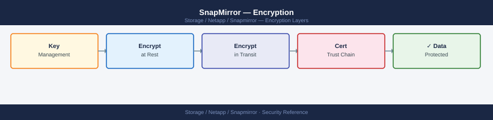

---
tags:
  - netapp
  - security
---
# SnapMirror — Encryption

<div class="kb-summary">
SnapMirror encryption: SnapMirror Traffic Encryption (SMT) using TLS, `snapmirror modify -encryption-algorithm`, and ONTAP NAE/NVE for at-rest encryption of replicated volumes.

*Applies to: SnapMirror*
</div>


---

## Before you begin

- **Access:** Storage admin credentials (cluster admin or equivalent)
- **Change management:** security changes require CAB approval in most environments
- **Rollback plan:** document current state before any security control change
- **Testing:** validate in a non-production environment first where possible

---

## Encryption in Transit

SnapMirror Transfer Data Encryption (TDE) encrypts all replication traffic end-to-end between clusters. The encryption is implemented at the SnapMirror layer and does not require IPsec or network-level encryption on the underlying infrastructure. TDE is configured per relationship and uses AES-256-GCM.

From ONTAP 9.6, TLS 1.2 is used for all intercluster communication by default. TDE on top of TLS provides defence-in-depth: even if the TLS session were compromised at the network layer, the replication data stream itself is separately encrypted.

Encryption in transit is mandatory for any SnapMirror relationship traversing a network segment that is not fully under your control — WAN links, co-location interconnects, third-party circuits, or internet-facing paths (e.g., replication to Cloud Volumes ONTAP).

### Enable Encryption on an Existing Relationship

```bash
# Enable AES-256 encryption on an existing SnapMirror relationship
snapmirror modify \
    -destination-path svm_dst:vol_dst \
    -encryption-algorithm aes-256

# Verify encryption is active on the relationship
snapmirror show -destination-path svm_dst:vol_dst \
    -fields encryption-algorithm,is-healthy
# Expected: encryption-algorithm: aes-256

# Enable encryption on all relationships to a specific destination SVM
snapmirror modify -destination-path svm_dst:* \
    -encryption-algorithm aes-256
```

### Enable Encryption at Relationship Creation

```bash
# Create a new XDP relationship with encryption enabled from the start
snapmirror create \
    -source-path svm_prod:vol_data \
    -destination-path svm_dr:vol_data \
    -type XDP \
    -policy MirrorAllSnapshots \
    -schedule hourly \
    -encryption-algorithm aes-256

# Confirm the relationship was created with encryption
snapmirror show -destination-path svm_dr:vol_data -instance \
    | grep -i encryption
```

### Verify Encryption Across All Relationships

```bash
# List all relationships and their encryption state
snapmirror show -fields source-path,destination-path,encryption-algorithm

# Flag any relationships without encryption
snapmirror show -fields source-path,destination-path,encryption-algorithm \
    | grep -v "aes-256"
```

---

## Encryption at Rest

SnapMirror replicates data blocks from source to destination. The encryption-at-rest state of the destination volume is independent of the source — a destination volume can be encrypted even if the source is not, and vice versa. Both NetApp Volume Encryption (NVE) and NetApp Aggregate Encryption (NAE) are supported on destination (DP type) volumes.

### Creating an Encrypted Destination Volume

```bash
# Create an encrypted DP volume as the replication target
volume create \
    -vserver svm_dr \
    -volume vol_data_dr \
    -aggregate aggr_dr \
    -size 2TB \
    -type DP \
    -encrypt true

# Confirm encryption is enabled on the destination volume
volume show -vserver svm_dr -volume vol_data_dr -fields encrypt
# Expected: encrypt: true

# View the encryption state (requires key manager configured)
volume show -vserver svm_dr -volume vol_data_dr -fields encryption-state
# Expected: encryption-state: encrypted
```

### Enabling NVE on an Existing Destination Volume

```bash
# Enable NVE on an existing unencrypted DP volume
# Note: volume must be quiesced (SnapMirror paused) before enabling NVE
snapmirror quiesce -destination-path svm_dr:vol_data_dr

volume encryption conversion start \
    -vserver svm_dr \
    -volume vol_data_dr

# Monitor conversion progress
volume encryption conversion show \
    -vserver svm_dr \
    -volume vol_data_dr

# Resume replication after conversion completes
snapmirror resume -destination-path svm_dr:vol_data_dr
```

---

## Key Management for Encrypted Destination Volumes

Destination volumes encrypted with NVE or NAE require a key manager to be configured on the destination cluster. The key manager can be either:

- **ONTAP Key Manager (OKM)** — built-in key manager suitable for non-regulated environments; keys stored on the cluster itself
- **External KMIP key manager** — external key management (Thales, Entrust, IBM, HashiCorp Vault) for regulated environments; required for FIPS and most compliance frameworks

```bash
# Verify key manager is configured on the destination cluster
security key-manager show

# For external KMIP key manager — show configured servers
security key-manager external show

# Check that keys are available for the destination volume
volume encryption show -vserver svm_dr -volume vol_data_dr \
    -fields key-id,encryption-state
```

The source and destination clusters can use different key managers independently — encryption at the destination is entirely managed by the destination cluster's key manager configuration.

---

## SnapMirror Synchronous and SMBC Encryption

For SnapMirror Synchronous and SMBC (AutomatedFailOver) relationships, the same encryption controls apply. Because synchronous replication is latency-sensitive, verify that the AES-256 overhead is accounted for in the inter-site latency budget.

```bash
# Enable encryption on a SnapMirror Synchronous relationship
snapmirror modify \
    -destination-path svm_dr:vol_data \
    -encryption-algorithm aes-256 \
    -type sync

# Check SMBC consistency group relationship encryption
snapmirror show -type automatedfailover \
    -fields encryption-algorithm
```

---

## Compliance Mapping

| Requirement | ONTAP Control | Configuration |
|---|---|---|
| Data in transit — PCI-DSS, HIPAA | SnapMirror TDE (AES-256) | `snapmirror modify -encryption-algorithm aes-256` |
| Data at rest — PCI-DSS, HIPAA | NVE or NAE on destination volume | `volume create -encrypt true` or `volume encryption conversion start` |
| Key management — FIPS 140-2 | External KMIP with FIPS-certified HSM | `security key-manager external enable` |
| Transport TLS version | ONTAP intercluster TLS 1.2 minimum | `security config modify -min-protocol-version TLSv1.2` |
| Audit trail for key operations | ONTAP audit log | `security audit log show -cmdname "security key-manager"` |

---

## See also

- [Snapmirror — Hardening](hardening/)
- [Snapmirror — Authentication](authentication/)
- [Snapmirror — Access Control](access-control/)
