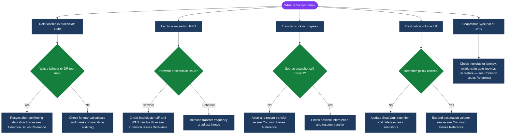

---
tags:
  - netapp
  - troubleshooting
search:
  boost: 1.5
---
# SnapMirror — Common Issues


<div class="kb-summary">
SnapMirror troubleshooting: `snapmirror show -fields status,health` for broken relationships, transfer failures, missing common snapshots, and NetApp support escalation.

*Applies to: SnapMirror*
</div>
```text
┌────────────────────────────────── NetApp SnapMirror — Common Issues ──────────────────────────────────┐
│                                                                                                       │
│   ┌───────────────────────────────────────────────────────────────────────────────────────────────┐   │
│   │         SnapMirror common issues: quick-reference for frequently encountered problems         │   │
│   │         Issues: path failures, connectivity errors, capacity alerts, and auth failures        │   │
│   │         For each issue: symptoms, root cause, diagnostic steps, and resolution actions        │   │
│   │           Escalate to vendor support if the issue persists after standard procedures          │   │
│   └───────────────────────────────────────────────────────────────────────────────────────────────┘   │
│                                                                                                       │
│    Identify symptom → check logs → diagnose root cause → resolve → verify                             │
│                                                                                                       │
│                  ▼                                ▼                                ▼                  │
│                                                                                                       │
│   ┌─────────────────────────────┐  ┌─────────────────────────────┐  ┌─────────────────────────────┐   │
│   │            Layer            │  │          Component          │  │            Notes            │   │
│   │            Async            │  │        Periodic sync        │  │         RPO: minutes        │   │
│   │             Sync            │  │           Zero RPO          │  │          Sub-ms lag         │   │
│   │            SM-BC            │  │        Active-active        │  │        Transparent FO       │   │
│   │            Vault            │  │        Long retention       │  │         Backup copy         │   │
│   │            Cloud            │  │         ONTAP → CVO         │  │       Cloud DR/backup       │   │
│   └─────────────────────────────┘  └─────────────────────────────┘  └─────────────────────────────┘   │
│                                                                                                       │
│                          ▼                                                 ▼                          │
│                                                                                                       │
│   ┌───────────────────────────────────────────────────────────────────────────────────────────────┐   │
│   │    Component     │     Purpose      │      Protocol     │       Auth       │      Notes       │   │
│   │ Async SnapMirror │  DR replication  │    SM protocol    │   Certificate    │   RPO minutes    │   │
│   │ Sync SnapMirror  │  Zero-RPO sync   │    SM protocol    │   Certificate    │ StrictSync/Sync  │   │
│   │      SM-BC       │ Active-active SA │    SM protocol    │     Mediator     │    No RPO/RTO    │   │
│   │    SnapVault     │ Backup retention │    SM protocol    │   Certificate    │ Longer retentio  │   │
│   └───────────────────────────────────────────────────────────────────────────────────────────────┘   │
│                                                                                                       │
│    Physical: Source ONTAP cluster · destination ONTAP cluster · intercluster LIFs · WAN link          │
│                                                                                                       │
│    Key terms:                                                                                         │
│                                                                                                       │
│    SnapMirror         = ONTAP replication; transfers only changed blocks after initial baseline sync  │
│    Intercluster LIF   = dedicated logical interface for SnapMirror traffic between clusters           │
│    SnapMirror policy  = defines schedule, retention, and transfer type (async/sync/vault)             │
│    Baseline transfer  = first full snapshot transfer establishing the SnapMirror relationship         │
│    Update             = incremental transfer; only sends new or changed blocks since last successfu...│
│    Snapmirror break   = breaks the DR relationship; activates destination volume for read-write       │
│    Resync             = re-establishes a broken SnapMirror relationship from the last common snapshot │
│    SM-BC              = SnapMirror Business Continuity; synchronous zero-RPO active-active SAN volumes│
│    Mediator           = ONTAP Mediator; quorum service for SM-BC running on Linux VM at third site    │
│    SnapVault          = SnapMirror variant for backup retention; destination has independent schedule │
│    MirrorAndVault     = policy combining SnapMirror DR and SnapVault backup retention copies          │
│    Fanout             = single source volume replicating to multiple destination clusters simultane...│
│                                                                                                       │
└───────────────────────────────────────────────────────────────────────────────────────────────────────┘
```


---

## Diagnostic Flow



---

## Before you begin

- **Access:** Storage admin credentials (cluster admin or equivalent)
- **Gather first:** recent error message text, event timestamps, and affected object names
- **Scope:** confirm whether the issue affects a single object, host, cluster, or site
- **Escalation:** open a vendor support ticket before running any destructive step
- **Logging:** document each command and output — required if escalation is needed

---

## Common Issues Reference

| Symptom | Likely Cause | Action |
|---|---|---|
| Relationship in `broken-off` state | `snapmirror quiesce` + `snapmirror break` was run manually for a DR test or failover and was never resynced | Resync with `snapmirror resync -destination-path svm_dst:vol_dst`; confirm data direction before running |
| Lag time exceeding RPO | Network congestion, high source change rate, or transfer schedule too infrequent | Check `snapmirror show -fields lag-time,transfer-bytes`; increase schedule frequency or investigate network bandwidth |
| Transfer stuck in progress | Network interruption mid-transfer or source snapshot deleted before transfer completed | Run `snapmirror abort -destination-path svm_dst:vol_dst`; wait for abort to complete; restart with `snapmirror update` |
| Destination volume full | SnapVault/XDP retention policy not pruning old snapshots; autogrow not configured | Check destination volume space with `volume show -fields size,used`; review SnapVault retention rules; delete excess snapshots |
| SMBC mediator unreachable | Network connectivity issue to mediator VM or mediator service not running | Check mediator connectivity from both clusters: `snapmirror mediator show`; verify mediator VM status and network path |
| Initialize failing: destination not DP type | Destination volume created as RW instead of DP | Delete and recreate destination volume with `-type DP`; rerun `snapmirror initialize` |
| SnapMirror Sync showing `Out-of-Sync` | Inter-site latency exceeded threshold or network interruption | Check intercluster LIF connectivity; relationship auto-resyncs when connectivity restores within the resync window |
| SVM-DR update failing | SVM configuration change on source not yet reflected on destination | Run `snapmirror update -destination-path svm_dst:` at the SVM level to force a configuration sync |

---

## Verify resolution

- Confirm the original symptom no longer occurs
- Check logs for any residual errors related to the issue
- Monitor for 10–15 minutes to confirm the fix is stable

---

## See also

- [Snapmirror — Diagnostics](diagnostics/)
- [Snapmirror — Escalation](escalation/)
- [Snapmirror — Health Checks](../operations/health-checks/)
