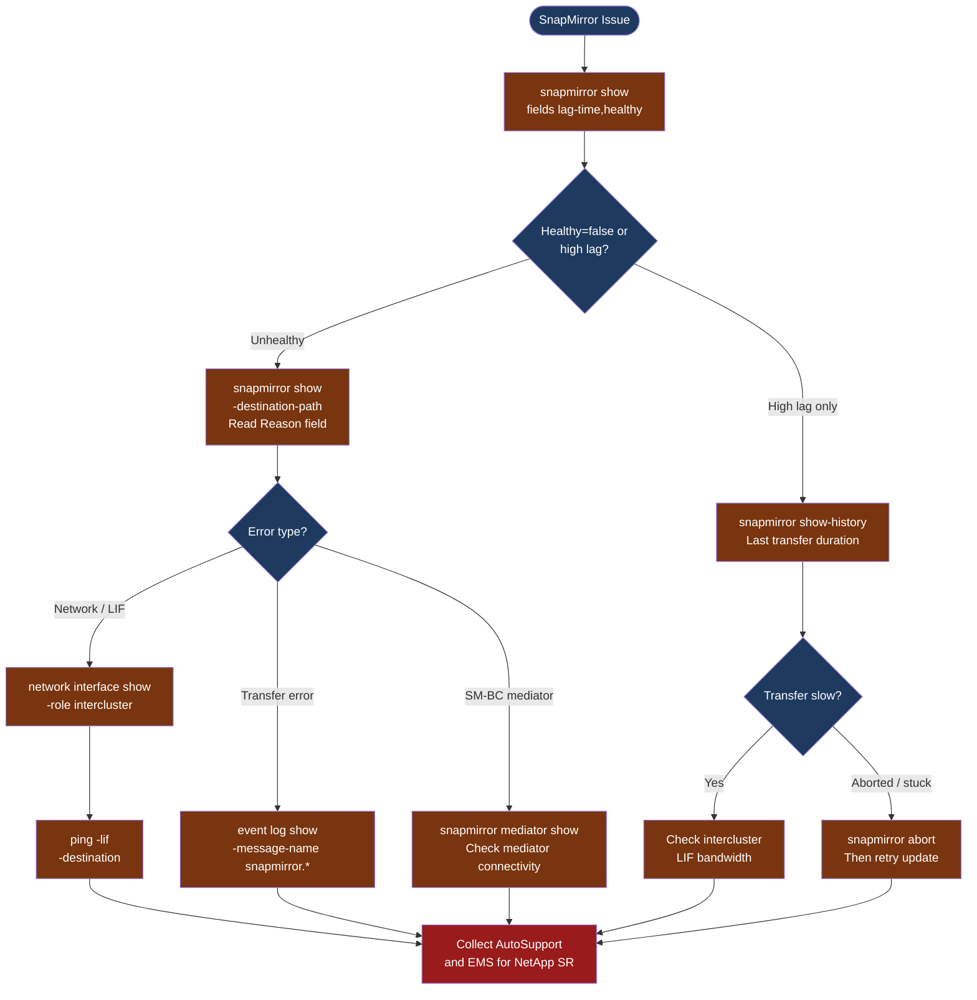

---
tags:
  - netapp
  - troubleshooting
search:
  boost: 1.5
---
# SnapMirror — Diagnostics

<div class="kb-summary">
SnapMirror diagnostic commands: check relationship health and lag with snapmirror show, diagnose intercluster LIF connectivity, trace transfer errors in ONTAP EMS, check SM-BC mediator status, and collect diagnostic output for NetApp support cases.

*Applies to: ONTAP 9.x SnapMirror (Async, Sync, SM-BC, SnapVault)*
</div>




## Before you begin

- **Access:** Cluster admin credentials on both source and destination ONTAP clusters; SSH or NetApp System Manager access
- **Gather first:** the relationship path (`source-svm:volume` → `dest-svm:volume`), current lag time, and the "Reason" text from `snapmirror show` on the unhealthy relationship
- **Scope:** confirm whether the issue affects a single volume relationship, all relationships on one cluster, or all cross-cluster replication
- **SM-BC caution:** for SM-BC relationships, do not run `snapmirror break` or `snapmirror resync` without confirming the mediator is reachable — automatic failover requires the mediator to be healthy
- **Logging:** run each command and save the output; ONTAP EMS event log is the primary artifact for NetApp TAC cases

---

## Step 1 — Check relationship health and lag

```bash
# Summary view — all relationships with health and lag
snapmirror show -fields lag-time,healthy,last-transfer-end-timestamp,status
# Columns:
#   healthy:       true = no errors; false = relationship has an error
#   lag-time:      time since last successful transfer; for async: should be < schedule interval
#   status:        Idle | Transferring | Aborting | Quiesced | Broken-off
# Focus on rows with healthy=false first

# Detailed view of a specific relationship
snapmirror show -destination-path <dest-svm>:<dest-vol>
# Key fields:
#   Relationship Status:   Snapmirrored | Broken-off | Quiesced
#   Transferring?:         true if a transfer is in progress
#   Last Transfer Size:    how much data moved in the last transfer
#   Unhealthy Reason:      exact error text — this is what to search in NetApp KB and EMS

# All destination relationships from this cluster's perspective
snapmirror list-destinations
# Shows: source path, dest path, relationship type, status

# Find all broken-off (activated) relationships
snapmirror show -relationship-status broken-off
# Expected: none in normal operation; present after a DR failover
```

---

## Step 2 — Check transfer history

```bash
# Transfer history for a specific relationship (last 20 transfers)
snapmirror show-history -destination-path <dest-svm>:<dest-vol>
# Shows: start time, end time, bytes transferred, transfer duration, status
# Look for: recent failures, very short durations (abort), increasing transfer size

# Active transfers in progress right now
snapmirror show -fields is-current-op-abort-enabled,transferring | grep -i true

# Abort a stuck transfer (safe — only cancels the current transfer; does not break the relationship)
snapmirror abort -destination-path <dest-svm>:<dest-vol>
# Then manually trigger a new update:
snapmirror update -destination-path <dest-svm>:<dest-vol>
```

---

## Step 3 — Check intercluster LIFs

SnapMirror traffic uses dedicated intercluster logical interfaces. If these are down or misconfigured, all cross-cluster replication fails.

```bash
# List all intercluster LIFs on the local cluster
network interface show -role intercluster
# Columns: LIF Name, SVM, Home Node, Home Port, Current Node, Current Port, Status Admin/Oper
# Expected: Status Admin = up, Status Oper = up for all intercluster LIFs

# Test ICMP reachability between intercluster LIFs
network ping -lif <local-intercluster-lif> -destination <remote-intercluster-lif-ip>
# Expected: 0% packet loss; round-trip time < 5ms (LAN) or < 80ms (WAN typical)

# Check intercluster peer relationship
cluster peer show
# Shows: peer cluster name, availability (Available/Partial/Unavailable), ping status
# If status = Unavailable: intercluster LIF connectivity is broken

# Show intercluster peer detail
cluster peer show -instance
# Shows: remote IPs, last heartbeat, authentication status
```

---

## Step 4 — Check ONTAP EMS for SnapMirror events

```bash
# Show all SnapMirror-specific EMS events (most specific filter)
event log show -message-name "snapmirror.*" -severity error -time-range <start>..<end>
# Replace <start>..<end> with: "2026-06-15 08:00:00".."2026-06-15 10:00:00"

# Broader search — all errors in the relevant time window
event log show -severity error -time-range <start>..<end>
# Look for: snapmirror, network, disk, aggr messages

# Show EMS messages mentioning a specific volume
event log show -node * | grep -i "<volume-name>"

# Common SnapMirror EMS messages and their meaning:
#   snapmirror.src.notSnapshot   → source snapshot was deleted before transfer completed
#   snapmirror.xfer.write.err    → write error on destination volume; check destination aggregate
#   snapmirror.dst.noSpace       → destination volume or aggregate is full
#   netc.conn.refused            → intercluster connection refused; LIF or firewall issue
```

---

## Step 5 — SM-BC specific diagnostics

For SnapMirror Business Continuity (SM-BC / SnapMirror Active Sync) issues:

```bash
# Check mediator connectivity
snapmirror mediator show
# Shows: mediator IP, mediator version, peer cluster, connectivity (Reachable/Unreachable)
# Expected: Connected = true, mediator-state = success

# List all SM-BC consistency groups
consistency-group show
# Shows: CG name, source cluster, dest cluster, status, RPO, state

# Check SM-BC relationship state
snapmirror show -policy AutomatedFailOver
# Status should be: Insync (healthy) or OutOfSync (problem)

# If mediator is unreachable — SM-BC falls back to standard sync (no automatic failover)
# Test mediator manually from Linux CLI on mediator VM:
curl https://<mediator-ip>/api/v1/heartbeat
# Expected: HTTP 200 with cluster peer info

# Trigger SM-BC mediator re-connection (if mediator was temporarily unavailable)
snapmirror mediator remove -peer-cluster <peer>
snapmirror mediator add -peer-cluster <peer> -username <user> -mediator-address <ip>
```

---

## Step 6 — Collect AutoSupport and EMS for NetApp SR

```bash
# Invoke AutoSupport for the affected node (preferred artifact for NetApp TAC)
system node autosupport invoke -node * -type all -message "SnapMirror investigation case #<case-id>"

# Export EMS log to a file
event log show -severity error -time-range <start>..<end> > /tmp/ems-error-$(date +%F).txt

# Collect all-in-one SnapMirror diagnostic snapshot
{
  echo "=== snapmirror show summary ==="
  snapmirror show -fields lag-time,healthy,status
  echo "=== cluster peer show ==="
  cluster peer show
  echo "=== network interface show intercluster ==="
  network interface show -role intercluster
  echo "=== snapmirror mediator show (if SM-BC) ==="
  snapmirror mediator show 2>/dev/null || echo "No mediator configured"
  echo "=== EMS errors (last 2 hours) ==="
  event log show -severity error -time-range "-2h".."now"
} 2>&1 | tee /tmp/snapmirror-diag-$(date +%F-%H%M).txt
```

---

## Log locations

| Component | Command / Location | What to look for |
|---|---|---|
| ONTAP EMS | `event log show -message-name "snapmirror.*"` | Transfer errors, network failures |
| Transfer history | `snapmirror show-history -destination-path <path>` | Failed transfers, duration trends |
| Cluster peer | `cluster peer show` | Availability status, authentication |
| AutoSupport | `system node autosupport invoke` | Full system state snapshot for NetApp TAC |

---

## See also

- [SnapMirror — Common Issues](common-issues/)
- [SnapMirror — Escalation](escalation/)
- [SnapMirror — Health Checks](../operations/health-checks/)

## Verify resolution

- `snapmirror show -fields healthy` shows `healthy=true` for all affected relationships
- `snapmirror show -fields lag-time` shows lag below 1× the schedule interval for async relationships
- `cluster peer show` shows `Available` for all peer cluster relationships
- For SM-BC: `snapmirror mediator show` shows `Connected = true` and mediator-state = success
- Trigger a manual `snapmirror update` and confirm it completes with `status=Idle` and a new transfer end time
