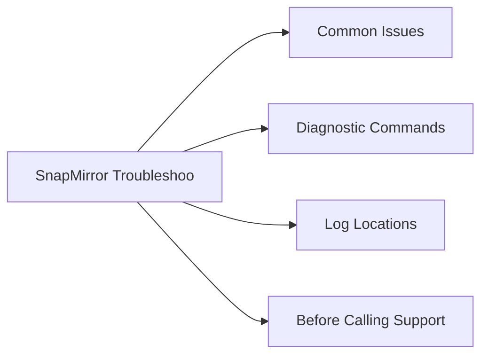

# NetApp SnapMirror Troubleshooting



## Common Issues

| Symptom | Likely Cause | Action |
|---|---|---|
| Relationship in `broken-off` state | `snapmirror quiesce` + `snapmirror break` was run manually for a DR test or failover and was never resynced | Resync with `snapmirror resync -destination-path svm_dst:vol_dst`; confirm data direction before running |
| Lag time exceeding RPO | Network congestion, high source change rate, or transfer schedule too infrequent | Check `snapmirror show -fields lag-time,transfer-bytes`; increase schedule frequency or investigate network bandwidth |
| Transfer stuck in progress | Network interruption mid-transfer or source snapshot deleted before transfer completed | Run `snapmirror abort -destination-path svm_dst:vol_dst`; wait for abort to complete; restart with `snapmirror update` |
| Destination volume full | SnapVault/XDP retention policy not pruning old snapshots; autogrow not configured | Check destination volume space with `volume show -fields size,used`; review SnapVault retention rules; delete excess snapshots |
| SMBC mediator unreachable | Network connectivity issue to mediator VM or mediator service not running | Check mediator connectivity from both clusters: `snapmirror mediator show`; verify mediator VM status and network path |
| Initialize failing: destination not DP type | Destination volume created as RW instead of DP | Delete and recreate destination volume with `-type DP`; rerun `snapmirror initialize` |
| SnapMirror Sync showing `Out-of-Sync` | Inter-site latency exceeded threshold or network interruption | Check intercluster LIF connectivity; relationship auto-resyncs when connectivity restores within the resync window |
| SVM-DR update failing | SVM configuration change on source not yet reflected on destination | Run `snapmirror update -destination-path svm_dst:` at the SVM level to force a configuration sync |

## Diagnostic Commands

```bash
# Show all relationships with lag time and health
snapmirror show -fields lag-time,healthy,status

# Show full detail for a specific relationship
snapmirror show -destination-path svm_dst:vol_dst

# Show transfer history for a relationship
snapmirror show-history -destination-path svm_dst:vol_dst

# List all destination relationships across the cluster
snapmirror list-destinations

# Show intercluster LIF status
network interface show -role intercluster

# Check SMBC mediator connectivity
snapmirror mediator show

# Show relationships in broken-off state
snapmirror show -relationship-status broken-off

# Abort a stuck transfer
snapmirror abort -destination-path svm_dst:vol_dst
```

## Log Locations

- **ONTAP EMS log** — `event log show -severity error -time-range <start>..<end>`
- **SnapMirror-specific EMS events** — `event log show -message-name snapmirror.*`
- **Transfer history** — `snapmirror show-history -destination-path svm_dst:vol_dst`
- **System Manager** — Protection > Relationships view shows a visual timeline of transfer health

## Before Calling Support

Gather the following before opening a NetApp support case:

```bash
# AutoSupport from both clusters
system node autosupport invoke -node * -type all -message "case <number>"

# Full relationship output
snapmirror show -expanded

# EMS error extract
event log show -severity error -time-range <start>..<end>

# Intercluster LIF status
network interface show -role intercluster
```

Also collect: ONTAP version on both clusters, relationship name, symptom description and timeline, and whether the issue is impacting production access.
