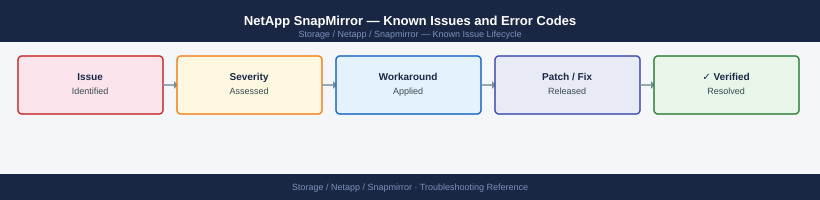

---
tags:
  - troubleshooting
  - snapmirror
  - netapp
  - known-issues
---
# NetApp SnapMirror — Known Issues and Error Codes

<div class="kb-summary">
Catalog of known SnapMirror bugs, error codes, and workarounds. SnapMirror is an ONTAP feature — most issues are cluster peering or intercluster LIF connectivity problems.

*Applies to: ONTAP 9.x SnapMirror / SnapVault / Cloud*
</div>



```d2
direction: down

symptom: Identify Symptom {shape: diamond}
relationship_errors: "Relationship Errors" {shape: rectangle}
initialization: "Initialization" {shape: rectangle}
snapmirror_to_cloud: "SnapMirror to Cloud" {shape: rectangle}
resolution: Resolve or Escalate {shape: oval}

symptom -> relationship_errors: investigate
symptom -> initialization: investigate
symptom -> snapmirror_to_cloud: investigate
relationship_errors -> resolution
initialization -> resolution
snapmirror_to_cloud -> resolution
```

## Before you begin

- Run `snapmirror show -fields state,healthy,lag-time` for relationship status.
- `snapmirror show -fields last-transfer-error` gives the last failure reason.
- Intercluster LIF connectivity (ports 11104/11105) is the most common root cause.

## Relationship Errors

| Error / Symptom | Affected Versions | Cause | Workaround / Fix | Fixed In |
|---|---|---|---|---|
| `SnapMirror: Source not reachable` | ONTAP 9.x | Cluster peering broken or intercluster LIF unreachable | Verify cluster peer: `cluster peer show`; check 11104/11105 between intercluster LIFs | N/A |
| Relationship stuck in `Transferring` for >24 hours | ONTAP 9.x | Network bandwidth saturated or network interruption | Abort transfer: `snapmirror abort`; resume when bandwidth available | N/A |
| `Destination is busy` during update | ONTAP 9.x | Concurrent SnapMirror operations on same destination volume | Stagger SnapMirror schedules to avoid concurrent transfers to same destination | N/A |
| `Snapshot not found` on destination after truncation | ONTAP 9.x | Destination's common Snapshot deleted | Run `snapmirror resync` to re-establish baseline; full transfer required | N/A |

## Initialization

| Error / Symptom | Affected Versions | Cause | Workaround / Fix | Fixed In |
|---|---|---|---|---|
| Initial baseline transfer failing midway | ONTAP 9.x | Network interruption during large initial transfer | Transfer restarts from last checkpoint; no data re-sent | N/A |
| `Cluster peer not authenticated` | ONTAP 9.x | Peer relationship deleted on one side | Delete and re-create cluster peer on both sides using `cluster peer create` | N/A |

## SnapMirror to Cloud

| Error / Symptom | Affected Versions | Cause | Workaround / Fix | Fixed In |
|---|---|---|---|---|
| `S3 endpoint unreachable` | ONTAP 9.12+ | ONTAP cluster cannot reach S3 endpoint (port 443) | Verify outbound 443 from cluster management LIF to S3 endpoint FQDN | N/A |
| `Invalid credentials for cloud target` | ONTAP 9.x | S3 access key or secret key incorrect | Update cloud target credentials: `snapmirror cloud target modify` | N/A |

## See also

- [NetApp SnapMirror — Common Issues](common-issues/)
- [NetApp ONTAP — Known Issues](../../ontap/troubleshooting/known-issues.md)
- [NetApp SnapCenter — Known Issues](../../snapcenter/troubleshooting/known-issues.md)
