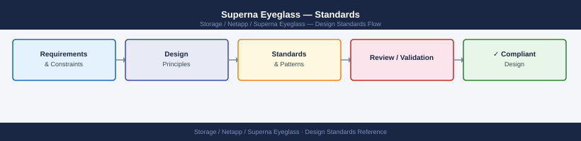

---
tags:
  - architecture
  - netapp
---
# Superna Eyeglass — Standards


<div class="kb-summary">
Standards reference covering SyncIQ Policy Naming, DR Readiness Score, Failover Test Frequency, Operational Standards, Policy Configuration.

*Applies to: Superna Eyeglass*
</div>



## SyncIQ Policy Naming

SyncIQ policy names must be consistent between primary and DR clusters and follow the format:


### Viewing Policies

```bash
# List all DR policies
egcli drpolicy list

# Detailed view of a specific policy
egcli drpolicy view --policy <policy_name>

# Status of all policies (replication state, lag, last test)
egcli drpolicy status --all

# List access zones included in a policy
egcli accesszone list --policy <policy_name>

# List SyncIQ policies mapped to a DR policy
egcli synciq list --policy <policy_name>
```

### Creating a DR Policy

DR policies are typically created via the Eyeglass web UI. CLI equivalent:

```bash
# Create a new DR policy (basic parameters)
egcli drpolicy create \
  --name POL-NAS-PROD \
  --source-cluster <production-cluster> \
  --target-cluster <dr-cluster> \
  --access-zone <zone_name> \
  --synciq-policy <synciq_policy_name> \
  --rpo-seconds 300

# Add additional access zones to an existing policy
egcli drpolicy addzone --policy POL-NAS-PROD --access-zone <zone2_name>

# Add additional SyncIQ policies to an existing policy
egcli drpolicy addsync --policy POL-NAS-PROD --synciq-policy <synciq_policy2>

# Enable the policy
egcli drpolicy enable --policy POL-NAS-PROD
```

### SyncIQ Integration

Eyeglass monitors and manages SyncIQ policies as part of DR orchestration. SyncIQ policies must be pre-configured on the production PowerScale cluster.

```bash
# On production PowerScale — view SyncIQ policy configuration
isi sync policies view <synciq_policy_name>

# Confirm policy target is the DR cluster
# Confirm schedule (should be frequent enough to meet RPO)
# Confirm source/target paths match the access zone directories

# Check last run time and status
isi sync reports list --policy <synciq_policy_name> --limit 5

# Manually trigger a SyncIQ sync (e.g., before a planned failover)
isi sync jobs start <synciq_policy_name>

# Monitor sync job completion
isi sync jobs list
```

| SyncIQ Setting | Recommended Value |
|---|---|
| Schedule | Every 5–15 minutes (match RPO target) |
| Source root | Access zone base directory |
| Target path | Matching path on DR cluster |
| Workers per node | 3 (default; increase for high-throughput environments) |
| Log level | Info |

### Policy RPO Monitoring

```bash
# Check current replication lag vs RPO target per policy
egcli drpolicy status --all

# Alert if lag exceeds RPO
# Eyeglass sends SNMP traps or syslog events on RPO breach
# Forward events to monitoring: Settings → Notifications in Eyeglass UI

# Manually check SyncIQ lag on production cluster
isi sync policies list | grep -E "Name|Last|Status"
```

### Modifying and Disabling Policies

```bash
# Update RPO target for a policy
egcli drpolicy modify --policy <policy_name> --rpo-seconds 600

# Disable a policy (e.g., when decommissioning a workload)
egcli drpolicy disable --policy <policy_name>

# Remove an access zone from a policy
egcli drpolicy removezone --policy <policy_name> --access-zone <zone_name>

# Delete a policy (caution — removes Eyeglass orchestration but does not
# remove underlying SyncIQ policies from PowerScale)
egcli drpolicy delete --policy <policy_name> --confirm

# After deletion: verify remaining SyncIQ policies on PowerScale are correct
isi sync policies list
```

---

## See also

- [Superna Eyeglass — How It Works](how-it-works/)
- [Superna Eyeglass — Integrations](integrations/)
- [Superna Eyeglass — Deploy](../deploy/)
