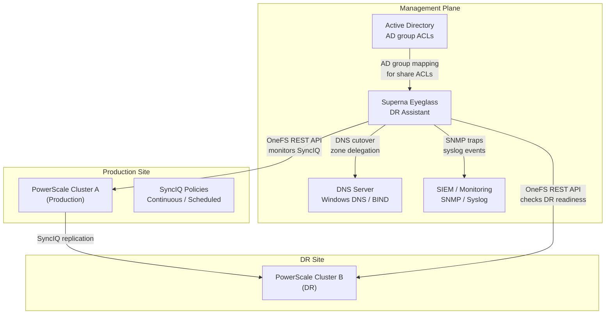

---
tags:
  - architecture
  - netapp
---
# Superna Eyeglass — Integrations


<div class="kb-summary">
Integrations reference covering NetApp PowerScale (SyncIQ), Syslog / SIEM, Email Notifications.

*Applies to: Superna Eyeglass*
</div>

## NetApp PowerScale (SyncIQ)


```text
┌──────────────────────────── Superna Eyeglass — Architecture Integrations ─────────────────────────────┐
│                                                                                                       │
│   ┌───────────────────────────────────────────────────────────────────────────────────────────────┐   │
│   │                         Superna Eyeglass — External Integration Points                        │   │
│   │ Auth: Eyeglass admin roles; PowerScale admin credentials; AD integration for DFS-N management │   │
│   │                 Storage: connected via 443 (Eyeglass web UI) · 8080 (REST API)                │   │
│   │            Monitoring: SNMP traps / syslog / REST API to ITSM and alerting systems            │   │
│   │        Encryption: HTTPS/TLS for all management; SyncIQ replication AES-256 in transit        │   │
│   └───────────────────────────────────────────────────────────────────────────────────────────────┘   │
│                                                                                                       │
│                          ▼                        ▼                        ▼                          │
│                                                                                                       │
│   ┌─────────────────────────────┐  ┌─────────────────────────────┐  ┌─────────────────────────────┐   │
│   │           Identity          │  │           Storage           │  │          Monitoring         │   │
│   │          AD / LDAP          │  │    443 (Eyeglass web UI)    │  │        SNMP / syslog        │   │
│   │           SAML SSO          │  │       8080 (REST API)       │  │         REST webhook        │   │
│   │          RBAC roles         │  │       NFS / iSCSI / FC      │  │         Email alerts        │   │
│   │         MFA optional        │  │       Dedup appliance       │  │          ServiceNow         │   │
│   │          Cert auth          │  │        Object storage       │  │          Prometheus         │   │
│   └─────────────────────────────┘  └─────────────────────────────┘  └─────────────────────────────┘   │
│                                                                                                       │
│  Physical Infrastructure:                                                                             │
│  ESXi VM (Eyeglass appliance) · PowerScale cluster pair (production + DR) · SyncIQ replication link   │
│  Key terms:                                                                                           │
│                                                                                                       │
│  Eyeglass      = Superna Eyeglass; software appliance for NAS DR and ransomware protection            │
│  RAPA          = Ransomware Protection with Automated Response; detects and quarantines threats       │
│  SyncIQ        = PowerScale built-in replication; Eyeglass monitors and orchestrates policies         │
│  DFS-N         = Windows Distributed File System Namespace; Eyeglass automates failover of DFS        │
│  Failover      = Eyeglass-orchestrated shift of NAS access from production to DR cluster              │
│  Failback      = reversing failover; Eyeglass re-syncs DR changes back and cuts back to product       │
│  Quota Sync    = Eyeglass replicates SmartQuotas from source to DR to preserve user limits            │
│  Export Sync   = NFS exports and SMB shares replicated so clients can reconnect at DR site            │
│  Quarantine    = RAPA isolation of suspect directory; blocks writes, alerts ops team                  │
│  Shadow Copy   = Eyeglass exposes PowerScale snapshots as Windows Previous Versions for NFS sha       │
│  Runbook       = Eyeglass DR Assistant guided checklist for pre-checks, failover, and validation      │
│  igls          = Eyeglass CLI; used for status, sync, DR, and RAPA operations                         │
│  SmartConnect  = PowerScale DNS load balancing; failover changes SmartConnect zone delegation         │
│  Configuration = shares, exports, quotas, NFS aliases; Eyeglass syncs these between clusters          │
│                                                                                                       │
└───────────────────────────────────────────────────────────────────────────────────────────────────────┘
```

## Syslog / SIEM

Forward Eyeglass audit trail to SIEM:

1. Eyeglass Admin UI: Configuration → Syslog
2. Enter SIEM IP, port 514 (UDP) or 6514 (TLS)

Alert in SIEM on:
- Failover initiated (any event)
- DR readiness score < 100% for > 15 minutes
- Eyeglass appliance unreachable

## Email Notifications

Eyeglass Admin UI: Configuration → Notifications → Email:
- Configure SMTP relay
- Add distribution lists for DR team and on-call
- Enable notifications for: failover events, readiness changes, SyncIQ policy errors
