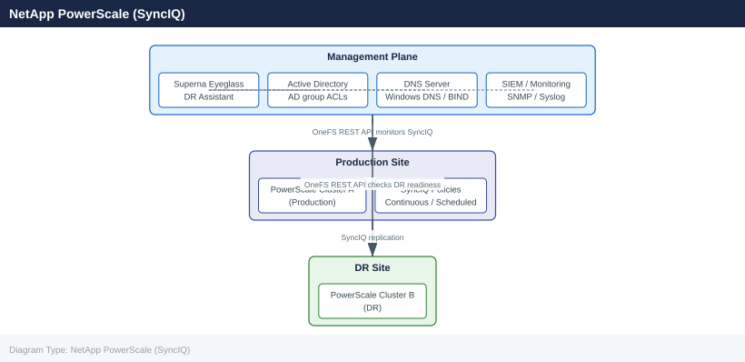

---
tags:
  - architecture
  - netapp
---
# Superna Eyeglass — Integrations

Integrations reference covering NetApp PowerScale (SyncIQ), Syslog / SIEM, Email Notifications.

*Applies to: Superna Eyeglass*

## NetApp PowerScale (SyncIQ)

## Syslog / SIEM

Forward Eyeglass audit trail to SIEM:

1. Eyeglass Admin UI: Configuration → Syslog
2. Enter SIEM IP, port 514 (UDP) or 6514 (TLS)

Alert in SIEM on:
- Failover initiated (any event)
- DR readiness score < 100% for > 15 minutes
- Eyeglass appliance unreachable

## Email Notifications

Eyeglass Admin UI: Configuration → Notifications → Email:
- Configure SMTP relay
- Add distribution lists for DR team and on-call
- Enable notifications for: failover events, readiness changes, SyncIQ policy errors

---

## See also

- [Superna Eyeglass — How It Works](../how-it-works/)
- [Superna Eyeglass — Design Standards](../design-standards/)
