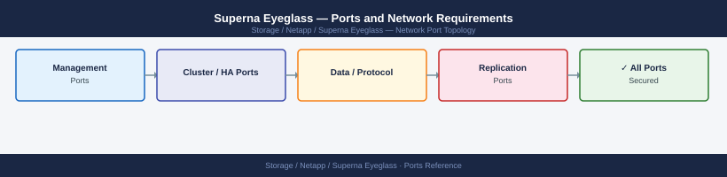

---
tags:
  - superna-eyeglass
  - netapp
  - networking
  - firewall
  - ports
  - DR
---
# Superna Eyeglass — Ports and Network Requirements

<div class="kb-summary">
Firewall port reference for Superna Eyeglass (PowerScale / Isilon DR orchestration and file auditing). Eyeglass runs as a virtual appliance and connects to PowerScale clusters and AD to manage SyncIQ failover and quota/share replication.

*Applies to: Superna Eyeglass 2.x / 3.x for PowerScale (OneFS)*
</div>



```d2
direction: right

center: "Superna Eyeglass" {shape: hexagon}
network_zones: "Network Zones" {shape: rectangle}
inbound_admin_to_eyeglass: "Inbound — Admin to Eyeglass" {shape: rectangle}
eyeglass_to_powerscale_outbound: "Eyeglass to PowerScale (Outbound)" {shape: rectangle}
eyeglass_to_active_directory_outboun: "Eyeglass to Active Directory (Outbound)" {shape: rectangle}
eyeglass_to_nfs_file_auditing_option: "Eyeglass to NFS (File Auditing — Optional)" {shape: rectangle}
firewall_zone_summary: "Firewall Zone Summary" {shape: rectangle}

center -> network_zones
center -> inbound_admin_to_eyeglass
center -> eyeglass_to_powerscale_outbound
center -> eyeglass_to_active_directory_outboun
center -> eyeglass_to_nfs_file_auditing_option
center -> firewall_zone_summary
```

## Network Zones

```
┌───────────────────────────────────────────────────────────────────────────────────────────────────────┐
│  Admin Browsers  │──8081──▶┌─────────────────────────────────┐
└──────────────────┘         │  Superna Eyeglass Appliance     │
                             │  (Linux VM)                     │
                             └────┬──────────────┬────────────┘
                                  │              │
                              443/8080         636/389
                                  │              │
                     ┌────────────▼──────┐  ┌───▼──────────────┐
                     │  PowerScale       │  │  Active Directory │
                     │  Clusters         │  │  (LDAP / Kerberos)│
                     │  (Primary + DR)   │  └──────────────────┘
                     └───────────────────┘
```

## Inbound — Admin to Eyeglass

| Port | Protocol | Source | Purpose |
|---|---|---|---|
| 8081 | TCP | Admin browsers | Eyeglass web UI (HTTPS) |
| 22 | TCP | Jump hosts | SSH — Eyeglass appliance OS access |

## Eyeglass to PowerScale (Outbound)

| Port | Protocol | Source | Destination | Purpose |
|---|---|---|---|---|
| 8080 | TCP | Eyeglass appliance | PowerScale SmartConnect / mgmt IP | OneFS Platform API — cluster monitoring, SyncIQ policy management, quota/share config |
| 443 | TCP | Eyeglass appliance | PowerScale mgmt IP | Newer OneFS — HTTPS platform API |
| 22 | TCP | Eyeglass appliance | PowerScale mgmt IP | SSH — configuration push and automation |

## Eyeglass to Active Directory (Outbound)

| Port | Protocol | Source | Destination | Purpose |
|---|---|---|---|---|
| 636 | TCP | Eyeglass appliance | AD domain controllers | LDAP/S — user and group sync (share permissions, quota owners) |
| 389 | TCP | Eyeglass appliance | AD domain controllers | LDAP — fallback if LDAPS not available |
| 88 | TCP/UDP | Eyeglass appliance | AD domain controllers | Kerberos — authentication |

## Eyeglass to NFS (File Auditing — Optional)

| Port | Protocol | Source | Destination | Purpose |
|---|---|---|---|---|
| 2049 | TCP | Eyeglass appliance | PowerScale NFS data IP | NFS — file access for audit scanning |
| 111 | TCP/UDP | Eyeglass appliance | PowerScale NFS data IP | Portmapper / rpcbind for NFS mount |

## Firewall Zone Summary

| From | To | Ports | Notes |
|---|---|---|---|
| Admin browsers | Eyeglass appliance | 8081 | Web UI |
| Eyeglass appliance | PowerScale mgmt | 8080 or 443, 22 | API + SSH — required for DR orchestration |
| Eyeglass appliance | Active Directory | 636, 389, 88 | LDAP/Kerberos |
| Eyeglass appliance | PowerScale NFS | 2049, 111 | File auditing only |

## Verify

```bash
# From Eyeglass appliance — test PowerScale API
curl -sk -o /dev/null -w "%{http_code}" https://<powerscale-mgmt>:8080/platform/latest/

# From Eyeglass appliance — test AD LDAPS
ldapsearch -H ldaps://<ad-dc>:636 -x -b "dc=domain,dc=com" "(cn=*)" cn

# From Eyeglass appliance — test SSH to PowerScale
ssh admin@<powerscale-mgmt> "isi version"

# From admin workstation — test Eyeglass UI
curl -sk -o /dev/null -w "%{http_code}" https://<eyeglass-ip>:8081/
```

## See also

- [Superna Eyeglass — Architecture](how-it-works/)
- [Dell PowerScale — Ports](../../../dell/powerscale/architecture/ports.md)
- [NetApp ONTAP — Ports](../../ontap/architecture/ports.md)
