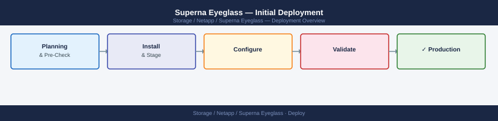
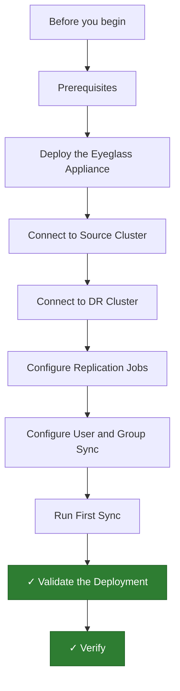

---
tags:
  - deployment
  - netapp
search:
  boost: 1.5
---

## Before you begin

- **Access:** admin credentials for the target system and any upstream dependencies (DNS, NTP, vCenter, directory services)
- **Timing:** safe to run during a scheduled maintenance window; allow 1-2 hours for initial deployment
- **Dependencies:** network connectivity verified; DNS resolvable; NTP configured; any licence keys available
- **Logging:** record every IP address, hostname, and credential set assigned during this deployment

---

# Superna Eyeglass — Initial Deployment

## Prerequisites

PowerScale (Isilon) clusters at both sites (production and DR), vSphere for Eyeglass virtual appliance, network access between Eyeglass and both clusters (HTTPS 8080/443), Eyeglass licence, DNS entries for both cluster SmartConnect zones.

## Deploy the Eyeglass Appliance

Download OVA from Superna portal, deploy to vSphere, assign IP/DNS/gateway, power on, complete first-boot wizard.

## Connect to Source Cluster

Eyeglass Configuration → Add Cluster → enter source PowerScale management IP/FQDN → credentials (admin or service account with appropriate role) → test connectivity → save.

## Connect to DR Cluster

Add second cluster (DR PowerScale) → credentials → test → save.

## Configure Replication Jobs

Eyeglass → Configuration Replication → New Job → select source cluster → select shares/exports/quotas to replicate → select DR cluster as target → set schedule → save.

## Configure User and Group Sync

Eyeglass → User and Group Replication → enable → select source and target clusters → test sync.

## Run First Sync

Trigger manual sync for all replication jobs → verify shares/exports/quotas appear on DR cluster → verify ACLs are preserved.

## Validate the Deployment

Eyeglass → DR Testing → Runbook → generate DR readiness report → verify all jobs show Ready → document last sync timestamp → schedule first DR test.

---

## Verify

- **Cluster health:** all nodes show online in the management UI
- **Volume access:** mount a test LUN/NFS export from a host and confirm read/write
- **Replication:** confirm replication partner shows last-sync within RPO window

---

## See also

- [Superna Eyeglass — Procedures](../operations/procedures/)
- [Superna Eyeglass — Common Issues](../troubleshooting/common-issues/)
- [Superna Eyeglass — How It Works](../architecture/how-it-works/)
