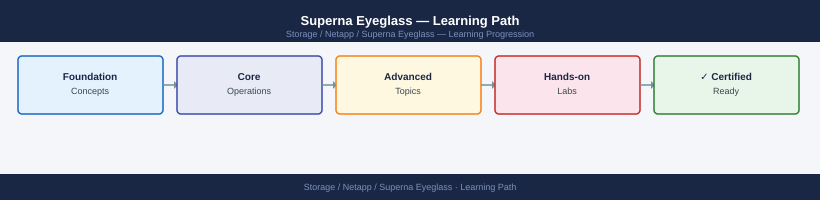
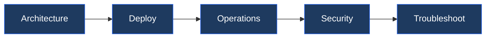

---
tags:
  - learning-path
  - netapp
---
# Superna Eyeglass — Learning Path

Recommended reading order for Superna Eyeglass. Follow these stages in order to build a complete mental model before working with it in production.

*Applies to: Superna Eyeglass*

## Stage 1 — Architecture

**Goal**: Understand how Eyeglass monitors CIFS audit events, detects ransomware anomalies, and provides automated lockout and recovery capabilities for NetApp storage.

**Read in this order**:

- [How It Works](../architecture/how-it-works/) — Eyeglass appliance architecture: audit event ingestion from ONTAP CIFS audit logs, anomaly detection engine, automated lockout via Active Directory account disable, alert pipeline
- [Design Standards](../architecture/design-standards/) — Detection sensitivity tuning, anomaly threshold configuration, lockout scope (user vs share), recovery runbook design, multi-cluster federation sizing
- [Integrations](../architecture/integrations/) — ONTAP CIFS audit log streaming, Active Directory for lockout actions, SIEM/syslog integration, email alerting, SNMP trap integration

**Why first**: Eyeglass acts autonomously during a ransomware event — understanding the detection model and lockout scope before deployment prevents overly aggressive or under-sensitive configurations.

---

## Stage 2 — Deployment

**Goal**: Deploy the Eyeglass virtual appliance, connect ONTAP clusters, and validate audit event ingestion.

**Read**:

- [Deploy](../deploy/) — OVA deployment, ONTAP cluster registration with audit-capable credentials, CIFS audit policy configuration on SVMs, Active Directory service account for lockout actions, initial sensitivity calibration

---

## Stage 3 — Operations

**Goal**: Monitor audit events, review anomaly alerts, manage lockout actions, and execute recovery workflows.

**Read in this order**:

- [Health Checks](../operations/health-checks/) — Run the routine first on every shift; verify audit event ingestion is current, review active anomaly alerts, confirm AD lockout service account is functional
- [CLI Reference](../operations/cli-reference/) — Eyeglass REST API for alert queries, lockout status checks, and policy configuration; ONTAP CLI commands for CIFS audit policy management
- [Procedures](../operations/procedures/) — Responding to a ransomware alert: validate anomaly, contain (lockout), assess scope, initiate snapshot recovery; unblock a legitimate user after false positive
- [Backup & Restore](../operations/backup-restore/) — Snapshot-based recovery workflow for ransomware-affected volumes; coordinating ONTAP snapshot restore with Eyeglass incident tracking
- [Scripts](../operations/scripts/) — Alert suppression scripts for known maintenance windows, automated incident report generation, anomaly trend reporting

---

## Stage 4 — Security

**Goal**: Secure Eyeglass management access and ensure the lockout service account is appropriately privileged and audited.

**Read**:

- [Access Control](../security/access-control/) — Eyeglass admin vs read-only roles, restricting who can approve or override lockout actions, audit of manual policy changes
- [Authentication](../security/authentication/) — Eyeglass web UI authentication (local and AD), two-factor authentication for admin accounts, ONTAP credential storage security
- [Encryption](../security/encryption/) — HTTPS enforcement for Eyeglass management UI, encrypted ONTAP API connections, secure storage of AD service account credentials
- [Hardening](../security/hardening/) — Restrict Eyeglass management network access, limit AD lockout account to minimum required permissions, enable audit log export to SIEM

---

## Stage 5 — Troubleshooting

**Goal**: Diagnose missed detections, false positive lockouts, and audit log ingestion failures.

**Read**:

- [Common Issues](../troubleshooting/common-issues/) — Audit events not being received, false positive lockout of legitimate user, anomaly threshold triggering on backup jobs, AD account disable failing due to permissions
- [Diagnostics](../troubleshooting/diagnostics/) — Eyeglass appliance logs, ONTAP CIFS audit policy verification, AD service account permission test, anomaly engine log review
- [Escalation](../troubleshooting/escalation/) — Superna support case process, log bundle export from Eyeglass, ONTAP audit configuration review with NetApp

**Why last**: Troubleshooting missed detections or false positives requires a clear mental model of the audit event pipeline and anomaly engine thresholds — established in the Architecture and Operations stages.

---

## See also

- [Superna Eyeglass — Deploy](../../deploy/)
