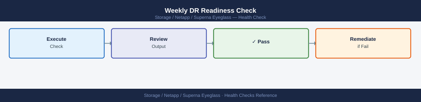
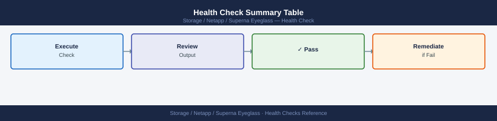
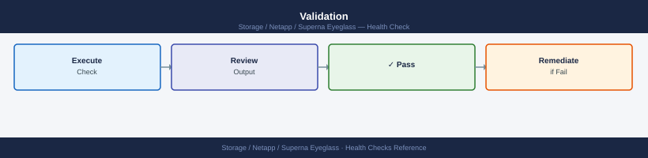

---
tags:
  - netapp
  - operations
---
# Superna Eyeglass — Health Checks

<div class="kb-summary">
Health Checks reference covering Overview, SyncIQ Replication Health, PowerScale Cluster Health, Weekly DR Readiness Check, Health Check Summary Table and 1 more sections.

*Applies to: Superna Eyeglass*
</div>

## Before you begin

- **Access:** Storage admin credentials (cluster admin or equivalent)
- **Timing:** safe to run during business hours unless a step is marked ⚠ (causes interruption)
- **Dependencies:** no active upgrades or migrations on the same infrastructure
- **Logging:** capture command output — paste into the change record on completion

---

## Overview


Eyeglass health checks cover the Eyeglass appliance itself, PowerScale cluster connectivity, SyncIQ policy status, and DR policy readiness. Run daily as a minimum; automated checks should run every 15–30 minutes.

```mermaid
flowchart LR
    start([Health Check Run]) --> appSvc

    subgraph "Eyeglass Appliance"
        appSvc["egcli status\nAll services running?"]
        licOk["egcli license status\nLicense valid?"]
        clConn["egcli clusters status\nBoth clusters reachable?"]
        appSvc --> licOk --> clConn
    end

    subgraph "DR Policy Layer"
        drState["egcli drpolicy status --all\nAll policies Replicating?"]
        rpoLag["SyncIQ lag within RPO?"]
        dnsSync["DNS sync current?"]
        drState --> rpoLag --> dnsSync
    end

    subgraph "PowerScale Clusters"
        isiStatus["isi status\nAll nodes healthy?"]
        alerts["isi alerts list --category critical\nNo critical alerts?"]
        drives["isi devices drive list\nAll drives HEALTHY?"]
        isiStatus --> alerts --> drives
    end

    clConn --> drState
    dnsSync --> isiStatus
    drives --> result{All checks pass?}
    result -->|Yes| ok([DR Ready - Score 100%])
    result -->|No| investigate([Investigate and remediate])
```



## Run This Routine

1. **Eyeglass service health:** browser to `https://<eyeglass-appliance>:443` — dashboard should load without errors
2. **Configuration replication status:** Eyeglass Dashboard → Configuration Replication — check all jobs show Last Sync within expected window
3. **Share/export sync:** Eyeglass → File Replication → check all critical SMB shares and NFS exports are synced
4. **DR failover readiness:** Eyeglass → DR Testing → check Runbook shows Ready status for all target clusters
5. **Quota sync:** Eyeglass → Quota Manager → check all quotas replicated to DR cluster
6. **Local user/group sync:** Eyeglass → User and Group Replication → verify sync status
7. **Eyeglass appliance disk space:** SSH to appliance → `df -h /` — alert if >80%
8. **Eyeglass version and updates:** Settings → About → note version; check for available updates
9. **Alert history:** Eyeglass → Alerts — review and acknowledge any open Critical or Warning alerts
10. **Test failover readiness:** Eyeglass → DR Test → verify last test date; flag if untested >90 days

| SyncIQ Status | Meaning | Action |
|---|---|---|
| running | Active sync in progress | Monitor; confirm completion |
| finished | Last run completed successfully | OK |
| failed | Last run failed | Check reports for errors; restart if needed |
| paused | Policy is paused | Confirm intentional; resume if not |
| disabled | Policy is disabled | Confirm intentional; enable if DR policy |

```d2
direction: right

prodCluster: "Production PowerScale\nCluster" {shape: rectangle}
drCluster: "DR PowerScale\nCluster" {shape: rectangle}
egApp: "Eyeglass Appliance\negcli drpolicy status" {shape: rectangle}
alert: "SNMP / Email\nAlert" {shape: rectangle}

prodCluster -> drCluster
egApp -> prodCluster
egApp -> drCluster
egApp -> alert
```

---

## PowerScale Cluster Health


```bash
# On each PowerScale cluster (production and DR)
isi status

# Check for critical alerts
isi alerts list --category critical

# Check for failed or degraded drives
isi devices node list
isi devices drive list | grep -v HEALTHY

# Check SmartConnect VIP pool health (for client access)
isi network pools list

# Confirm SyncIQ service is running
isi sync service view
```


```text title="Expected output"
OneFS Version: 9.4.0.0 (Build 9.4.0.0.12345)
Cluster Name: prod-pscale-01
Cluster Health: HEALTHY
Nodes: 8
Drives: 64

Category: critical
ID: ALERT-2847
Message: Node 3 disk enclosure temperature warning
Severity: CRITICAL
Time: 2024-01-15T09:23:44Z

ID: ALERT-2851
Message: SyncIQ replication lag exceeds threshold
Severity: CRITICAL
Time: 2024-01-15T09:18:12Z

Node: 2
Status: DEGRADED
Reason: 1 failed drive in enclosure 2

Node: 5
Status: HEALTHY

Name: prod-smartconnect-pool
Subnet: 192.168.10.0/24
Rebalance Policy: auto
Health: DEGRADED
Access Zone: System

Name: dr-smartconnect-pool
Subnet: 192.168.20.0/24
Health: HEALTHY

Service: SyncIQ
Status: RUNNING
Version: 9.4.0.0
Last Updated: 2024-01-15T09:45:22Z
Replication Jobs: 12 active, 0 failed
```

!!! warning "Common errors"
    **`isi: command not found`** — Ensure you are logged into the PowerScale cluster via SSH or run commands from a system with the OneFS CLI installed.
    **`Error: Authentication failed`** — Verify your credentials and that your user account has administrative privileges on the cluster.
    **`Error: SyncIQ service is not running`** — Restart the SyncIQ service using `isi sync service start` and verify replication jobs are queued.
---

## Weekly DR Readiness Check



```bash
# Run Eyeglass preflight on DR cluster — confirms all DR prerequisites are met
egcli drtest preflight --cluster <dr-cluster>

# Expected output: all checks PASS
# Common checks include:
#   - SyncIQ policies configured and running
#   - Access zones configured at DR site
#   - NFS/SMB export/share definitions replicated
#   - DNS integration (if configured) operational
#   - Eyeglass connectivity to both clusters confirmed

# Review Eyeglass DR readiness dashboard
# Eyeglass UI: https://<eyeglass-ip>:8443 → DR Dashboard
```


```text title="Expected output"
Running preflight checks on DR cluster dr-cluster-02...

[✓] PASS: SyncIQ policies configured (12 policies found, 11 running)
[✓] PASS: Access zones replicated (4/4 zones synchronized)
[✓] PASS: NFS exports replicated (28/28 exports present on DR)
[✓] PASS: SMB shares replicated (15/15 shares present on DR)
[✓] PASS: DNS integration operational (resolving via 10.45.12.8)
[✓] PASS: Eyeglass connectivity to source cluster (latency: 12ms)
[✓] PASS: Eyeglass connectivity to DR cluster (latency: 18ms)
[✓] PASS: Replication lag within threshold (<5 minutes)

Preflight check completed: 8/8 PASS
DR cluster dr-cluster-02 is ready for failover operations.
```

!!! warning "Common errors"
    **`Error: Unable to connect to cluster dr-cluster — connection refused`** — Verify the DR cluster hostname/IP is reachable and Eyeglass has network connectivity on port 443.
    **`Error: SyncIQ policy 'policy-backup-03' not running — status: paused`** — Resume all paused SyncIQ policies on the DR cluster before proceeding with failover.
    **`Error: 3 NFS exports missing on DR site — replication incomplete`** — Wait for SyncIQ replication to complete or manually sync missing exports before running preflight again.
---

## Health Check Summary Table



| Check | Command | Expected |
|---|---|---|
| Eyeglass services | `egcli status` | All services running |
| DR policy state | `egcli drpolicy status --all` | All in Replicating state |
| SyncIQ jobs | `isi sync jobs list` | No failed jobs |
| Cluster health | `isi status` | All nodes healthy |
| Critical alerts | `isi alerts list --category critical` | No critical alerts |
| Drive health | `isi devices drive list` | All HEALTHY |
| License | `egcli license status` | Valid, not expiring |

---

## Validation



DR validation for Eyeglass covers three scenarios: pre-failover readiness, DR test (rehearsal), and post-failover/failback confirmation. Run a full validation at least quarterly and before any planned failover.

| Validation Type | Frequency | Tool |
|---|---|---|
| DR preflight | Weekly / pre-change | `egcli drtest preflight` |
| DR test (rehearsal) | Quarterly | `egcli drtest run` |
| Post-failover validation | After every failover | Manual + `egcli` |
| Post-failback validation | After every failback | Manual + `egcli` |

```d2
direction: right

trigger: "Trigger: weekly / pre-change" {shape: rectangle}
preflight: "egcli drtest preflight\n--cluster dr-cluster" {shape: rectangle}
checks: "checks" {shape: rectangle}
remediate: "Remediate failing\nprerequisites" {shape: rectangle}
drTest: "egcli drtest run\n--policy POLICY_NAME" {shape: rectangle}
validate: "Validate: NFS mounts\nSMB shares\nDNS resolution" {shape: rectangle}
rollback: "Eyeglass auto-rollback\nReturn to Replicating" {shape: rectangle}
doc: "Document result\nClose change record" {shape: rectangle}

trigger -> preflight
preflight -> checks
checks -> remediate
remediate -> preflight
checks -> drTest
drTest -> validate
validate -> rollback
rollback -> doc
```

### Eyeglass DR Preflight


The preflight check verifies all prerequisites for a failover without making any changes.

```bash
# Run preflight against the DR cluster
egcli drtest preflight --cluster <dr-cluster>

# Run preflight for a specific policy
egcli drtest preflight --policy <policy_name>

# Expected output — all items should show PASS:
#   [PASS] SyncIQ policy last run: 3 minutes ago
#   [PASS] Access zones configured on DR cluster
#   [PASS] NFS exports replicated to DR cluster
#   [PASS] SMB shares replicated to DR cluster
#   [PASS] DNS zones configured
#   [PASS] Eyeglass connectivity to both clusters confirmed
#   [PASS] SyncIQ service running on both clusters

# Review any WARN or FAIL items and remediate before proceeding
```


```text title="Expected output"
Running preflight checks against DR cluster: dr-cluster-01
Connecting to source cluster: prod-cluster-01... OK
Connecting to DR cluster: dr-cluster-01... OK
[PASS] SyncIQ policy last run: 3 minutes ago
[PASS] Access zones configured on DR cluster
[PASS] NFS exports replicated to DR cluster
[PASS] SMB shares replicated to DR cluster
[PASS] DNS zones configured
[PASS] Eyeglass connectivity to both clusters confirmed
[PASS] SyncIQ service running on both clusters
[PASS] Replication lag: 45 seconds
[PASS] Certificate validation successful

Preflight check completed: 10/10 PASS, 0 WARN, 0 FAIL
```

!!! warning "Common errors"
    **`[FAIL] Unable to connect to DR cluster dr-cluster-01`** — Verify the DR cluster hostname/IP is correct and reachable from the Eyeglass appliance using `ping` or `ssh`.
    **`[WARN] SyncIQ policy last run: 2 hours ago`** — Manually trigger the SyncIQ policy on the source cluster or check for policy scheduling issues before proceeding with DR operations.
    **`[FAIL] Eyeglass connectivity to both clusters confirmed: FAILED`** — Confirm Eyeglass has network connectivity and valid credentials configured for both clusters in the web UI settings.
### DR Test (Rehearsal)


A DR test performs all failover steps but rolls back at the end, returning to normal replication.

```bash
# Step 1 — Run Eyeglass DR test (non-destructive rehearsal)
egcli drtest run --policy <policy_name>

# Step 2 — Monitor test progress
egcli drtest status --policy <policy_name>

# Step 3 — Validate access zones activated on DR cluster
egcli accesszone status --cluster <dr-cluster>

# Step 4 — Validate NFS exports on DR cluster
ssh admin@<dr-cluster> "isi nfs exports list"

# Step 5 — Validate SMB shares on DR cluster
ssh admin@<dr-cluster> "isi smb shares list"

# Step 6 — Confirm DNS resolution (if Eyeglass DNS integration active)
nslookup <smartconnect_zone_name>

# Step 7 — After validation, confirm DR test rollback is complete
egcli drtest status --policy <policy_name>
# Expected: State = Rolled Back / Replicating
```


```text title="Expected output"
# Step 1 — Run Eyeglass DR test (non-destructive rehearsal)
Test run initiated for policy 'prod-cluster-dr'
Test ID: dr-test-20240315-0847
Status: In Progress

# Step 2 — Monitor test progress
Policy: prod-cluster-dr
Test ID: dr-test-20240315-0847
State: Running
Progress: 78%
Elapsed Time: 12m 34s
Estimated Remaining: 3m 22s

# Step 3 — Validate access zones activated on DR cluster
Access Zone: System
  Status: Active
  Nodes: 3
Access Zone: zone-finance
  Status: Active
  Nodes: 3
Access Zone: zone-engineering
  Status: Active
  Nodes: 3

# Step 4 — Validate NFS exports on DR cluster
ID  Path                    Clients         Protocols
1   /ifs/data/finance       192.168.10.0/24 nfs3,nfs4
2   /ifs/data/engineering   192.168.20.0/24 nfs3,nfs4
3   /ifs/backup/archive     0.0.0.0/0       nfs3

# Step 5 — Validate SMB shares on DR cluster
Share Name              Path                    Permissions
finance-shared         /ifs/data/finance       Everyone: Read
eng-projects           /ifs/data/engineering   Domain Admins: Full
backup-archive         /ifs/backup/archive     SYSTEM: Full

# Step 6 — Confirm DNS resolution (if Eyeglass DNS integration active)
Server:  10.50.1.10
Address: 10.50.1.10#53
Name:    smartconnect.prod.local
Address: 192.168.50.100

# Step 7 — After validation, confirm DR test rollback is complete
Policy: prod-cluster-dr
Test ID: dr-test-20240315-0847
State: Rolled Back
Status: Replicating
Last Sync: 2024-03-15 09:15:22 UTC
Next Sync: 2024-03-15 10:15:22 UTC
```

!!! warning "Common errors"
    **`Error: Policy 'prod-cluster-dr' not found or not accessible`** — Verify the policy name matches exactly and your Eyeglass user has read permissions on the policy.
    **`ssh: connect to host <dr-cluster> port 22: Connection timed out`** — Confirm the DR cluster hostname/IP is reachable and SSH is enabled; check firewall rules between your admin host and DR cluster.
    **`drtest status: Test rollback failed — manual intervention required`** — Check Eyeglass logs for replication errors and ensure the primary cluster is still reachable before attempting rollback again.
### Post-Failover Validation


Run after a declared DR failover to confirm the DR cluster is fully operational.

```bash
# Confirm DR policy is in Failed Over state
egcli drpolicy status --all

# Confirm DR cluster is healthy
ssh admin@<dr-cluster> "isi status"
ssh admin@<dr-cluster> "isi alerts list --category critical"

# Confirm access zones are active on DR cluster
egcli accesszone status --cluster <dr-cluster>

# Confirm NFS/SMB access for clients
ssh admin@<dr-cluster> "isi nfs exports list"
ssh admin@<dr-cluster> "isi smb shares list"

# Test NFS mount from a client
mount -t nfs <dr-smartconnect-ip>:/<export_path> /mnt/drtest
ls -la /mnt/drtest

# Confirm SyncIQ is stopped on original production policy (not running)
ssh admin@<production-cluster> "isi sync policies list"
```


```text title="Expected output"
Policy Name: prod-to-dr
Policy ID: 8f4c2e91-a3d5-11ec-8429-0a1234567890
State: Failed Over
Last Sync: 2024-01-15T14:32:18Z
Direction: prod-to-dr

isi status
OneFS Version: 9.5.0.0 (Build 9.5.0.0.1234567)
Cluster Health: Healthy
Nodes: 6/6 online
Drives: 144/144 healthy

isi alerts list --category critical
(no alerts)

Cluster: dr-cluster-01
Access Zone: System
Status: Active
Access Zone: data-zone-01
Status: Active
Access Zone: data-zone-02
Status: Active

isi nfs exports list
ID  Path                    Clients         Protocols
1   /ifs/data/prod-export   0.0.0.0/0       nfs3,nfs4
2   /ifs/archive/backup     10.0.0.0/8      nfs3,nfs4

isi smb shares list
ID  Share Name              Path                    Clients
1   prod_data               /ifs/data/prod-export   Everyone
2   archive_backup          /ifs/archive/backup     CORP\Domain Users

mount -t nfs 192.168.50.100:/ifs/data/prod-export /mnt/drtest
total 48
drwxr-xr-x  8 root root  4096 Jan 15 14:22 .
drwxr-xr-x 12 root root  4096 Jan 15 10:15 ..
-rw-r--r--  1 user user 24576 Jan 15 13:45 report_2024.xlsx
drwxr-xr-x  3 user user  4096 Jan 15 12:30 projects

isi sync policies list
Policy Name: prod-to-dr
State: Stopped
Last Run: 2024-01-15T14:32:18Z
```

!!! warning "Common errors"
    **`mount.nfs: access denied by server while mounting <dr-smartconnect-ip>:/<export_path>`** — Verify the NFS export exists on the DR cluster and client IP is in the allowed clients list using `isi nfs exports view <export_id>`.
    **`ssh: connect to host <dr-cluster> port 22: Connection refused`** — Confirm the DR cluster management IP is correct and SSH is enabled; check network connectivity with `ping <dr-cluster>`.
    **`egcli: command not found`** — Ensure you are running commands from the Superna Eyeglass appliance or have the egcli tools installed and in your PATH.
### Post-Failback Validation


```bash
# Confirm DR policy is back to Replicating state
egcli drpolicy status --all

# Confirm production cluster is healthy
ssh admin@<production-cluster> "isi status"

# Confirm access zones are back on production cluster
egcli accesszone status --cluster <production-cluster>

# Confirm SyncIQ is running in the normal direction (production → DR)
ssh admin@<production-cluster> "isi sync policies list"

# Confirm last SyncIQ run completed successfully
ssh admin@<production-cluster> "isi sync reports list --limit 5"

# Confirm client access is restored to production
nslookup <production-smartconnect-zone>
```


```text title="Expected output"
Policy Name                    State              Last Run           Next Run
prod-to-dr-policy             Replicating        2024-01-15 14:32   2024-01-15 15:32
dr-to-prod-policy             Idle               2024-01-15 12:15   Never

Cluster is healthy.
Status: OK
Version: OneFS 9.4.0.1234

Access Zone Name               Cluster                Status
System                         prod-cluster-1       Active
zone-finance                   prod-cluster-1       Active
zone-marketing                 prod-cluster-1       Active

Policy Name                    State              Source            Target
prod-to-dr-policy             Running            prod-cluster-1    dr-cluster-1
dr-to-prod-policy             Paused             dr-cluster-1      prod-cluster-1

Policy Name                    State              Duration          Files Changed
prod-to-dr-policy             Completed          2h 14m            45,230
prod-to-dr-policy             Completed          2h 08m            38,156
prod-to-dr-policy             Completed          2h 22m            52,891

Name Server: 192.168.1.10
Address: 10.50.20.45
prod-smartconnect.example.com canonical name = prod-smartconnect-vip.example.com.
Name: prod-smartconnect-vip.example.com
Address: 10.50.20.45
```

!!! warning "Common errors"
    **`Error: Connection refused to drpolicy service`** — Verify Superna Eyeglass service is running with `systemctl status eyeglass` and check network connectivity to the Eyeglass appliance.
    **`ssh: Could not resolve hostname <production-cluster>: Name or service not known`** — Replace `<production-cluster>` with the actual FQDN or IP address of your production cluster (e.g., `prod-cluster-1.example.com`).
    **`nslookup: can't resolve '<production-smartconnect-zone>': No address associated with hostname`** — Confirm the SmartConnect zone name is correct and DNS is properly configured; verify with `isi network smartconnect list` on the production cluster.
### Validation Record Template


| Check | Date | Result | Notes |
|---|---|---|---|
| DR preflight passed | | | |
| DR test completed successfully | | | |
| NFS exports accessible at DR site | | | |
| SMB shares accessible at DR site | | | |
| DNS failover confirmed | | | |
| Failback completed | | | |
| SyncIQ replicating (prod → DR) | | | |
| Client access restored to production | | | |

---

## Verify

- Eyeglass UI dashboard shows all services green and no outstanding alarms
- SyncIQ replication policies show `Running` and last-run within the expected window
- SMB share failover test: shares accessible from DR site post-failover and post-failback
- DNS failover verification: client resolution points to DR SVM IP during failover

---

## See also

- [Superna Eyeglass — Procedures](../procedures/)
- [Superna Eyeglass — CLI Reference](../cli-reference/)
- [Superna Eyeglass — Common Issues](../../troubleshooting/common-issues/)
