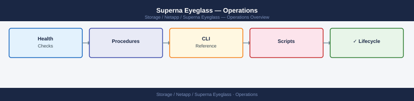

---
tags:
  - netapp
  - operations
---
# Superna Eyeglass — Operations

Superna Eyeglass day-to-day operations — DR orchestration, configuration sync monitoring, and SyncIQ policy management.

*Applies to: Superna Eyeglass*

<a class="kb-card" href="cli-reference/">
  <strong>CLI Reference</strong>
  igls CLI, REST API, failover, failback, sync status, and OneFS SyncIQ commands.
</a>

<a class="kb-card" href="health-checks/">
  <strong>Health Checks</strong>
  Daily and weekly checklists, appliance health, SyncIQ status, and DR validation.
</a>

<a class="kb-card" href="procedures/">
  <strong>Procedures</strong>
  Failover, failback, DNS cutover, and day-to-day operational procedures.
</a>

<a class="kb-card" href="install-upgrade/">
  <strong>Install & Upgrade</strong>
  Version compatibility, upgrade process, OneFS impact, EOL tracking, and licensing.
</a>

<a class="kb-card" href="backup-restore/">
  <strong>Backup & Restore</strong>
  Appliance configuration backup and restore procedures.
</a>

<a class="kb-card" href="scripts/">
  <strong>Scripts</strong>
  Automation scripts for health checks, RPO reporting, and failover validation.
</a>

  <a class="kb-card" href="faq/"><strong>FAQ</strong>Frequently asked questions, common issues, and quick answers for day-to-day operations.</a>

