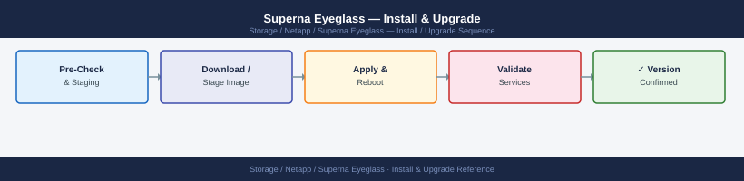
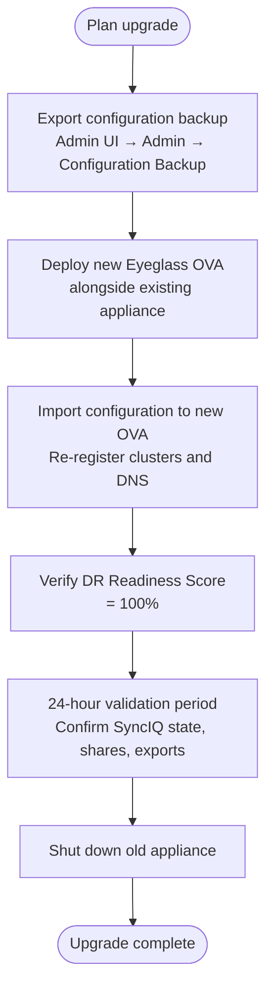

---
tags:
  - netapp
  - operations
---
# Superna Eyeglass — Install & Upgrade


<div class="kb-summary">
Install & Upgrade reference covering Version Compatibility Matrix, EOL Tracking, License Management.

*Applies to: Superna Eyeglass*
</div>



```d2
direction: right

hub: "Superna Eyeglass\nOperations" {shape: hexagon}
version_compatibility_matrix: "Version Compatibility Matrix" {shape: rectangle}
eol_tracking: "EOL Tracking" {shape: rectangle}
license_management: "License Management" {shape: rectangle}
verify: "Verify" {shape: rectangle}

hub -> version_compatibility_matrix
hub -> eol_tracking
hub -> license_management
hub -> verify
```

## Before you begin

- **Access:** Storage admin credentials (cluster admin or equivalent)
- **Timing:** safe to run during business hours unless a step is marked ⚠ (causes interruption)
- **Dependencies:** no active upgrades or migrations on the same infrastructure
- **Logging:** capture command output — paste into the change record on completion

---

## Version Compatibility Matrix

Eyeglass version must be compatible with the deployed PowerScale OneFS version. Always verify before upgrading either system.




If Eyeglass shows API errors after OneFS upgrade, check if an Eyeglass update is required to support the new OneFS version.

## EOL Tracking

| Item | Check Location | Action Threshold |
|---|---|---|
| Eyeglass appliance version | support.superna.net → EOL | Upgrade plan at 6 months before EOL |
| OneFS compatibility | Superna compatibility matrix | Verify before any OneFS upgrade |
| License expiry | Admin UI → License | Renew 60 days before expiry |
| VM guest OS (Eyeglass appliance) | Admin UI → System Info | Align with Superna supported OS list |

## License Management

Eyeglass licensing is per-cluster (primary and DR) and per-node count:

1. Download license file from Superna licensing portal
2. Admin UI → License → Import License
3. Verify license file UUID matches the appliance UUID shown in the UI

If appliance shows "Unlicensed" after an upgrade, re-import the license — appliance UUID may have changed if deployed from new OVA.

---

## Verify

- Confirm the operation completed without errors in the log or management UI
- Verify the expected state change is visible (service running, object created, config applied)
- Document the outcome in the change record

---

## See also

- [Superna Eyeglass — Procedures](procedures/)
- [Superna Eyeglass — Health Checks](health-checks/)
- [Superna Eyeglass — Deploy](../deploy/)
