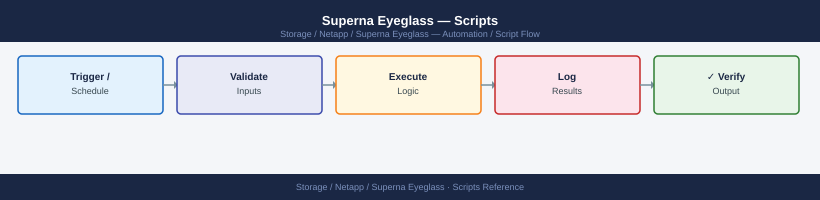

---
tags:
  - netapp
  - operations
---
# Superna Eyeglass — Scripts

Automation scripts for Superna Eyeglass — DR test operations, configuration reporting, and SyncIQ health monitoring.

*Applies to: Superna Eyeglass*

## Before you begin

- **Access:** Storage admin credentials (cluster admin or equivalent)
- **Timing:** safe to run during business hours unless a step is marked ⚠ (causes interruption)
- **Dependencies:** no active upgrades or migrations on the same infrastructure
- **Logging:** capture command output — paste into the change record on completion

---

---

## Verify

- Confirm the operation completed without errors in the log or management UI
- Verify the expected state change is visible (service running, object created, config applied)
- Document the outcome in the change record

---

## See also

- [Superna Eyeglass — Procedures](procedures/)
- [Superna Eyeglass — CLI Reference](cli-reference/)
- [Superna Eyeglass — Health Checks](health-checks/)
