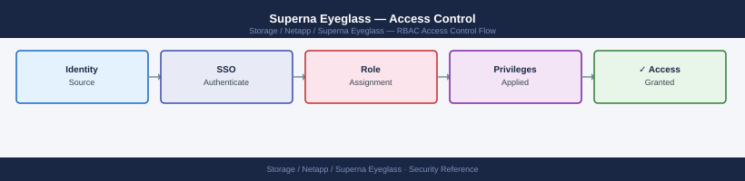

---
tags:
  - netapp
  - security
---
# Superna Eyeglass — Access Control


<div class="kb-summary">
Superna Eyeglass role-based access — user management, RBAC configuration, and access policy enforcement.

*Applies to: Superna Eyeglass*
</div>



Network access to the Eyeglass management interface must be restricted to the management VLAN or jump host only. Direct access from user workstations or untrusted networks is not permitted.

| Control | Detail |
|---|---|
| Network access | Restrict Eyeglass UI and API to management network |
| Console access | HTTPS only; restrict to management VLAN or jump host |
| OneFS API credentials | Dedicated service account; minimum required OneFS privileges |
| RBAC | Admin and read-only roles; enforce least privilege |

All failover events are recorded in the Eyeglass audit log. The audit log must be forwarded to a SIEM to ensure a complete record of all failover and configuration events is retained outside the appliance.

```d2
direction: down

external: External / Untrusted {shape: rectangle}
perimeter_controls: "Perimeter Controls" {shape: rectangle}
identity_access: "Identity & Access" {shape: rectangle}
audit_logging: "Audit & Logging" {shape: rectangle}
core: "Superna Eyeglass Core" {shape: hexagon}

external -> perimeter_controls: traffic in
perimeter_controls -> identity_access
identity_access -> audit_logging
audit_logging -> core: secured path
```

## Before you begin

- **Access:** Storage admin credentials (cluster admin or equivalent)
- **Change management:** security changes require CAB approval in most environments
- **Rollback plan:** document current state before any security control change
- **Testing:** validate in a non-production environment first where possible

---

---

## See also

- [Superna Eyeglass — Authentication](authentication/)
- [Superna Eyeglass — Hardening](hardening/)
- [Superna Eyeglass — Encryption](encryption/)
