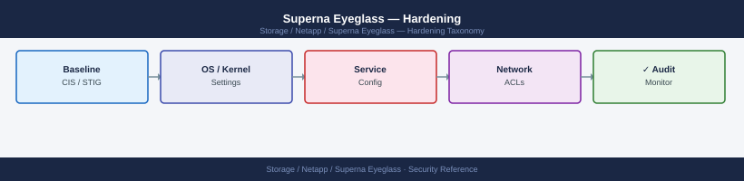

---
tags:
  - netapp
  - security
---
# Superna Eyeglass — Hardening

Hardening reference covering Audit Log Forwarding, Appliance Patching.

*Applies to: Superna Eyeglass*

| Control | Detail |
|---|---|
| Audit log | All failover and configuration events logged; forward to SIEM |
| Appliance hardening | Disable unused services; keep appliance patched to current release |
| Service account rotation | Eyeglass service account credentials rotated every 90 days (coordinate with CyberArk policy) |

## Before you begin

- **Access:** Storage admin credentials (cluster admin or equivalent)
- **Change management:** security changes require CAB approval in most environments
- **Rollback plan:** document current state before any security control change
- **Testing:** validate in a non-production environment first where possible

---

## Audit Log Forwarding

All failover events are recorded in the Eyeglass audit log. Forward the audit log to a SIEM:

1. Eyeglass Admin UI: Configuration → Syslog
2. Enter SIEM IP, port 514 (UDP) or 6514 (TLS)

Alert in SIEM on:
- Failover initiated (any event)
- DR readiness score < 100% for > 15 minutes
- Eyeglass appliance unreachable

## Appliance Patching

- Keep the Eyeglass appliance updated to the current release — Superna releases patches that address security vulnerabilities in the appliance OS and application stack
- Disable any unused services on the Eyeglass appliance via the Admin UI
- Verify the appliance VM guest OS is on the Superna supported OS list (Admin UI → System Info)

---

## See also

- [Superna Eyeglass — Authentication](authentication/)
- [Superna Eyeglass — Access Control](access-control/)
- [Superna Eyeglass — Encryption](encryption/)
