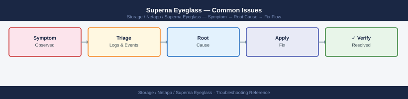
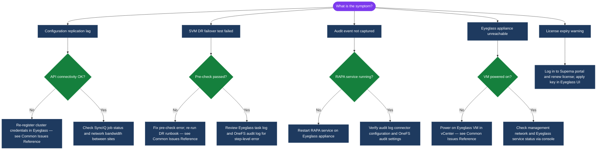

---
tags:
  - netapp
  - troubleshooting
search:
  boost: 1.5
---
# Superna Eyeglass — Common Issues

Common Superna Eyeglass issues — sync failures, DR test errors, configuration drift, and SyncIQ job problems.

*Applies to: Superna Eyeglass*

Common Eyeglass issues include SyncIQ policies not being detected, low DR readiness scores, DNS cutover failures, and failover jobs that stall or complete with errors. Most issues trace back to API connectivity between Eyeglass and the PowerScale clusters, configuration drift between the primary and DR cluster, or DNS delegation misconfiguration.

| Issue | Likely Cause | Resolution |
|---|---|---|
| SyncIQ policy not detected | Eyeglass-to-OneFS API connectivity failure | Check Eyeglass cluster credentials and OneFS API reachability; re-register cluster in Eyeglass |
| DR readiness score low | Quota or share mismatch between clusters | Review Eyeglass sync log; re-run share/quota sync; check for manually created shares not in Eyeglass |
| DNS cutover failure | DNS delegation not configured or DNS plugin issue | Verify DNS delegation zone configuration; check Eyeglass DNS plugin logs; test manual DNS cutover |
| Failover stuck / not completing | API timeout, share conflict, or quota error | Review Eyeglass admin UI task log; check OneFS audit log for errors; use manual intervention steps in Eyeglass UI |
| RPO breach alerts | SyncIQ replication lag exceeding threshold | Check SyncIQ job status on source cluster (`isi sync jobs list`); check network bandwidth between sites |
| Eyeglass appliance unreachable | VM or network issue | Verify VM is powered on in vCenter; check management network connectivity; check Eyeglass service status via console |

## Diagnostic Flow

---

## Before you begin

- **Access:** Storage admin credentials (cluster admin or equivalent)
- **Gather first:** recent error message text, event timestamps, and affected object names
- **Scope:** confirm whether the issue affects a single object, host, cluster, or site
- **Escalation:** open a vendor support ticket before running any destructive step
- **Logging:** document each command and output — required if escalation is needed

---

---

## Verify resolution

- Confirm the original symptom no longer occurs
- Check logs for any residual errors related to the issue
- Monitor for 10–15 minutes to confirm the fix is stable

---

## See also

- [Superna Eyeglass — Diagnostics](diagnostics/)
- [Superna Eyeglass — Escalation](escalation/)
- [Superna Eyeglass — Health Checks](../operations/health-checks/)
