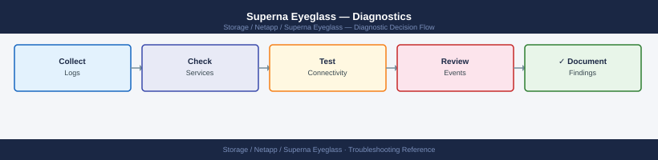
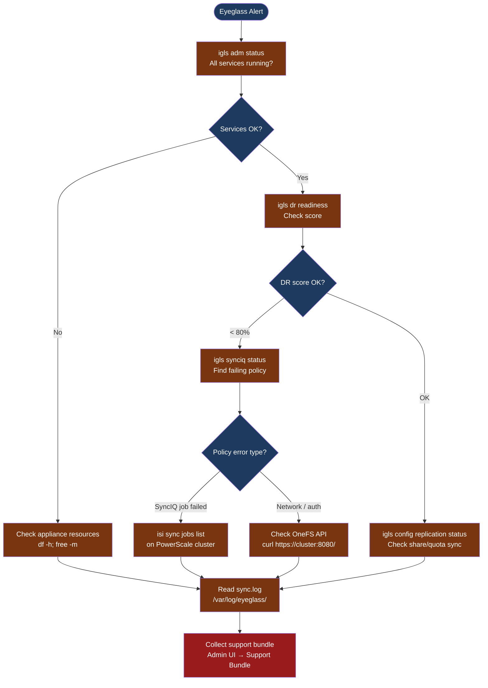

---
tags:
  - netapp
  - troubleshooting
search:
  boost: 1.5
---
# Superna Eyeglass — Diagnostics

<div class="kb-summary">
Superna Eyeglass diagnostic commands: check service health with igls adm status, trace SyncIQ and DFS sync errors, read Eyeglass log files, and verify DR readiness score before opening a support case.

*Applies to: Superna Eyeglass 2.x*
</div>





```d2
direction: down

symptom: Identify Symptom {shape: diamond}
step_1_check_eyeglass_service_health: "Step 1 — Check Eyeglass service health" {shape: rectangle}
step_2_check_dr_readiness_score: "Step 2 — Check DR readiness score" {shape: rectangle}
step_3_check_synciq_on_the_powerscal: "Step 3 — Check SyncIQ on the PowerScale cluster" {shape: rectangle}
step_4_check_onefs_api_connectivity_: "Step 4 — Check OneFS API connectivity (Eyeglass to cluster)" {shape: rectangle}
step_5_read_eyeglass_log_files: "Step 5 — Read Eyeglass log files" {shape: rectangle}
log_locations: "Log locations" {shape: rectangle}
resolution: Resolve or Escalate {shape: oval}

symptom -> step_1_check_eyeglass_service_health: investigate
symptom -> step_2_check_dr_readiness_score: investigate
symptom -> step_3_check_synciq_on_the_powerscal: investigate
symptom -> step_4_check_onefs_api_connectivity_: investigate
symptom -> step_5_read_eyeglass_log_files: investigate
symptom -> log_locations: investigate
step_1_check_eyeglass_service_health -> resolution
step_2_check_dr_readiness_score -> resolution
step_3_check_synciq_on_the_powerscal -> resolution
step_4_check_onefs_api_connectivity_ -> resolution
step_5_read_eyeglass_log_files -> resolution
log_locations -> resolution
```

## Before you begin

- **Access:** SSH to the Eyeglass appliance as `admin`; Eyeglass Admin UI (`https://<eyeglass-ip>`); PowerScale admin credentials on both clusters
- **Gather first:** current DR readiness score from the Eyeglass dashboard, which SyncIQ policies are failing, and the exact error from the Eyeglass UI or igls output
- **Scope:** confirm whether the issue affects a single SyncIQ policy, all policies, DFS namespace sync, or the Eyeglass appliance itself
- **RAPA caution:** if RAPA has quarantined a directory, do not un-quarantine without confirming the threat is resolved with the security team
- **Do not fail over while DR score is degraded** without running the Eyeglass DR Assistant runbook — it checks pre-conditions before each step

---

## Step 1 — Check Eyeglass service health

```bash
# SSH to the Eyeglass appliance
ssh admin@<eyeglass-hostname>

# Check all Eyeglass services are running
igls adm status
# Expected output (healthy):
#   Eyeglass Services:     Running
#   SyncIQ Monitor:        Running
#   DFS Sync Service:      Running
#   RAPA Service:          Running
#   Database:              Running
# Any service showing "Stopped" — restart with: igls adm restart <service-name>

# Check Eyeglass version
igls version

# Check license validity
igls license status
# Expected: Status: Licensed, with expiry date > today
```

**If a service is stopped:**
1. Check appliance disk space: `df -h /opt/superna/` — full disk can crash services
2. Check memory: `free -m` — if swap is high, the appliance may need a reboot
3. Restart the specific service: `igls adm restart synciq-monitor` (for SyncIQ monitor)

---

## Step 2 — Check DR readiness score

```bash
# Overall DR readiness score
igls dr readiness
# Expected: Ready (100%)
# If < 80%: one or more categories below are degraded

# SyncIQ policy replication status (Eyeglass view)
igls synciq status
# Each policy shows: Name, Status, Last Run, Policy Progress
# Problem statuses: "Error: Job Failed", "Stopped", "Paused"

# Configuration replication (shares, exports, quotas)
igls config replication status
# Shows: each policy, last sync time, status
# Problem: "Out of Sync", "Error"

# DFS namespace sync status
igls dfs status
# Shows: each DFS namespace, current target, sync state

# RAPA protection status
igls rapa status
# Shows: monitored paths, quarantine events (if any)
```

---

## Step 3 — Check SyncIQ on the PowerScale cluster

When Eyeglass shows a SyncIQ policy failing, verify directly on the PowerScale cluster:

```bash
# SSH to the production PowerScale cluster
ssh admin@<production-cluster>

# List all SyncIQ policies
isi sync policies list
# Shows: Name, Enabled, Action, Target Host, Schedule, Last Result

# List currently running or recently completed jobs
isi sync jobs list
# Look for: State = "failed" or "error"; note the policy name and error detail

# Check reports for a specific failing policy
isi sync reports list --policy-name <policy-name> --limit 5
# Shows: start time, end time, result, files transferred, error message

# Check SyncIQ policy configuration
isi sync policies view <policy-name>
# Verify: target host, target path, source path, schedule

# On the DR cluster: check target status
ssh admin@<dr-cluster>
isi sync targets list
# Shows target policies and their last sync time
```

**Common SyncIQ failure patterns:**
- `"Source path not found"` → files moved since the policy was created; update source path in Eyeglass → Configuration Replication
- `"Target host unreachable"` → network issue between clusters; check ICMP and TCP 445 between cluster SmartConnect zones
- `"Authentication failure"` → credentials used by SyncIQ to reach DR cluster have expired; re-enter in the SyncIQ policy

---

## Step 4 — Check OneFS API connectivity (Eyeglass to cluster)

Eyeglass communicates with PowerScale clusters via the OneFS REST API (HTTPS port 8080).

```bash
# From the Eyeglass appliance — test API reachability
curl -sk https://<production-cluster-smartconnect>:8080/
# Expected: HTTP 200 or redirect to API root (not connection refused)

curl -sk https://<dr-cluster-smartconnect>:8080/
# Same check for DR cluster

# Test with credentials (basic auth)
curl -sk -u admin:<password> "https://<cluster>:8080/platform/1/cluster/config"
# Expected: JSON with cluster name, nodes list, OneFS version

# Verify DNS resolution of SmartConnect zone from the appliance
nslookup <cluster-smartconnect-zone>
# Should resolve to one of the node IP addresses
```

---

## Step 5 — Read Eyeglass log files

```bash
# SSH to the Eyeglass appliance
ssh admin@<eyeglass-hostname>

# Main sync service log — shows share/export/quota replication activity
tail -100 /var/log/eyeglass/sync.log | grep -i "error\|fail\|warn"

# Failover event log — shows pre-checks, failover steps, and results
tail -100 /var/log/eyeglass/failover.log | grep -i "error\|fail\|step"

# DNS integration log (DFS failover changes DNS delegation)
tail -100 /var/log/eyeglass/dns.log | grep -i "error\|fail"

# RAPA event log
tail -100 /var/log/eyeglass/rapa.log | grep -i "quarantine\|detect\|alert"

# Main Eyeglass application log
grep -i "error\|exception" /opt/superna/log/eyeglass.log | tail -100

# Collect all logs in one snapshot for SR attachment
{
  echo "=== igls dr readiness ==="
  igls dr readiness
  echo "=== igls synciq status ==="
  igls synciq status
  echo "=== igls config replication status ==="
  igls config replication status
  echo "=== igls dfs status ==="
  igls dfs status
  echo "=== igls rapa status ==="
  igls rapa status
  echo "=== igls version ==="
  igls version
} > /tmp/eyeglass-diag-$(date +%F-%H%M).txt
```

---

## Log locations

| Component | Path | What to look for |
|---|---|---|
| Sync service | `/var/log/eyeglass/sync.log` | Share/export/quota sync errors |
| Failover events | `/var/log/eyeglass/failover.log` | Pre-check failures, step errors |
| DNS changes | `/var/log/eyeglass/dns.log` | DFS delegation update failures |
| RAPA events | `/var/log/eyeglass/rapa.log` | Quarantine events, threat detections |
| Main app log | `/opt/superna/log/eyeglass.log` | Application-level errors |
| Support bundle | Admin UI → Admin → Support Bundle | Full diagnostic archive for Superna SR |

---

## See also

- [Superna Eyeglass — Common Issues](../common-issues/)
- [Superna Eyeglass — Escalation](../escalation/)
- [Superna Eyeglass — Health Checks](../operations/health-checks/)

## Verify resolution

- `igls dr readiness` returns `Ready (100%)`
- `igls synciq status` shows all policies as `Running` or `Finished`
- `igls config replication status` shows all policies as `Synced`
- DR readiness score remains stable at ≥ 90% for 30 minutes after the fix
- If RAPA was involved: verify the quarantine is released and users can access the affected share
