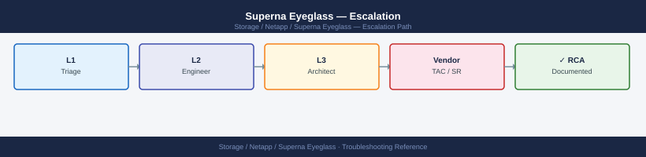
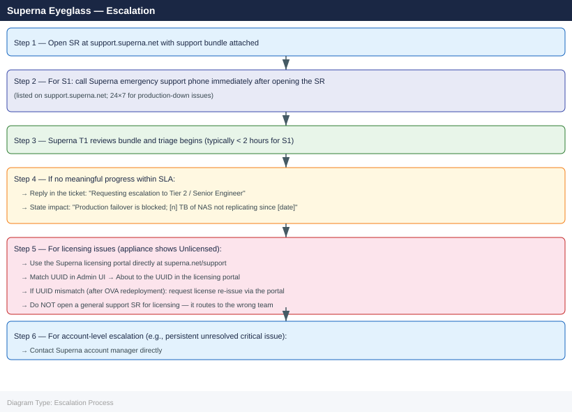

---
tags:
  - netapp
  - troubleshooting
search:
  boost: 1.5
---
# Superna Eyeglass — Escalation

<div class="kb-summary">
Superna Eyeglass support escalation: how to collect the support bundle via igls and the Admin UI, open a case at support.superna.net, set severity, and follow the escalation path for DR readiness degradation, failover failures, and RAPA quarantine events.

*Applies to: Superna Eyeglass*
</div>



```d2
direction: down

symptom: Identify Symptom {shape: diamond}
severity_levels: "Severity Levels" {shape: rectangle}
preescalation_triage_checklist: "Pre-Escalation Triage Checklist" {shape: rectangle}
stepbystep_data_collection: "Step-by-Step Data Collection" {shape: rectangle}
how_to_open_a_superna_support_case: "How to Open a Superna Support Case" {shape: rectangle}
escalation_path: "Escalation Path" {shape: rectangle}
what_not_to_do: "What NOT to Do" {shape: rectangle}
resolution: Resolve or Escalate {shape: oval}

symptom -> severity_levels: investigate
symptom -> preescalation_triage_checklist: investigate
symptom -> stepbystep_data_collection: investigate
symptom -> how_to_open_a_superna_support_case: investigate
symptom -> escalation_path: investigate
symptom -> what_not_to_do: investigate
severity_levels -> resolution
preescalation_triage_checklist -> resolution
stepbystep_data_collection -> resolution
how_to_open_a_superna_support_case -> resolution
escalation_path -> resolution
what_not_to_do -> resolution
```

## Before you begin

- **Access:** Eyeglass Admin UI (admin user); SSH access to the Eyeglass appliance; PowerScale admin access to both production and DR clusters
- **Gather first:** current DR readiness score from the Eyeglass dashboard, SyncIQ policy status on both clusters, and the exact error from the Eyeglass UI or igls output
- **Scope:** confirm whether the issue affects a single SyncIQ policy, all policies, DFS namespace sync, or the Eyeglass appliance itself
- **Do not fail over without Eyeglass guidance:** if the DR score is degraded but you need to fail over, use the Eyeglass DR Runbook step-by-step; do not manually change DFS namespace pointers without completing the Eyeglass pre-failover checks
- **RAPA quarantine:** if RAPA has quarantined a directory, do not un-quarantine without confirming the threat is resolved and change management approval

---

## Severity Levels

| Severity | Criteria | Response SLA |
|---|---|---|
| S1 — Critical | Production failover completely blocked; Eyeglass appliance unreachable; DR entirely inoperative | 1–2 hours (call Superna emergency line) |
| S2 — High | DR readiness score critically degraded (< 60%); DFS failover will not complete; SyncIQ policies all stopped | Same business day |
| S3 — Medium | Non-critical feature broken; single SyncIQ policy error; workaround available; DR readiness > 80% | 2 business days |
| S4 — Low | Cosmetic UI issue; documentation question; enhancement request | Best effort |

## Pre-Escalation Triage Checklist

| Check | Command / Where | Expected |
|---|---|---|
| Eyeglass appliance reachable | SSH to Eyeglass appliance: `igls status` | No connection error |
| DR readiness score | Eyeglass Admin UI → Dashboard | ≥ 80% (green) |
| SyncIQ policies running | `igls synciq status` on both clusters | All policies `Running` or `Finished` |
| DFS namespace sync current | Eyeglass Admin UI → DFS | No `Error` or `Warning` state |
| Quota sync current | Eyeglass Admin UI → Quota | No `Out of Sync` entries |
| Share/export sync current | Eyeglass Admin UI → Configuration Replication | All policies green |
| Eyeglass license valid | Admin UI → Admin → License | Status: Licensed |
| OneFS versions compatible | Both clusters: `isi version` | Versions compatible per Eyeglass release notes |

---

## Step-by-Step Data Collection

### 1. Collect Eyeglass support bundle

```bash
# Method 1: Admin UI (recommended — most complete)
# Navigate to: Admin → Support Bundle → Click "Download Support Bundle"
# The bundle ZIP includes: logs, configuration, replication status, and system state

# Method 2: CLI (SSH to Eyeglass appliance)
ssh admin@<eyeglass-hostname>
igls support bundle
# Bundle is created at /opt/superna/support/superna-bundle-<date>.zip
# Download via SCP
scp admin@<eyeglass-hostname>:/opt/superna/support/superna-bundle-*.zip /tmp/
```


```text title="Expected output"
admin@eyeglass-prod.corp.local's password: 
Welcome to Superna Eyeglass v5.8.2 (Build 2847)
Last login: Wed Jan 15 14:32:18 2025 from 192.168.1.105

eyeglass-prod> igls support bundle
Generating support bundle...
Collecting system logs... [████████████████████] 100%
Collecting configuration data... [████████████████████] 100%
Collecting replication status... [████████████████████] 100%
Bundle created successfully: /opt/superna/support/superna-bundle-20250115-143245.zip
Size: 287 MB

superna-bundle-20250115-143245.zip                    100%  287MB   8.2MB/s   00:35
```

!!! warning "Common errors"
    **`Permission denied (publickey,password).`** — Verify SSH credentials and that the admin user exists; check firewall rules allowing port 22 to the Eyeglass appliance.
    **`scp: /opt/superna/support/superna-bundle-*.zip: No such file or directory`** — Confirm the bundle generation completed successfully by running `igls support bundle` again and check the exact filename in `/opt/superna/support/` using SSH.
### 2. Collect igls status output

```bash
# SSH to Eyeglass appliance
ssh admin@<eyeglass-hostname>

# Overall DR readiness
igls dr readiness

# SyncIQ policy status (Eyeglass view)
igls synciq status

# Configuration replication status (shares, exports, quotas)
igls config replication status

# DFS namespace status
igls dfs status

# RAPA status (if ransomware module is licensed)
igls rapa status

# Eyeglass version
igls version

# Save all output to a file
{
  echo "=== igls dr readiness ==="
  igls dr readiness
  echo "=== igls synciq status ==="
  igls synciq status
  echo "=== igls config replication status ==="
  igls config replication status
  echo "=== igls dfs status ==="
  igls dfs status
  echo "=== igls version ==="
  igls version
} > /tmp/eyeglass-status-$(date +%F-%H%M%S).txt
```


```text title="Expected output"
admin@eyeglass-prod:~$ ssh admin@eyeglass-01.corp.local
Last login: Wed Jan 15 14:32:18 2025 from 10.50.12.45
eyeglass-01:~$ igls dr readiness
DR Readiness Status: HEALTHY
  Primary Cluster: isilon-prod-1 (OneFS 9.4.0.0)
  Secondary Cluster: isilon-dr-1 (OneFS 9.4.0.0)
  Replication Lag: 2.3 seconds
  Policy Compliance: 100%

eyeglass-01:~$ igls synciq status
SyncIQ Policies: 12 active
  prod-shares-hourly: RUNNING (87% complete, ETA 3m 22s)
  archive-daily: IDLE (last run: 2025-01-15 08:00:00, duration: 18m 45s)
  config-sync-15min: IDLE (last run: 2025-01-15 14:30:00, duration: 2m 11s)

eyeglass-01:~$ igls config replication status
Configuration Replication: SYNCED
  Shares: 247 replicated
  Exports: 89 replicated
  Quotas: 156 replicated
  Last sync: 2025-01-15 14:33:12 UTC

eyeglass-01:~$ igls dfs status
DFS Namespace Status: OPERATIONAL
  Namespace: \\corp.local\shares
  Referrals: 2,847 served (24h)
  Health: GOOD

eyeglass-01:~$ igls version
Eyeglass Version: 5.2.1-build.4521
  License: DR + RAPA + DFS
  Build Date: 2024-12-10

eyeglass-01:~$ {
>   echo "=== igls dr readiness ==="
>   igls dr readiness
>   echo "=== igls synciq status ==="
>   igls synciq status
>   echo "=== igls config replication status ==="
>   igls config replication status
>   echo "=== igls dfs status ==="
>   igls dfs status
>   echo "=== igls version ==="
>   igls version
> } > /tmp/eyeglass-status-2025-01-15-143401.txt
eyeglass-01:~$ echo "Status report saved to /tmp/eyeglass-status-2025-01-15-143401.txt"
Status report saved to /tmp/eyeglass-status-2025-01-15-143401.txt
```

!!! warning "Common errors"
    **`igls: command not found`** — Verify Eyeglass is running with `systemctl status eyeglass` and confirm you're logged into the correct appliance hostname.
    **`Connection refused` or `ssh: connect to host <eyeglass-hostname> port 22: Connection refused`** — Confirm the Eyeglass appliance IP/hostname is reachable with `ping` and that SSH is enabled in Eyeglass admin console.
    **`Permission denied (publickey,password)`** — Verify your SSH credentials and that the admin user exists; reset the password via
### 3. Collect PowerScale SyncIQ status (from both clusters)

```bash
# SSH to PowerScale cluster (production and DR)
ssh admin@<production-cluster-hostname>
isi sync policies list
isi sync jobs list
isi sync reports list --limit 10

# For a specific failing policy
isi sync policies view <policy-name>
isi sync reports list --policy-name <policy-name> --limit 5

# On DR cluster as well
ssh admin@<dr-cluster-hostname>
isi sync targets list
isi sync target rules list
```


```text title="Expected output"
admin@prod-cluster-01:~# isi sync policies list
Name                          ID       Enabled  Source              Target
----                          --       -------  ------              ------
daily-prod-sync               pol-001  Yes      10.45.12.50         10.67.89.120
hourly-critical-data          pol-002  Yes      10.45.12.50         10.67.89.120
weekly-archive-backup          pol-003  No       10.45.12.50         10.67.89.121
nightly-compliance-sync        pol-004  Yes      10.45.12.50         10.67.89.120

admin@prod-cluster-01:~# isi sync jobs list
ID                                    Policy Name              Status    Progress  Start Time
--                                    -----------              ------    --------  ----------
job-8f4a2c91-7e3b-4d2a-b1f5-9c3e2a1b  daily-prod-sync          RUNNING   67%       2024-01-15 03:22:15
job-7d3b1c8a-9f2e-4b5c-a3d2-8e1f7c9a  hourly-critical-data     COMPLETED 100%      2024-01-15 02:15:00
job-6c2a0b7f-8e1d-3a4b-9c2e-7d0e6b8f  weekly-archive-backup    FAILED    45%       2024-01-15 01:30:22

admin@prod-cluster-01:~# isi sync reports list --limit 10
Report ID                             Policy Name              Status    Duration  Timestamp
---------                             -----------              ------    --------  ---------
rpt-9f8e7d6c-5b4a-3c2d-1e0f-9a8b7c6d  daily-prod-sync          SUCCESS   2h 14m    2024-01-14 03:45:00
rpt-8e7d6c5b-4a3b-2c1d-0e9f-8a7b6c5d  hourly-critical-data     SUCCESS   18m 32s   2024-01-15 02:15:00
rpt-7d6c5b4a-3b2c-1d0e-9f8a-7b6c5d4e  daily-prod-sync          SUCCESS   2h 08m    2024-01-13 03:50:15
rpt-6c5b4a39-2b1c-0d9e-8f7a-6b5c4d3e  weekly-archive-backup    FAILED    1h 22m    2024-01-14 22:30:00

admin@prod-cluster-01:~# isi sync policies view daily-prod-sync
Name:                    daily-prod-sync
ID:                      pol-001
Enabled:                 Yes
Source Cluster:          10.45.12.50
Target Cluster:          10.67.89.120
Schedule:                0 3 * * * (Daily at 3:00 AM)
Last Run:                2024-01-15 03:22:15
Last Status:
```
### 4. Collect component versions and license info

```bash
# Eyeglass version
igls version

# OneFS versions (run on each cluster)
isi version

# License status
# Admin UI → Admin → License → note UUID and expiry
# Or CLI:
igls license status

# If license shows Unlicensed: check UUID match
# Admin UI → About → UUID
# Compare to UUID in Superna licensing portal
```


```text title="Expected output"
Eyeglass Version: 5.2.1 Build 2847
Release Date: 2024-01-15

OneFS Version: 9.4.0.0
Build: L9.4.0.0_210824_001
Cluster: isilon-prod-01

License Status: ACTIVE
UUID: 550e8400-e29b-41d4-a716-446655440000
Expiry Date: 2025-06-30
Features: Snapshots, Replication, Compliance
Days Remaining: 527

Superna Portal UUID: 550e8400-e29b-41d4-a716-446655440000
Status: MATCHED
```

!!! warning "Common errors"
    **`igls: command not found`** — Verify Eyeglass is installed and /opt/superna/bin is in your PATH, or use the full path /opt/superna/bin/igls.
    **`License Status: UNLICENSED`** — Confirm the UUID in the Superna licensing portal matches the UUID shown in Eyeglass Admin UI → About, then re-register the license.
    **`isi: command not found`** — Run this command directly on an OneFS cluster node (SSH to the cluster), not from the Eyeglass appliance.
### 5. Write the timeline

```text
Eyeglass version: 2.5.8
OneFS version (Production): 9.5.0.1 / cluster: prod-powerscale.corp.local
OneFS version (DR):         9.5.0.1 / cluster: dr-powerscale.corp.local

Issue first observed: 2026-06-15 06:00 UTC
Last known good DR readiness score: 2026-06-14 22:00 UTC (100%)
Current DR readiness score: 45%

Error observed:
  - Eyeglass Dashboard: DR Readiness 45% — "3 of 7 SyncIQ policies not replicating"
  - igls synciq status: Policies PROD_NAS_01, PROD_NAS_02, PROD_NAS_03 show "Error: Job Failed"
  - PowerScale: isi sync jobs list shows "sync job failed — source path not found"

Steps already taken:
  - Verified SyncIQ policies exist on production cluster
  - Confirmed DR cluster network reachable from production cluster
  - Did NOT attempt manual failover

Changes in prior 24h:
  - SharePoint migration moved files from /ifs/data/shares/dept-a to /ifs/data/shares/dept-b
  - This changed the source path for 3 SyncIQ policies

Blast radius:
  - 3 of 7 NAS DR policies not replicating — DR for these shares is 24 hours stale
  - Remaining 4 policies replicating normally
```

---

## How to Open a Superna Support Case

1. Go to **support.superna.net** and sign in with your Superna customer account.
   - If no account: contact Superna via the portal registration page; a Superna representative will create credentials.

2. Click **Open a Ticket**.

3. Under **Product**, select **Eyeglass** and the specific module (DR, RAPA, Quota Sync, DFS).

4. Under **Severity**, select:
   - **S1 — Critical**: Failover completely blocked; Eyeglass appliance down; DR inoperative
   - **S2 — High**: DR readiness critically degraded; DFS failover will fail; major replication stopped
   - **S3 — Medium**: Non-critical module error; DR readiness > 80%; workaround available
   - **S4 — Low**: UI issue; documentation question; feature request

5. In the **Summary**: `Eyeglass 2.5.8 — 3 SyncIQ policies failing to replicate — source path changed — DR readiness 45%`.

6. In the **Description**, paste:
   - Eyeglass version and OneFS versions on both clusters
   - Current DR readiness score
   - igls status output
   - Timeline (from step 5 above)
   - What you have already checked

7. Upload attachments:
   - `superna-bundle-<date>.zip` — full support bundle from Admin UI
   - `eyeglass-status-<date>.txt` — igls status output
   - SyncIQ policy list from both clusters (if replication issue)

8. Click **Submit**. You receive a ticket number by email.

9. **S1 only:** the Superna support portal lists an emergency phone number. Call it immediately after submitting the ticket.

---

## Escalation Path



---

## What NOT to Do

| Do NOT do this | Why | What to do instead |
|---|---|---|
| Manually edit SyncIQ policy source paths on PowerScale to match where files moved | Eyeglass will detect the out-of-sync state and may re-create or override the policy with incorrect paths | Use Eyeglass Admin UI → Configuration Replication to update the share/policy mapping; let Eyeglass manage SyncIQ policy updates |
| Un-quarantine a RAPA-quarantined directory without verifying the threat is resolved | If ransomware activity is ongoing, un-quarantining re-exposes the share to active encryption | Verify with your security team that the threat is contained; then use igls rapa unquarantine with change management approval |
| Restart the Eyeglass appliance VM during active replication | Interrupts in-progress SyncIQ jobs; may cause a partial sync that takes hours to reconcile | Stop replication first via igls synciq pause; then restart; then resume |
| Upgrade Eyeglass during an active S1 incident | Introduces a new variable during the investigation | Complete the incident first; schedule the upgrade for a maintenance window |
| Attempt a manual DFS namespace failover while Eyeglass shows DR readiness < 80% | Eyeglass's pre-failover checks exist to prevent an incomplete failover from leaving clients stranded | Use the Eyeglass DR Assistant guided runbook even in an emergency; it pauses at each checkpoint |

---

## Useful Commands for Case Updates

```bash
# Quick state snapshot — paste into every case update
igls version
igls dr readiness
igls synciq status | head -30

# Check Eyeglass appliance resource usage
df -h /opt/superna/
free -m

# List all configuration replication errors
igls config replication status | grep -i "error\|fail\|warning"

# RAPA status summary
igls rapa status

# Eyeglass application log (last 100 error lines)
grep -i "error\|exception" /opt/superna/log/eyeglass.log | tail -100

# SyncIQ policy from PowerScale (run on production cluster)
isi sync policies list
isi sync jobs list | grep -i "error\|fail"
```


```text title="Expected output"
Eyeglass Version: 5.2.1 (Build 2024.01.15)
DR Readiness Status: HEALTHY
  Primary Cluster: prod-isilon-01.corp.local
  Secondary Cluster: dr-isilon-02.corp.local
  Replication Lag: 45 seconds
  Last Sync: 2024-01-22 14:32:18 UTC

SyncIQ Status Summary:
  Total Policies: 23
  Active Jobs: 5
  Completed (24h): 18
  Failed (24h): 0
  Warnings: 2

Filesystem Usage:
/opt/superna/              87G    52G    35G   60% /opt/superna/

Memory Usage:
              total        used        free      shared  buff/cache   available
Mem:          16384        9821        4563         128        1000        6563

Configuration Replication Status:
[WARNING] Cluster 'dr-isilon-02' config sync delayed by 3 minutes
[ERROR] Failed to replicate access zone 'az-finance' — connection timeout

RAPA Status:
  Status: OPERATIONAL
  Replication Appliance Pool: 5 nodes active, 0 degraded
  Last Health Check: 2024-01-22 14:35:42 UTC
  Bandwidth Utilization: 2.1 Gbps / 10 Gbps

Eyeglass Application Log (error lines):
2024-01-22T14:28:33Z [ERROR] SyncIQ job 'policy-backup-daily' exceeded retry limit
2024-01-22T14:15:12Z [ERROR] Connection refused to secondary cluster dr-isilon-02:8080
2024-01-22T13:42:05Z [EXCEPTION] NullPointerException in ReplicationManager.validatePolicy()
2024-01-22T13:15:33Z [WARNING] High memory pressure detected — 89% utilization

SyncIQ Policies (PowerScale):
Name                          Source              Target              State
backup-daily                  prod-isilon-01      dr-isilon-02        enabled
incremental-hourly            prod-isilon-01      dr-isilon-02        enabled
archive-weekly                prod-isilon-01      archive-vault       enabled

SyncIQ Jobs (PowerScale):
ID      Policy                  State       Progress    Bytes Transferred
12847   backup-daily            completed   100%        2.3 TB
12848   incremental-hourly      running     67%         1.8 TB
12849   archive-weekly          failed      0%          0 B
```

!!! warning "Common errors"
    **`[ERROR] Failed to replicate access zone 'az-finance' — connection timeout`** — Verify network connectivity between Eyeglass and secondary cluster; check firewall rules for port 8080 and 3218.
    **`Connection refused to secondary cluster dr-isilon-02:8080`** — Confirm the secondary cluster is online and accessible; run `ping dr-isilon-02` and `isi status` on the target cluster.
    **`SyncIQ job 'policy-backup-daily' exceeded retry limit`** — Check the SyncIQ job logs on PowerScale with `isi sync jobs view <job-id>` and resolve the underlying replication failure before manual
---

## License Issues

Licensing issues (appliance reporting "Unlicensed") are handled via the Superna licensing portal:

1. Go to [https://superna.net/support/](https://superna.net/support/)
2. Locate your license by the serial number provided by Superna
3. Confirm the license UUID matches the UUID shown in Admin UI → License → UUID
4. If UUID mismatch (typically after OVA redeployment): request license re-issue via the portal
5. Do not open a general support SR for licensing — use the licensing portal directly

---

## Verify resolution

- Confirm DR readiness score returns to ≥ 90% in the Eyeglass dashboard
- Verify `igls synciq status` shows all previously failing policies as `Running` or `Finished`
- Run `igls dr readiness` and confirm it reports `Ready` status
- Check DFS namespace status: `igls dfs status` shows all namespaces synced
- If RAPA was involved: verify the quarantine is released and users can access the affected share
- Monitor DR readiness score for 24 hours to confirm stable replication before closing the case

---

## See also

- [Superna Eyeglass — Diagnostics](../diagnostics/)
- [Superna Eyeglass — Common Issues](../common-issues/)
