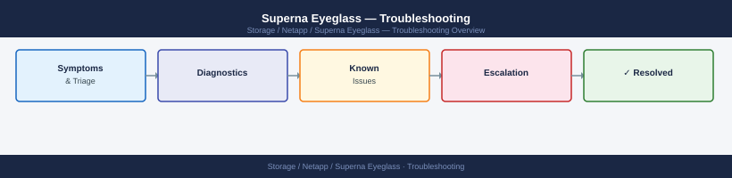

---
tags:
  - netapp
  - troubleshooting
search:
  boost: 1.5
---
# Superna Eyeglass — Troubleshooting

Diagnosing Superna Eyeglass replication failures, configuration sync errors, DR orchestration issues, and Eyeglass connectivity.

*Applies to: Superna Eyeglass*

<a class="kb-card" href="common-issues/">
  <strong>Common Issues</strong>
  SyncIQ detection failures, readiness score drops, DNS cutover errors, and failover stalls.
</a>

<a class="kb-card" href="diagnostics/">
  <strong>Diagnostics</strong>
  Diagnostic commands, log locations, and API connectivity checks.
</a>

<a class="kb-card" href="escalation/">
  <strong>Escalation</strong>
  Support bundle collection, SR requirements, severity levels, and vendor escalation path.
</a>

