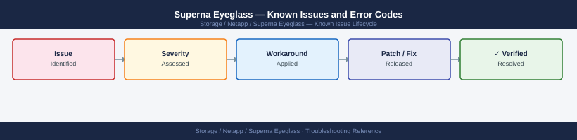

---
tags:
  - troubleshooting
  - superna-eyeglass
  - netapp
  - known-issues
---
# Superna Eyeglass — Known Issues and Error Codes

Catalog of known Superna Eyeglass bugs, error codes, and workarounds covering SyncIQ DR orchestration, share replication, and AD integration.

*Applies to: Superna Eyeglass 2.x / 3.x for PowerScale (OneFS)*

## Before you begin

- Eyeglass errors appear in the web UI under `Administration → Activity → Jobs`.
- Logs: `/var/log/superna/` on the Eyeglass appliance.
- Most issues are API connectivity to PowerScale (port 8080) or AD (LDAP 636).

## DR Orchestration

| Error / Symptom | Affected Versions | Cause | Workaround / Fix | Fixed In |
|---|---|---|---|---|
| Failover job fails: `SyncIQ policy not in compliance` | Eyeglass 3.x | SyncIQ lag exceeds RPO before failover triggered | Allow SyncIQ to complete sync; retry failover; or override RPO check for emergency failover | N/A |
| `Cannot connect to cluster` during failover | Eyeglass 3.x | DR cluster API (port 8080) unreachable at time of failover | Verify TCP 8080 from Eyeglass to DR cluster SmartConnect | N/A |
| Share replication incomplete: `AD object not found` | Eyeglass 3.x | AD user or group referenced in share ACL does not exist on DR AD domain | Ensure AD is synced / extended to DR site before failover | N/A |

## Share and Quota Replication

| Error / Symptom | Affected Versions | Cause | Workaround / Fix | Fixed In |
|---|---|---|---|---|
| Quota replication not running on schedule | Eyeglass 3.x | Eyeglass scheduler service stopped after appliance update | Restart Eyeglass services: `service eyeglass restart` | N/A |
| Share ACL replication fails: `LDAP authentication failed` | Eyeglass 3.x | AD LDAPS (636) certificate expired or changed | Update LDAP certificate in Eyeglass → Configuration → LDAP | N/A |

## See also

- [Superna Eyeglass — Common Issues](common-issues/)
- [Dell PowerScale — Known Issues](../../../dell/powerscale/troubleshooting/known-issues.md)
- [NetApp ONTAP — Known Issues](../../ontap/troubleshooting/known-issues.md)
