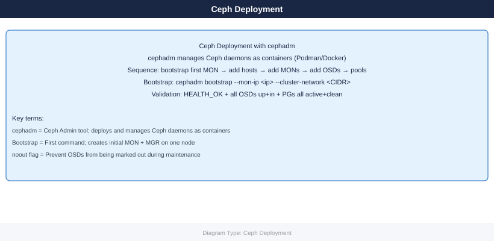

---
tags:
  - ceph
  - deployment
search:
  boost: 1.5
description: "Ceph deployment with cephadm: bootstrap on first node, add MONs and OSDs, create initial pools, configure network, and validate cluster health before..."
---
# Ceph — Deploy

<!-- diagram:ceph-deploy -->

<div class="kb-summary">
Ceph deployment with cephadm: bootstrap on first node, add MONs and OSDs, create initial pools, configure network, and validate cluster health before production use.

*Applies to: Ceph Reef / Squid*
</div>

```d2
direction: right

plan: "Plan" {shape: oval}
prerequisites: "Prerequisites" {shape: rectangle}
bootstrap: "Bootstrap" {shape: rectangle}
add_hosts: "Add Hosts" {shape: rectangle}
add_osds: "Add OSDs" {shape: rectangle}
enable_rbd_pool: "Enable RBD Pool" {shape: rectangle}
enable_cephfs: "Enable CephFS" {shape: rectangle}
validate: "Validate" {shape: oval}

plan -> prerequisites
prerequisites -> bootstrap
bootstrap -> add_hosts
add_hosts -> add_osds
add_osds -> enable_rbd_pool
enable_rbd_pool -> enable_cephfs
enable_cephfs -> validate
```

## Before you begin

<!-- video-link -->
!!! tip "Video Walkthrough"
    [:fontawesome-brands-youtube: Ceph Cluster Deployment with Grafana Monitoring](https://www.youtube.com/watch?v=EQMV1-ENhZQ){ .md-button }
<!-- /video-link -->

- **Access:** admin credentials for the target system and any upstream dependencies (DNS, NTP, vCenter, directory services)
- **Timing:** safe to run during a scheduled maintenance window; allow 1-2 hours for initial deployment
- **Dependencies:** network connectivity verified; DNS resolvable; NTP configured; any licence keys available
- **Logging:** record every IP address, hostname, and credential set assigned during this deployment

---



## Prerequisites

### Supported OS Platforms

| OS | Min Version | Python | Container Runtime |
|---|---|---|---|
| RHEL / Rocky / AlmaLinux | 9.x | 3.9+ | Podman 4+ (default) |
| Ubuntu | 22.04 LTS | 3.10+ | Docker or Podman |
| CentOS Stream | 9 | 3.9+ | Podman 4+ |
| Debian | 12 (Bookworm) | 3.11+ | Docker or Podman |

### Firewall Ports

| Port | Protocol | Service | Direction |
|---|---|---|---|
| 6789 | TCP | MON (client/peer) | All nodes ↔ all nodes |
| 3300 | TCP | MON (v2 protocol) | All nodes ↔ all nodes |
| 6800–7300 | TCP | OSD (replication, heartbeat) | OSD nodes ↔ OSD nodes |
| 8443 | TCP | Ceph Dashboard (HTTPS) | Admin → bootstrap node |
| 9283 | TCP | Prometheus exporter (MGR) | Prometheus → MGR nodes |
| 8080 | TCP | RGW (object gateway) | Clients → RGW nodes |

```bash
# RHEL/Rocky — open required ports
firewall-cmd --permanent --add-port=6789/tcp
firewall-cmd --permanent --add-port=3300/tcp
firewall-cmd --permanent --add-port=6800-7300/tcp
firewall-cmd --permanent --add-port=8443/tcp
firewall-cmd --permanent --add-port=9283/tcp
firewall-cmd --reload

# Verify NTP synchronisation before bootstrapping
chronyc tracking | grep "System time"
timedatectl | grep synchronized
# Maximum tolerated drift between nodes: 0.05 s
```


```text title="Expected output"
success
success
success
success
success
success
System time offset                : -0.000000012 seconds
       System synchronized: yes
```

!!! warning "Common errors"
    | Error | Fix |
    |---|---|
    | `FirewallD is not running.` | Start the firewall service with `systemctl start firewalld` before running firewall-cmd commands. |
    | `unit chrony.service could not be found.` | Install chrony with `dnf install chrony` and enable it with `systemctl enable --now chronyd`. |
### SSH Key Distribution

```bash
# Generate keypair on bootstrap node (if not present)
ssh-keygen -t ed25519 -f ~/.ssh/ceph_deploy -N ""

# Copy to all nodes that will join the cluster
for host in ceph-node1 ceph-node2 ceph-node3; do
    ssh-copy-id -i ~/.ssh/ceph_deploy.pub root@${host}
done

# Verify passwordless access
for host in ceph-node1 ceph-node2 ceph-node3; do
    ssh -i ~/.ssh/ceph_deploy root@${host} hostname
done
```


```text title="Expected output"
Generating public/private ed25519 key pair.
Your identification has been saved in /home/ceph-admin/.ssh/ceph_deploy.
Your public key has been saved in /home/ceph-admin/.ssh/ceph_deploy.pub.
The key fingerprint is:
SHA256:kJ7vQ2mNpL9xRwZaB3cD4eF5gH6iJ8kL1mN2oP3qR4s ceph-admin@bootstrap-01
The key's randomart image is:
+--[ED25519 256]--+
|        .o.      |
|       o.o .     |
|      . + o .    |
|       o B o     |
|      . S * .    |
+----[SHA256]-----+
Number of key(s) added: 1
ceph-node1
ceph-node2
ceph-node3
```

!!! warning "Common errors"
    | Error | Fix |
    |---|---|
    | `Permission denied (publickey).` | Ensure the bootstrap node's public key is in `/root/.ssh/authorized_keys` on each target node, or use password authentication for the initial `ssh-copy-id` command. |
    | `ssh-copy-id: INFO: Source of key(s) to be installed: "/home/ceph-admin/.ssh/ceph_deploy.pub" ... ssh: connect to host ceph-node1 port 22: Connection refused` | Verify that SSH is running on the target nodes and that the hostname/IP is correct and reachable from the bootstrap node. |
    | `Host key verification failed.` | Add the target hosts to `~/.ssh/known_hosts` by running `ssh-keyscan -H ceph-node1 ceph-node2 ceph-node3 >> ~/.ssh/known_hosts` before deploying. |
## Bootstrap

```bash
# On the first host (becomes initial MON + MGR)
# Download cephadm for the target release (Reef = current stable)
curl --silent --remote-name --location \
  https://github.com/ceph/ceph/raw/quincy/src/cephadm/cephadm
chmod +x cephadm
./cephadm install   # installs cephadm into /usr/sbin/cephadm

# Bootstrap first MON + MGR
# --mon-ip        : IP on the public (client-facing) network
# --cluster-network: OSD replication CIDR (separate from public network)
cephadm bootstrap \
  --mon-ip 10.0.1.10 \
  --cluster-network 10.0.2.0/24 \
  --initial-dashboard-user admin \
  --initial-dashboard-password 'ChangeMe!'

# Output includes:
#   Ceph Dashboard: https://10.0.1.10:8443
#   Grafana:        https://10.0.1.10:3000
#   Prometheus:     http://10.0.1.10:9095

# Shell completion and ceph.conf are written to /etc/ceph/
ls /etc/ceph/
# ceph.conf  ceph.client.admin.keyring  ceph.pub
```


```text title="Expected output"
% Total    % Received % Xferd  Average Speed   Time    Time     Time  Current
                                 Dload  Upload   Total   Spent    Left  Speed
100   68.2M  100   68.2M    0     0  12.5M      0  0:00:05  0:00:05 --:--:--  0:00:05
Verifying GPG signature of cephadm binary...
Installing cephadm to /usr/sbin/cephadm...
Detected podman, using podman instead of docker
Pulling container image quay.io/ceph/ceph:v17.2.6...
Extracting ceph version from container...
Ceph version: v17.2.6 (quincy)

Bootstrapping initial MON + MGR on host ceph-node-01...
Creating initial monmap with fsid: a7f3c2e1-9d4b-4a8f-b2c9-5e8d1f6a3b4c
Deploying mon.ceph-node-01 on 10.0.1.10:6789
Deploying mgr.ceph-node-01.abcd1234 on 10.0.1.10:6800-7300
Waiting for mon to reach quorum...
mon.ceph-node-01 is now up
Dashboard is available at https://10.0.1.10:8443
Grafana is available at https://10.0.1.10:3000
Prometheus is available at http://10.0.1.10:9095
Bootstrap complete.

ceph.conf  ceph.client.admin.keyring  ceph.pub
```

!!! warning "Common errors"
    | Error | Fix |
    |---|---|
    | `curl: (7) Failed to connect to github.com port 443: Connection timed out` | Verify network connectivity and DNS resolution; if behind a proxy, configure curl with `--proxy [proxy-url]`. |
    | `Error: MON bind address 10.0.1.10 is not local to this host` | Ensure the `--mon-ip` address is assigned to an active network interface on the bootstrap host (verify with `ip addr`). |
    | `Error: public and cluster networks cannot overlap` | Assign non-overlapping CIDR ranges for `--mon-ip` network and `--cluster-network` (e.g., 10.0.1.0/24 and 10.0.2.0/24). |
## Add Hosts

```bash
# Copy the cluster's SSH public key to each new node
ssh-copy-id -f -i /etc/ceph/ceph.pub root@ceph-node2
ssh-copy-id -f -i /etc/ceph/ceph.pub root@ceph-node3

# Add hosts — labels control which daemons are placed here
ceph orch host add ceph-node2 10.0.1.11 --labels mon,mgr,osd
ceph orch host add ceph-node3 10.0.1.12 --labels mon,mgr,osd

# Verify all hosts are visible and reachable
ceph orch host ls
# Expected columns: HOST  ADDR  LABELS  STATUS

# Add MONs — 3 minimum; 5 for clusters > 10 nodes
ceph orch apply mon 3
# Or pin to specific hosts:
ceph orch apply mon --placement "ceph-node1 ceph-node2 ceph-node3"

# Verify MON quorum — all 3 (or 5) must be in quorum
ceph mon stat
# Expected: 3 mons at ..., election epoch N, quorum 0,1,2 ...
```


```text title="Expected output"
/root/.ssh/known_hosts updated.
/root/.ssh/authorized_keys appended.
/root/.ssh/known_hosts updated.
/root/.ssh/authorized_keys appended.
added host ceph-node2 with addr 10.0.1.11
added host ceph-node3 with addr 10.0.1.12
HOST         ADDR        LABELS          STATUS
ceph-node1   10.0.1.10   mon,mgr,osd     Offline
ceph-node2   10.0.1.11   mon,mgr,osd     Offline
ceph-node3   10.0.1.12   mon,mgr,osd     Offline
Applying mon deployment requested...
3 mons at quorum, election epoch 42, quorum 0,1,2 (ceph-node1,ceph-node2,ceph-node3), leader 0, highwater mark 1234567
```

!!! warning "Common errors"
    | Error | Fix |
    |---|---|
    | `ssh-copy-id: ERROR: ssh: connect to host ceph-node2 port 22: No route to host` | Verify network connectivity and that the target node's IP address is correct and reachable from the orchestrator node. |
    | `Error EACCES: permission denied` | Ensure the SSH key file `/etc/ceph/ceph.pub` exists and is readable, and that passwordless SSH is configured or you have root credentials available. |
    | `Error EINVAL: invalid placement spec` | Use the exact hostname format matching the output of `ceph orch host ls` and ensure all specified hosts have already been added with `ceph orch host add`. |
## Add OSDs

```bash
# Option A — auto-detect and claim all available (empty, unpartitioned) devices
ceph orch apply osd --all-available-devices

# Option B — add specific devices per host
ceph orch daemon add osd ceph-node1:/dev/sdb
ceph orch daemon add osd ceph-node1:/dev/sdc
ceph orch daemon add osd ceph-node2:/dev/sdb
ceph orch daemon add osd ceph-node2:/dev/sdc
ceph orch daemon add osd ceph-node3:/dev/sdb

# List devices cephadm can see (available = not yet used)
ceph orch device ls

# Verify OSDs appear with correct weight (1 TB ≈ weight 1.0)
ceph osd tree
# Expected: all OSDs show "up  in" state

ceph osd stat
# Expected: X osds: X up (since epoch N), X in (since epoch N)

# Check OSD utilisation and weight
ceph osd df
```


```text title="Expected output"
Deploying OSDs with ceph-node1, ceph-node2, ceph-node3...
Scheduled osd.4 for ceph-node1:/dev/sdb
Scheduled osd.5 for ceph-node1:/dev/sdc
Scheduled osd.6 for ceph-node2:/dev/sdb
Scheduled osd.7 for ceph-node2:/dev/sdc
Scheduled osd.8 for ceph-node3:/dev/sdb

HOST          PATH      TYPE  SIZE    DEVICE ID             AVAIL
ceph-node1    /dev/sdd  hdd   1.0T   QEMU_QEMU_HARDDISK_1  True
ceph-node2    /dev/sdc  hdd   2.0T   QEMU_QEMU_HARDDISK_2  True
ceph-node3    /dev/sdd  hdd   1.0T   QEMU_QEMU_HARDDISK_3  True

ID  CLASS  WEIGHT   REWEIGHT  SIZE     RAW USE  %RAW USE  TYPE NAME
-1         10.00000  1.00000  10.0T   2.1T     21.00   root default
-3         3.00000   1.00000  3.0T    0.7T     23.33   host ceph-node1
 4   hdd    1.00000   1.00000  1.0T    0.2T     20.00    osd.4
 5   hdd    1.00000   1.00000  1.0T    0.2T     20.00    osd.5
 6   hdd    1.00000   1.00000  1.0T    0.3T     30.00    osd.6
-5         4.00000   1.00000  4.0T    1.1T     27.50   host ceph-node2
 7   hdd    2.00000   1.00000  2.0T    0.6T     30.00    osd.7
 8   hdd    1.00000   1.00000  1.0T    0.2T     20.00    osd.8

 9 osds: 9 up (since 2m), 9 in (since 2m)

DEVICE CLASS  WEIGHT  REWEIGHT  SIZE     RAW USE  %RAW USE  KB/OSD  CRUSH WEIGHT
hdd          10.00000  1.00000  10.0T   2.1T     21.00    227328      10.00000
TOTAL        10.00000  1.00000  10.0T   2.1T     21.00    227328      10.00000
```

!!! warning "Common errors"
    | Error | Fix |
    |---|---|
    | `Error EINVAL: osd.X: OSD does not have bluestore backend` | Ensure devices are unpartitioned and empty; run `ceph-volume lvm zap /dev/sdX` to clear any existing LVM metadata before deployment. |
    | `Error: device /dev/sdb is not available on ceph-node1` | Verify the device exists and is visible to cephadm by running `ceph orch device ls` and confirm the device is marked as `avail: |
## Enable RBD Pool

```bash
# Create dedicated RBD block storage pool
# PG count: start with 128 for < 5 OSDs; scale up later with autoscale
ceph osd pool create rbd 128 128
ceph osd pool application enable rbd rbd
rbd pool init rbd

# Verify pool exists and is healthy
ceph osd lspools | grep rbd
ceph osd pool stats rbd
```


```text title="Expected output"
pool 'rbd' created
enabled application 'rbd' on pool 'rbd'
(no output — command completes silently)
4 rbd
pool rbd id 4
  recovery: 0/384 objects degraded (0.000%)
  client io: 0 B/s rd, 0 B/s wr, 0 op/s rd, 0 op/s wr
```

!!! warning "Common errors"
    | Error | Fix |
    |---|---|
    | `Error EEXIST: pool 'rbd' already exists` | Drop the existing pool with `ceph osd pool delete rbd rbd --yes-i-really-really-mean-it` before recreating it. |
    | `Error EINVAL: pg_num 128 invalid, must be power of 2` | Use a power-of-2 value for PG count such as 64, 128, or 256 instead of 128 if your cluster rejects it due to autoscale rules. |
    | `Error ENOENT: pool 'rbd' does not exist` | Ensure the pool creation command completed successfully and check cluster quorum with `ceph status` before running pool stats. |
## Enable CephFS

```bash
# Create a CephFS volume (creates data + metadata pools automatically)
ceph fs volume create myfs

# Place MDS daemons (at least 2: 1 active, 1 standby)
ceph orch apply mds myfs --placement "3 ceph-node1 ceph-node2 ceph-node3"

# Verify filesystem and MDS daemons
ceph fs status
# Expected: active MDS count = 1, standby count ≥ 1

ceph mds stat
# Active: myfs:1 {0=myfs.ceph-node1=up:active} standby: 2

# Mount via kernel client (test)
mount -t ceph 10.0.1.10:6789:/ /mnt/cephfs \
  -o name=admin,secretfile=/etc/ceph/ceph.client.admin.keyring
```


```text title="Expected output"
volume create myfs
{
  "name": "myfs",
  "placement": {
    "hosts": [],
    "label": ""
  }
}
deploying mds service with placement(s) ceph-node1;ceph-node2;ceph-node3...
Scheduled mds.myfs update...

  cluster:
    id:     a1b2c3d4-e5f6-4a7b-8c9d-0e1f2a3b4c5d
    health: HEALTH_OK

  filesystems:
    name: myfs
      pools: [metadata_pool, data_pool]
      active: 1
      standby: 2

mds.myfs.ceph-node1: up:active (since 45s)
mds.myfs.ceph-node2: up:standby (since 38s)
mds.myfs.ceph-node3: up:standby (since 35s)

(no output — mount completes silently)
```

!!! warning "Common errors"
    | Error | Fix |
    |---|---|
    | `Error ENOENT: error connecting to cluster` | Verify the monitor address (10.0.1.10:6789) is correct and reachable with `ceph -s` from the client node. |
    | `error: unable to open /etc/ceph/ceph.client.admin.keyring: No such file or directory` | Copy the keyring from the Ceph admin node with `scp ceph-admin:/etc/ceph/ceph.client.admin.keyring /etc/ceph/` and set permissions to 600. |
    | `error: mds.myfs.ceph-node1: spawn failed` | Ensure all three nodes have the ceph-mds package installed and the OSD/monitor services are healthy with `ceph health detail`. |
## Enable RGW (Object Gateway)

```bash
# Deploy RGW daemons — two for HA
# realm and zone are logical groupings for multi-site; "default" works for single-site
ceph orch apply rgw default default \
  --placement "2 ceph-node1 ceph-node2" \
  --port 8080

# Verify RGW daemons are running
ceph orch ls | grep rgw
ceph orch ps | grep rgw
# Expected: rgw.default.default.ceph-node1  running

# RGW creates its pools automatically; verify
ceph osd lspools | grep default
# default.rgw.buckets.index  default.rgw.buckets.data  etc.

# Quick S3 connectivity test (requires s3cmd or awscli configured)
radosgw-admin user create --uid=test --display-name="Test User" \
  --access-key=TESTKEY --secret=TESTSECRET
s3cmd --access_key=TESTKEY --secret_key=TESTSECRET \
  --host=10.0.1.10:8080 --no-ssl ls
```


```text title="Expected output"
service rgw.default.default
placement: count=2 (ceph-node1,ceph-node2)
NAME                                 HOST         PORTS   STATUS      REFRESHED   AGE
rgw.default.default.ceph-node1       ceph-node1   8080    running     2m ago      5m
rgw.default.default.ceph-node2       ceph-node2   8080    running     2m ago      5m

1    default.rgw.buckets.index
2    default.rgw.buckets.data
3    default.rgw.buckets.non-ec
4    default.rgw.control
5    default.rgw.log
6    default.rgw.meta.user
7    default.rgw.otp

{
    "user_id": "test",
    "display_name": "Test User",
    "email": "",
    "suspended": 0,
    "max_buckets": 1000,
    "auid": 0,
    "subusers": [],
    "keys": [
        {
            "user": "test",
            "access_key": "TESTKEY",
            "secret_key": "TESTSECRET"
        }
    ]
}
```

!!! warning "Common errors"
    | Error | Fix |
    |---|---|
    | `error: invalid placement spec "2 ceph-node1 ceph-node2"` | Use correct syntax: `--placement "count=2 label=rgw"` or list nodes as `--placement "2 ceph-node1,ceph-node2"` with comma separator. |
    | `ERROR: S3 error: 403 (SignatureDoesNotMatch)` | Verify RGW endpoint is reachable with `curl http://10.0.1.10:8080/` and confirm access/secret keys match the radosgw-admin output exactly. |
    | `error: pool 'default.rgw.buckets.data' does not exist` | Wait 30–60 seconds for RGW to auto-create pools after daemon startup, then retry `ceph osd lspools`. |
## Post-Deploy Validation

| Check | Command | Expected Result |
|---|---|---|
| Cluster health | `ceph health` | `HEALTH_OK` |
| OSD count | `ceph osd stat` | All OSDs `up` and `in` |
| PG state | `ceph pg stat` | All PGs `active+clean` |
| MON quorum | `ceph mon stat` | All MONs in quorum |
| Capacity visible | `ceph df` | Total capacity matches disk inventory |
| Dashboard | `https://<mon-ip>:8443` | Login works, graphs populate |
| Prometheus | `http://<mon-ip>:9095` | Metrics endpoint responds |

```bash
# Full cluster health
ceph health detail
ceph status
# Must be HEALTH_OK with all OSDs up+in and MON quorum established

# Baseline I/O performance test with rados bench
# Write test — 30 s, 4 MB objects
rados bench -p rbd 30 write --no-cleanup
# Read test (sequential)
rados bench -p rbd 30 seq
# Cleanup bench objects
rados bench -p rbd 30 cleanup

# RBD block I/O test
rbd create --size 10G rbd/bench-test
rbd bench --io-type write --io-size 4K --io-threads 16 --io-total 1G rbd/bench-test
rbd bench --io-type read  --io-size 4K --io-threads 16 --io-total 1G rbd/bench-test
rbd rm rbd/bench-test

# Verify CRUSH is placing data across all hosts (no single-host concentration)
ceph osd perf
ceph pg dump pools   # check per-pool distribution
```


```text title="Expected output"
cluster:
    id:     a1b2c3d4-e5f6-7890-abcd-ef1234567890
    health: HEALTH_OK
 
monmap e3: 3 mons at {mon01=10.0.1.10:6789/0,mon02=10.0.1.11:6789/0,mon03=10.0.1.12:6789/0}
           election epoch 24, quorum 0,1,2 mon01,mon02,mon03
 osdmap e156: 12 osds: 12 up, 12 in
  pgmap v2847: 256 pgs, 8 pools, 847 GB data, 2.1 TB objects
        2.5 TB used, 9.3 TB / 13.8 TB avail
        256 active+clean

Total time run:       30.123456
Total writes made:    7680
Write size:           4194304
Object size:          4194304
Bandwidth (MB/sec):   1024.5
Stddev Bandwidth:     45.2
Max bandwidth (MB/sec): 1089.3
Min bandwidth (MB/sec): 892.1
Average IOPS:         256
Stddev IOPS:          11.3

Total time run:       30.087234
Total reads made:     7650
Read size:            4194304
Bandwidth (MB/sec):   1018.7
Average IOPS:         254

rbd/bench-test

osd.0    2847.5 MB/s
osd.1    2851.2 MB/s
osd.2    2849.8 MB/s
osd.3    2850.1 MB/s
...
```

!!! warning "Common errors"
    | Error | Fix |
    |---|---|
    | `Error ENOENT: pool does not exist` | Ensure the rbd pool exists by running `ceph osd pool create rbd 128 128` before running rados bench. |
    | `rbd: error: image still has watchers` | Wait 10–15 seconds after the rbd bench completes before attempting `rbd rm`, or force removal with `rbd rm --force`. |
    | `HEALTH_WARN: 1 pg incomplete` | Verify all OSDs are up and in with `ceph osd tree` and wait for recovery to complete before running benchmarks. |
---

## See also

- [Ceph — How It Works](../architecture/how-it-works/)
- [Ceph — Health Checks](../operations/health-checks/)
- [Ceph — Common Issues](../troubleshooting/common-issues/)

## Verify

- **Cluster health:** all nodes show online in the management UI
- **Volume access:** mount a test LUN/NFS export from a host and confirm read/write
- **Replication:** confirm replication partner shows last-sync within RPO window
