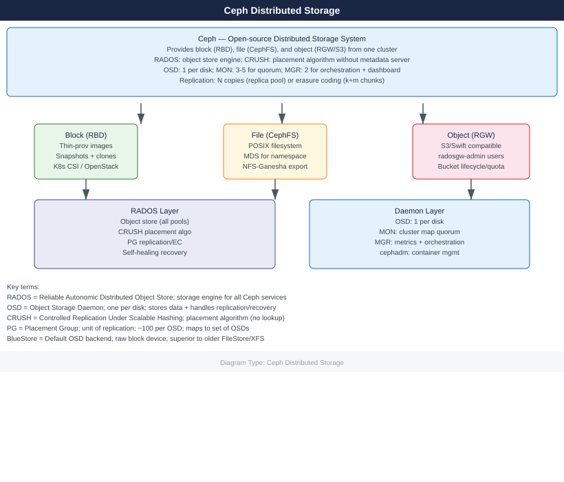

---
tags:
  - ceph
---
# Ceph Distributed Storage

<!-- diagram:ceph -->

Ceph is an open-source distributed storage system providing block (RBD), file (CephFS), and object (RGW/S3) storage from a single cluster. Deployed on commodity hardware with no single point of failure.

*Applies to: Red Hat Ceph Storage · Upstream Ceph*

  <a class="kb-card" href="architecture/">
    Architecture
    RADOS, OSD/MON/MGR/MDS daemons, CRUSH map, replication and erasure coding
  </a>
  <a class="kb-card" href="deploy/">
    Deploy
    cephadm bootstrap, OSD provisioning, pool creation, day-0 checklist
  </a>
  <a class="kb-card" href="operations/">
    Operations
    Cluster health, OSD management, CRUSH tuning, RBD/RGW/CephFS admin
  </a>
  <a class="kb-card" href="security/">
    Security
    CephX authentication, RBAC, encryption at rest, TLS for RGW
  </a>
  <a class="kb-card" href="troubleshooting/">
    Troubleshooting
    OSD down, PG degraded, slow requests, full cluster, and escalation
  </a>

