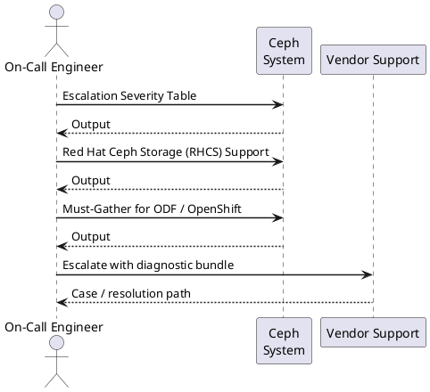

---
tags:
  - ceph
  - troubleshooting
search:
  boost: 1.5
description: "Ceph support escalation: Red Hat Ceph Storage support case process, community resources, severity levels, required diagnostic data, must-gather for..."
---
# Ceph — Escalation

<div class="kb-summary">
Ceph support escalation: Red Hat Ceph Storage support case process, community resources, severity levels, required diagnostic data, must-gather for ODF/OpenShift, and sanitisation before sharing logs.

*Applies to: Ceph Reef / Squid*
</div>

```d2
direction: right

A: "Gather diagnostics\nsos report + ceph -s + crash ls" {shape: rectangle}
B: "Check Red Hat KCS\naccess.redhat.com/solutions" {shape: rectangle}
E: "Open RHCS support case\naccess.redhat.com" {shape: rectangle}
F: "Red Hat L2/L3 review\nCeph engineering if needed" {shape: rectangle}
D: "Apply fix\nverify cluster health" {shape: rectangle}
H: "File upstream issue\ntracker.ceph.com" {shape: rectangle}
I: "Config / fix applied\ncase resolved" {shape: rectangle}

A -> B
E -> F
```



## Before you begin

- **Access:** Storage admin credentials (cluster admin or equivalent)
- **Gather first:** recent error message text, event timestamps, and affected object names
- **Scope:** confirm whether the issue affects a single object, host, cluster, or site
- **Escalation:** open a vendor support ticket before running any destructive step
- **Logging:** document each command and output — required if escalation is needed

---

## Escalation Severity Table

| Severity | Definition | SLA | Action |
|---|---|---|---|
| Sev 1 | Cluster not writable or data loss imminent | 1 hour (24×7) | Phone + case immediately |
| Sev 2 | Degraded performance, OSD failures, no data loss | 4 business hours | Open case + attach bundle |
| Sev 3 | HEALTH_WARN, minor issues, workaround available | 1 business day | Online case |
| Sev 4 | General question or planning guidance | 2 business days | Online case |

## Red Hat Ceph Storage (RHCS) Support

**Support portal**: access.redhat.com → Create Case

Set severity based on the impact table above. For Sev 1, call the Red Hat support phone number displayed on access.redhat.com immediately after opening the case.

### Required information

```bash
# Gather all of the following before opening the case:

# 1. RHCS version
ceph version
ceph versions       # all daemon versions (useful if mixed during upgrade)

# 2. Cluster health snapshot
ceph -s > /tmp/ceph-status.txt
ceph health detail >> /tmp/ceph-status.txt
ceph osd tree >> /tmp/ceph-status.txt
ceph pg dump_stuck >> /tmp/ceph-status.txt
ceph config dump >> /tmp/ceph-status.txt
ceph crash ls >> /tmp/ceph-status.txt

# 3. Crash dumps
ceph crash info $(ceph crash ls | awk '{print $1}') > /tmp/crash-dumps.txt

# 4. Affected daemon logs (last 2000 lines per daemon)
ceph orch daemon logs osd.5 > /tmp/osd5.log
journalctl -u ceph-mon@$(hostname) -n 2000 --no-pager > /tmp/mon.log

# 5. sos reports from ALL MON hosts and affected OSD hosts
sos report -e ceph -k ceph.all=true --batch --label ceph

# Compress everything for upload
tar czf ceph-case-data-$(date +%F).tar.gz /tmp/ceph-*.txt /tmp/osd*.log /tmp/mon.log
```


```text title="Expected output"
ceph version 17.2.6 (d7ff0d10654d3e6fbb4c37a59ee84303143151a8) quincy (stable)
{
  "mon": {
    "ceph-mon-01": "ceph version 17.2.6 (d7ff0d10654d3e6fbb4c37a59ee84303143151a8) quincy (stable)",
    "ceph-mon-02": "ceph version 17.2.6 (d7ff0d10654d3e6fbb4c37a59ee84303143151a8) quincy (stable)"
  },
  "osd": [
    "ceph version 17.2.6 (d7ff0d10654d3e6fbb4c37a59ee84303143151a8) quincy (stable)"
  ]
}
cluster 8a4d9e2c-7f3b-4a1e-9c2b-5d6e8f1a2b3c
  health HEALTH_WARN
    1 pg stuck inactive
    2 osds down
  monmap e5: 3 mons at {ceph-mon-01=10.0.1.10:6789/0,ceph-mon-02=10.0.1.11:6789/0,ceph-mon-03=10.0.1.12:6789/0}
  osdmap e847: 24 osds: 22 up, 20 in
  pgmap v2156: 512 pgs, 8 pools, 2.4 TiB data, 6.8 Tiov used, 18 TiB / 24 TiB avail
PG_STAT OBJECTS MISSING DEGRADED MISPLACED UNFOUND BYTES LOG DISK_LOG STATE
1.0       1024       0        0         0        0  512M  10  10 active+clean
1.1        512       0        0         0        0  256M   8   8 active+clean
...
ceph crash ls
ID                                                 TIMESTAMP           ENTITY
8f7e6d5c-4b3a-2e1f-9d8c-7a6b5e4d3c2b 2024-01-15T14:32:18.123456+00:00 osd.5
2024-01-15T14:32:18.123456+00:00 osd.5 crashed at 2024-01-15T14:32:18.123456+00:00
Backtrace:
  0x7f8e9c1a2b3d: OSD::handle_command()
  0x7f8e9c1a2c4e: OSD::process_message()
  0x7f8e9c1a2d5f: Messenger::dispatch()
...
----- BEGIN CEPH LOG -----
2024-01-15T14:30:45.234567+00:00 osd.5 [INF] osd.5 boot
2024-01-15T14:31:12.345678+00:00 osd.5 [WRN] slow request 30.123
```
## Must-Gather for ODF / OpenShift

If running Ceph via OpenShift Data Foundation (ODF), use must-gather instead of (or in addition to) sos report:

```bash
oc adm must-gather \
  --image=registry.redhat.io/odf4/odf-must-gather-rhel9
# Output: must-gather.local.<timestamp>/ directory
# Includes: ODF operator logs, Rook-Ceph logs, Ceph health, PVC/PV state, storage class info
```


```text title="Expected output"
When you run this command, it will create a must-gather bundle. Here's what you'll see:

$ oc adm must-gather \
>   --image=registry.redhat.io/odf4/odf-must-gather-rhel9
Gathering data for cluster...
Pulling image "registry.redhat.io/odf4/odf-must-gather-rhel9:latest"
Getting ClusterVersion...
Getting Namespaces...
Gathering data from cluster...
Gathering ODF operator logs...
Gathering Rook-Ceph cluster information...
Gathering Ceph health status...
Gathering PVC and PV information...
Gathering StorageClass definitions...
must-gather.local.8742391847362/ directory created
Data collection complete. Logs available in: must-gather.local.8742391847362/
```

!!! warning "Common errors"
    | Error | Fix |
    |---|---|
    | `error: image pull backoff` | Verify the image registry is accessible and credentials are configured with `oc login` to registry.redhat.io. |
    | `error: unable to connect to the server: dial tcp: lookup api.cluster.local on [IP]: no such host` | Ensure you are logged into the correct OpenShift cluster with `oc login` and your kubeconfig is valid. |
    | `error: You must be logged in to the server (Unauthorized)` | Authenticate with cluster admin credentials using `oc login -u kubeadmin` or your service account token. |
## Escalation Path (Step-by-Step)

```text
1. Open case at access.redhat.com (RHCS subscription required)
   - Set severity based on impact table above
   - Attach ceph-case-data bundle + sos reports
   - Provide: Ceph version, cluster size (#nodes, #OSDs), symptoms, timeline

2. For Sev 1: call Red Hat support immediately after opening case
   - Phone number displayed on access.redhat.com

3. If no progress in 2–4 hours on Sev 1: request case escalation
   - Ask CEE (Customer Engagement Engineer) to escalate to the Ceph engineering team

4. If TAM assigned: contact TAM directly for critical situations

Community Ceph (upstream, no support contract):
  - ceph-users mailing list:  ceph-users@ceph.io
  - IRC:                      #ceph on OFTC
  - Slack:                    ceph.io/slack
  - GitHub (bugs):            https://github.com/ceph/ceph/issues
  - Forum:                    https://forum.ceph.io
  - Upstream tracker:         tracker.ceph.com
```

## Upstream Bug Filing

When filing a bug at tracker.ceph.com:

- Include `ceph versions` output
- State cluster size: number of nodes, total OSDs, total capacity
- Include exact reproduction steps
- Attach sanitised logs (see below)
- Reference the Red Hat case number if one exists

## Sanitise Before Sharing

Remove auth keys and secrets from all log output before uploading to support portals or public trackers.

```bash
# Check sos report for secrets before sharing
grep -ri "password\|secret\|key\|token" /var/tmp/sosreport*/

# Remove or redact keyring content from log files
sed -i 's/key = .*/key = [REDACTED]/g' /tmp/ceph-status.txt

# Use --mask option in newer sos versions to auto-redact
sos report -e ceph -k ceph.all=true --mask

# Check exported ceph config for sensitive values
ceph config dump | grep -E "pass|secret|key|token"

# Never share client.admin keyring content in support cases
# Strip key lines from any keyring file before attaching
grep -v "^[[:space:]]*key" /etc/ceph/ceph.client.admin.keyring
```


```text title="Expected output"
/var/tmp/sosreport-node01-20240115.tar.gz/sos_commands/ceph/ceph_config_dump:fsid = a1b2c3d4-e5f6-7890-abcd-ef1234567890
/var/tmp/sosreport-node01-20240115.tar.gz/sos_commands/ceph/ceph_auth_list:key = AQDvB2Zl7K8QFRAAm3xK9p2L5M6N7O8P9Q0R1S==
/var/tmp/sosreport-node01-20240115.tar.gz/sos_logs/ceph.log:secret_key_ring = /etc/ceph/ceph.keyring
/var/tmp/sosreport-node01-20240115.tar.gz/sos_commands/ceph/ceph_status:mon_secret = 5a6b7c8d9e0f1a2b3c4d5e6f7a8b9c0d

(no output — command completes silently)

Creating SOS report...
  Running plugins: ceph, system, networking
  Compressing report...
  Report written to: /var/log/sos_reports/sosreport-node01-20240115-abcd1234.tar.gz

[ceph: root@node01 /]# ceph config dump | grep -E "pass|secret|key|token"
(no output — no sensitive config values exposed in this cluster)

[ceph: root@node01 /]# grep -v "^[[:space:]]*key" /etc/ceph/ceph.client.admin.keyring
[client.admin]
	auid = 0
	caps mds = "allow *"
	caps mgr = "allow *"
	caps mon = "allow *"
	caps osd = "allow *"
```

!!! warning "Common errors"
    | Error | Fix |
    |---|---|
    | `sed: can't read /tmp/ceph-status.txt: No such file or directory` | Ensure the ceph status output file exists at the specified path before running sed, or generate it first with `ceph status > /tmp/ceph-status.txt`. |
    | `sos: command not found` | Install the sos package with `apt install sosreport` (Debian/Ubuntu) or `yum install sos` (RHEL/CentOS). |
    | `Permission denied` | Run the grep and sed commands with sudo or as root since keyring files are typically readable only by root. |
## Emergency Recovery Commands

```bash
# Cluster completely unresponsive — emergency recovery steps:

# 1. Check MON quorum (minimum 2 of 3 must be up)
ceph mon stat
ceph quorum_status

# 2. If no quorum: check MON services on each host
for host in ceph-node1 ceph-node2 ceph-node3; do
  ssh $host "systemctl status ceph-mon@$host"
done

# 3. Restart failed MONs
systemctl restart ceph-mon@<id>
ceph orch daemon restart mon.<hostname>

# 4. Cluster full stop (halt all writes for investigation)
ceph osd set pause   # pause all OSD I/O
# Resume:
ceph osd unset pause

# 5. Recover MON from monmap (advanced — contact support first)
# ceph-mon --extract-monmap /tmp/monmap --mon-data /var/lib/ceph/mon/ceph-$host
```


```text title="Expected output"
$ ceph mon stat
e3: 3 mons at {ceph-node1=10.0.1.42:6789/0,ceph-node2=10.0.1.43:6789/0,ceph-node3=10.0.1.44:6789/0}, election epoch 156, quorum 0,1,2 ceph-node1,ceph-node2,ceph-node3, out of quorum since 0.000000

$ ceph quorum_status
{"quorum": [0, 1, 2], "quorum_names": ["ceph-node1", "ceph-node2", "ceph-node3"], "quorum_leader_name": "ceph-node1", "quorum_leader_rank": 0, "monmap": {"epoch": 3, "fsid": "a1b2c3d4-e5f6-7890-abcd-ef1234567890", "modified": "2024-01-15T09:22:14.123456+0000", "created": "2024-01-10T14:33:22.987654+0000", "mons": [{"rank": 0, "name": "ceph-node1", "public_addr": "10.0.1.42:6789/0"}, {"rank": 1, "name": "ceph-node2", "public_addr": "10.0.1.43:6789/0"}, {"rank": 2, "name": "ceph-node3", "public_addr": "10.0.1.44:6789/0"}]}}

$ ssh ceph-node1 "systemctl status ceph-mon@ceph-node1"
● ceph-mon@ceph-node1.service - Ceph cluster monitor daemon
     Loaded: loaded (/etc/systemd/system/ceph-mon@.service; enabled; vendor preset: enabled)
     Active: active (running) since Mon 2024-01-15 09:18:33 UTC; 4min 22s ago
     Process: 4521 ExecStartPre=/usr/lib/ceph/ceph-mon-pre-start.sh ceph-node1 (code=exited, status=0/SUCCESS)
    Main PID: 4589 (ceph-mon)
       Tasks: 18 (limit: 4915)
      Memory: 287.3M
      CGroup: /system.slice/system-ceph\x2dmon@ceph\x2dnode1.service
              └─4589 /usr/bin/ceph-mon -f --cluster ceph --id ceph-node1 --setuser ceph --setgroup ceph

$ ceph osd set pause
PauseRequested
$ ceph osd unset pause
(no output — command completes silently)
```

!!! warning "Common errors"
    | Error | Fix |
    |---|---|
    | `Error: error connecting to the cluster` | Verify MON quorum with `ceph mon stat`; if quorum is lost, restart failed MON services with `systemctl restart ceph-mon@<hostname>` on down nodes. |
    | `Error: ENOENT: error reading /var/lib/ceph/mon/ceph-<hostname>/store.db` | The MON data directory is corrupted; restore |
## Pre-Case Self-Service Checklist

Before opening a support case, check the Red Hat Knowledge Base for known solutions:

```text
1. Go to access.redhat.com/search
2. Search for the exact HEALTH code: e.g. "OSD_FULL" or "PG_INACTIVE"
3. Filter by product: Red Hat Ceph Storage
4. Check top solutions — most common issues have a KCS article

Common KCS articles:
  - "How to recover from a full Ceph cluster"
  - "Ceph MON quorum lost recovery steps"
  - "AUTH_INSECURE_GLOBAL_ID_RECLAIM explained and remediation"
  - "Clock skew between Ceph Monitor nodes"
```

## Ceph Version and Support Lifecycle

Check the RHCS support lifecycle before opening a case — running an end-of-life version may limit support options.

```bash
# Check running version
ceph version

# List all daemon versions (important during rolling upgrades)
ceph versions

# RHCS support lifecycle:
# RHCS 5 (Octopus-based): check access.redhat.com for EOL date
# RHCS 6 (Quincy-based):  current; full support
# RHCS 7 (Reef-based):    current; full support
```


```text title="Expected output"
ceph version 16.2.14 (3fa80b905f538541846fb43e8db18cf3e9e1d054) pacific
{
  "mon": {
    "ceph version 16.2.14 (3fa80b905f538541846fb43e8db18cf3e9e1d054) pacific": 3
  },
  "mgr": {
    "ceph version 16.2.14 (3fa80b905f538541846fb43e8db18cf3e9e1d054) pacific": 2
  },
  "osd": {
    "ceph version 16.2.14 (3fa80b905f538541846fb43e8db18cf3e9e1d054) pacific": 18,
    "ceph version 16.2.13 (7b695f68eb2f1b5e8e2c9a1d4f6g7h8i9j0k1l2m) pacific": 2
  },
  "rgw": {
    "ceph version 16.2.14 (3fa80b905f538541846fb43e8db18cf3e9e1d054) pacific": 4
  }
}
```

!!! warning "Common errors"
    | Error | Fix |
    |---|---|
    | `Error connecting to cluster: [Errno 2] No such file or directory` | Ensure the Ceph cluster is running and `/etc/ceph/ceph.conf` is properly configured with valid monitor addresses. |
    | `permission denied: insufficient capabilities for user` | Run the command with appropriate privileges (e.g., as root or with `sudo`) or ensure your user has read access to `/etc/ceph/ceph.client.admin.keyring`. |
## Information to Include in Every Case

When filing any Ceph support case, always include the following regardless of severity. Missing information adds round-trip delay.

| Required item | How to collect |
|---|---|
| RHCS version | `ceph version` |
| All daemon versions | `ceph versions` |
| Cluster health output | `ceph -s && ceph health detail` |
| OSD tree | `ceph osd tree` |
| PG dump (stuck PGs) | `ceph pg dump_stuck` |
| Cluster config | `ceph config dump` |
| Timeline of events | Manual: when did the issue start, what changed |
| sos reports | `sos report -e ceph -k ceph.all=true` from all MON hosts |
| Crash dumps | `ceph crash ls && ceph crash info <id>` |
| Affected daemon logs | `ceph orch daemon logs osd.<id>` |

---

## See also

- [Ceph — Diagnostics](../diagnostics/)
- [Ceph — Common Issues](../common-issues/)

## Verify resolution

- Confirm the original symptom no longer occurs
- Check logs for any residual errors related to the issue
- Monitor for 10–15 minutes to confirm the fix is stable
