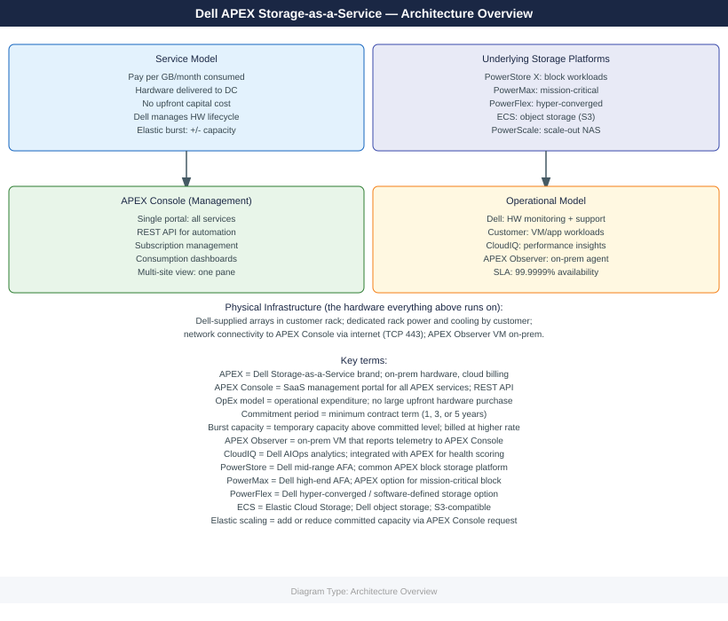
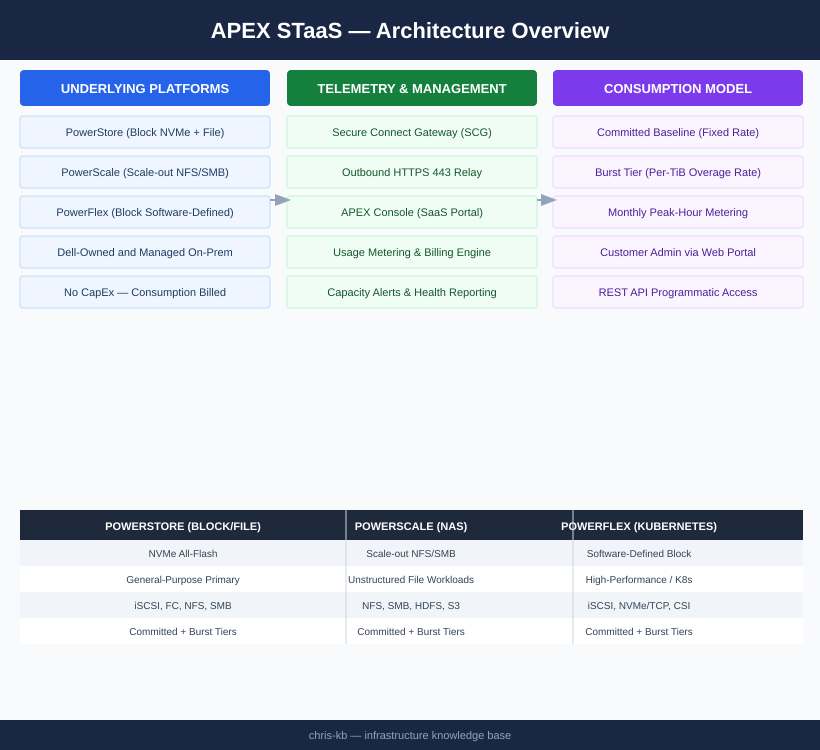

---
tags:
  - architecture
  - dell
---
# APEX Storage as a Service — Architecture

<div class="kb-summary">
Consumption-based STaaS model — Dell owns and manages on-premises PowerStore, PowerScale, or PowerFlex hardware; capacity is metered monthly via the APEX Console with committed and burst tiers.

*Applies to: APEX Storage-as-a-Service*
</div>



```d2
direction: right

DELL: "Dell Infrastructure\n(owned and managed by Dell" {shape: rectangle}
SCG: "Secure Connect Gateway\n(on-premises telemetry relay" {shape: rectangle}
APEX: "APEX Console\n(SaaS — Dell cloud" {shape: rectangle}
ADMIN: "Customer Admin" {shape: rectangle}

DELL -> SCG
SCG -> APEX
ADMIN -> APEX
```


<div class="kb-grid kb-grid-3">
<a class="kb-card" href="how-it-works/"><strong>How It Works</strong><span>How it works, integrations, and design standards.</span></a>
<a class="kb-card" href="integrations/"><strong>Integrations</strong><span>Integration with APEX Console, Secure Connect Gateway, and REST API.</span></a>
<a class="kb-card" href="design-standards/"><strong>Design Standards</strong><span>SCG redundancy, capacity planning, and subscription management practices.</span></a>
</div>

## Underlying Platforms

| Platform | Storage Type | Use Case |
|---|---|---|
| PowerStore | Block (NVMe) and file | General-purpose primary storage |
| PowerScale | NAS (scale-out NFS/SMB) | Unstructured data and file workloads |
| PowerFlex | Block (software-defined) | High-performance and Kubernetes workloads |

## How APEX STaaS Works

