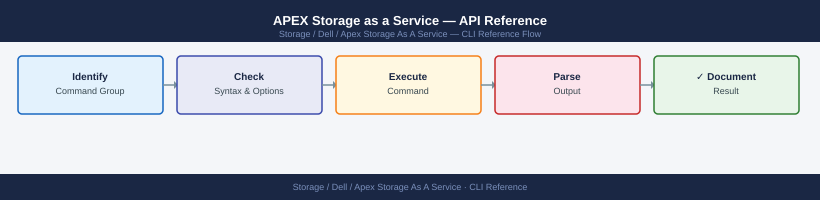

---
tags:
  - dell
  - operations
description: "APEX STaaS API reference: CloudIQ REST API for capacity reporting, GET /v1/storage-objects, snapshot management endpoints, and OAuth2 authentication."
---
# APEX Storage as a Service — API Reference

<div class="kb-summary">
APEX STaaS API reference: CloudIQ REST API for capacity reporting, `GET /v1/storage-objects`, snapshot management endpoints, and OAuth2 authentication.

*Applies to: APEX Storage-as-a-Service*
</div>


---

APEX Storage as a Service has no local CLI. All management is through the **Dell APEX Console** (web portal at console.dell.com) or the **Dell Technologies Cloud API** at `api.dell.com`. The API follows REST conventions and uses OAuth2 client credentials for authentication.

APEX Block Storage surfaces in CloudIQ for performance and health monitoring — see the [CloudIQ](../../cloudiq/index.md) section for those endpoints.

> **API base URL**: `https://api.dell.com`  
> **Auth URL**: `https://api.dell.com/auth/oauth/v2/token`  
> **API key management**: console.dell.com → Settings → API Keys  
> **API documentation**: developer.dell.com

---

## Before you begin

- **Access:** Storage admin credentials (cluster admin or equivalent)
- **Timing:** safe to run during business hours unless a step is marked ⚠ (causes interruption)
- **Dependencies:** no active upgrades or migrations on the same infrastructure
- **Logging:** capture command output — paste into the change record on completion

---

## Quick-Reference Table

| Operation | Method + Path |
|---|---|
| Get OAuth2 access token | `POST /auth/oauth/v2/token` |
| List APEX Block systems | `GET /apex/block/v1/systems` |
| Get APEX system details | `GET /apex/block/v1/systems/{id}` |
| Get system capacity | `GET /apex/block/v1/systems/{id}/capacity` |
| Get system health | `GET /apex/block/v1/systems/{id}/health` |
| List subscriptions | `GET /apex/subscriptions/v1` |
| Get subscription details | `GET /apex/subscriptions/v1/{id}` |
| Get subscription consumption | `GET /apex/subscriptions/v1/{id}/consumption` |
| Get performance metrics | `GET /apex/block/v1/systems/{id}/metrics` |
| List storage volumes | `GET /apex/block/v1/systems/{id}/volumes` |

---

## Dell API Authentication

APEX uses OAuth2 client credentials. Generate a `client_id` and `client_secret` in the APEX Console under **Settings → API Keys**. Access tokens expire after 3600 seconds.

```bash
CLIENT_ID="<your_client_id>"
CLIENT_SECRET="<your_client_secret>"
TOKEN_URL="https://api.dell.com/auth/oauth/v2/token"

# --- Get access token ---
RESPONSE=$(curl -s -X POST "${TOKEN_URL}" \
  -H "Content-Type: application/x-www-form-urlencoded" \
  -d "grant_type=client_credentials" \
  -d "client_id=${CLIENT_ID}" \
  -d "client_secret=${CLIENT_SECRET}")

TOKEN=$(echo "${RESPONSE}" | python3 -c "import sys,json; print(json.load(sys.stdin)['access_token'])")
EXPIRES_IN=$(echo "${RESPONSE}" | python3 -c "import sys,json; print(json.load(sys.stdin)['expires_in'])")

echo "Token acquired. Expires in ${EXPIRES_IN}s"

# --- Set convenience variables for subsequent calls ---
AUTH="Authorization: Bearer ${TOKEN}"
BASE="https://api.dell.com"
```


```text title="Expected output"
Token acquired. Expires in 3600s
```

!!! warning "Common errors"
    **`curl: (6) Could not resolve host: api.dell.com`** — Verify network connectivity and that the Dell API endpoint is accessible from your environment; check firewall rules and DNS resolution.
    **`json.decoder.JSONDecodeError: Expecting value: line 1 column 1 (char 0)`** — Confirm CLIENT_ID and CLIENT_SECRET are valid and that the token endpoint is returning JSON; check credentials in your Dell API console.
    **`curl: (35) error:1400D102:SSL routines:SSL_CTX_use_certificate:unsupported certificate type`** — Ensure your system's CA certificates are up to date by running `update-ca-certificates` or equivalent for your OS.
**Token management:**

| Field | Value |
|---|---|
| `grant_type` | Always `client_credentials` |
| `expires_in` | `3600` — re-authenticate before expiry in scripts |
| `token_type` | `Bearer` |
| Scope | Determined by API key permissions in APEX Console |

---

## APEX Systems API

```bash
# --- List all APEX Block Storage systems ---
curl -s -X GET "${BASE}/apex/block/v1/systems" \
  -H "${AUTH}" | python3 -m json.tool

# List with pagination
curl -s -X GET "${BASE}/apex/block/v1/systems?limit=50&offset=0" \
  -H "${AUTH}" | python3 -m json.tool

# Filter by location / site
curl -s -X GET "${BASE}/apex/block/v1/systems?location=DC1" \
  -H "${AUTH}" | python3 -m json.tool

# --- Get details for a specific APEX system ---
SYSTEM_ID="<system-id>"    # From list response

curl -s -X GET "${BASE}/apex/block/v1/systems/${SYSTEM_ID}" \
  -H "${AUTH}" | python3 -m json.tool

# Key system fields:
#   id                  – APEX system identifier
#   name                – Friendly name (set in APEX Console)
#   model               – Hardware model (e.g. "PowerStore 3200T")
#   type                – BLOCK / FILE
#   location            – Data centre / site label
#   status              – ACTIVE / PROVISIONING / DEGRADED / OFFLINE
#   software_version    – Current firmware/OS version
#   health_status       – GOOD / WARNING / CRITICAL

# --- Get system health ---
curl -s -X GET "${BASE}/apex/block/v1/systems/${SYSTEM_ID}/health" \
  -H "${AUTH}" | python3 -m json.tool

# Health response fields:
#   health_score        – 0–100 (100 = fully healthy)
#   health_issues[]     – Array of active health concerns
#   last_updated        – ISO8601 timestamp

# --- Get capacity for a system ---
curl -s -X GET "${BASE}/apex/block/v1/systems/${SYSTEM_ID}/capacity" \
  -H "${AUTH}" | python3 -m json.tool

# Capacity fields:
#   committed_capacity_tb    – Contracted committed capacity
#   burst_capacity_tb        – Available burst ceiling
#   used_capacity_tb         – Currently consumed
#   available_capacity_tb    – committed + burst - used
#   percent_used             – Utilisation percentage

# --- List storage volumes on a system ---
curl -s -X GET "${BASE}/apex/block/v1/systems/${SYSTEM_ID}/volumes" \
  -H "${AUTH}" | python3 -m json.tool

# Get a specific volume
VOLUME_ID="<volume-id>"
curl -s -X GET "${BASE}/apex/block/v1/systems/${SYSTEM_ID}/volumes/${VOLUME_ID}" \
  -H "${AUTH}" | python3 -m json.tool
```


```text title="Expected output"
{
  "systems": [
    {
      "id": "apex-ps3200t-dc1-001",
      "name": "PS3200T-Primary-DC1",
      "model": "PowerStore 3200T",
      "type": "BLOCK",
      "location": "DC1",
      "status": "ACTIVE",
      "software_version": "3.2.1.0",
      "health_status": "GOOD"
    },
    {
      "id": "apex-ps5000t-dc2-001",
      "name": "PS5000T-Secondary-DC2",
      "model": "PowerStore 5000T",
      "type": "BLOCK",
      "location": "DC2",
      "status": "ACTIVE",
      "software_version": "3.2.1.0",
      "health_status": "GOOD"
    }
  ],
  "pagination": {
    "limit": 50,
    "offset": 0,
    "total": 2
  }
}

{
  "health_score": 98,
  "health_issues": [],
  "last_updated": "2024-01-15T14:32:47Z"
}

{
  "committed_capacity_tb": 500,
  "burst_capacity_tb": 100,
  "used_capacity_tb": 342,
  "available_capacity_tb": 258,
  "percent_used": 68.4
}

{
  "volumes": [
    {
      "id": "vol-8f2c4a9e",
      "name": "prod-db-vol-01",
      "size_gb": 2048,
      "status": "ONLINE"
    },
    {
      "id": "vol-3d7b1f5c",
      "name": "prod-app-vol-02",
      "size_gb": 1024,
      "status": "ONLINE"
    }
  ]
}
```

!!! warning "Common errors"
    **`curl: (7) Failed to connect to apex.example.com port 443: Connection refused`** — Verify the BASE URL is correct and the APEX management API endpoint is reachable and listening on the configured port.
    **`{"error": "Unauthorized", "code": 401}`** — Ensure the AUTH header contains a valid bearer token or API key; regenerate credentials in the APEX Console if expired.
    **`curl: (60) SSL certificate problem: self signed certificate`** — Add `-k` flag to curl to skip certificate verification in lab environments, or import the APEX CA certificate into your system trust store for production.
---

## Subscription API

APEX subscriptions define contracted capacity, term, service tier, and billing model. Use these endpoints to track contracted vs consumed figures.

```bash
# --- List all APEX subscriptions ---
curl -s -X GET "${BASE}/apex/subscriptions/v1" \
  -H "${AUTH}" | python3 -m json.tool

# Filter by product type
curl -s -X GET "${BASE}/apex/subscriptions/v1?product_type=BLOCK" \
  -H "${AUTH}" | python3 -m json.tool

# Filter by status
curl -s -X GET "${BASE}/apex/subscriptions/v1?status=ACTIVE" \
  -H "${AUTH}" | python3 -m json.tool

# --- Get details for a specific subscription ---
SUB_ID="<subscription-id>"

curl -s -X GET "${BASE}/apex/subscriptions/v1/${SUB_ID}" \
  -H "${AUTH}" | python3 -m json.tool

# Key subscription fields:
#   id                      – Subscription identifier
#   product_type            – BLOCK / FILE / OBJECT
#   service_tier            – e.g. "Performance", "Capacity"
#   committed_capacity_tb   – Contracted base capacity (TB)
#   burst_capacity_tb       – Burst ceiling (TB above committed)
#   contract_start_date     – ISO8601
#   contract_end_date       – ISO8601
#   auto_renewal            – true/false
#   status                  – ACTIVE / EXPIRED / SUSPENDED

# --- Get subscription consumption (contracted vs consumed) ---
curl -s -X GET "${BASE}/apex/subscriptions/v1/${SUB_ID}/consumption" \
  -H "${AUTH}" | python3 -m json.tool

# Consumption fields:
#   committed_capacity_tb    – Contracted TB
#   burst_capacity_tb        – Burst ceiling TB
#   current_usage_tb         – TB currently in use
#   peak_usage_tb            – Peak TB used this billing period
#   burst_usage_tb           – TB used above committed (billed at burst rate)
#   billing_period_start     – ISO8601 start of current billing month
#   billing_period_end       – ISO8601 end of current billing month

# --- Check if burst is in use ---
curl -s -X GET "${BASE}/apex/subscriptions/v1/${SUB_ID}/consumption" \
  -H "${AUTH}" | python3 -c "
import sys, json
data = json.load(sys.stdin)
committed = data.get('committed_capacity_tb', 0)
current   = data.get('current_usage_tb', 0)
burst     = data.get('burst_usage_tb', 0)
ceiling   = data.get('burst_capacity_tb', 0)
print(f'Committed: {committed:.1f} TB  Used: {current:.1f} TB  Burst: {burst:.1f} TB  Ceiling: {ceiling:.1f} TB')
if burst > 0:
    pct = (burst/ceiling*100) if ceiling else 0
    print(f'BURST ACTIVE: {burst:.1f} TB at {pct:.1f}% of burst ceiling')
"
```


```text title="Expected output"
{
  "subscriptions": [
    {
      "id": "sub-apex-001-prod",
      "product_type": "BLOCK",
      "service_tier": "Performance",
      "committed_capacity_tb": 100.0,
      "burst_capacity_tb": 150.0,
      "contract_start_date": "2023-06-15T00:00:00Z",
      "contract_end_date": "2025-06-14T23:59:59Z",
      "auto_renewal": true,
      "status": "ACTIVE"
    },
    {
      "id": "sub-apex-002-file",
      "product_type": "FILE",
      "service_tier": "Capacity",
      "committed_capacity_tb": 250.0,
      "burst_capacity_tb": 300.0,
      "contract_start_date": "2024-01-01T00:00:00Z",
      "contract_end_date": "2026-01-01T00:00:00Z",
      "auto_renewal": true,
      "status": "ACTIVE"
    }
  ]
}
{
  "subscriptions": [
    {
      "id": "sub-apex-001-prod",
      "product_type": "BLOCK",
      "service_tier": "Performance",
      "committed_capacity_tb": 100.0,
      "burst_capacity_tb": 150.0,
      "status": "ACTIVE"
    }
  ]
}
{
  "subscriptions": [
    {
      "id": "sub-apex-001-prod",
      "product_type": "BLOCK",
      "service_tier": "Performance",
      "committed_capacity_tb": 100.0,
      "burst_capacity_tb": 150.0,
      "status": "ACTIVE"
    },
    {
      "id": "sub-apex-002-file",
      "product_type": "FILE",
      "service_tier": "Capacity",
      "committed_capacity_tb": 250.0,
      "burst_capacity_tb": 300.0,
      "status": "ACTIVE"
    }
  ]
}
{
  "id": "sub-apex-001-prod",
  "product_type": "BLOCK",
  "service_tier": "Performance",
  "committed_capacity_tb": 100.0,
  "burst_capacity_tb": 150.0,
  "contract_start_date": "2023-06-15T00:00:00Z",
  "contract_end_date": "2025-06-14T23:59:59Z",
  "auto_renewal": true,
  "status": "ACTIVE"
}
{
  "committed_capacity_tb": 100.0,
  "burst_capacity_tb": 150.0,
  "current_usage_tb": 87.3,
  "peak_usage_tb": 92.1,
  "burst_usage_tb": 0.0,
  "billing_period_start": "2024-12-01T00:00:00Z",
  "billing_period_end": "2024-12-31T23:59:59
```
---

## Metrics API

```bash
# --- Get available metric types for a system ---
curl -s -X GET "${BASE}/apex/block/v1/systems/${SYSTEM_ID}/metrics/types" \
  -H "${AUTH}" | python3 -m json.tool

# Common metric keys:
#   iops              – Total IOPS (read + write)
#   read_iops         – Read IOPS
#   write_iops        – Write IOPS
#   latency_ms        – Average latency in milliseconds
#   throughput_mb     – MB/s (read + write combined)
#   read_throughput_mb
#   write_throughput_mb
#   cpu_utilization   – Controller CPU %

# --- Set time range helpers ---
END=$(date -u +"%Y-%m-%dT%H:%M:%SZ")
START_1H=$(date -u -v-1H +"%Y-%m-%dT%H:%M:%SZ" 2>/dev/null \
         || date -u -d "1 hour ago" +"%Y-%m-%dT%H:%M:%SZ")
START_24H=$(date -u -v-24H +"%Y-%m-%dT%H:%M:%SZ" 2>/dev/null \
          || date -u -d "24 hours ago" +"%Y-%m-%dT%H:%M:%SZ")
START_30D=$(date -u -v-30d +"%Y-%m-%dT%H:%M:%SZ" 2>/dev/null \
          || date -u -d "30 days ago" +"%Y-%m-%dT%H:%M:%SZ")

# --- Get performance metrics (last 24 hours, hourly granularity) ---
curl -s -X POST "${BASE}/apex/block/v1/systems/${SYSTEM_ID}/metrics" \
  -H "${AUTH}" \
  -H "Content-Type: application/json" \
  -d "{
    \"metrics\":     [\"iops\", \"latency_ms\", \"throughput_mb\"],
    \"start_time\":  \"${START_24H}\",
    \"end_time\":    \"${END}\",
    \"granularity\": \"HOURLY\"
  }" | python3 -m json.tool

# --- Get last-known (real-time) metrics snapshot ---
curl -s -X GET "${BASE}/apex/block/v1/systems/${SYSTEM_ID}/metrics/current" \
  -H "${AUTH}" | python3 -m json.tool

# --- 30-day performance trend (daily granularity) ---
curl -s -X POST "${BASE}/apex/block/v1/systems/${SYSTEM_ID}/metrics" \
  -H "${AUTH}" \
  -H "Content-Type: application/json" \
  -d "{
    \"metrics\":     [\"iops\", \"latency_ms\"],
    \"start_time\":  \"${START_30D}\",
    \"end_time\":    \"${END}\",
    \"granularity\": \"DAILY\"
  }" | python3 -m json.tool

# --- Volume-level performance metrics ---
curl -s -X POST \
  "${BASE}/apex/block/v1/systems/${SYSTEM_ID}/volumes/${VOLUME_ID}/metrics" \
  -H "${AUTH}" \
  -H "Content-Type: application/json" \
  -d "{
    \"metrics\":     [\"iops\", \"latency_ms\"],
    \"start_time\":  \"${START_24H}\",
    \"end_time\":    \"${END}\",
    \"granularity\": \"HOURLY\"
  }" | python3 -m json.tool
```


```text title="Expected output"
{
  "metric_types": [
    "iops",
    "read_iops",
    "write_iops",
    "latency_ms",
    "throughput_mb",
    "read_throughput_mb",
    "write_throughput_mb",
    "cpu_utilization"
  ]
}
{
  "metrics": [
    {
      "timestamp": "2024-01-15T14:00:00Z",
      "iops": 4521.3,
      "latency_ms": 2.14,
      "throughput_mb": 287.6
    },
    {
      "timestamp": "2024-01-15T15:00:00Z",
      "iops": 5103.7,
      "latency_ms": 2.31,
      "throughput_mb": 312.4
    },
    {
      "timestamp": "2024-01-15T16:00:00Z",
      "iops": 4876.2,
      "latency_ms": 2.08,
      "throughput_mb": 298.9
    }
  ]
}
{
  "current_metrics": {
    "timestamp": "2024-01-15T16:47:23Z",
    "iops": 5234.1,
    "latency_ms": 2.19,
    "throughput_mb": 318.7,
    "cpu_utilization": 67.3
  }
}
{
  "metrics": [
    {
      "timestamp": "2023-12-17T00:00:00Z",
      "iops": 3847.5,
      "latency_ms": 2.42
    },
    {
      "timestamp": "2023-12-18T00:00:00Z",
      "iops": 4102.3,
      "latency_ms": 2.35
    },
    {
      "timestamp": "2024-01-15T00:00:00Z",
      "iops": 5156.8,
      "latency_ms": 2.11
    }
  ]
}
{
  "metrics": [
    {
      "timestamp": "2024-01-15T14:00:00Z",
      "volume_id": "vol-8f4c2a9e",
      "iops": 1247.6,
      "latency_ms": 1.87
    },
    {
      "timestamp": "2024-01-15T15:00:00Z",
      "volume_id": "vol-8f4c2a9e",
      "iops": 1389.2,
      "latency_ms": 1.92
    }
  ]
}
```

!!! warning "Common errors"
    **`curl: (7) Failed to connect to apex-api.dell.local port 443: Connection refused`** — Verify the BASE URL is correct and the APEX API endpoint is reachable; check firewall rules and API service status.
    **`{"error": "Unauthorized", "code": 401}`** — Ensure the AUTH header contains a valid bearer token or API key; regenerate credentials if expired.
    **`{"error": "System not found", "code": 404}`
---

## CloudIQ Integration

APEX Block Storage systems are automatically ingested into CloudIQ for health scoring, alerting, and capacity forecasting. Use the CloudIQ API to monitor APEX systems alongside other Dell products.

```bash
# CloudIQ base URL and auth are separate — see CloudIQ API Reference
CIQ_TOKEN="<cloudiq_access_token>"        # See CloudIQ auth section
CIQ_BASE="https://cloudiq.apis.dell.com/rest/v1"

# --- List APEX systems visible in CloudIQ ---
curl -s -X GET "${CIQ_BASE}/systems?type=POWERSTORE" \
  -H "Authorization: Bearer ${CIQ_TOKEN}" | python3 -m json.tool

# --- Get health score for an APEX system in CloudIQ ---
APEX_CIQ_ID="<cloudiq-system-id>"

curl -s -X GET "${CIQ_BASE}/systems/${APEX_CIQ_ID}" \
  -H "Authorization: Bearer ${CIQ_TOKEN}" | python3 -m json.tool

# --- Get CloudIQ alerts for APEX systems ---
curl -s -X GET "${CIQ_BASE}/alerts?system_id=${APEX_CIQ_ID}&state=ACTIVE" \
  -H "Authorization: Bearer ${CIQ_TOKEN}" | python3 -m json.tool

# --- Capacity forecast via CloudIQ ---
curl -s -X GET "${CIQ_BASE}/systems/${APEX_CIQ_ID}/capacity/forecast?days=90" \
  -H "Authorization: Bearer ${CIQ_TOKEN}" | python3 -m json.tool
```


```text title="Expected output"
{
  "systems": [
    {
      "id": "sys-ps-001a2b3c",
      "name": "APEX-DC1-PS01",
      "type": "POWERSTORE",
      "health_score": 98,
      "status": "healthy",
      "model": "PowerStore 7000T",
      "serial_number": "PS000123456789"
    },
    {
      "id": "sys-ps-004d5e6f",
      "name": "APEX-DC2-PS02",
      "type": "POWERSTORE",
      "health_score": 92,
      "status": "healthy",
      "model": "PowerStore 5000T",
      "serial_number": "PS000987654321"
    }
  ]
}
{
  "id": "sys-ps-001a2b3c",
  "name": "APEX-DC1-PS01",
  "health_score": 98,
  "capacity_used_percent": 67.3,
  "iops": 145230,
  "latency_ms": 2.1,
  "last_contact": "2024-01-15T14:32:18Z"
}
{
  "alerts": [
    {
      "id": "alert-78a9b0c1",
      "severity": "WARNING",
      "message": "Disk utilization approaching threshold",
      "created_at": "2024-01-15T10:22:45Z"
    },
    {
      "id": "alert-d2e3f4g5",
      "severity": "INFO",
      "message": "Scheduled maintenance window completed",
      "created_at": "2024-01-14T23:15:30Z"
    }
  ]
}
{
  "forecast": {
    "current_capacity_gb": 45678,
    "projected_capacity_gb": 52341,
    "growth_rate_percent": 14.6,
    "days_until_full": 287,
    "recommendation": "Consider expansion in Q2 2024"
  }
}
```

!!! warning "Common errors"
    **`curl: (6) Could not resolve host: cloudiq.apis.dell.com`** — Verify network connectivity and DNS resolution; check firewall rules for HTTPS egress to Dell CloudIQ endpoints.
    **`{"error": "Unauthorized", "code": 401}`** — Regenerate the CloudIQ access token in the Dell EMC support portal and ensure it has not expired or been revoked.
    **`{"error": "Not Found", "code": 404}`** — Confirm the APEX system ID exists in CloudIQ by running the first command to list all systems and copy the correct `id` value.
> APEX systems appear in CloudIQ with the model of the underlying hardware (e.g. `PowerStore 3200T`). Filter by type `POWERSTORE`, `POWERMAX`, or `UNITY_XT` depending on which APEX SKU is deployed. See the [CloudIQ](../../cloudiq/index.md) section for full CloudIQ API coverage.

---

## Notes on APEX Management Boundaries

| Task | Interface |
|---|---|
| Order / provision new APEX system | APEX Console (console.dell.com) |
| Resize contracted capacity | APEX Console → Subscription → Modify |
| Create / delete volumes | APEX Console or APEX Block API |
| Monitor health and alerts | CloudIQ (console.dell.com/cloudiq) |
| View billing / consumption | APEX Console → Billing or Subscription API |
| Performance metrics | APEX Block API or CloudIQ API |
| Firmware upgrades | Dell-managed (SaaS — no customer action required) |
| Hardware replacement | Dell field service — no customer CLI |

---

## Verify

- Confirm the operation completed without errors in the log or management UI
- Verify the expected state change is visible (service running, object created, config applied)
- Document the outcome in the change record

---

## See also

- [Apex Storage As A Service — Procedures](../procedures/)
- [Apex Storage As A Service — Scripts](../scripts/)
- [Apex Storage As A Service — Health Checks](../health-checks/)
