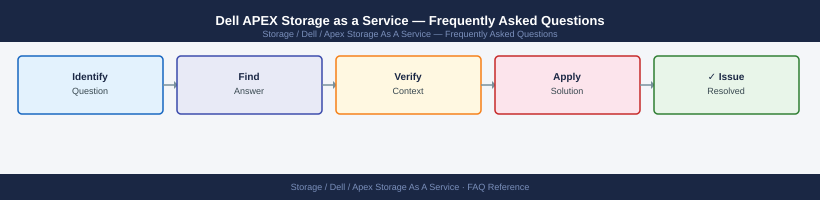

---
tags:
  - dell-apex-saas
  - faq
  - operations
description: "Common questions about Dell APEX Storage as a Service operations, configuration, and troubleshooting. For step-by-step procedures, see the Operations..."
---
# Dell APEX Storage as a Service — Frequently Asked Questions

*Applies to: Dell EMC Storage*

Common questions about Dell APEX Storage as a Service operations, configuration, and troubleshooting. For step-by-step procedures, see the <a href="index.md">Operations</a> section.

## General

**Q: How do I check the current APEX Storage firmware version?**
A: Log in to the APEX Console at console.apex.dell.com. Navigate to your storage service → Details → Software Version. Dell manages firmware updates automatically for APEX services.

**Q: How do I check the current Dell APEX Storage as a Service version?**
A: `APEX Console → Storage Service → Details → Software Version`

## Configuration

**Q: What is the default performance tier for new APEX Storage volumes?**
A: Performance tier is selected during service configuration. For most workloads, select 'Performance' (NVMe-backed). Use 'Standard' only for archival or low-IOPS workloads. Tier changes require a service reconfiguration request.

**Q: How do I enable data-at-rest encryption for an APEX Storage service?**
A: Encryption is enabled by default for all APEX Storage services. Dell manages the encryption keys unless you configure Customer-Managed Keys (CMK) via the APEX Console → Security → Encryption Settings.

## Operations

**Q: How does Dell handle firmware upgrades for APEX Storage?**
A: Dell handles all firmware upgrades as part of the APEX managed service. You receive advance notification of planned maintenance windows. APEX upgrades are non-disruptive for supported configurations. You cannot manually trigger or defer upgrades.

**Q: What is the correct procedure to expand APEX Storage capacity?**
A: In APEX Console, navigate to your service → Manage → Expand. Select additional capacity increment. Expansion is elastic — no hardware intervention required. Capacity is available within minutes for all-flash tiers.

## Troubleshooting

**Q: APEX Console shows 'Service Health: Degraded'. What does it mean?**
A: One or more components of your APEX service have reduced redundancy. Dell Support is automatically notified and a case is created. Review the alert details for estimated resolution time. Contact Dell Support if no case appears within 30 minutes.

**Q: APEX Storage performance is below contracted SLA — where do I start?**
A: Review APEX Console performance metrics. If below SLA, open a support case via the APEX Console — Dell will investigate infrastructure health. Review host-side I/O patterns (queue depth, block size) that may be limiting throughput.

## Backup and Recovery

**Q: How is APEX Storage data protected?**
A: APEX Storage includes built-in redundancy (RAID/erasure coding). For backup, you configure your own solution (Veeam, Commvault) targeting the APEX volumes. Dell does not manage application-level backups within the APEX service.

**Q: Can I request a point-in-time restore for APEX Storage?**
A: APEX Storage supports native snapshots (configure via APEX Console or REST API). Restore from a snapshot via the APEX Console → Storage → Snapshots → Restore. Restores are volume-level, not file-level.

## See Also

- [Dell APEX Storage as a Service Operations](index.md)
- [Dell APEX Storage as a Service Troubleshooting](../../../../troubleshooting/index.md)
