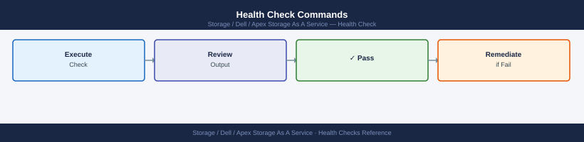

---
tags:
  - dell
  - operations
description: "APEX STaaS health checks: CloudIQ health score review, capacity threshold alerts, latency trending, and dcicli command verification from SCG."
---
# APEX Storage as a Service — Health Checks

<div class="kb-summary">
APEX STaaS health checks: CloudIQ health score review, capacity threshold alerts, latency trending, and `dcicli` command verification from SCG.

*Applies to: APEX Storage-as-a-Service*
</div>

## Before you begin

- **Access:** Storage admin credentials (cluster admin or equivalent)
- **Timing:** safe to run during business hours unless a step is marked ⚠ (causes interruption)
- **Dependencies:** no active upgrades or migrations on the same infrastructure
- **Logging:** capture command output — paste into the change record on completion

---

## Run This Routine

1. **Service health:** APEX Console → Services — all services Active
2. **Capacity consumption:** APEX Console → Consumption — check against committed capacity
3. **Performance metrics:** review IOPS and latency trends in APEX Console
4. **Support case status:** check any open support cases related to service health
5. **Billing alerts:** review any billing or consumption threshold alerts
6. **SLA compliance:** verify uptime metrics meet contracted SLA in APEX Console
7. **Data protection status:** verify snapshots and replication are completing per schedule

---

## Daily Checks


| Check | Command | Notes |
|---|---|---|
| [ ] Log in to the Dell APEX console and review the Dashboard for any active service alerts | | |
| [ ] Check current committed vs. consumed capacity | | flag if consumed capacity exceeds 80% of the contracted amount |
| [ ] Confirm all APEX systems are showing healthy in CloudIQ | | health score >= 80 |
| [ ] Confirm no Dell-scheduled maintenance windows are active or pending | | |

## Health Check Commands



```bash
# Authenticate to Dell APEX API
APEX_TOKEN="<your_apex_api_token>"
APEX_BASE="https://apigw.dell.com/apex/v1"

# List all APEX storage systems and their health scores
curl -s -H "Authorization: Bearer ${APEX_TOKEN}" \
  "${APEX_BASE}/storage-systems" | \
  jq '.results[] | {name: .name, health_score: .health_score, status: .status, type: .type}'

# Check capacity consumed vs contracted for each system
curl -s -H "Authorization: Bearer ${APEX_TOKEN}" \
  "${APEX_BASE}/storage-systems" | \
  jq '.results[] | {name: .name, contracted_tb: .contracted_capacity_tb, consumed_tb: .consumed_capacity_tb, percent_consumed: (.consumed_capacity_tb / .contracted_capacity_tb * 100)}'

# Check for any active alerts on APEX systems via CloudIQ API
CLOUDIQ_TOKEN="<your_cloudiq_api_token>"
curl -s -H "Authorization: Bearer ${CLOUDIQ_TOKEN}" \
  "https://apigw.dell.com/cloudiq/v1/alerts?filter=state%20eq%20%22ACTIVE%22" | \
  jq '.results[] | select(.severity == "CRITICAL") | {resource: .resource_name, description: .description}'
```


```text title="Expected output"
{
  "name": "APEX-SYS-001",
  "health_score": 95,
  "status": "HEALTHY",
  "type": "PowerFlex"
}
{
  "name": "APEX-SYS-002",
  "health_score": 87,
  "status": "HEALTHY",
  "type": "PowerStore"
}
{
  "name": "APEX-SYS-003",
  "health_score": 72,
  "status": "DEGRADED",
  "type": "Unity"
}
{
  "name": "APEX-SYS-001",
  "contracted_tb": 500,
  "consumed_tb": 385.2,
  "percent_consumed": 77.04
}
{
  "name": "APEX-SYS-002",
  "contracted_tb": 1000,
  "consumed_tb": 642.8,
  "percent_consumed": 64.28
}
{
  "name": "APEX-SYS-003",
  "contracted_tb": 250,
  "consumed_tb": 248.5,
  "percent_consumed": 99.4
}
{
  "resource": "APEX-SYS-003-NODE-04",
  "description": "Drive failure detected on enclosure 2, slot 8"
}
{
  "resource": "APEX-SYS-001-CONTROLLER-B",
  "description": "Controller temperature threshold exceeded"
}
```

!!! warning "Common errors"
    **`curl: (401) Unauthorized`** — Verify the APEX_TOKEN and CLOUDIQ_TOKEN are valid and not expired by regenerating them in the Dell APEX console.
    **`jq: error (at <stdin>:1): Cannot index null with string "results"`** — Confirm the API endpoint URLs are correct and the API gateway is reachable; check for typos in APEX_BASE and CloudIQ URLs.
## Change Readiness

- [ ] Contracted capacity headroom is sufficient for the planned workload increase (consumed < 80% of contracted)
- [ ] The current SLA tier is appropriate for the planned workload's performance requirements
- [ ] Check the APEX console for any Dell-scheduled maintenance windows that overlap with the planned change
- [ ] If the workload increase is expected to exceed contracted capacity, contact Dell account team before the change to initiate a contract amendment
- [ ] Confirm CloudIQ is reporting the APEX system as healthy before proceeding

## Post-Change Validation


- [ ] APEX system health score in CloudIQ has returned to the pre-change baseline (>= 80)
- [ ] No new CRITICAL alerts generated after the change
- [ ] Capacity consumption is within the expected range — no unexpected increase
- [ ] SLA tier remains appropriate and IOPS commitments are being met
- [ ] SCG is reporting the APEX system as CONNECTED
- [ ] Application owners confirm no user-visible impact following the change

---

## Verify

- Confirm the operation completed without errors in the log or management UI
- Verify the expected state change is visible (service running, object created, config applied)
- Document the outcome in the change record

---

## See also

- [Apex Storage As A Service — Procedures](../procedures/)
- [Apex Storage As A Service — CLI Reference](../cli-reference/)
- [Apex Storage As A Service — Common Issues](../../troubleshooting/common-issues/)
