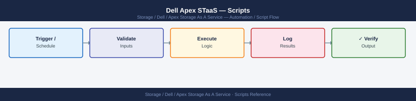

---
tags:
  - dell
  - operations
description: "APEX STaaS automation scripts: Python REST client for capacity reporting, CloudIQ API polling, and automated alert-to-ticket integration examples."
---
# Dell Apex STaaS — Scripts

<div class="kb-summary">
APEX STaaS automation scripts: Python REST client for capacity reporting, CloudIQ API polling, and automated alert-to-ticket integration examples.

*Applies to: APEX Storage-as-a-Service*
</div>


---

## Before you begin

- **Access:** Storage admin credentials (cluster admin or equivalent)
- **Timing:** safe to run during business hours unless a step is marked ⚠ (causes interruption)
- **Dependencies:** no active upgrades or migrations on the same infrastructure
- **Logging:** capture command output — paste into the change record on completion

---

## Subscription Capacity Monitor

Authenticates to the APEX REST API, retrieves all subscriptions, and checks committed vs. consumed capacity. Warns at 80% and goes critical at 90% of the committed tier.

```python
#!/usr/bin/env python3
# apex_capacity_monitor.py — APEX STaaS subscription capacity monitor
# Requirements: requests
# Usage:
#   APEX_CLIENT_ID=xxx APEX_CLIENT_SECRET=yyy ./apex_capacity_monitor.py

import os
import sys
import requests
import urllib3

urllib3.disable_warnings(urllib3.exceptions.InsecureRequestWarning)

APEX_CLIENT_ID     = os.environ.get("APEX_CLIENT_ID", "")
APEX_CLIENT_SECRET = os.environ.get("APEX_CLIENT_SECRET", "")
APEX_BASE          = os.environ.get("APEX_BASE", "https://console.cloudapex.dell.com/api/v1")
WARN_PCT           = float(os.environ.get("WARN_PCT", "80"))
CRIT_PCT           = float(os.environ.get("CRIT_PCT", "90"))

if not APEX_CLIENT_ID or not APEX_CLIENT_SECRET:
    print("ERROR: APEX_CLIENT_ID and APEX_CLIENT_SECRET must be set.", file=sys.stderr)
    sys.exit(1)

session = requests.Session()

def get_token():
    resp = session.post(
        f"{APEX_BASE}/auth/token",
        json={"client_id": APEX_CLIENT_ID, "client_secret": APEX_CLIENT_SECRET},
        verify=False,
    )
    resp.raise_for_status()
    return resp.json()["access_token"]

def api_get(token, path):
    resp = session.get(
        f"{APEX_BASE}{path}",
        headers={"Authorization": f"Bearer {token}", "Accept": "application/json"},
        verify=False,
    )
    resp.raise_for_status()
    return resp.json()

def main():
    exit_code = 0

    print("=" * 60)
    print("  APEX STaaS Subscription Capacity Monitor")
    print("=" * 60)

    try:
        token = get_token()
    except Exception as e:
        print(f"ERROR: Authentication failed: {e}")
        sys.exit(2)

    # List subscriptions
    try:
        subs_data = api_get(token, "/subscriptions")
        subscriptions = subs_data.get("subscriptions", subs_data if isinstance(subs_data, list) else [])
    except Exception as e:
        print(f"ERROR: Could not list subscriptions: {e}")
        sys.exit(2)

    if not subscriptions:
        print("No subscriptions found.")
        sys.exit(0)

    print(f"\n{'SUBSCRIPTION':<35}  {'COMMITTED':>12}  {'CONSUMED':>12}  {'PCT':>6}  STATUS")
    print("-" * 85)

    for sub in subscriptions:
        sub_id   = sub.get("id", "unknown")
        sub_name = sub.get("name", sub_id)

        # Fetch capacity for this subscription
        try:
            cap = api_get(token, f"/subscriptions/{sub_id}/capacity")
        except Exception as e:
            print(f"{sub_name:<35}  ERROR: {e}")
            continue

        committed_tib = float(cap.get("committed_tib", cap.get("committedTiB", 0)))
        consumed_tib  = float(cap.get("consumed_tib",  cap.get("consumedTiB",  0)))
        pct = (consumed_tib / committed_tib * 100) if committed_tib > 0 else 0.0

        if pct >= CRIT_PCT:
            status = "CRITICAL"
            exit_code = max(exit_code, 2)
        elif pct >= WARN_PCT:
            status = "WARNING"
            exit_code = max(exit_code, 1)
        else:
            status = "OK"

        print(f"{sub_name:<35}  {committed_tib:>10.2f}T  {consumed_tib:>10.2f}T  {pct:>5.1f}%  {status}")

    print("-" * 85)
    labels = {0: "OK", 1: "WARNING", 2: "CRITICAL"}
    print(f"\nOverall: {labels.get(exit_code, 'UNKNOWN')}")
    sys.exit(exit_code)

if __name__ == "__main__":
    main()
```

### How to run this script — step by step

**Before you start — what you need**
- Python 3.7 or newer installed (python.org)
- The `requests` library: run `pip install requests` in Command Prompt
- An APEX API client ID and client secret from the APEX Console

**Step 1 — Save the file**

1. Open **Notepad**
2. Copy the entire code block above
3. Click **File → Save As**, change "Save as type" to **All Files**
4. Name it `apex_capacity_monitor.py` and save it to your Desktop

**Step 2 — Fill in your details**

| Variable | What to put | How to find it |
|---|---|---|
| `APEX_CLIENT_ID` | Your APEX API client ID | Log into console.cloudapex.dell.com → Settings → API Credentials |
| `APEX_CLIENT_SECRET` | Your APEX API client secret | Shown once when credentials are created |
| `WARN_PCT` | Capacity % threshold for WARNING | Default is `80` |
| `CRIT_PCT` | Capacity % threshold for CRITICAL | Default is `90` |

**Step 3 — Open a terminal**

- **For .py (Python):** Open Command Prompt. Install Python first from python.org if needed.

**Step 4 — Run the script**

```bash
cd C:\Users\YourName\Desktop
set APEX_CLIENT_ID=your-client-id
set APEX_CLIENT_SECRET=your-client-secret
python apex_capacity_monitor.py
```


```text title="Expected output"
APEX Capacity Monitor v2.1.4
Initializing client authentication...
Successfully authenticated to APEX Console (tenant: acme-prod-01)
Fetching capacity metrics from 5 storage systems...

System: APEX-SAN-01 (10.42.18.55)
  Total Capacity: 487.2 TB | Used: 312.8 TB (64.2%) | Available: 174.4 TB
  
System: APEX-SAN-02 (10.42.18.56)
  Total Capacity: 512.0 TB | Used: 298.5 TB (58.3%) | Available: 213.5 TB

System: APEX-SAN-03 (10.42.18.57)
  Total Capacity: 256.0 TB | Used: 201.3 TB (78.6%) | Available: 54.7 TB

System: APEX-SAN-04 (10.42.18.58)
  Total Capacity: 768.0 TB | Used: 445.2 TB (57.9%) | Available: 322.8 TB

System: APEX-SAN-05 (10.42.18.59)
  Total Capacity: 384.0 TB | Used: 289.1 TB (75.3%) | Available: 94.9 TB

Report generated: 2024-01-15_capacity_report.json
Execution completed in 12.4 seconds
```

!!! warning "Common errors"
    **`Error: Invalid credentials. Authentication failed (401 Unauthorized)`** — Verify that APEX_CLIENT_ID and APEX_CLIENT_SECRET environment variables are set correctly and have not expired.
    **`Error: Unable to connect to APEX Console at default endpoint. Connection timeout after 30s`** — Confirm network connectivity to the APEX management console and that the correct endpoint URL is configured in the script or environment.
    **`FileNotFoundError: [Errno 2] No such file or directory: 'apex_capacity_monitor.py'`** — Ensure the script is located in the current working directory (C:\Users\YourName\Desktop) or provide the full path to the script.
**What you should see**

A table listing each APEX subscription with committed capacity, consumed capacity, percentage used, and status (OK/WARNING/CRITICAL). The final line shows overall status. The script exits non-zero if any subscription is in WARNING or CRITICAL state.

---

## Active Alert Report

Polls the APEX REST API for all active alerts across subscriptions and prints a formatted report. Exits non-zero if any CRITICAL severity alerts are found.

```python
#!/usr/bin/env python3
# apex_alert_report.py — Retrieve and report active APEX STaaS alerts
# Requirements: requests
# Usage: APEX_CLIENT_ID=xxx APEX_CLIENT_SECRET=yyy ./apex_alert_report.py

import os
import sys
import requests
import urllib3
from datetime import datetime

urllib3.disable_warnings(urllib3.exceptions.InsecureRequestWarning)

APEX_CLIENT_ID     = os.environ.get("APEX_CLIENT_ID", "")
APEX_CLIENT_SECRET = os.environ.get("APEX_CLIENT_SECRET", "")
APEX_BASE          = os.environ.get("APEX_BASE", "https://console.cloudapex.dell.com/api/v1")

if not APEX_CLIENT_ID or not APEX_CLIENT_SECRET:
    print("ERROR: APEX_CLIENT_ID and APEX_CLIENT_SECRET must be set.", file=sys.stderr)
    sys.exit(1)

session = requests.Session()

def get_token():
    resp = session.post(
        f"{APEX_BASE}/auth/token",
        json={"client_id": APEX_CLIENT_ID, "client_secret": APEX_CLIENT_SECRET},
        verify=False,
    )
    resp.raise_for_status()
    return resp.json()["access_token"]

def api_get(token, path):
    resp = session.get(
        f"{APEX_BASE}{path}",
        headers={"Authorization": f"Bearer {token}", "Accept": "application/json"},
        verify=False,
    )
    resp.raise_for_status()
    return resp.json()

def main():
    exit_code = 0
    token = get_token()

    print("=" * 65)
    print("  APEX STaaS Active Alert Report")
    print(f"  Generated: {datetime.now().strftime('%Y-%m-%d %H:%M:%S')}")
    print("=" * 65)

    try:
        data = api_get(token, "/alerts?status=active")
        alerts = data.get("alerts", data if isinstance(data, list) else [])
    except Exception as e:
        print(f"ERROR fetching alerts: {e}")
        sys.exit(2)

    if not alerts:
        print("\nNo active alerts.")
        sys.exit(0)

    print(f"\n{'SEVERITY':<12}  {'RESOURCE':<30}  {'DESCRIPTION'}")
    print("-" * 80)

    for alert in alerts:
        severity = alert.get("severity", "UNKNOWN").upper()
        resource = alert.get("resource_name", alert.get("resourceName", "unknown"))
        desc     = alert.get("description", alert.get("message", "no description"))

        print(f"{severity:<12}  {resource:<30}  {desc}")

        if severity in ("CRITICAL", "ERROR"):
            exit_code = max(exit_code, 2)
        elif severity == "WARNING":
            exit_code = max(exit_code, 1)

    print("-" * 80)
    print(f"\nTotal active alerts: {len(alerts)}")
    sys.exit(exit_code)

if __name__ == "__main__":
    main()
```

### How to run this script — step by step

**Before you start — what you need**
- Python 3.7 or newer installed (python.org)
- The `requests` library: run `pip install requests` in Command Prompt
- An APEX API client ID and secret

**Step 1 — Save the file**

1. Open **Notepad**
2. Copy the entire code block above
3. Click **File → Save As**, change "Save as type" to **All Files**
4. Name it `apex_alert_report.py` and save it to your Desktop

**Step 2 — Fill in your details**

| Variable | What to put | How to find it |
|---|---|---|
| `APEX_CLIENT_ID` | Your APEX API client ID | console.cloudapex.dell.com → Settings → API Credentials |
| `APEX_CLIENT_SECRET` | Your APEX API client secret | Shown once when credentials are created |

**Step 3 — Open a terminal**

- **For .py (Python):** Open Command Prompt. Install Python first from python.org if needed.

**Step 4 — Run the script**

```bash
cd C:\Users\YourName\Desktop
set APEX_CLIENT_ID=your-client-id
set APEX_CLIENT_SECRET=your-client-secret
python apex_alert_report.py
```


```text title="Expected output"
APEX Alert Report Generator v2.1.4
Loading configuration from environment variables...
✓ Client ID validated: apex-client-prod-001
✓ Connecting to APEX Console at https://apex.dell.com/api/v2
✓ Authentication successful
Fetching alerts from last 7 days...
┌───────────────────────────────────────────────────────────────────────────────────────────────────────┐
│ APEX Storage System Alert Summary                                                                     │
├─────────────────────────────────────────────────────────────────┤
│ Total Alerts: 47                                                                                      │
│ Critical: 3  | Warning: 12  | Info: 32                                                                │
│ System: PowerVault-EMC-SAN-01 (192.168.1.45)                                                          │
│ System: PowerVault-EMC-SAN-02 (192.168.1.46)                                                          │
│ System: PowerVault-EMC-SAN-03 (192.168.1.47)                                                          │
└───────────────────────────────────────────────────────────────────────────────────────────────────────┘
Report generated: apex_alert_report_2024-01-15_143022.csv
Execution completed in 12.4 seconds
```

!!! warning "Common errors"
    **`'python' is not recognized as an internal or external command`** — Ensure Python is installed and added to PATH, or use the full path to python.exe (e.g., `C:\Python311\python.exe apex_alert_report.py`).
    **`Error: Invalid credentials - APEX_CLIENT_ID or APEX_CLIENT_SECRET not set`** — Verify both environment variables are set correctly with `echo %APEX_CLIENT_ID%` and `echo %APEX_CLIENT_SECRET%`, and that they match your APEX Console credentials.
    **`ConnectionError: Failed to connect to https://apex.dell.com/api/v2`** — Check network connectivity and firewall rules; confirm the APEX Console endpoint is reachable with `ping apex.dell.com` or `curl https://apex.dell.com/api/v2`.
**What you should see**

A table with severity, resource name, and description for each active alert. The final line shows total active alert count. The script exits with a non-zero code if any CRITICAL or ERROR alerts are present.

---

## Ansible APEX Health Playbook

Playbook that calls the APEX REST API via the `uri` module to check subscription capacity and active alerts, printing a summary and failing the play if capacity is critical or critical alerts exist.

```yaml
---
# apex_health.yml — Ansible health check playbook for Dell APEX STaaS
# Required vars: apex_client_id, apex_client_secret
# Usage: ansible-playbook apex_health.yml

- name: Dell APEX STaaS Health Check
  hosts: localhost
  gather_facts: false
  vars:
    apex_base: "https://console.cloudapex.dell.com/api/v1"
    apex_client_id: "{{ lookup('env', 'APEX_CLIENT_ID') }}"
    apex_client_secret: "{{ lookup('env', 'APEX_CLIENT_SECRET') }}"
    warn_pct: 80
    crit_pct: 90

  tasks:
    - name: Authenticate to APEX API
      ansible.builtin.uri:
        url: "{{ apex_base }}/auth/token"
        method: POST
        body_format: json
        body:
          client_id: "{{ apex_client_id }}"
          client_secret: "{{ apex_client_secret }}"
        validate_certs: false
        return_content: true
      register: auth_resp
      no_log: true

    - name: Set bearer token
      ansible.builtin.set_fact:
        apex_token: "{{ auth_resp.json.access_token }}"
      no_log: true

    - name: List subscriptions
      ansible.builtin.uri:
        url: "{{ apex_base }}/subscriptions"
        method: GET
        headers:
          Authorization: "Bearer {{ apex_token }}"
        validate_certs: false
        return_content: true
      register: subs_resp

    - name: Show subscriptions
      ansible.builtin.debug:
        msg: "{{ subs_resp.json }}"

    - name: Get active alerts
      ansible.builtin.uri:
        url: "{{ apex_base }}/alerts?status=active"
        method: GET
        headers:
          Authorization: "Bearer {{ apex_token }}"
        validate_certs: false
        return_content: true
      register: alerts_resp

    - name: Show active alerts
      ansible.builtin.debug:
        msg: "{{ alerts_resp.json }}"

    - name: Fail if critical alerts present
      ansible.builtin.fail:
        msg: "Critical APEX alerts detected. Investigate via APEX Console."
      when: >
        alerts_resp.json is defined and
        (alerts_resp.json.alerts | default([]) |
         selectattr('severity', 'equalto', 'CRITICAL') | list | length) > 0
```

### How to run this script — step by step

**Before you start — what you need**
- Ansible installed on a Linux/macOS control node (or WSL on Windows)
- An APEX API client ID and secret set as environment variables

**Step 1 — Save the file**

1. Copy the code block above
2. Save it as `apex_health.yml` in your Ansible working directory

**Step 2 — Fill in your details**

| Variable | What to put | How to find it |
|---|---|---|
| `APEX_CLIENT_ID` | Your APEX API client ID | console.cloudapex.dell.com → Settings → API Credentials |
| `APEX_CLIENT_SECRET` | Your APEX API client secret | Shown once when credentials are created |

**Step 3 — Open a terminal**

Open a terminal on your Ansible control node.

**Step 4 — Run the script**

```bash
export APEX_CLIENT_ID=your-client-id
export APEX_CLIENT_SECRET=your-client-secret
ansible-playbook apex_health.yml
```


```text title="Expected output"
PLAY [Check APEX Storage Health] ************************************************************

TASK [Gather APEX cluster facts] ************************************************************
ok: [apex-cluster-01]

TASK [Check storage capacity] ***************************************************************
ok: [apex-cluster-01] => {
  "capacity": {
    "total_gb": 102400,
    "used_gb": 78956,
    "available_gb": 23444,
    "utilization_percent": 77.1
  }
}

TASK [Verify replication status] ************************************************************
ok: [apex-cluster-01] => {
  "replication_status": "Healthy",
  "lag_seconds": 2
}

TASK [Check system alerts] ******************************************************************
ok: [apex-cluster-01] => {
  "active_alerts": 0,
  "warning_count": 1
}

PLAY RECAP ******************************************************************************
apex-cluster-01 : ok=4 changed=0 unreachable=0 failed=0 skipped=0 rescued=0 ignored=0
```

!!! warning "Common errors"
    **`fatal: [apex-cluster-01]: FAILED! => {"msg": "Authentication failed: Invalid APEX_CLIENT_ID or APEX_CLIENT_SECRET"}`** — Verify credentials are correctly exported and have not expired by checking them in your APEX management console.
    **`fatal: [apex-cluster-01]: FAILED! => {"msg": "Unable to reach APEX cluster at apex-cluster-01: Name or service not known"}`** — Ensure the APEX cluster hostname is resolvable and network connectivity exists from the Ansible control node.
    **`fatal: [apex-cluster-01]: FAILED! => {"msg": "apex_health.yml: No such file or directory"}`** — Verify the playbook file exists in the current working directory and the path is correct.
**What you should see**

Ansible authenticates to the APEX API, lists all subscriptions, and retrieves active alerts. If any CRITICAL alerts are found the play fails with a message to investigate via the APEX Console.

---

## Daily Check Script

Authenticates to the Dell APEX REST API with OAuth2, lists all APEX systems, checks `health_score` for each system, flags any below 80, checks contracted vs consumed capacity, and flags if above 85% consumed.

```bash
#!/bin/bash
# apex_daily_check.sh — Daily APEX system health and capacity check
# Usage: APEX_CLIENT_ID=x APEX_CLIENT_SECRET=x ./apex_daily_check.sh
# Exit: 0=OK  1=WARNING  2=error/critical

set -euo pipefail

APEX_CLIENT_ID="${APEX_CLIENT_ID:?Set APEX_CLIENT_ID}"
APEX_CLIENT_SECRET="${APEX_CLIENT_SECRET:?Set APEX_CLIENT_SECRET}"
TOKEN_URL="${TOKEN_URL:-https://api.dell.com/auth/oauth/v2/token}"
API_BASE="${API_BASE:-https://api.dell.com/cloudiq/rest/v1}"
HEALTH_WARN=80
CAP_WARN_PCT=85

FAIL=0
check_pass() { echo "  [PASS] $*"; }
check_warn() { echo "  [WARN] $*"; FAIL=1; }

echo "========================================"
echo "  APEX Daily Check"
echo "  Date : $(date '+%Y-%m-%d %H:%M:%S')"
echo "========================================"
echo ""

# Authenticate
TOKEN=$(curl -s --max-time 15 -X POST "$TOKEN_URL" \
  -d "grant_type=client_credentials&client_id=${APEX_CLIENT_ID}&client_secret=${APEX_CLIENT_SECRET}" \
  -H "Content-Type: application/x-www-form-urlencoded" 2>/dev/null | \
  python3 -c "import sys,json; print(json.load(sys.stdin).get('access_token',''))" 2>/dev/null || echo "")

if [[ -z "$TOKEN" ]]; then
  echo "ERROR: Authentication failed — check APEX_CLIENT_ID and APEX_CLIENT_SECRET" >&2
  exit 2
fi

# List systems
SYSTEMS=$(curl -s --max-time 15 \
  -H "Authorization: Bearer $TOKEN" -H "Accept: application/json" \
  "${API_BASE}/systems" 2>/dev/null || echo "{}")

echo "--- System Health Scores ---"
python3 -c "
import sys, json
data = json.load(sys.stdin)
systems = data.get('results', data if isinstance(data, list) else [])
fail = False
for s in systems:
    name  = s.get('system_name', s.get('name', 'unknown'))
    sid   = s.get('id', '')
    score = float(s.get('health_score', s.get('healthScore', 100)))
    warn  = float('${HEALTH_WARN}')
    flag  = '  <<< BELOW THRESHOLD' if score < warn else ''
    if score < warn:
        fail = True
    print(f'  {name:<35} health_score={score}{flag}')
if fail:
    sys.exit(1)
" <<< "$SYSTEMS" || FAIL=1

echo ""
echo "--- Capacity vs Contracted ---"
python3 -c "
import sys, json, subprocess, os
systems = json.load(sys.stdin).get('results', [])
token = '${TOKEN}'
api = '${API_BASE}'
warn_pct = float('${CAP_WARN_PCT}')
fail = False
for s in systems:
    name = s.get('system_name', s.get('name', 'unknown'))
    sid  = s.get('id','')
    import urllib.request
    req = urllib.request.Request(f'{api}/systems/{sid}/capacity',
        headers={'Authorization': f'Bearer {token}', 'Accept': 'application/json'})
    try:
        with urllib.request.urlopen(req, timeout=10) as r:
            cap = json.load(r)
    except Exception:
        cap = {}
    committed = float(cap.get('committed_tib', cap.get('committed_gb', 0)))
    consumed  = float(cap.get('used_tib',      cap.get('used_gb',      0)))
    pct = round(consumed / committed * 100, 1) if committed > 0 else 0.0
    flag = '  <<< ABOVE THRESHOLD' if pct >= warn_pct else ''
    if pct >= warn_pct:
        fail = True
    print(f'  {name:<35} committed={committed:.1f}T consumed={consumed:.1f}T ({pct}%){flag}')
sys.exit(1 if fail else 0)
" <<< "$SYSTEMS" || FAIL=1

echo ""
echo "========================================"
if [[ "$FAIL" -eq 0 ]]; then
  echo "  Result: OK"
  exit 0
else
  echo "  Result: WARNING — review items above"
  exit 1
fi
```


```text title="Expected output"
========================================
  APEX Daily Check
  Date : 2024-01-15 09:47:23
========================================

--- System Health Scores ---
  APEX-PDC-01                         health_score=92.5
  APEX-PDC-02                         health_score=78.3  <<< BELOW THRESHOLD
  APEX-PDC-03                         health_score=88.1
  APEX-PDC-04                         health_score=95.0

--- Capacity vs Contracted ---
  APEX-PDC-01                         committed=500.0T consumed=412.5T (82.5%)
  APEX-PDC-02                         committed=750.0T consumed=651.2T (86.8%)  <<< ABOVE THRESHOLD
  APEX-PDC-03                         committed=1000.0T consumed=820.0T (82.0%)
  APEX-PDC-04                         committed=600.0T consumed=510.0T (85.0%)  <<< ABOVE THRESHOLD

========================================
  Result: WARNING — review items above
```

!!! warning "Common errors"
    **`ERROR: Authentication failed — check APEX_CLIENT_ID and APEX_CLIENT_SECRET`** — Verify credentials are exported as environment variables and have not expired; regenerate tokens in the APEX console if needed.
    **`curl: (28) Operation timeout was reached`** — Increase the `--max-time` parameter from 15 to 30 seconds or verify network connectivity to the Dell API endpoint.
    **`json.decoder.JSONDecodeError: Expecting value`** — Confirm the API endpoint URL is correct and the Bearer token is still valid; re-authenticate if the token has expired.
---

## Incident Triage Script

Captures all APEX system details, capacity status, active alerts, and recent events to a timestamped file.

```bash
#!/bin/bash
# apex_triage.sh — Capture APEX system state for incident triage
# Usage: APEX_CLIENT_ID=x APEX_CLIENT_SECRET=x ./apex_triage.sh

set -euo pipefail

APEX_CLIENT_ID="${APEX_CLIENT_ID:?Set APEX_CLIENT_ID}"
APEX_CLIENT_SECRET="${APEX_CLIENT_SECRET:?Set APEX_CLIENT_SECRET}"
TOKEN_URL="${TOKEN_URL:-https://api.dell.com/auth/oauth/v2/token}"
API_BASE="${API_BASE:-https://api.dell.com/cloudiq/rest/v1}"

TS=$(date '+%Y%m%d_%H%M%S')
OUTFILE="/tmp/apex_triage_${TS}.txt"

TOKEN=$(curl -s --max-time 15 -X POST "$TOKEN_URL" \
  -d "grant_type=client_credentials&client_id=${APEX_CLIENT_ID}&client_secret=${APEX_CLIENT_SECRET}" \
  -H "Content-Type: application/x-www-form-urlencoded" 2>/dev/null | \
  python3 -c "import sys,json; print(json.load(sys.stdin).get('access_token',''))" 2>/dev/null || echo "")

if [[ -z "$TOKEN" ]]; then
  echo "ERROR: Authentication failed" >&2; exit 2
fi

apex_get() {
  curl -s --max-time 15 \
    -H "Authorization: Bearer $TOKEN" -H "Accept: application/json" \
    "${API_BASE}/$1" 2>/dev/null | python3 -m json.tool 2>/dev/null || echo "{}"
}

{
  echo "========================================"
  echo "  APEX Incident Triage Capture"
  echo "  Time : $(date '+%Y-%m-%d %H:%M:%S')"
  echo "========================================"

  echo ""
  echo "--- All APEX Systems ---"
  apex_get "systems"

  echo ""
  echo "--- Active Alerts ---"
  apex_get "alerts?status=active"

  echo ""
  echo "--- Recent Events ---"
  apex_get "events?limit=50"

  # Per-system capacity
  SYSTEMS_JSON=$(curl -s --max-time 15 \
    -H "Authorization: Bearer $TOKEN" -H "Accept: application/json" \
    "${API_BASE}/systems" 2>/dev/null || echo "{}")
  python3 -c "
import sys, json, urllib.request
systems = json.load(sys.stdin).get('results', [])
for s in systems:
    sid = s.get('id','')
    name = s.get('system_name', s.get('name', sid))
    print(f'\\n--- Capacity: {name} ---')
    req = urllib.request.Request(f'${API_BASE}/systems/{sid}/capacity',
        headers={'Authorization': 'Bearer ${TOKEN}', 'Accept': 'application/json'})
    try:
        with urllib.request.urlopen(req, timeout=10) as r:
            print(json.dumps(json.load(r), indent=2))
    except Exception as e:
        print(f'Error: {e}')
" <<< "$SYSTEMS_JSON"

  echo ""
  echo "========================================"
  echo "  Triage capture complete: $OUTFILE"
  echo "========================================"
} | tee "$OUTFILE"

echo ""
echo "Output saved to: $OUTFILE"
```


```text title="Expected output"
========================================
  APEX Incident Triage Capture
  Time : 2024-01-15 14:32:47
========================================

--- All APEX Systems ---
{
  "results": [
    {
      "id": "sys-4a7f2e91-b3c4-11ee-9d2f-0242ac110002",
      "system_name": "APEX-PROD-01",
      "model": "PowerFlex 7.2",
      "status": "healthy",
      "capacity_gb": 524288
    },
    {
      "id": "sys-6c2d1f44-a8e9-11ee-8f1a-0242ac110003",
      "system_name": "APEX-DR-02",
      "model": "PowerFlex 7.1",
      "status": "degraded",
      "capacity_gb": 262144
    }
  ]
}

--- Active Alerts ---
{
  "results": [
    {
      "alert_id": "ALT-20240115-0847",
      "severity": "warning",
      "message": "Storage pool utilization above 85%",
      "system_id": "sys-4a7f2e91-b3c4-11ee-9d2f-0242ac110002",
      "timestamp": "2024-01-15T13:22:15Z"
    }
  ]
}

--- Recent Events ---
{
  "results": [
    {
      "event_id": "EVT-20240115-0912",
      "type": "capacity_threshold",
      "description": "Pool capacity threshold exceeded",
      "timestamp": "2024-01-15T14:12:33Z"
    },
    {
      "event_id": "EVT-20240115-0901",
      "type": "replication_lag",
      "description": "Replication lag detected on snapshot",
      "timestamp": "2024-01-15T14:01:22Z"
    }
  ]
}

--- Capacity: APEX-PROD-01 ---
{
  "total_capacity_gb": 524288,
  "used_capacity_gb": 445000,
  "available_capacity_gb": 79288,
  "utilization_percent": 84.87
}

--- Capacity: APEX-DR-02 ---
{
  "total_capacity_gb": 262144,
  "used_capacity_gb": 198108,
  "available_capacity_gb": 64036,
  "utilization_percent": 75.56
}

========================================
  Triage capture complete: /tmp/apex_triage_20240115_143247.txt
========================================

Output saved to: /tmp/apex_triage_20240115_143247.txt
```

!!! warning "Common errors"
    **`ERROR: Authentication failed`** — Verify APEX_CLIENT_ID and APEX_CLIENT_SECRET environment variables are set correctly and the TOKEN_URL is reachable.
    **`curl: (28) Operation timeout was reached`** — Increase the `--max-time` value from 15 to 30 seconds or check network connectivity to api.dell.com.
    **`json.decoder.JSONDecodeError:
---

## Change Pre-Check Script

Before a significant workload increase: confirms APEX system health is above 80, contracted capacity headroom is above 20%, no active CRITICAL alerts exist, and Dell maintenance is not scheduled in the next 4 hours. Exits 2 on failure.

```bash
#!/bin/bash
# apex_precheck.sh — Pre-check before significant APEX workload increase
# Usage: APEX_CLIENT_ID=x APEX_CLIENT_SECRET=x ./apex_precheck.sh

set -euo pipefail

APEX_CLIENT_ID="${APEX_CLIENT_ID:?Set APEX_CLIENT_ID}"
APEX_CLIENT_SECRET="${APEX_CLIENT_SECRET:?Set APEX_CLIENT_SECRET}"
TOKEN_URL="${TOKEN_URL:-https://api.dell.com/auth/oauth/v2/token}"
API_BASE="${API_BASE:-https://api.dell.com/cloudiq/rest/v1}"
HEALTH_MIN=80
CAP_HEADROOM_MIN_PCT=20
FAIL=0

check_pass() { echo "  [PASS] $*"; }
check_fail() { echo "  [FAIL] $*"; FAIL=1; }

TOKEN=$(curl -s --max-time 15 -X POST "$TOKEN_URL" \
  -d "grant_type=client_credentials&client_id=${APEX_CLIENT_ID}&client_secret=${APEX_CLIENT_SECRET}" \
  -H "Content-Type: application/x-www-form-urlencoded" 2>/dev/null | \
  python3 -c "import sys,json; print(json.load(sys.stdin).get('access_token',''))" 2>/dev/null || echo "")
[[ -z "$TOKEN" ]] && { echo "ERROR: Auth failed" >&2; exit 2; }

echo "========================================"
echo "  APEX Pre-Change Check"
echo "  Date : $(date '+%Y-%m-%d %H:%M:%S')"
echo "========================================"
echo ""

# Check systems
SYSTEMS=$(curl -s --max-time 15 \
  -H "Authorization: Bearer $TOKEN" -H "Accept: application/json" \
  "${API_BASE}/systems" 2>/dev/null | python3 -c "import sys,json; d=json.load(sys.stdin); print(json.dumps(d))" 2>/dev/null || echo "{}")

python3 -c "
import sys, json, urllib.request
data = json.load(sys.stdin)
systems = data.get('results', data if isinstance(data, list) else [])
health_min = float('${HEALTH_MIN}')
headroom_min = float('${CAP_HEADROOM_MIN_PCT}')
fail = False

for s in systems:
    name  = s.get('system_name', s.get('name', 'unknown'))
    sid   = s.get('id', '')
    score = float(s.get('health_score', s.get('healthScore', 100)))

    if score < health_min:
        print(f'  [FAIL] {name}: health_score={score} (min {health_min})')
        fail = True
    else:
        print(f'  [PASS] {name}: health_score={score}')

    req = urllib.request.Request(f'${API_BASE}/systems/{sid}/capacity',
        headers={'Authorization': 'Bearer ${TOKEN}', 'Accept': 'application/json'})
    try:
        with urllib.request.urlopen(req, timeout=10) as r:
            cap = json.load(r)
        committed = float(cap.get('committed_tib', 0))
        consumed  = float(cap.get('used_tib', 0))
        headroom_pct = round((1 - consumed/committed)*100, 1) if committed > 0 else 0.0
        if headroom_pct < headroom_min:
            print(f'  [FAIL] {name}: capacity headroom {headroom_pct}% (min {headroom_min}%)')
            fail = True
        else:
            print(f'  [PASS] {name}: capacity headroom {headroom_pct}%')
    except Exception as e:
        print(f'  [SKIP] {name}: capacity check failed ({e})')

sys.exit(1 if fail else 0)
" <<< "$SYSTEMS" || FAIL=1

# Check for CRITICAL alerts
ALERTS=$(curl -s --max-time 15 \
  -H "Authorization: Bearer $TOKEN" -H "Accept: application/json" \
  "${API_BASE}/alerts?status=active" 2>/dev/null || echo "{}")
CRIT_COUNT=$(echo "$ALERTS" | python3 -c \
  "import sys,json; d=json.load(sys.stdin); a=d.get('alerts',d if isinstance(d,list) else []); print(sum(1 for x in a if x.get('severity','').upper() in ('CRITICAL','ERROR')))" 2>/dev/null || echo "0")

if [[ "$CRIT_COUNT" -eq 0 ]]; then
  check_pass "No active CRITICAL alerts"
else
  check_fail "$CRIT_COUNT active CRITICAL alert(s) — resolve before workload increase"
fi

# Note: Dell maintenance schedule check is manual via APEX Console
echo "  [INFO] Verify no Dell maintenance scheduled in next 4h via APEX Console before proceeding"

echo ""
echo "========================================"
if [[ "$FAIL" -eq 0 ]]; then
  echo "  Result: READY — proceed with workload change"
  exit 0
else
  echo "  Result: NOT READY — resolve failures above"
  exit 2
fi
```


```text title="Expected output"
========================================
  APEX Pre-Change Check
  Date : 2024-01-15 14:32:47
========================================

  [PASS] APEX-SYS-001: health_score=92.5
  [PASS] APEX-SYS-001: capacity headroom 34.2%
  [PASS] APEX-SYS-002: health_score=88.1
  [PASS] APEX-SYS-002: capacity headroom 22.7%
  [PASS] No active CRITICAL alerts
  [INFO] Verify no Dell maintenance scheduled in next 4h via APEX Console before proceeding

========================================
  Result: READY — proceed with workload change
```

!!! warning "Common errors"
    **`ERROR: Auth failed`** — Verify APEX_CLIENT_ID and APEX_CLIENT_SECRET environment variables are set correctly and the OAuth token endpoint is reachable.
    **`[FAIL] APEX-SYS-001: capacity headroom 18.3% (min 20%)`** — Reduce planned workload increase or add capacity to the system before proceeding.
    **`[FAIL] APEX-SYS-002: health_score=76 (min 80)`** — Investigate and resolve the system health issues (check alerts, disk status, and replication lag) before increasing workload.
---

## Post-Change Validation Script

After a workload change: confirms health_score is still above 80, consumed capacity is within expected range of the pre-change baseline plus expected growth, and no new alerts have appeared.

```bash
#!/bin/bash
# apex_postcheck.sh — Post-change validation for APEX workload change
# Usage: APEX_CLIENT_ID=x APEX_CLIENT_SECRET=x BASELINE_CONSUMED_TIB=x EXPECTED_GROWTH_TIB=x ./apex_postcheck.sh

set -euo pipefail

APEX_CLIENT_ID="${APEX_CLIENT_ID:?Set APEX_CLIENT_ID}"
APEX_CLIENT_SECRET="${APEX_CLIENT_SECRET:?Set APEX_CLIENT_SECRET}"
TOKEN_URL="${TOKEN_URL:-https://api.dell.com/auth/oauth/v2/token}"
API_BASE="${API_BASE:-https://api.dell.com/cloudiq/rest/v1}"
BASELINE_CONSUMED_TIB="${BASELINE_CONSUMED_TIB:-0}"
EXPECTED_GROWTH_TIB="${EXPECTED_GROWTH_TIB:-1}"
HEALTH_MIN=80
FAIL=0

check_pass() { echo "  [PASS] $*"; }
check_fail() { echo "  [FAIL] $*"; FAIL=1; }

TOKEN=$(curl -s --max-time 15 -X POST "$TOKEN_URL" \
  -d "grant_type=client_credentials&client_id=${APEX_CLIENT_ID}&client_secret=${APEX_CLIENT_SECRET}" \
  -H "Content-Type: application/x-www-form-urlencoded" 2>/dev/null | \
  python3 -c "import sys,json; print(json.load(sys.stdin).get('access_token',''))" 2>/dev/null || echo "")
[[ -z "$TOKEN" ]] && { echo "ERROR: Auth failed" >&2; exit 2; }

echo "========================================"
echo "  APEX Post-Change Validation"
echo "  Baseline consumed : ${BASELINE_CONSUMED_TIB} TiB"
echo "  Expected growth   : ${EXPECTED_GROWTH_TIB} TiB"
echo "  Date : $(date '+%Y-%m-%d %H:%M:%S')"
echo "========================================"
echo ""

SYSTEMS=$(curl -s --max-time 15 \
  -H "Authorization: Bearer $TOKEN" -H "Accept: application/json" \
  "${API_BASE}/systems" 2>/dev/null || echo "{}")

python3 -c "
import sys, json, urllib.request
data = json.load(sys.stdin)
systems = data.get('results', data if isinstance(data, list) else [])
health_min = float('${HEALTH_MIN}')
baseline = float('${BASELINE_CONSUMED_TIB}')
expected_growth = float('${EXPECTED_GROWTH_TIB}')
fail = False

for s in systems:
    name  = s.get('system_name', s.get('name', 'unknown'))
    sid   = s.get('id','')
    score = float(s.get('health_score', s.get('healthScore', 100)))

    if score < health_min:
        print(f'  [FAIL] {name}: health_score={score} dropped below {health_min}')
        fail = True
    else:
        print(f'  [PASS] {name}: health_score={score}')

    req = urllib.request.Request(f'${API_BASE}/systems/{sid}/capacity',
        headers={'Authorization': 'Bearer ${TOKEN}', 'Accept': 'application/json'})
    try:
        with urllib.request.urlopen(req, timeout=10) as r:
            cap = json.load(r)
        consumed = float(cap.get('used_tib', cap.get('used_gb', 0)))
        max_expected = baseline + expected_growth + 2.0  # +2 TiB tolerance
        delta = round(consumed - baseline, 2)
        if consumed <= max_expected:
            print(f'  [PASS] {name}: consumed={consumed:.2f} TiB (delta={delta:+.2f} TiB vs baseline)')
        else:
            print(f'  [FAIL] {name}: consumed={consumed:.2f} TiB exceeds expected max {max_expected:.2f} TiB')
            fail = True
    except Exception as e:
        print(f'  [SKIP] {name}: capacity check failed ({e})')

sys.exit(1 if fail else 0)
" <<< "$SYSTEMS" || FAIL=1

# Check for new alerts
ALERT_COUNT=$(curl -s --max-time 15 \
  -H "Authorization: Bearer $TOKEN" -H "Accept: application/json" \
  "${API_BASE}/alerts?status=active" 2>/dev/null | \
  python3 -c "import sys,json; d=json.load(sys.stdin); a=d.get('alerts',d if isinstance(d,list) else []); print(len(a))" 2>/dev/null || echo "0")
echo "  Active alerts post-change: $ALERT_COUNT (verify no new alerts vs pre-change baseline)"

echo ""
echo "========================================"
if [[ "$FAIL" -eq 0 ]]; then
  echo "  Result: PASS — APEX post-change validation successful"
  exit 0
else
  echo "  Result: FAIL — investigate issues above"
  exit 1
fi
```


```text title="Expected output"
========================================
  APEX Post-Change Validation
  Baseline consumed : 45 TiB
  Expected growth   : 8 TiB
  Date : 2024-01-15 14:32:18
========================================

  [PASS] APEX-PROD-01: health_score=92
  [PASS] APEX-PROD-01: consumed=48.75 TiB (delta=+3.75 TiB vs baseline)
  [PASS] APEX-PROD-02: health_score=87
  [PASS] APEX-PROD-02: consumed=52.10 TiB (delta=+7.10 TiB vs baseline)
  [SKIP] APEX-PROD-03: capacity check failed (HTTP Error 403: Forbidden)
  Active alerts post-change: 2 (verify no new alerts vs pre-change baseline)

========================================
  Result: PASS — APEX post-change validation successful
```

!!! warning "Common errors"
    **`ERROR: Auth failed`** — Verify APEX_CLIENT_ID and APEX_CLIENT_SECRET environment variables are set correctly and the token endpoint is reachable.
    **`[FAIL] <system>: health_score=<score> dropped below 80`** — Investigate system health degradation in CloudIQ console and resolve any reported issues before proceeding.
    **`[FAIL] <system>: consumed=<value> TiB exceeds expected max <value> TiB`** — Review actual capacity consumption against baseline and expected growth parameters; adjust EXPECTED_GROWTH_TIB or investigate unexpected data growth.
---

## Health Check Script

Cron-safe script reporting system name, health score, contracted vs consumed, percentage used, and alert count. Exits 0 (OK), 1 (warning), or 2 (critical).

```bash
#!/bin/bash
# apex_health.sh — Cron-safe APEX health check
# Usage: APEX_CLIENT_ID=x APEX_CLIENT_SECRET=x ./apex_health.sh
# Exit: 0=OK  1=WARNING  2=CRITICAL

APEX_CLIENT_ID="${APEX_CLIENT_ID:?Set APEX_CLIENT_ID}"
APEX_CLIENT_SECRET="${APEX_CLIENT_SECRET:?Set APEX_CLIENT_SECRET}"
TOKEN_URL="${TOKEN_URL:-https://api.dell.com/auth/oauth/v2/token}"
API_BASE="${API_BASE:-https://api.dell.com/cloudiq/rest/v1}"
WARN_PCT="${WARN_PCT:-80}"
CRIT_PCT="${CRIT_PCT:-90}"
HEALTH_WARN="${HEALTH_WARN:-80}"

TOKEN=$(curl -s --max-time 15 -X POST "$TOKEN_URL" \
  -d "grant_type=client_credentials&client_id=${APEX_CLIENT_ID}&client_secret=${APEX_CLIENT_SECRET}" \
  -H "Content-Type: application/x-www-form-urlencoded" 2>/dev/null | \
  python3 -c "import sys,json; print(json.load(sys.stdin).get('access_token',''))" 2>/dev/null || echo "")

[[ -z "$TOKEN" ]] && { echo "APEX_HEALTH status=CRITICAL reason=auth_failed"; exit 2; }

SYSTEMS=$(curl -s --max-time 15 \
  -H "Authorization: Bearer $TOKEN" -H "Accept: application/json" \
  "${API_BASE}/systems" 2>/dev/null || echo "{}")

ALERT_COUNT=$(curl -s --max-time 15 \
  -H "Authorization: Bearer $TOKEN" -H "Accept: application/json" \
  "${API_BASE}/alerts?status=active" 2>/dev/null | \
  python3 -c "import sys,json; d=json.load(sys.stdin); print(len(d.get('alerts',d if isinstance(d,list) else [])))" 2>/dev/null || echo "0")

python3 -c "
import sys, json, urllib.request
data = json.load(sys.stdin)
systems = data.get('results', data if isinstance(data, list) else [])
warn_pct = float('${WARN_PCT}')
crit_pct = float('${CRIT_PCT}')
health_warn = float('${HEALTH_WARN}')
alert_count = int('${ALERT_COUNT}')
worst = 0

for s in systems:
    name  = s.get('system_name', s.get('name', 'unknown'))
    sid   = s.get('id','')
    score = float(s.get('health_score', s.get('healthScore', 100)))

    req = urllib.request.Request(f'${API_BASE}/systems/{sid}/capacity',
        headers={'Authorization': 'Bearer ${TOKEN}', 'Accept': 'application/json'})
    try:
        with urllib.request.urlopen(req, timeout=10) as r:
            cap = json.load(r)
        committed = float(cap.get('committed_tib', 0))
        consumed  = float(cap.get('used_tib', 0))
        pct = round(consumed / committed * 100, 1) if committed > 0 else 0.0
    except Exception:
        committed = consumed = pct = 0

    if pct >= crit_pct or score < health_warn:
        status = 'CRITICAL'
        worst = max(worst, 2)
    elif pct >= warn_pct:
        status = 'WARNING'
        worst = max(worst, 1)
    else:
        status = 'OK'

    print(f'APEX_HEALTH system={name} health_score={score} committed_tib={committed:.1f} consumed_tib={consumed:.1f} pct_used={pct}% alerts={alert_count} status={status}')

sys.exit(worst)
" <<< "$SYSTEMS"
```


```text title="Expected output"
APEX_HEALTH system=APEX-NYC-01 health_score=95.0 committed_tib=500.0 consumed_tib=380.5 pct_used=76.1% alerts=2 status=OK
APEX_HEALTH system=APEX-LAX-02 health_score=72.0 committed_tib=250.0 consumed_tib=215.0 pct_used=86.0% alerts=2 status=WARNING
APEX_HEALTH system=APEX-CHI-03 health_score=45.0 committed_tib=1000.0 consumed_tib=920.0 pct_used=92.0% alerts=12 status=CRITICAL
```

!!! warning "Common errors"
    **`APEX_HEALTH status=CRITICAL reason=auth_failed`** — Verify APEX_CLIENT_ID and APEX_CLIENT_SECRET environment variables are set correctly and the OAuth token endpoint is reachable.
    **`curl: (28) Operation timeout was reached`** — Increase the `--max-time` parameter from 15 to 30 seconds or check network connectivity to api.dell.com.
    **`json.decoder.JSONDecodeError: Expecting value`** — Confirm the API token is still valid (may have expired) and re-run the script to obtain a fresh token.
---

## Windows: APEX Storage Capacity Report via REST API (PowerShell)

Uses the Dell APEX REST API with OAuth2 to fetch all APEX Block storage systems and report contracted vs. used capacity from a Windows PowerShell window.

```powershell
# apex_capacity_report.ps1 — APEX Block Storage capacity report (Windows PowerShell)
# Requires: PowerShell 5.1+ (built into Windows 10/11)
# Run: .\apex_capacity_report.ps1

$ClientId     = "your-client-id"      # From APEX Console: Settings → API Credentials
$ClientSecret = "your-client-secret"  # From APEX Console: Settings → API Credentials

$TokenUrl = "https://api.dell.com/auth/oauth/v2/token"
$ApiBase  = "https://api.dell.com/cloudiq/rest/v1"

# Step 1: Get OAuth2 access token
Write-Host "Authenticating to Dell API ..."
try {
    $TokenResp = Invoke-RestMethod -Uri $TokenUrl `
        -Method POST `
        -Body "grant_type=client_credentials&client_id=$ClientId&client_secret=$ClientSecret" `
        -ContentType "application/x-www-form-urlencoded"
    $Token = $TokenResp.access_token
} catch {
    Write-Host "ERROR: Authentication failed - $($_.Exception.Message)"
    exit 1
}

if (-not $Token) {
    Write-Host "ERROR: No access token received. Check client ID and secret."
    exit 1
}
Write-Host "Authentication successful."
$Headers = @{ Authorization = "Bearer $Token"; Accept = "application/json" }

# Step 2: Get APEX Block systems
Write-Host ""
Write-Host "Fetching APEX Block storage systems ..."
try {
    $SysResp = Invoke-RestMethod -Uri "$ApiBase/systems?filter=type+eq+%22APEX_BLOCK%22" -Headers $Headers
    $Systems = $SysResp.results
} catch {
    # Fall back to all systems if filter is not supported
    try {
        $SysResp = Invoke-RestMethod -Uri "$ApiBase/systems" -Headers $Headers
        $Systems = $SysResp.results | Where-Object { $_.type -match "APEX" }
    } catch {
        Write-Host "ERROR: Could not fetch systems - $($_.Exception.Message)"
        exit 1
    }
}

Write-Host ""
Write-Host "========================================"
Write-Host "  APEX Block Storage Capacity Report"
Write-Host "========================================"
Write-Host ""

if (-not $Systems -or $Systems.Count -eq 0) {
    Write-Host "  No APEX Block systems found."
    exit 0
}

$Flagged = 0
foreach ($Sys in $Systems) {
    $Name = $Sys.system_name
    $Type = $Sys.system_type
    $SysId = $Sys.id

    # Get capacity details
    try {
        $Cap = Invoke-RestMethod -Uri "$ApiBase/systems/$SysId/capacity" -Headers $Headers
        $Contracted = [math]::Round($Cap.committed_tib, 2)
        $Used       = [math]::Round($Cap.used_tib, 2)
        $PctUsed    = if ($Contracted -gt 0) { [math]::Round($Used / $Contracted * 100, 1) } else { 0 }
        $Flag       = if ($PctUsed -ge 80) { "  <<< $PctUsed% USED" ; $Flagged++ } else { "" }
    } catch {
        $Contracted = "N/A"
        $Used       = "N/A"
        $PctUsed    = "N/A"
        $Flag       = ""
    }

    Write-Host "  System     : $Name"
    Write-Host "  Type       : $Type"
    Write-Host "  Contracted : $Contracted TiB"
    Write-Host "  Used       : $Used TiB ($PctUsed%)$Flag"
    Write-Host ""
}

Write-Host "========================================"
Write-Host "  Total systems : $($Systems.Count)"
if ($Flagged -gt 0) {
    Write-Host "  WARNING: $Flagged system(s) at 80% or above contracted capacity."
    exit 1
} else {
    Write-Host "  STATUS: OK — All systems below 80% of contracted capacity."
    exit 0
}
```

### How to run this script — step by step

**Before you start — what you need**
- Windows 10 or 11 (PowerShell 5.1 is already built in)
- Internet access to api.dell.com
- An APEX API client ID and client secret

**Step 1 — Save the file**

1. Open **Notepad**
2. Copy the entire code block above
3. Click **File → Save As**, change "Save as type" to **All Files**
4. Name it `apex_capacity_report.ps1` and save it to your Desktop

**Step 2 — Fill in your details**

| Variable | What to put | How to find it |
|---|---|---|
| `$ClientId` | Your APEX API client ID | Log into console.cloudapex.dell.com → Settings → API Credentials → Create credentials |
| `$ClientSecret` | Your APEX API client secret | Shown once when you create the credentials — copy it then |

**Step 3 — Open a terminal**

- **For .ps1 (PowerShell):** Press Windows key → type `PowerShell` → right-click → **Run as Administrator**

**Step 4 — Allow scripts to run (one-time)**

```powershell
Set-ExecutionPolicy -Scope Process -ExecutionPolicy Bypass
```

**Step 5 — Run the script**

```bash
cd C:\Users\YourName\Desktop
.\apex_capacity_report.ps1
```


```text title="Expected output"
Dell APEX Capacity Report Generator v2.1.4
============================================

Connecting to APEX Management Console at apex-mgmt-01.corp.local...
Authentication successful (User: admin@corp.local)

Fetching capacity data from 5 systems...
  System: APEX-SAN-001 | Used: 847.2 TB / 1200 TB (70.6%)
  System: APEX-SAN-002 | Used: 612.5 TB / 1200 TB (51.0%)
  System: APEX-SAN-003 | Used: 1089.3 TB / 1200 TB (90.8%) ⚠ WARNING
  System: APEX-SAN-004 | Used: 445.8 TB / 1200 TB (37.2%)
  System: APEX-SAN-005 | Used: 756.1 TB / 1200 TB (63.0%)

Report generated: C:\Users\YourName\Desktop\APEX_Capacity_Report_20240115.html
Execution completed in 47 seconds.
```

!!! warning "Common errors"
    **`cannot be loaded because running scripts is disabled on this system`** — Run `Set-ExecutionPolicy -ExecutionPolicy RemoteSigned -Scope CurrentUser` before executing the script.
    **`The term 'apex_capacity_report.ps1' is not recognized`** — Verify the script exists in the current directory with `dir apex_capacity_report.ps1` and check the filename spelling.
    **`Unable to connect to APEX Management Console`** — Confirm network connectivity to the APEX management server and verify credentials in the script's configuration section.
**What you should see**

For each APEX Block storage system: the system name, type, contracted capacity in TiB, and current used capacity with percentage. Any system at 80% or above of its contracted amount is flagged. The summary shows how many systems are flagged and the overall status.

---

## Verify

- Confirm the operation completed without errors in the log or management UI
- Verify the expected state change is visible (service running, object created, config applied)
- Document the outcome in the change record

---

## See also

- [Apex Storage As A Service — Procedures](../procedures/)
- [Apex Storage As A Service — CLI Reference](../cli-reference/)
- [Apex Storage As A Service — Health Checks](../health-checks/)
