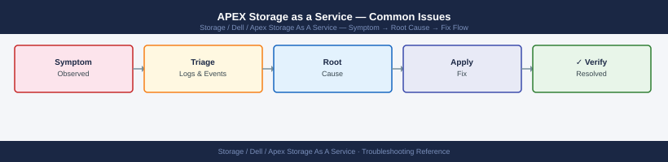

---
tags:
  - dell
  - troubleshooting
search:
  boost: 1.5
---
# APEX Storage as a Service — Common Issues

<div class="kb-summary">
Common APEX Storage as a Service issues — provisioning failures, connectivity errors, and service-level degradation.

*Applies to: APEX Storage-as-a-Service*
</div>


> Part of the [APEX Storage as a Service](../index.md) reference.

---

| Symptom | Likely Cause | Action |
|---|---|---|
| Infrastructure health warning in APEX Console | On-premises hardware fault or connectivity loss from Secure Connect Gateway | Check SCG connectivity; review hardware alerts on the underlying platform (PowerStore/PowerScale/PowerFlex) |
| Burst capacity charges unexpected | Workload growth or snapshot/backup accumulation pushing usage above committed tier | Review consumed capacity trend in APEX Console; identify growth sources; raise committed tier if sustained |
| APEX Console shows infrastructure as offline | Secure Connect Gateway appliance down or network path to Dell blocked | Check SCG appliance health and outbound HTTPS connectivity on port 443 to Dell APEX endpoints |
| Capacity request delayed | Service request not raised in APEX Console, or SLA window not yet elapsed | Raise a capacity increase request via APEX Console; review the contracted SLA response time |
| Billing discrepancy | Consumed capacity reported differently between on-premises platform and APEX Console | Allow 24 hours for telemetry sync; open a support case via APEX Console if discrepancy persists |

```d2
direction: down

symptom: Identify Symptom {shape: diamond}
diagnostic_flow: "Diagnostic Flow" {shape: rectangle}
verify_resolution: "Verify resolution" {shape: rectangle}
resolution: Resolve or Escalate {shape: oval}

symptom -> diagnostic_flow: investigate
symptom -> verify_resolution: investigate
diagnostic_flow -> resolution
verify_resolution -> resolution
```

## Diagnostic Flow

```d2
direction: right

D1: "D1" {shape: rectangle}
R1: "See Issue Reference —\nAPEX Console shows infrastructure as offline" {shape: rectangle}
R2: "See Issue Reference —\nInfrastructure health warning in APEX Console" {shape: rectangle}
D2: "D2" {shape: rectangle}
R3: "See Issue Reference —\nBurst capacity charges unexpected" {shape: rectangle}
R4: "See Portal Issues —\nSnap failure: check available burst capacity" {shape: rectangle}
D3: "D3" {shape: rectangle}
R5: "See Issue Reference —\nCapacity request delayed: raise SR in console" {shape: rectangle}
R6: "See Issue Reference —\nCapacity request delayed: review SLA response" {shape: rectangle}
D4: "D4" {shape: rectangle}
R7: "See Issue Reference —\nBilling discrepancy: open support case" {shape: rectangle}
R8: "See Portal Issues —\nCloudIQ gap: check SCG and telemetry" {shape: rectangle}
D5: "D5" {shape: rectangle}
R9: "See Issue Reference —\nInfrastructure health warning: check platform" {shape: rectangle}
R10: "See Block Issues —\nPath offline: fix physical then rescan" {shape: rectangle}
S: "What is the symptom?" {shape: rectangle}
B1: "B1" {shape: rectangle}
B2: "B2" {shape: rectangle}
B3: "B3" {shape: rectangle}
B4: "B4" {shape: rectangle}
B5: "B5" {shape: rectangle}

D1 -> R1
D1 -> R2
D2 -> R3
D2 -> R4
D3 -> R5
D3 -> R6
D4 -> R7
D4 -> R8
D5 -> R9
D5 -> R10
```

---

## Before you begin

- **Access:** Storage admin credentials (cluster admin or equivalent)
- **Gather first:** recent error message text, event timestamps, and affected object names
- **Scope:** confirm whether the issue affects a single object, host, cluster, or site
- **Escalation:** open a vendor support ticket before running any destructive step
- **Logging:** document each command and output — required if escalation is needed

---

---

## Verify resolution

- Confirm the original symptom no longer occurs
- Check logs for any residual errors related to the issue
- Monitor for 10–15 minutes to confirm the fix is stable

---

## See also

- [Apex Storage As A Service — Diagnostics](../diagnostics/)
- [Apex Storage As A Service — Escalation](../escalation/)
- [Apex Storage As A Service — Health Checks](../../operations/health-checks/)
