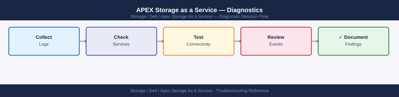

---
tags:
  - dell
  - troubleshooting
search:
  boost: 1.5
---
# APEX Storage as a Service — Diagnostics

<div class="kb-summary">
APEX Storage as a Service diagnostic commands: check host-side iSCSI and multipath connectivity, verify APEX Console subscription state, diagnose SCG telemetry reporting gaps, and collect array and path diagnostics for Dell support cases.

*Applies to: Dell APEX Storage-as-a-Service (block storage)*
</div>


```d2
direction: right

B: "B" {shape: rectangle}
C: "multipath -ll\niscsiadm -m session" {shape: rectangle}
D: "scg status\nscg connectivity --test" {shape: rectangle}
E: "APEX Console\nSubscription → Capacity" {shape: rectangle}
F: "Unisphere → Performance\nCheck IOPS and latency" {shape: rectangle}
G: "G" {shape: rectangle}
H: "Check iSCSI/FC login\nCheck zoning / VLAN" {shape: rectangle}
I: "multipath -ll\nCheck failed paths" {shape: rectangle}
J: "J" {shape: rectangle}
K: "systemctl status dsagw\nscg log collect" {shape: rectangle}
L: "APEX Console → Systems\nCheck last data timestamp" {shape: rectangle}
M: "Verify subscription status\nCheck burst usage alerts" {shape: rectangle}
N: "Check host queue depth\narray-side performance view" {shape: rectangle}
O: "Collect host + array diag\nOpen Dell SR" {shape: rectangle}
A: "APEX STaaS Issue" {shape: rectangle}

B -> C
B -> D
B -> E
B -> F
G -> H
G -> I
J -> K
J -> L
E -> M
F -> N
H -> O
I -> O
K -> O
L -> O
M -> O
N -> O
```

```d2
direction: down

symptom: Identify Symptom {shape: diamond}
step_1_check_hostside_storage_connec: "Step 1 — Check host-side storage connectivity" {shape: rectangle}
step_2_check_apex_console_for_system: "Step 2 — Check APEX Console for system and\ncapacity status" {shape: rectangle}
step_3_check_scg_telemetry_reporting: "Step 3 — Check SCG telemetry reporting" {shape: rectangle}
step_4_check_the_underlying_array_un: "Step 4 — Check the underlying array (Unisphere)" {shape: rectangle}
collect_diagnostic_snapshot_for_dell: "Collect diagnostic snapshot for Dell SR" {shape: rectangle}
verify_resolution: "Verify resolution" {shape: rectangle}
resolution: Resolve or Escalate {shape: oval}

symptom -> step_1_check_hostside_storage_connec: investigate
symptom -> step_2_check_apex_console_for_system: investigate
symptom -> step_3_check_scg_telemetry_reporting: investigate
symptom -> step_4_check_the_underlying_array_un: investigate
symptom -> collect_diagnostic_snapshot_for_dell: investigate
symptom -> verify_resolution: investigate
step_1_check_hostside_storage_connec -> resolution
step_2_check_apex_console_for_system -> resolution
step_3_check_scg_telemetry_reporting -> resolution
step_4_check_the_underlying_array_un -> resolution
collect_diagnostic_snapshot_for_dell -> resolution
verify_resolution -> resolution
```

## Before you begin

- **Access:** Host OS admin credentials; APEX Console login (admin role); SCG appliance SSH; Unisphere access to the underlying array
- **Gather first:** the specific symptom (volume not visible, I/O errors, console shows stale data), affected host names, and the subscription ID from APEX Console
- **Scope:** confirm whether the issue affects a single host, all hosts on one fabric, or all hosts accessing the APEX system
- **Responsibility boundary:** for APEX STaaS, Dell owns the array hardware; customer owns networking, host configuration, and data. For hardware faults, Dell support opens a field dispatch; for host-side issues, the customer team resolves

---

## Step 1 — Check host-side storage connectivity

### Linux hosts (iSCSI)

```bash
# Check active iSCSI sessions
iscsiadm -m session
# Shows: target IQN, target IP, session state, interface
# Expected: sessions to all configured array iSCSI portals; State = Running

# Check iSCSI node database (registered targets)
iscsiadm -m node
# Shows all discovered targets and their login status

# Manually log in if session is missing
iscsiadm -m node -T <target-iqn> -p <array-ip>:<port> --login

# Check multipath status after iSCSI sessions are up
multipath -ll
# Expected output per LUN:
#   <wwid> dm-X DELL,<model>
#   size=<n>G features='...' hwhandler='...'
#   |- <path> <state> <prio> <read_write>
# Healthy: 4 paths (2 per controller port); all paths "active ready"
# Problem: "failed faulty" paths; fewer than expected paths

# Check for path failures in multipath
multipath -ll | grep -E "failed|faulty|checker failed"

# Run path checker on all paths
multipathd show paths
multipathd show maps
```


```text title="Expected output"
$ iscsiadm -m session
tcp: [1] 192.168.10.45:3260,1 iqn.1991-05.com.dell:storage.apex01.target1 (non-flash)
tcp: [2] 192.168.10.46:3260,1 iqn.1991-05.com.dell:storage.apex01.target1 (non-flash)
tcp: [3] 192.168.10.47:3260,1 iqn.1991-05.com.dell:storage.apex01.target2 (non-flash)
tcp: [4] 192.168.10.48:3260,1 iqn.1991-05.com.dell:storage.apex01.target2 (non-flash)

$ iscsiadm -m node
192.168.10.45:3260,1 iqn.1991-05.com.dell:storage.apex01.target1
192.168.10.46:3260,1 iqn.1991-05.com.dell:storage.apex01.target1
192.168.10.47:3260,1 iqn.1991-05.com.dell:storage.apex01.target2
192.168.10.48:3260,1 iqn.1991-05.com.dell:storage.apex01.target2

$ multipath -ll
360060e80057f5200000057f52a2d5d11 dm-0 DELL,APEX Storage
size=2.0T features='1 queue_if_no_path' hwhandler='1 alua' wp=rw
|- 2:0:0:0 sdb 8:16 active ready running
|- 3:0:0:0 sdc 8:32 active ready running
|- 4:0:0:0 sdd 8:48 active ready running
|- 5:0:0:0 sde 8:64 active ready running
360060e80057f5200000057f52a2d5d12 dm-1 DELL,APEX Storage
size=1.5T features='1 queue_if_no_path' hwhandler='1 alua' wp=rw
|- 2:0:0:1 sdf 8:80 active ready running
|- 3:0:0:1 sdg 8:96 active ready running
|- 4:0:0:1 sdh 8:112 failed faulty offline
|- 5:0:0:1 sdi 8:128 active ready running

$ multipath -ll | grep -E "failed|faulty|checker failed"
|- 4:0:0:1 sdh 8:112 failed faulty offline

$ multipathd show paths
hcil    dev dev_t pri dm_st chk_st next_check
2:0:0:0 sdb 8:16  50  0    ready  *
3:0:0:0 sdc 8:32  50  0    ready  *
4:0:0:0 sdd 8:48  50  0    ready  *
5:0:0:0 sde 8:64  50  0    ready  *
```
### Linux hosts (FC)

```bash
# Check FC HBA status
cat /sys/class/fc_host/host*/port_state
# Expected: Online for all HBAs

# Check discovered FC targets
cat /sys/class/fc_transport/*/roles 2>/dev/null | head -20

# Check multipath (same command as iSCSI)
multipath -ll | grep -E "DELL|failed|faulty"
```


```text title="Expected output"
Online
Online
Online
Online
initiator
target
initiator,target
initiator
size=100G features='0' hwhandler='1 alua' wp=rw
|-+- policy='service-time 0' prio=50 status=active
| `- 4:0:0:1 sda 8:0  active ready running
`-+- policy='service-time 0' prio=10 status=enabled
  `- 5:0:0:1 sdb 8:16 failed faulty offline
```

!!! warning "Common errors"
    **`cat: /sys/class/fc_host/host*/port_state: No such file or directory`** — Verify FC HBA drivers are loaded with `lsmod | grep qla2xxx` and reseat the HBA if needed.
    **`failed faulty offline`** — Check FC cable connections and zoning on the SAN switch, then run `multipathd reconfigure` to refresh paths.
### Windows hosts

```powershell
# Check MPIO disk paths (requires MPIO feature installed)
mpclaim -s -d
# Shows: physical disk number, load balance policy, paths
# Expected: all paths show "Active/Optimized" or "Active/Unoptimized"

# PowerShell equivalent
Get-Disk | Where-Object {$_.BusType -eq "iSCSI" -or $_.BusType -eq "Fibre Channel"} |
  Select-Object Number, FriendlyName, Size, OperationalStatus, HealthStatus |
  Format-Table -AutoSize

# Check MPIO paths for a specific disk
Get-MSDSMPathInformation | Where-Object {$_.DiskNumber -eq <disk-number>}
# Shows: path state, weight, active status

# Check iSCSI sessions on Windows
Get-IscsiSession | Select-Object -Property InitiatorNodeAddress, TargetNodeAddress, IsConnected, SessionState
```

---

## Step 2 — Check APEX Console for system and capacity status

```text
Via APEX Console (console.dell.com or dell.com/apex):
  1. Navigate to: Infrastructure → Storage Systems
  2. Find the affected system; check "Last Data Received" timestamp
     - If > 30 minutes ago: SCG is not reporting (proceed to Step 3)
     - If current: the issue is configuration or host-side

  3. Navigate to: Subscriptions → select your subscription
     - Check: Committed capacity vs current usage
     - Check: Burst capacity status (if near or at burst limit, new volume provisioning fails)
     - Check: Subscription expiry date

  4. Navigate to: Storage Systems → <your system> → Volumes
     - Confirm the affected volume exists and is in "Ready" state
     - Check: Volume Attachments — confirm the host is listed

  5. To open a service request directly:
     - Navigate to: Support → Create Service Request
     - Select: the affected system and the system serial number
```

---

## Step 3 — Check SCG telemetry reporting

```bash
# SSH to the SCG appliance
ssh admin@<scg-ip>

# SCG overall health
scg status
# Expected: SCG Service = Running; Connected to CloudIQ = Yes

# Test outbound connectivity to APEX Console and CloudIQ
scg connectivity --test
# Expected: all endpoints Reachable

# List registered devices and their last poll time
scg device list
# Look for the APEX system; check Last Poll Time

# Test connectivity to the specific APEX array
scg device test --id <device-id>
# Expected: Authentication OK; API reachable

# Collect SCG diagnostic bundle for Dell SR
scg log collect --output /tmp/scg-apex-$(date +%F).tar.gz
```


```text title="Expected output"
admin@scg-01:~$ scg status
SCG Service = Running
Connected to CloudIQ = Yes
Last Heartbeat = 2024-01-15 14:32:18 UTC
Version = 2.4.1.5

admin@scg-01:~$ scg connectivity --test
Testing endpoint connectivity...
APEX Console (apex.dell.com:443) = Reachable
CloudIQ (cloudiq.dell.com:443) = Reachable
NTP Server (time.nist.gov:123) = Reachable
DNS Resolver (8.8.8.8:53) = Reachable

admin@scg-01:~$ scg device list
Device ID | Name | Type | Last Poll Time | Status
----------|------|------|----------------|--------
dev-4a7f2c | APEX-SAN-01 | PowerFlex | 2024-01-15 14:31:42 | Connected
dev-8b1e9d | APEX-OBJ-02 | ObjectScale | 2024-01-15 14:29:15 | Connected
dev-5c3a6e | APEX-NAS-03 | PowerScale | 2024-01-15 14:30:58 | Connected

admin@scg-01:~$ scg device test --id dev-4a7f2c
Testing device connectivity for APEX-SAN-01...
Authentication OK
API Endpoint Reachable = Yes
Response Time = 142ms
Status = Healthy

admin@scg-01:~$ scg log collect --output /tmp/scg-apex-2024-01-15.tar.gz
Collecting diagnostic bundle...
Gathering system logs...
Gathering connectivity logs...
Gathering device metrics...
Bundle created: /tmp/scg-apex-2024-01-15.tar.gz (287 MB)
```

!!! warning "Common errors"
    **`scg: command not found`** — Verify SSH session is connected to the SCG appliance (not a standard Linux host) and the scg CLI is in the PATH.
    **`Authentication failed for device dev-4a7f2c`** — Confirm the APEX array credentials stored in SCG are current and the array's management IP is reachable from the SCG network.
    **`Connected to CloudIQ = No`** — Check SCG outbound firewall rules allow HTTPS to cloudiq.dell.com and verify the SCG proxy settings if applicable.
---

## Step 4 — Check the underlying array (Unisphere)

```bash
# For PowerStore (via Unisphere or REST API)
curl -sk -u admin:<password> "https://<powerstore-ip>/api/rest/volume?select=name,state,health" |
  jq '.[] | {name, state, health}'
# Expected: all volumes state = "Ready", health = "OK"

# Check host connections
curl -sk -u admin:<password> "https://<powerstore-ip>/api/rest/host_volume_mapping" |
  jq '.[] | {host_id, volume_id, logical_unit_number}'

# Check array port state
curl -sk -u admin:<password> "https://<powerstore-ip>/api/rest/fc_port?select=name,current_speed,wwn,current_univ_wwn" |
  jq '.[] | {name, current_speed}'

# For PowerFlex — check system via API gateway
curl -sk -H "Authorization: Basic $(echo -n admin:<password> | base64)" \
  "https://<pfx-gateway>:443/api/types/System/instances" | jq '.name,.capacity'
```


```text title="Expected output"
{
  "name": "vol_prod_db_001",
  "state": "Ready",
  "health": "OK"
}
{
  "name": "vol_prod_db_002",
  "state": "Ready",
  "health": "OK"
}
{
  "name": "vol_backup_tier2",
  "state": "Ready",
  "health": "OK"
}
{
  "host_id": "host-5f8c2a1b",
  "volume_id": "vol_prod_db_001",
  "logical_unit_number": 0
}
{
  "host_id": "host-5f8c2a1b",
  "volume_id": "vol_prod_db_002",
  "logical_unit_number": 1
}
{
  "name": "FC_Port_A0",
  "current_speed": "16 Gbps"
}
{
  "name": "FC_Port_B0",
  "current_speed": "16 Gbps"
}
"PowerStore-Array-01"
"18.5 TB"
```

!!! warning "Common errors"
    **`curl: (60) SSL certificate problem: self signed certificate`** — Add `-k` flag to skip certificate verification (already present; verify the flag is not being stripped by shell escaping).
    **`jq: parse error: Invalid numeric literal at line 1 column 7`** — Ensure the API response is valid JSON by checking credentials and endpoint URL are correct; test with `curl -sk ... | head -c 200` to inspect raw response.
    **`curl: (7) Failed to connect to <powerstore-ip> port 443: Connection refused`** — Verify the PowerStore/PowerFlex management IP is reachable and the REST API service is running with `ping <powerstore-ip>` and check firewall rules.
---

## Collect diagnostic snapshot for Dell SR

```bash
# On Linux host — collect all path and session info
{
  echo "=== iSCSI sessions ==="
  iscsiadm -m session 2>/dev/null || echo "iSCSI not in use"
  echo "=== multipath ==="
  multipath -ll
  echo "=== multipathd paths ==="
  multipathd show paths
  echo "=== FC HBA state ==="
  cat /sys/class/fc_host/host*/port_state 2>/dev/null || echo "No FC HBAs"
  echo "=== block devices ==="
  lsblk -o NAME,SIZE,TYPE,TRAN,MODEL | grep -v "^loop"
} > /tmp/apex-host-diag-$(date +%F-%H%M).txt
```


```text title="Expected output"
=== iSCSI sessions ===
tcp: [1] 192.168.100.45:3260,1 iqn.1991-05.com.dell:APEX.array01.target1 (non-flash)
tcp: [2] 192.168.100.46:3260,1 iqn.1991-05.com.dell:APEX.array01.target1 (non-flash)
=== multipath ===
mpatha (360060e80057900000057900000010001) dm-0 DELL,APEX Storage
size=2.0T features='1 queue_if_no_path' hwhandler='1 alua' wp=rw
`-+- policy='service-time 0' prio=50 status=active
  |- 2:0:0:0 sdb 8:16 active ready running
  `- 3:0:0:0 sdc 8:32 active ready running
=== multipathd paths ===
hcil    dev dev_t pri dm_st chk_st next_check
2:0:0:0 sdb 8:16  50 active ready  XXXXXXXX.XXX
3:0:0:0 sdc 8:32  50 active ready  XXXXXXXX.XXX
=== FC HBA state ===
Online
Online
=== block devices ===
NAME   SIZE TYPE TRAN MODEL
sdb    2.0T disk sas  APEX Storage
sdc    2.0T disk sas  APEX Storage
mpatha 2.0T mpath
Diagnostic data saved to: /tmp/apex-host-diag-2024-01-15-1430.txt
```

!!! warning "Common errors"
    **`iscsiadm: No records found`** — Verify iSCSI target is configured and running with `iscsiadm -m discovery -t st -p <target_ip>`.
    **`multipath: command not found`** — Install device-mapper-multipath package with `apt-get install device-mapper-multipath` or `yum install device-mapper-multipath`.
    **`multipathd: socket connect failed, No such file or directory`** — Start the multipathd service with `systemctl start multipathd && systemctl enable multipathd`.
---

## See also

- [APEX Storage As A Service — Common Issues](../common-issues/)
- [APEX Storage As A Service — Escalation](../escalation/)
- [APEX Storage As A Service — Health Checks](../../operations/health-checks/)

## Verify resolution

- `multipath -ll` shows all expected paths in `active ready` state with no failed/faulty paths
- `iscsiadm -m session` (or FC HBA state) shows sessions to all configured array portals
- APEX Console → Storage Systems shows the affected system with a current "Last Data Received" timestamp
- SCG: `scg device list` shows the system with `Status = OK` and a recent last poll time
- I/O test from the affected host: `dd if=/dev/mapper/<dm-device> of=/dev/null bs=1M count=1000` completes at expected throughput
