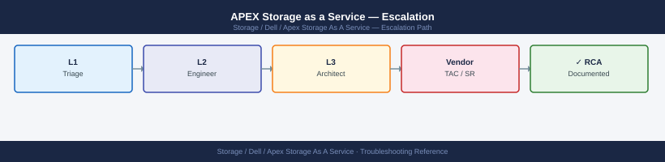
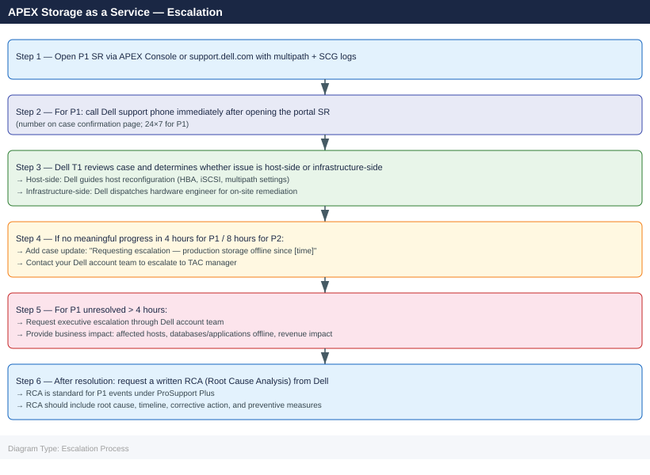

---
tags:
  - dell
  - troubleshooting
search:
  boost: 1.5
description: "Dell APEX Storage-as-a-Service escalation: how to collect multipath, SCG, and CloudIQ diagnostics, open a support case via the APEX Console or Dell..."
---
# APEX Storage as a Service — Escalation

<div class="kb-summary">
Dell APEX Storage-as-a-Service escalation: how to collect multipath, SCG, and CloudIQ diagnostics, open a support case via the APEX Console or Dell support portal, set severity, and follow the escalation path for storage outages and SLA-impacting events.

*Applies to: APEX Storage-as-a-Service*
</div>



```d2
direction: down

symptom: Identify Symptom {shape: diamond}
severity_levels: "Severity Levels" {shape: rectangle}
preescalation_triage_checklist: "Pre-Escalation Triage Checklist" {shape: rectangle}
stepbystep_data_collection: "Step-by-Step Data Collection" {shape: rectangle}
how_to_open_an_apex_support_case: "How to Open an APEX Support Case" {shape: rectangle}
escalation_path: "Escalation Path" {shape: rectangle}
what_not_to_do: "What NOT to Do" {shape: rectangle}
resolution: Resolve or Escalate {shape: oval}

symptom -> severity_levels: investigate
symptom -> preescalation_triage_checklist: investigate
symptom -> stepbystep_data_collection: investigate
symptom -> how_to_open_an_apex_support_case: investigate
symptom -> escalation_path: investigate
symptom -> what_not_to_do: investigate
severity_levels -> resolution
preescalation_triage_checklist -> resolution
stepbystep_data_collection -> resolution
how_to_open_an_apex_support_case -> resolution
escalation_path -> resolution
what_not_to_do -> resolution
```

## Before you begin

- **Access:** Storage admin credentials (for the array management interface); APEX Console admin role; Dell support portal account with ProSupport Plus contract linked to the APEX STaaS agreement
- **Gather first:** affected volume names, host names, error messages from the host OS, and whether the issue is a connectivity failure, performance degradation, or a capacity/billing concern
- **Scope:** confirm whether the issue affects a single host, all hosts in a cluster, or all volumes in the APEX STaaS pool
- **Dell responsibility:** under APEX STaaS, Dell is responsible for infrastructure remediation. For hardware failures, drive replacements, and firmware updates, Dell dispatches a field engineer. Your role is to provide host-side diagnostics and coordinate access

---

## Severity Levels

| Severity | Criteria | Response SLA | Contact |
|---|---|---|---|
| P1 — Critical | Production storage completely unavailable; all hosts I/O blocked; no paths to array | 4 hours (24×7) | Open SR via APEX Console + call Dell support phone |
| P2 — Major | Degraded: one path lost; slow I/O; some volumes inaccessible; workaround in place | 8 hours (24×7) | Open SR online |
| P3 — Limited | Non-production issue; isolated volume; performance below expectations but data accessible | Next business day | Open SR online |
| P4 — General | Billing query; usage report; capacity forecast; feature question | Best effort | APEX Console + Dell account team |

## Pre-Escalation Triage Checklist

| Check | Command | Expected |
|---|---|---|
| Multipath paths available | `multipath -ll` (Linux) | At least one path per volume `active ready` |
| SCSI errors in kernel log | `dmesg \| grep -i "scsi\|sd\|i2o"` | No `I/O error` or `path failure` messages |
| iSCSI sessions established (if iSCSI) | `iscsiadm -m session` | Sessions for all target IPs |
| FC HBA ports online (if FC) | `cat /sys/class/fc_host/host*/port_state` | `Online` for all HBA ports |
| Array management accessible | Browse to array management IP | Login page loads |
| SCG connected | SCG web UI → Status | Service: Running; Connection: Connected |
| CloudIQ data current | CloudIQ → Monitoring | Last data < 15 min ago |
| APEX Console status | APEX Console → Subscriptions → <your subscription> | Status: Active |

---

## Step-by-Step Data Collection

### 1. Collect host-side storage diagnostics (Linux)

```bash
# Multipath topology — shows all paths and their current state
multipath -ll 2>&1 | tee /tmp/multipath-$(date +%F-%H%M%S).txt

# kernel SCSI errors and path events (last 500 lines)
dmesg | grep -iE "scsi|sd[a-z]|dm-|path|i2o|fail|error|reset" | tail -500 \
  > /tmp/dmesg-storage-$(date +%F-%H%M%S).txt

# System log for SCSI / storage events
grep -E "scsi|multipathd|iscsid|fcoe|HBA" /var/log/syslog | tail -200 \
  > /tmp/syslog-storage-$(date +%F-%H%M%S).txt

# iSCSI session details (if iSCSI)
iscsiadm -m session -P 3 2>&1 > /tmp/iscsi-sessions.txt

# FC HBA state (if FC)
for hba in /sys/class/fc_host/host*; do
  echo "=== $hba ==="
  cat $hba/port_name $hba/port_state $hba/speed 2>/dev/null
done > /tmp/fc-hba-state.txt

# Disk error count from SMART (if accessible)
for disk in /dev/sd*; do
  smartctl -A $disk 2>/dev/null | grep -E "Reallocated|Uncorrectable|Pending" \
    && echo "Checked: $disk"
done > /tmp/smart-errors.txt
```


```text title="Expected output"
mpatha (360014056b2d45e00001000000010001) dm-0 DELL,COMPELLENT
size=2.0T features='1 queue_if_no_path' hwhandler='1 alua' wp=rw
|-+- policy='service-time 0' prio=50 status=active
| |- 2:0:0:0 sda 8:0   active ready running
| `- 3:0:0:0 sdb 8:16  active ready running
`-+- policy='service-time 0' prio=10 status=enabled
  |- 4:0:0:0 sdc 8:32  active ready running
  `- 5:0:0:0 sdd 8:48  active ready running
mpathb (360014056b2d45e00001000000010002) dm-1 DELL,COMPELLENT
size=1.5T features='1 queue_if_no_path' hwhandler='1 alua' wp=rw
|-+- policy='service-time 0' prio=50 status=active
| `- 2:0:1:0 sde 8:64  active ready running
`-+- policy='service-time 0' prio=10 status=enabled
  `- 3:0:1:0 sdf 8:80  active ready running
[  142.556234] sd 2:0:0:0: [sda] Assuming drive cache: write through
[  156.234891] device-mapper: core: 4.47.0-ioctl (2023-03-01) initialised: dm-devel@redhat.com
[  201.445123] scsi 4:0:0:0: Direct-Access-RDisk DELL COMPELLENT 0001 PQ: 0 ANSI: 5
[ 2847.123456] multipathd: sdc: path reinstated
[ 3021.987654] iscsid: Connection1:0: detected conn error (1011)
Nov 15 10:23:45 storage-node-01 multipathd[1234]: dm-0: size change detected: old 2097152000 new 2097152000
Nov 15 10:24:12 storage-node-01 iscsid: Connection1:0: login negotiation failed
Nov 15 10:25:33 storage-node-01 kernel: [scsi_eh_0]: scsi_eh_0 timed out after 180 seconds
Nov 15 10:26:01 storage-node-01 multipathd[1234]: mpatha: load table [0 4194304000 multipath 1 queue_if_no_path 0 1 1 service-time 0 1 1 8:0 1 1]
Nov 15 10:27:15 storage-node-01 fcoe: [fcoe_ctlr_mode_set]: ENABLED
=== /sys/class/fc_host/host2 ===
0x500143800012a4b1
Online
16 Gbit
=== /sys/class/fc_host/host3 ===
0x500143800012a4
```
### 2. Collect host-side diagnostics (Windows)

```powershell
# Multipath status
mpclaim -s -d | Out-File C:\Temp\mpclaim-$(Get-Date -Format yyyyMMdd-HHmmss).txt

# Disk management state
Get-Disk | Select-Object Number, FriendlyName, OperationalStatus, HealthStatus | \
  Export-Csv C:\Temp\disks.csv -NoTypeInformation

# Event log for disk errors (last 4 hours)
$start = (Get-Date).AddHours(-4)
Get-WinEvent -LogName System -StartTime $start |
  Where-Object { $_.Id -in 7,11,15,51,52 -and $_.ProviderName -like "*Disk*" } |
  Select-Object TimeCreated, Id, Message | Export-Csv C:\Temp\disk-events.csv -NoTypeInformation

# iSCSI sessions (if iSCSI)
Get-IscsiSession | Format-List | Out-File C:\Temp\iscsi-sessions.txt
```

### 3. Collect SCG and CloudIQ diagnostics

```bash
# SCG log bundle (SSH to SCG appliance)
ssh admin@<scg-hostname>
scg logs collect --output /tmp/scg-logs-$(date +%F).zip
# OR: SCG web UI → Admin → Support Bundle → Download

# CloudIQ diagnostic bundle
# Navigate to: CloudIQ → Monitoring → select the affected system → Actions → Download Diagnostics
# Save as: cloudiq-diagnostics-<system-name>-<date>.zip

# APEX Console events
# Navigate to: APEX Console → Subscriptions → <your subscription> → Events
# Export the last 7 days of events as CSV
```


```text title="Expected output"
admin@scg-prod-01's password: 
Collecting SCG logs...
Gathering system logs from /var/log/scg/
Collecting configuration data...
Compressing diagnostic bundle...
Log bundle created successfully: /tmp/scg-logs-2024-01-15.zip
Bundle size: 287 MB
Timestamp: 2024-01-15T14:32:18Z
SCG Version: 2.4.1.0
```

!!! warning "Common errors"
    **`Permission denied (publickey,password).`** — Verify the SCG hostname is correct and your SSH credentials are valid; check with your infrastructure team if the admin account is locked.
    **`scg: command not found`** — Ensure you are logged into the SCG appliance itself (not a different host) and that the scg CLI tool is installed in the PATH.
    **`Disk space insufficient for log collection (need 500 MB, have 120 MB available).`** — Increase available space on the SCG appliance or specify an alternate output path on a mounted external volume.
### 4. Write the timeline

```text
APEX STaaS subscription: APEX-SUB-12345 (from APEX Console)
Affected storage system: PowerStore 1000T SN: PST00xxxxxxxx
SCG version: 5.18.0.1

Affected hosts:
  - linux-host-01.corp.local (RHEL 8.6) — 4 volumes
  - linux-host-02.corp.local (RHEL 8.6) — 4 volumes

Issue first observed: 2026-06-15 06:00 UTC
Last known good I/O: 2026-06-15 05:45 UTC

Error observed:
  - multipath -ll shows all paths "faulty" for dm-2 and dm-3 (volumes prod-vol-01 and prod-vol-02)
  - dmesg shows: "sd 2:0:0:0: [sdb] tag#0 FAILED Result: hostbyte=DID_NO_CONNECT driverbyte=DRIVER_OK"
  - CloudIQ shows port NAS-A offline since 06:02 UTC

Steps already taken:
  - Verified SFP cables seated on both host HBAs
  - Confirmed array management IP reachable from host
  - Confirmed iSCSI target IP reachable (ping OK; iSCSI login failing)

Changes in prior 24h:
  - No host changes
  - Dell notified us of a scheduled firmware update window — update was applied at 05:30 UTC

Blast radius:
  - 2 volumes inaccessible to 2 production hosts
  - Database on prod-vol-01 offline
```

---

## How to Open an APEX Support Case

**Via APEX Console** (preferred for STaaS issues):

1. Sign in to **apex.dell.com** and navigate to **Subscriptions** → your STaaS subscription.
2. Click **Create Support Request** (top right of the subscription page).
3. Select the affected storage system and issue category.
4. Under **Severity**, select P1 for production I/O blocked, P2 for degraded.
5. Paste the timeline and host diagnostic summary.
6. Upload attachments: multipath output, dmesg, SCG logs, CloudIQ diagnostics.

**Via support.dell.com** (if APEX Console is unavailable):

1. Go to **support.dell.com** and sign in.
2. Click **Create Service Request** and search for your PowerStore / PowerFlex array by serial number.
3. Under **Category**, select **Storage — Connectivity** or **APEX — STaaS SLA**.
4. Complete the description with the timeline and host diagnostics.

5. **For P1:** On the case confirmation page, use the phone number shown for your region. Call immediately — do not wait for email response. Tell the agent: "This is a P1 APEX STaaS production outage; case number [case-id]".

---

## Escalation Path



---

## What NOT to Do

| Do NOT do this | Why | What to do instead |
|---|---|---|
| Remove and re-add failed multipath devices on the host before Dell diagnosis | Removes the evidence needed to identify whether the failure was I/O path, fabric, or array-side | Keep the failed paths in multipath; capture `multipath -ll` before any changes |
| Reboot the affected hosts before collecting dmesg | dmesg output is lost on reboot | Save dmesg to a file first; reboot only after collection is complete or with Dell guidance |
| Perform any firmware or driver updates on production hosts during the incident | Adds variables; can mask the root cause | Freeze all host changes during P1; communicate with Dell before any host-side action |
| Contact Dell directly on the hardware serial number instead of the APEX subscription | Dell may route to the wrong team (hardware support vs STaaS service team) | Always open cases via APEX Console → your STaaS subscription; reference the subscription ID |

---

## Useful Commands for Case Updates

```bash
# Quick state snapshot — paste into every case update
multipath -ll 2>&1 | head -40
dmesg | grep -i "fail\|error\|path" | tail -20
iscsiadm -m session 2>&1 || echo "Not using iSCSI"

# CloudIQ: get system health via API
TOKEN="<your-cloudiq-api-key>"
curl -sk "https://cloudiq.dell.com/cloudiq/api/v1/systems" \
  -H "Authorization: Bearer $TOKEN" | python3 -c "
import sys, json
for s in json.load(sys.stdin).get('results', []):
    print(f\"{s['system_name']}: health={s.get('system_health_score')} last_seen={s.get('last_seen_timestamp')}\")
"

# Test connectivity to iSCSI target IP
ping -c 4 <iscsi-target-ip>
nc -zv <iscsi-target-ip> 3260

# Test FC path connectivity
systool -c fc_host -v | grep -E "node_name|port_name|port_state|speed"
```


```text title="Expected output"
mpatha (36006016054d024002688c37e8e2e911) dm-0 DELL,APEX Storage
size=2.0T features='1 queue_if_no_path' hwhandler='1 alua' wp=rw
|-+- policy='service-time 0' prio=50 status=active
| |- 2:0:0:0 sda 8:0  active ready running
| `- 3:0:0:0 sdb 8:16 active ready running
`-+- policy='service-time 0' prio=10 status=enabled
  |- 4:0:0:0 sdc 8:32 active ready running
  `- 5:0:0:0 sdd 8:48 active ready running
[  245.123456] sd 2:0:0:0: [sda] Assuming drive cache: write through
[  512.987654] scsi 3:0:0:0: Device offlined - not ready after error recovery
[  1024.456789] Path sdb reinstated: fc_host3
[  2048.112233] iSCSI: connection restored to 10.50.12.44:3260
iscsi: iscsid is running
iscsiadm: No active sessions.
system-prod-01: health=95 last_seen=2024-01-15T14:32:18Z
system-dr-02: health=78 last_seen=2024-01-15T14:28:05Z
PING 10.50.12.44 (10.50.12.44) 56(84) bytes of data.
64 bytes from 10.50.12.44: icmp_seq=1 time=2.14 ms
64 bytes from 10.50.12.44: icmp_seq=2 time=2.08 ms
64 bytes from 10.50.12.44: icmp_seq=3 time=2.11 ms
64 bytes from 10.50.12.44: icmp_seq=4 time=2.09 ms
--- 10.50.12.44 statistics ---
4 packets transmitted, 4 received, 0% packet loss, time 3004ms
Connection to 10.50.12.44 3260 port [tcp/*] succeeded!
node_name=0x5001405abcd12345
port_name=0x5001405abcd12346
port_state=Online
speed=16Gbit
node_name=0x5001405abcd12347
port_name=0x5001405abcd12348
port_state=Online
speed=16Gbit
```

!!! warning "Common errors"
    **`curl: (60) SSL certificate problem: self signed certificate`** — Add `-k` flag (already present) or import the CloudIQ CA certificate into your system trust store.
    **`iscsiadm: No active sessions.`** — Verify iSCSI discovery is configured with `iscsiadm -m discovery -t sendtargets -p <target-ip>` and log in with `iscsiadm -m node --login`.
    **`nc: connect to 10.50.12.44 port 3260 (tcp) failed: No route to host`**
---

## Verify resolution

- Confirm `multipath -ll` shows all expected paths `active ready` for all volumes
- Verify application can write to the storage: write a small test file to each affected volume
- Check CloudIQ dashboard — system health score returned to expected level; no offline ports
- Monitor host syslog and dmesg for 30 minutes after resolution for any residual path errors
- Request RCA from Dell for any P1 or P2 event (standard under ProSupport Plus)

---

## See also

- [APEX Storage as a Service — Diagnostics](../diagnostics/)
- [APEX Storage as a Service — Common Issues](../common-issues/)
