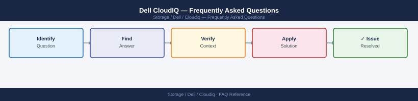

---
tags:
  - dell-cloudiq
  - faq
  - operations
description: "Common questions about Dell CloudIQ operations, configuration, and troubleshooting. For step-by-step procedures, see the Operations section."
---
# Dell CloudIQ — Frequently Asked Questions

*Applies to: Dell CloudIQ*

Common questions about Dell CloudIQ operations, configuration, and troubleshooting. For step-by-step procedures, see the <a href="index.md">Operations</a> section.

## General

**Q: How do I check the CloudIQ version?**
A: CloudIQ is a SaaS platform — Dell manages versioning. Check the current release notes at dell.com/support. The platform version is shown in CloudIQ UI → Help → About.

**Q: How do I check the current Dell CloudIQ version?**
A: `CloudIQ UI → Help → About`

## Configuration

**Q: What is the default health score threshold for alerts?**
A: CloudIQ generates alerts when health score drops below 80 (default). Customise thresholds per system type under Settings → Alerting. Set email or webhook notifications for score drops below your defined threshold.

**Q: How do I enable CloudIQ for a new Dell storage system?**
A: Ensure SupportAssist (formerly Secure Remote Services) is active on the system. In CloudIQ, go to Settings → Connected Systems → Add. The system must have outbound HTTPS (443) connectivity to CloudIQ SaaS endpoints.

## Operations

**Q: How does CloudIQ handle new feature rollouts?**
A: CloudIQ is a SaaS platform — Dell rolls out new features automatically. No action required. Check the CloudIQ What's New page monthly for feature updates. New features may require opt-in for preview.

**Q: What is the correct procedure to add a new storage system to CloudIQ?**
A: Register the system with SupportAssist (CloudIQ ingests data automatically once SupportAssist is active). Verify in CloudIQ → Systems within 24 hours. Configure notification recipients and thresholds for the new system.

## Troubleshooting

**Q: CloudIQ shows 'Connectivity Lost' for a system. What does it mean?**
A: The system has not sent telemetry to CloudIQ for more than the expected interval. Check the system's SupportAssist connectivity. Verify the proxy configuration if the system routes outbound traffic via proxy. Check for firewall rule changes.

**Q: CloudIQ performance prediction shows an upcoming capacity breach — where do I start?**
A: Review the capacity trend chart. If breach is within 90 days, initiate capacity expansion planning. Use CloudIQ's 'What-if' analysis to model the impact of adding drives or volumes. Engage Dell account team for procurement lead times.

## Backup and Recovery

**Q: Should I back up CloudIQ data?**
A: CloudIQ is a SaaS platform — Dell manages data retention and backup. Historical performance and capacity data is retained per the CloudIQ data retention policy (typically 90 days hot, longer for trend analysis). No customer action required.

**Q: Can I recover CloudIQ historical data if my system was offline?**
A: Data collected while the system was offline is lost — CloudIQ only ingests live telemetry. Historical trends show a gap for the offline period. If the system was online but connectivity was interrupted, some data may be buffered and uploaded when connectivity restores.

## See Also

- [Dell CloudIQ Operations](index.md)
- [Dell CloudIQ Troubleshooting](../../../../troubleshooting/index.md)
