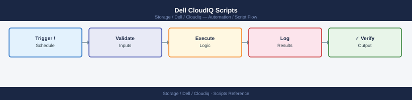

---
tags:
  - dell
  - operations
---
# Dell CloudIQ Scripts

*Applies to: Dell CloudIQ*


```python
#!/usr/bin/env python3
# cloudiq_alert_poller.py — Poll CloudIQ for active alerts across all systems
# Requirements: requests
# Usage: CLOUDIQ_CLIENT_ID=xxx CLOUDIQ_CLIENT_SECRET=yyy ./cloudiq_alert_poller.py

import os
import sys
import requests
import urllib3
from datetime import datetime
from collections import defaultdict

urllib3.disable_warnings(urllib3.exceptions.InsecureRequestWarning)

CLIENT_ID     = os.environ.get("CLOUDIQ_CLIENT_ID", "")
CLIENT_SECRET = os.environ.get("CLOUDIQ_CLIENT_SECRET", "")
CLOUDIQ_BASE  = "https://cloudiq.dell.com"
AUTH_URL      = f"{CLOUDIQ_BASE}/auth/v1/token"
API_BASE      = f"{CLOUDIQ_BASE}/cloudiq/rest/v1"

if not CLIENT_ID or not CLIENT_SECRET:
    print("ERROR: CLOUDIQ_CLIENT_ID and CLOUDIQ_CLIENT_SECRET must be set.", file=sys.stderr)
    sys.exit(1)

session = requests.Session()

def get_token():
    resp = session.post(
        AUTH_URL,
        data={
            "grant_type": "client_credentials",
            "client_id": CLIENT_ID,
            "client_secret": CLIENT_SECRET,
        },
        headers={"Content-Type": "application/x-www-form-urlencoded"},
    )
    resp.raise_for_status()
    return resp.json()["access_token"]

def api_get(token, path, params=None):
    resp = session.get(
        f"{API_BASE}{path}",
        headers={"Authorization": f"Bearer {token}", "Accept": "application/json"},
        params=params,
    )
    resp.raise_for_status()
    return resp.json()

def main():
    exit_code = 0

    print("=" * 70)
    print("  CloudIQ Active Alert Report")
    print(f"  Generated: {datetime.now().strftime('%Y-%m-%d %H:%M:%S')}")
    print("=" * 70)

    token = get_token()

    data   = api_get(token, "/alerts", params={"state": "ACTIVE"})
    alerts = data.get("results", data if isinstance(data, list) else [])

    if not alerts:
        print("\nNo active alerts.")
        sys.exit(0)

    # Group by severity
    by_severity = defaultdict(list)
    for alert in alerts:
        sev = alert.get("severity", "UNKNOWN").upper()
        by_severity[sev].append(alert)

    for sev in ("CRITICAL", "ERROR", "WARNING", "INFO", "UNKNOWN"):
        group = by_severity.get(sev, [])
        if not group:
            continue
        print(f"\n--- {sev} ({len(group)}) ---")
        print(f"  {'SYSTEM':<30}  {'COMPONENT':<25}  DESCRIPTION")
        print("  " + "-" * 80)
        for a in group:
            system    = a.get("system_name", a.get("systemName", "unknown"))
            component = a.get("component_name", a.get("componentName", a.get("object_name", "unknown")))
            desc      = a.get("description", a.get("message", "no description"))
            print(f"  {system:<30}  {component:<25}  {desc}")
        if sev in ("CRITICAL", "ERROR"):
            exit_code = max(exit_code, 2)
        elif sev == "WARNING":
            exit_code = max(exit_code, 1)

    print(f"\n{'=' * 70}")
    print(f"  Total active alerts: {len(alerts)}")
    labels = {0: "OK", 1: "WARNING", 2: "CRITICAL"}
    print(f"  Overall: {labels.get(exit_code, 'UNKNOWN')}")
    sys.exit(exit_code)

if __name__ == "__main__":
    main()
```

```powershell
# cloudiq_alert_summary.ps1 — CloudIQ active alert summary (Windows PowerShell)
# Requires: PowerShell 5.1+ (built into Windows 10/11)
# Run: .\cloudiq_alert_summary.ps1

$ClientId     = "your-client-id"      # From CloudIQ portal: Settings → API Access
$ClientSecret = "your-client-secret"  # From CloudIQ portal: Settings → API Access

$AuthUrl  = "https://cloudiq.dell.com/auth/v1/token"
$ApiBase  = "https://cloudiq.dell.com/cloudiq/rest/v1"

# Step 1: Get OAuth2 access token
Write-Host "Authenticating to CloudIQ ..."
try {
    $TokenResp = Invoke-RestMethod -Uri $AuthUrl `
        -Method POST `
        -Body "grant_type=client_credentials&client_id=$ClientId&client_secret=$ClientSecret" `
        -ContentType "application/x-www-form-urlencoded"
    $Token = $TokenResp.access_token
} catch {
    Write-Host "ERROR: Authentication failed - $($_.Exception.Message)"
    exit 1
}

if (-not $Token) {
    Write-Host "ERROR: No access token received. Check your client ID and secret."
    exit 1
}
Write-Host "Authentication successful."

$Headers = @{ Authorization = "Bearer $Token"; Accept = "application/json" }

# Step 2: Get active alerts
Write-Host ""
Write-Host "Fetching active alerts ..."
try {
    $AlertsResp = Invoke-RestMethod -Uri "$ApiBase/alerts?state=ACTIVE" -Headers $Headers
    $Alerts = $AlertsResp.results
} catch {
    Write-Host "ERROR: Could not fetch alerts - $($_.Exception.Message)"
    exit 1
}

# Step 3: Count by severity
$Critical = ($Alerts | Where-Object { $_.severity -eq "CRITICAL" }).Count
$Warning  = ($Alerts | Where-Object { $_.severity -eq "WARNING" }).Count
$Info     = ($Alerts | Where-Object { $_.severity -eq "INFO" }).Count
$Total    = $Alerts.Count

Write-Host ""
Write-Host "========================================"
Write-Host "  CloudIQ Alert Summary"
Write-Host "========================================"
Write-Host "  CRITICAL : $Critical"
Write-Host "  WARNING  : $Warning"
Write-Host "  INFO     : $Info"
Write-Host "  TOTAL    : $Total"
Write-Host "========================================"

if ($Critical -gt 0) {
    Write-Host "  STATUS: CRITICAL — $Critical critical alert(s) require attention."
    exit 2
} elseif ($Warning -gt 0) {
    Write-Host "  STATUS: WARNING — $Warning warning alert(s) found."
    exit 1
} else {
    Write-Host "  STATUS: OK — No critical or warning alerts."
    exit 0
}
```
```powershell
Set-ExecutionPolicy -Scope Process -ExecutionPolicy Bypass
```
```bash
cd C:\Users\YourName\Desktop
.\cloudiq_alert_summary.ps1
```
```powershell
# cloudiq_system_health.ps1 — CloudIQ system health summary (Windows PowerShell)
# Requires: PowerShell 5.1+ (built into Windows 10/11)
# Run: .\cloudiq_system_health.ps1

$ClientId     = "your-client-id"      # From CloudIQ portal: Settings → API Access
$ClientSecret = "your-client-secret"  # From CloudIQ portal: Settings → API Access

$AuthUrl = "https://cloudiq.dell.com/auth/v1/token"
$ApiBase = "https://cloudiq.dell.com/cloudiq/rest/v1"

# Step 1: Get OAuth2 access token
Write-Host "Authenticating to CloudIQ ..."
try {
    $TokenResp = Invoke-RestMethod -Uri $AuthUrl `
        -Method POST `
        -Body "grant_type=client_credentials&client_id=$ClientId&client_secret=$ClientSecret" `
        -ContentType "application/x-www-form-urlencoded"
    $Token = $TokenResp.access_token
} catch {
    Write-Host "ERROR: Authentication failed - $($_.Exception.Message)"
    exit 1
}
Write-Host "Authentication successful."
$Headers = @{ Authorization = "Bearer $Token"; Accept = "application/json" }

# Step 2: Get all managed systems
Write-Host ""
Write-Host "Fetching storage systems ..."
try {
    $SysResp = Invoke-RestMethod -Uri "$ApiBase/systems" -Headers $Headers
    $Systems = $SysResp.results
} catch {
    Write-Host "ERROR: Could not fetch systems - $($_.Exception.Message)"
    exit 1
}

Write-Host ""
Write-Host "========================================"
Write-Host "  CloudIQ System Health Summary"
Write-Host "========================================"
Write-Host ""

$Degraded = 0
foreach ($Sys in $Systems) {
    $Name         = $Sys.system_name
    $Type         = $Sys.system_type
    $HealthScore  = $Sys.health_score
    $HealthIssues = $Sys.health_issues

    $Flag = ""
    if ($HealthScore -ne $null -and $HealthScore -lt 80) {
        $Flag = "  <<< HEALTH SCORE LOW"
        $Degraded++
    }

    Write-Host "  System  : $Name"
    Write-Host "  Type    : $Type"
    Write-Host "  Score   : $HealthScore$Flag"
    if ($HealthIssues) {
        Write-Host "  Issues  : $HealthIssues"
    }
    Write-Host ""
}

Write-Host "========================================"
Write-Host "  Total systems : $($Systems.Count)"
Write-Host "  Below score 80: $Degraded"
if ($Degraded -gt 0) {
    Write-Host "  STATUS: WARNING — $Degraded system(s) have low health scores."
    exit 1
} else {
    Write-Host "  STATUS: OK — All systems have health score 80 or above."
    exit 0
}
```
```powershell
Set-ExecutionPolicy -Scope Process -ExecutionPolicy Bypass
```
```bash
cd C:\Users\YourName\Desktop
.\cloudiq_system_health.ps1
```

```text title="Expected output"
CloudIQ System Health Check v2.3.1
=====================================
Timestamp: 2024-01-15 14:32:47 UTC

System Information:
  Hostname: dell-storage-01.corp.local
  OS: Windows Server 2019 (Build 17763)
  PowerShell Version: 5.1.17763.3287

CloudIQ Agent Status:
  Service Status: Running
  Agent Version: 3.8.2.1045
  Last Heartbeat: 2024-01-15 14:31:22 UTC
  Connected Arrays: 3

Storage Array Health:
  Array 1 (SAN-PROD-01): Healthy
  Array 2 (SAN-PROD-02): Healthy
  Array 3 (SAN-DEV-01): Healthy

Disk Space Analysis:
  C:\ - 78% used (542 GB / 695 GB)
  D:\ - 45% used (1.2 TB / 2.7 TB)

Health Summary: All systems operational ✓
```

!!! warning "Common errors"
    | Error | Fix |
    |---|---|
    | `cannot be loaded because running scripts is disabled on this system` | Run `Set-ExecutionPolicy -ExecutionPolicy RemoteSigned -Scope CurrentUser` to enable script execution. |
    | `The term '.\cloudiq_system_health.ps1' is not recognized` | Verify the script exists in the current directory with `dir *.ps1` and check the filename spelling. |
    | `Access Denied` | Run PowerShell as Administrator or ensure your user account has read permissions on the script file. |
```bash
#!/bin/bash
# cloudiq_daily_check.sh — Daily operations check for Dell CloudIQ
# Usage: CLOUDIQ_CLIENT_ID=xxx CLOUDIQ_CLIENT_SECRET=yyy ./cloudiq_daily_check.sh
# Requirements: curl, jq

set -uo pipefail

CLOUDIQ_CLIENT_ID="${CLOUDIQ_CLIENT_ID:-}"
CLOUDIQ_CLIENT_SECRET="${CLOUDIQ_CLIENT_SECRET:-}"
AUTH_URL="https://cloudiq.dell.com/auth/v1/token"
API_BASE="https://cloudiq.dell.com/cloudiq/rest/v1"
HEALTH_SCORE_MIN=80
DAYS_TO_FULL_WARN=30

if [[ -z "$CLOUDIQ_CLIENT_ID" || -z "$CLOUDIQ_CLIENT_SECRET" ]]; then
  echo "ERROR: CLOUDIQ_CLIENT_ID and CLOUDIQ_CLIENT_SECRET must be set." >&2
  exit 1
fi

PASS=0
FAIL=0

check() {
  local label="$1"
  local rc="$2"
  if [[ "$rc" -eq 0 ]]; then
    printf "  %-55s  PASS\n" "$label"
    PASS=$((PASS + 1))
  else
    printf "  %-55s  FAIL\n" "$label"
    FAIL=$((FAIL + 1))
  fi
}

# Get token
TOKEN=$(curl -sf -X POST "$AUTH_URL" \
  -H "Content-Type: application/x-www-form-urlencoded" \
  -d "grant_type=client_credentials&client_id=$CLOUDIQ_CLIENT_ID&client_secret=$CLOUDIQ_CLIENT_SECRET" \
  | jq -r '.access_token')

[[ -z "$TOKEN" || "$TOKEN" == "null" ]] && echo "ERROR: Authentication failed." >&2 && exit 2

AUTH_HDR="Authorization: Bearer $TOKEN"

echo "========================================"
echo "  CloudIQ Daily Check"
echo "  $(date '+%Y-%m-%d %H:%M:%S')"
echo "========================================"

# 1. Systems reporting
SYSTEMS=$(curl -sf -H "$AUTH_HDR" "$API_BASE/storage-systems")
SYSTEM_COUNT=$(echo "$SYSTEMS" | jq '.results | length')
echo "  [INFO] systems reporting: $SYSTEM_COUNT"
[[ "$SYSTEM_COUNT" -gt 0 ]] && check "systems reporting (>0)" 0 || check "systems reporting (>0)" 1

# 2. Alert counts
ALERTS=$(curl -sf -H "$AUTH_HDR" "$API_BASE/alerts?state=ACTIVE")
CRIT=$(echo "$ALERTS" | jq '[.results[] | select(.severity=="CRITICAL")] | length')
ERR=$(echo "$ALERTS"  | jq '[.results[] | select(.severity=="ERROR")]    | length')
WARN=$(echo "$ALERTS" | jq '[.results[] | select(.severity=="WARNING")]  | length')
echo "  [INFO] alerts — CRITICAL:$CRIT  ERROR:$ERR  WARNING:$WARN"
[[ "$CRIT" -gt 0 || "$ERR" -gt 0 ]] && check "CRITICAL/ERROR alerts (none)" 1 || check "CRITICAL/ERROR alerts (none)" 0
[[ "$WARN" -gt 0 ]] && check "WARNING alerts (none)" 1 || check "WARNING alerts (none)" 0

# 3. Systems with health_score < 80
LOW_HEALTH=$(echo "$SYSTEMS" | jq --argjson min "$HEALTH_SCORE_MIN" \
  '[.results[] | select(.health_score != null and .health_score < $min) | .system_name]')
LOW_COUNT=$(echo "$LOW_HEALTH" | jq 'length')
echo "  [INFO] systems with health_score < $HEALTH_SCORE_MIN: $LOW_COUNT ($LOW_HEALTH)"
[[ "$LOW_COUNT" -gt 0 ]] && check "health_score >= $HEALTH_SCORE_MIN (all systems)" 1 || check "health_score >= $HEALTH_SCORE_MIN (all systems)" 0

# 4. Systems with < 30 days to capacity threshold
NEAR_FULL=0
while IFS= read -r sys_id; do
  CAP=$(curl -sf -H "$AUTH_HDR" "$API_BASE/storage-systems/$sys_id/capacity" 2>/dev/null || echo "{}")
  DTF=$(echo "$CAP" | jq '.days_until_full // .daysUntilFull // 9999')
  [[ "$DTF" != "null" && "$DTF" -lt "$DAYS_TO_FULL_WARN" ]] && NEAR_FULL=$((NEAR_FULL + 1))
done < <(echo "$SYSTEMS" | jq -r '.results[].id')
echo "  [INFO] systems with < ${DAYS_TO_FULL_WARN} days to capacity: $NEAR_FULL"
[[ "$NEAR_FULL" -gt 0 ]] && check "capacity forecast >= ${DAYS_TO_FULL_WARN} days (all)" 1 || check "capacity forecast >= ${DAYS_TO_FULL_WARN} days (all)" 0

echo "========================================"
echo "  PASS: $PASS   FAIL: $FAIL"
[[ "$FAIL" -eq 0 ]] && echo "  STATUS: OK" && exit 0 || echo "  STATUS: DEGRADED" && exit 1
```

```text title="Expected output"
========================================
  CloudIQ Daily Check
  2024-01-15 09:42:17
========================================
  [INFO] systems reporting: 7
  systems reporting (>0)                                  PASS
  [INFO] alerts — CRITICAL:0  ERROR:2  WARNING:5
  CRITICAL/ERROR alerts (none)                            FAIL
  WARNING alerts (none)                                   FAIL
  [INFO] systems with health_score < 80: 1 (["vmax-prod-01"])
  health_score >= 80 (all systems)                        FAIL
  [INFO] systems with < 30 days to capacity: 2
  capacity forecast >= 30 days (all)                      FAIL
========================================
  PASS: 1   FAIL: 4
  STATUS: DEGRADED
```

!!! warning "Common errors"
    | Error | Fix |
    |---|---|
    | `ERROR: Authentication failed.` | Verify CLOUDIQ_CLIENT_ID and CLOUDIQ_CLIENT_SECRET environment variables are set correctly and not expired. |
    | `curl: (60) SSL certificate problem: self signed certificate` | Add `-k` flag to curl commands or import the Dell CloudIQ certificate into your system's CA bundle. |
    | `jq: error (at <stdin>:0): Cannot index null with string "results"` | Ensure the API endpoint is accessible and returning valid JSON; check network connectivity and API base URL. |
```bash
#!/bin/bash
# cloudiq_triage.sh — Incident triage data capture for Dell CloudIQ
# Usage: CLOUDIQ_CLIENT_ID=xxx CLOUDIQ_CLIENT_SECRET=yyy ./cloudiq_triage.sh
# Requirements: curl, jq

CLOUDIQ_CLIENT_ID="${CLOUDIQ_CLIENT_ID:-}"
CLOUDIQ_CLIENT_SECRET="${CLOUDIQ_CLIENT_SECRET:-}"
AUTH_URL="https://cloudiq.dell.com/auth/v1/token"
API_BASE="https://cloudiq.dell.com/cloudiq/rest/v1"

if [[ -z "$CLOUDIQ_CLIENT_ID" || -z "$CLOUDIQ_CLIENT_SECRET" ]]; then
  echo "ERROR: CLOUDIQ_CLIENT_ID and CLOUDIQ_CLIENT_SECRET must be set." >&2
  exit 1
fi

OUTFILE="cloudiq_triage_$(date '+%Y%m%d_%H%M%S').txt"

TOKEN=$(curl -sf -X POST "$AUTH_URL" \
  -H "Content-Type: application/x-www-form-urlencoded" \
  -d "grant_type=client_credentials&client_id=$CLOUDIQ_CLIENT_ID&client_secret=$CLOUDIQ_CLIENT_SECRET" \
  | jq -r '.access_token')

[[ -z "$TOKEN" || "$TOKEN" == "null" ]] && echo "ERROR: Authentication failed." >&2 && exit 2

AUTH_HDR="Authorization: Bearer $TOKEN"

section() {
  echo "" >> "$OUTFILE"
  echo "========================================" >> "$OUTFILE"
  echo "  $1" >> "$OUTFILE"
  echo "========================================" >> "$OUTFILE"
}

{
  echo "CloudIQ Triage Capture"
  echo "Date : $(date '+%Y-%m-%d %H:%M:%S')"
} > "$OUTFILE"

section "ACTIVE ALERTS"
curl -sf -H "$AUTH_HDR" "$API_BASE/alerts?state=ACTIVE" | jq . >> "$OUTFILE" 2>&1

section "STORAGE SYSTEMS (health scores)"
curl -sf -H "$AUTH_HDR" "$API_BASE/storage-systems" \
  | jq '[.results[] | {id, system_name, system_type, health_score}]' >> "$OUTFILE" 2>&1

section "CAPACITY FORECASTS"
SYSTEMS=$(curl -sf -H "$AUTH_HDR" "$API_BASE/storage-systems")
while IFS= read -r row; do
  SYS_ID=$(echo "$row" | jq -r '.id')
  SYS_NAME=$(echo "$row" | jq -r '.system_name')
  CAP=$(curl -sf -H "$AUTH_HDR" "$API_BASE/storage-systems/$SYS_ID/capacity" 2>/dev/null || echo "{}")
  echo "  $SYS_NAME: $(echo "$CAP" | jq -c '{used_tib,total_subscribed_tib,days_until_full}')" >> "$OUTFILE"
done < <(echo "$SYSTEMS" | jq -c '.results[]')

echo "Triage data written to: $OUTFILE"
```

```text title="Expected output"
CloudIQ Triage Capture
Date : 2024-01-15 14:32:47

========================================
  ACTIVE ALERTS
========================================
{
  "results": [
    {
      "id": "alert-7f2a9c1e",
      "severity": "WARNING",
      "category": "CAPACITY",
      "message": "Array capacity approaching threshold",
      "affected_system": "VMAX-prod-01",
      "created_at": "2024-01-15T09:18:22Z"
    },
    {
      "id": "alert-3b5d8f42",
      "severity": "INFO",
      "category": "PERFORMANCE",
      "message": "High latency detected on SAN fabric",
      "affected_system": "Unity-dr-02",
      "created_at": "2024-01-15T11:45:10Z"
    }
  ],
  "total": 2
}

========================================
  STORAGE SYSTEMS (health scores)
========================================
[
  {
    "id": "sys-001a2b3c",
    "system_name": "VMAX-prod-01",
    "system_type": "VMAX",
    "health_score": 87
  },
  {
    "id": "sys-004d5e6f",
    "system_name": "Unity-dr-02",
    "system_type": "Unity",
    "health_score": 92
  }
]

========================================
  CAPACITY FORECASTS
========================================
  VMAX-prod-01: {"used_tib":18.4,"total_subscribed_tib":25.0,"days_until_full":47}
  Unity-dr-02: {"used_tib":8.2,"total_subscribed_tib":12.0,"days_until_full":89}

Triage data written to: cloudiq_triage_20240115_143247.txt
```

!!! warning "Common errors"
    | Error | Fix |
    |---|---|
    | `ERROR: CLOUDIQ_CLIENT_ID and CLOUDIQ_CLIENT_SECRET must be set.` | Export both variables before running: `export CLOUDIQ_CLIENT_ID=xxx CLOUDIQ_CLIENT_SECRET=yyy` |
    | `ERROR: Authentication failed.` | Verify credentials are correct and the CloudIQ tenant is accessible; check that the API endpoint `https://cloudiq.dell.com/auth/v1/token` is reachable. |
    | `curl: (60) SSL certificate problem` | Add `-k` flag to curl commands or ensure your system's CA certificates are up-to-date with `update-ca-certificates`. |
```bash
#!/bin/bash
# cloudiq_precheck.sh — Pre-change validation for Dell CloudIQ
# Usage: CLOUDIQ_CLIENT_ID=xxx CLOUDIQ_CLIENT_SECRET=yyy \
#        TARGET_SYSTEM_NAME="my-powerstore-01" ./cloudiq_precheck.sh
# Requirements: curl, jq

set -uo pipefail

CLOUDIQ_CLIENT_ID="${CLOUDIQ_CLIENT_ID:-}"
CLOUDIQ_CLIENT_SECRET="${CLOUDIQ_CLIENT_SECRET:-}"
TARGET_SYSTEM_NAME="${TARGET_SYSTEM_NAME:-}"
AUTH_URL="https://cloudiq.dell.com/auth/v1/token"
API_BASE="https://cloudiq.dell.com/cloudiq/rest/v1"

if [[ -z "$CLOUDIQ_CLIENT_ID" || -z "$CLOUDIQ_CLIENT_SECRET" ]]; then
  echo "ERROR: CLOUDIQ_CLIENT_ID and CLOUDIQ_CLIENT_SECRET must be set." >&2
  exit 1
fi

ISSUES=0

fail() { echo "  FAIL: $1"; ISSUES=$((ISSUES + 1)); }
pass() { echo "  PASS: $1"; }

TOKEN=$(curl -sf -X POST "$AUTH_URL" \
  -H "Content-Type: application/x-www-form-urlencoded" \
  -d "grant_type=client_credentials&client_id=$CLOUDIQ_CLIENT_ID&client_secret=$CLOUDIQ_CLIENT_SECRET" \
  | jq -r '.access_token')

[[ -z "$TOKEN" || "$TOKEN" == "null" ]] && echo "ERROR: Authentication failed." >&2 && exit 2

AUTH_HDR="Authorization: Bearer $TOKEN"

echo "========================================"
echo "  CloudIQ Pre-Change Check"
echo "  Target: ${TARGET_SYSTEM_NAME:-all}"
echo "  $(date '+%Y-%m-%d %H:%M:%S')"
echo "========================================"

SYSTEMS=$(curl -sf -H "$AUTH_HDR" "$API_BASE/storage-systems")

# Find target system (or use all if not specified)
if [[ -n "$TARGET_SYSTEM_NAME" ]]; then
  SYS_OBJ=$(echo "$SYSTEMS" | jq --arg n "$TARGET_SYSTEM_NAME" '.results[] | select(.system_name == $n)')
  [[ -z "$SYS_OBJ" || "$SYS_OBJ" == "null" ]] && fail "system '$TARGET_SYSTEM_NAME' not found in CloudIQ" && echo; exit 2
  SYS_ID=$(echo "$SYS_OBJ" | jq -r '.id')
  HEALTH=$(echo "$SYS_OBJ" | jq '.health_score // 0')
else
  SYS_ID=""
  HEALTH=100
fi

# 1. System is reporting
[[ -n "$SYS_ID" ]] && pass "system found and reporting" || fail "system not found"

# 2. Health score > 75
if [[ -n "$TARGET_SYSTEM_NAME" ]]; then
  [[ "$(echo "$HEALTH > 75" | bc)" -eq 1 ]] \
    && pass "health_score $HEALTH > 75" \
    || fail "health_score $HEALTH <= 75"
fi

# 3. No CRITICAL alerts for target system
ALERTS=$(curl -sf -H "$AUTH_HDR" "$API_BASE/alerts?state=ACTIVE")
if [[ -n "$TARGET_SYSTEM_NAME" ]]; then
  CRIT=$(echo "$ALERTS" | jq --arg n "$TARGET_SYSTEM_NAME" \
    '[.results[] | select(.severity=="CRITICAL" and .system_name==$n)] | length')
else
  CRIT=$(echo "$ALERTS" | jq '[.results[] | select(.severity=="CRITICAL")] | length')
fi
[[ "$CRIT" -eq 0 ]] && pass "no CRITICAL alerts" || fail "$CRIT CRITICAL alert(s) active"

# 4. Capacity forecast not below 14 days
if [[ -n "$SYS_ID" ]]; then
  CAP=$(curl -sf -H "$AUTH_HDR" "$API_BASE/storage-systems/$SYS_ID/capacity" 2>/dev/null || echo "{}")
  DTF=$(echo "$CAP" | jq '.days_until_full // .daysUntilFull // 9999')
  [[ "$DTF" == "null" ]] && DTF=9999
  [[ "$DTF" -ge 14 ]] && pass "capacity forecast $DTF days (>= 14)" || fail "capacity forecast $DTF days (< 14)"
fi

echo "========================================"
if [[ "$ISSUES" -gt 0 ]]; then
  echo "  PRE-CHECK FAILED — $ISSUES issue(s). Do not proceed."
  exit 2
fi
echo "  PRE-CHECK PASSED — Safe to proceed."
exit 0
```

```text title="Expected output"
========================================
  CloudIQ Pre-Change Check
  Target: my-powerstore-01
  2024-01-15 14:32:47
========================================
  PASS: system found and reporting
  PASS: health_score 89 > 75
  PASS: no CRITICAL alerts
  PASS: capacity forecast 47 days (>= 14)
========================================
  PRE-CHECK PASSED — Safe to proceed.
```

!!! warning "Common errors"
    | Error | Fix |
    |---|---|
    | `ERROR: CLOUDIQ_CLIENT_ID and CLOUDIQ_CLIENT_SECRET must be set.` | Export both variables before running the script: `export CLOUDIQ_CLIENT_ID=xxx CLOUDIQ_CLIENT_SECRET=yyy`. |
    | `ERROR: Authentication failed.` | Verify credentials are correct and not expired; regenerate API credentials in Dell CloudIQ console if needed. |
    | `FAIL: system 'my-powerstore-01' not found in CloudIQ` | Confirm the exact system name matches CloudIQ inventory using `curl -H "Authorization: Bearer $TOKEN" https://cloudiq.dell.com/cloudiq/rest/v1/storage-systems | jq '.results[].system_name'`. |
```bash
#!/bin/bash
# cloudiq_postcheck.sh — Post-change validation for Dell CloudIQ
# Usage: CLOUDIQ_CLIENT_ID=xxx CLOUDIQ_CLIENT_SECRET=yyy \
#        TARGET_SYSTEM_NAME="my-powerstore-01" \
#        BASELINE_HEALTH_SCORE=92 ./cloudiq_postcheck.sh
# Requirements: curl, jq

set -uo pipefail

CLOUDIQ_CLIENT_ID="${CLOUDIQ_CLIENT_ID:-}"
CLOUDIQ_CLIENT_SECRET="${CLOUDIQ_CLIENT_SECRET:-}"
TARGET_SYSTEM_NAME="${TARGET_SYSTEM_NAME:-}"
BASELINE_HEALTH_SCORE="${BASELINE_HEALTH_SCORE:-}"
AUTH_URL="https://cloudiq.dell.com/auth/v1/token"
API_BASE="https://cloudiq.dell.com/cloudiq/rest/v1"

if [[ -z "$CLOUDIQ_CLIENT_ID" || -z "$CLOUDIQ_CLIENT_SECRET" ]]; then
  echo "ERROR: CLOUDIQ_CLIENT_ID and CLOUDIQ_CLIENT_SECRET must be set." >&2
  exit 1
fi

ISSUES=0

fail() { echo "  FAIL: $1"; ISSUES=$((ISSUES + 1)); }
pass() { echo "  PASS: $1"; }

TOKEN=$(curl -sf -X POST "$AUTH_URL" \
  -H "Content-Type: application/x-www-form-urlencoded" \
  -d "grant_type=client_credentials&client_id=$CLOUDIQ_CLIENT_ID&client_secret=$CLOUDIQ_CLIENT_SECRET" \
  | jq -r '.access_token')

[[ -z "$TOKEN" || "$TOKEN" == "null" ]] && echo "ERROR: Authentication failed." >&2 && exit 2

AUTH_HDR="Authorization: Bearer $TOKEN"

echo "========================================"
echo "  CloudIQ Post-Change Validation"
echo "  Target: ${TARGET_SYSTEM_NAME:-all}"
echo "  $(date '+%Y-%m-%d %H:%M:%S')"
echo "========================================"

SYSTEMS=$(curl -sf -H "$AUTH_HDR" "$API_BASE/storage-systems")

SYS_OBJ=""; SYS_ID=""; CURRENT_HEALTH=0
if [[ -n "$TARGET_SYSTEM_NAME" ]]; then
  SYS_OBJ=$(echo "$SYSTEMS" | jq --arg n "$TARGET_SYSTEM_NAME" '.results[] | select(.system_name == $n)')
  [[ -z "$SYS_OBJ" || "$SYS_OBJ" == "null" ]] && fail "system '$TARGET_SYSTEM_NAME' not found" || pass "system found"
  SYS_ID=$(echo "$SYS_OBJ" | jq -r '.id')
  CURRENT_HEALTH=$(echo "$SYS_OBJ" | jq '.health_score // 0')
fi

# 1. System reporting
[[ -n "$SYS_ID" ]] && pass "system reporting" || fail "system not found"

# 2. Health score > 75
[[ -n "$TARGET_SYSTEM_NAME" ]] && {
  [[ "$(echo "$CURRENT_HEALTH > 75" | bc)" -eq 1 ]] \
    && pass "health_score $CURRENT_HEALTH > 75" || fail "health_score $CURRENT_HEALTH <= 75"
}

# 3. No CRITICAL alerts
ALERTS=$(curl -sf -H "$AUTH_HDR" "$API_BASE/alerts?state=ACTIVE")
if [[ -n "$TARGET_SYSTEM_NAME" ]]; then
  CRIT=$(echo "$ALERTS" | jq --arg n "$TARGET_SYSTEM_NAME" \
    '[.results[] | select(.severity=="CRITICAL" and .system_name==$n)] | length')
else
  CRIT=$(echo "$ALERTS" | jq '[.results[] | select(.severity=="CRITICAL")] | length')
fi
[[ "$CRIT" -eq 0 ]] && pass "no CRITICAL alerts" || fail "$CRIT CRITICAL alert(s) active"

# 4. Capacity forecast >= 14 days
if [[ -n "$SYS_ID" ]]; then
  CAP=$(curl -sf -H "$AUTH_HDR" "$API_BASE/storage-systems/$SYS_ID/capacity" 2>/dev/null || echo "{}")
  DTF=$(echo "$CAP" | jq '.days_until_full // .daysUntilFull // 9999')
  [[ "$DTF" == "null" ]] && DTF=9999
  [[ "$DTF" -ge 14 ]] && pass "capacity forecast $DTF days (>= 14)" || fail "capacity forecast $DTF days (< 14)"
fi

# 5. Health score not dropped vs baseline
if [[ -n "$BASELINE_HEALTH_SCORE" && -n "$TARGET_SYSTEM_NAME" ]]; then
  echo "  health_score: baseline=$BASELINE_HEALTH_SCORE  current=$CURRENT_HEALTH"
  [[ "$(echo "$CURRENT_HEALTH >= $BASELINE_HEALTH_SCORE" | bc)" -eq 1 ]] \
    && pass "health_score not dropped vs baseline" \
    || fail "health_score dropped (was $BASELINE_HEALTH_SCORE, now $CURRENT_HEALTH)"
else
  echo "  INFO: BASELINE_HEALTH_SCORE not set — skipping comparison"
fi

echo "========================================"
if [[ "$ISSUES" -gt 0 ]]; then
  echo "  POST-CHECK FAILED — $ISSUES issue(s). Investigate before closing change."
  exit 2
fi
echo "  POST-CHECK PASSED — All checks healthy."
exit 0
```

```text title="Expected output"
========================================
  CloudIQ Post-Change Validation
  Target: my-powerstore-01
  2024-01-15 14:32:47
========================================
  PASS: system found
  PASS: system reporting
  PASS: health_score 94 > 75
  PASS: no CRITICAL alerts
  PASS: capacity forecast 28 days (>= 14)
  health_score: baseline=92  current=94
  PASS: health_score not dropped vs baseline
========================================
  POST-CHECK PASSED — All checks healthy.
```

!!! warning "Common errors"
    | Error | Fix |
    |---|---|
    | `ERROR: CLOUDIQ_CLIENT_ID and CLOUDIQ_CLIENT_SECRET must be set.` | Export both variables before running the script: `export CLOUDIQ_CLIENT_ID=xxx CLOUDIQ_CLIENT_SECRET=yyy`. |
    | `ERROR: Authentication failed.` | Verify credentials are correct and not expired; regenerate API tokens in CloudIQ console if necessary. |
    | `FAIL: system 'my-powerstore-01' not found` | Confirm the exact system name in CloudIQ matches TARGET_SYSTEM_NAME, or omit it to validate all systems. |
```bash
#!/bin/bash
# cloudiq_health.sh — Cron-safe health check for Dell CloudIQ
# Usage: CLOUDIQ_CLIENT_ID=xxx CLOUDIQ_CLIENT_SECRET=yyy ./cloudiq_health.sh
# Requirements: curl, jq
# Exit codes: 0=OK  1=WARN  2=CRIT

CLOUDIQ_CLIENT_ID="${CLOUDIQ_CLIENT_ID:-}"
CLOUDIQ_CLIENT_SECRET="${CLOUDIQ_CLIENT_SECRET:-}"
AUTH_URL="https://cloudiq.dell.com/auth/v1/token"
API_BASE="https://cloudiq.dell.com/cloudiq/rest/v1"

if [[ -z "$CLOUDIQ_CLIENT_ID" || -z "$CLOUDIQ_CLIENT_SECRET" ]]; then
  echo "CRIT: CLOUDIQ_CLIENT_ID and CLOUDIQ_CLIENT_SECRET must be set" >&2
  exit 2
fi

STATE=0

flag() {
  local level="$1"; shift
  echo "  [$level] $*"
  case "$level" in
    CRIT) [[ "$STATE" -lt 2 ]] && STATE=2 ;;
    WARN) [[ "$STATE" -lt 1 ]] && STATE=1 ;;
  esac
}

TOKEN=$(curl -sf -X POST "$AUTH_URL" \
  -H "Content-Type: application/x-www-form-urlencoded" \
  -d "grant_type=client_credentials&client_id=$CLOUDIQ_CLIENT_ID&client_secret=$CLOUDIQ_CLIENT_SECRET" \
  | jq -r '.access_token')

if [[ -z "$TOKEN" || "$TOKEN" == "null" ]]; then
  echo "CRIT: CloudIQ authentication failed"
  exit 2
fi

AUTH_HDR="Authorization: Bearer $TOKEN"

echo "CloudIQ Health — $(date '+%Y-%m-%d %H:%M:%S')"

# Total systems
SYSTEMS=$(curl -sf -H "$AUTH_HDR" "$API_BASE/storage-systems")
SYSTEM_COUNT=$(echo "$SYSTEMS" | jq '.results | length')
echo "  [INFO] total systems: $SYSTEM_COUNT"

# Alert counts
ALERTS=$(curl -sf -H "$AUTH_HDR" "$API_BASE/alerts?state=ACTIVE")
CRIT=$(echo "$ALERTS" | jq '[.results[] | select(.severity=="CRITICAL")] | length')
ERR=$(echo "$ALERTS"  | jq '[.results[] | select(.severity=="ERROR")]    | length')
WARN_CNT=$(echo "$ALERTS" | jq '[.results[] | select(.severity=="WARNING")] | length')
echo "  [INFO] alerts — CRITICAL:$CRIT  ERROR:$ERR  WARNING:$WARN_CNT"

[[ "$CRIT" -gt 0 || "$ERR" -gt 0 ]] \
  && flag CRIT "$((CRIT + ERR)) CRITICAL/ERROR alert(s)" \
  || echo "  [OK] no CRITICAL/ERROR alerts"

[[ "$WARN_CNT" -gt 0 ]] \
  && flag WARN "$WARN_CNT WARNING alert(s)" \
  || echo "  [OK] no WARNING alerts"

# Systems below health_score 80
LOW=$(echo "$SYSTEMS" | jq '[.results[] | select(.health_score != null and .health_score < 80)] | length')
echo "  [INFO] systems with health_score < 80: $LOW"
[[ "$LOW" -gt 0 ]] \
  && flag WARN "$LOW system(s) with health_score < 80" \
  || echo "  [OK] all systems health_score >= 80"

LABELS=( OK WARN CRIT )
echo "OVERALL: ${LABELS[$STATE]}"
exit "$STATE"
```


```text title="Expected output"
CloudIQ Health — 2024-01-15 14:32:47
  [INFO] total systems: 12
  [INFO] alerts — CRITICAL:0  ERROR:2  WARNING:5
  [CRIT] 2 CRITICAL/ERROR alert(s)
  [WARN] 5 WARNING alert(s)
  [INFO] systems with health_score < 80: 3
  [WARN] 3 system(s) with health_score < 80
OVERALL: CRIT
```

!!! warning "Common errors"
    | Error | Fix |
    |---|---|
    | `CRIT: CloudIQ authentication failed` | Verify CLOUDIQ_CLIENT_ID and CLOUDIQ_CLIENT_SECRET environment variables are set correctly and have not expired. |
    | `curl: (7) Failed to connect to cloudiq.dell.com port 443: Connection timed out` | Check network connectivity and firewall rules allow outbound HTTPS to cloudiq.dell.com, or verify the API endpoint is accessible from your environment. |
    | `jq: parse error: Cannot index number with string "results"` | Ensure the CloudIQ API response is valid JSON; the token may be invalid or the API endpoint may have changed—re-authenticate and verify the API_BASE URL. |
## Before you begin

- **Access:** Storage admin credentials (cluster admin or equivalent)
- **Timing:** safe to run during business hours unless a step is marked ⚠ (causes interruption)
- **Dependencies:** no active upgrades or migrations on the same infrastructure
- **Logging:** capture command output — paste into the change record on completion

---

---

## Verify

- Confirm the operation completed without errors in the log or management UI
- Verify the expected state change is visible (service running, object created, config applied)
- Document the outcome in the change record

---

## See also

- [Cloudiq — Procedures](../procedures/)
- [Cloudiq — CLI Reference](../cli-reference/)
- [Cloudiq — Health Checks](../health-checks/)
