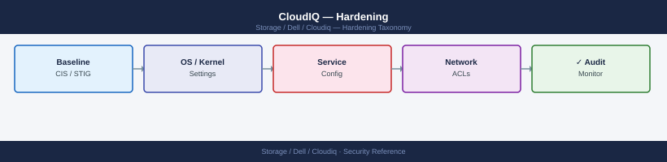

---
tags:
  - dell
  - security
---
# CloudIQ — Hardening

CloudIQ hardening: audit log retention policy, MFA enforcement for admin accounts, IP allowlist configuration, and SIEM integration via syslog or REST API.

*Applies to: CloudIQ*

> Part of the [CloudIQ](../index.md) reference.

---

## Before you begin

- **Access:** Storage admin credentials (cluster admin or equivalent)
- **Change management:** security changes require CAB approval in most environments
- **Rollback plan:** document current state before any security control change
- **Testing:** validate in a non-production environment first where possible

---

## Audit Log

CloudIQ logs all user actions and API calls in a tamper-evident audit log. Access the audit log under **Admin > Audit Log** in the CloudIQ portal.

Audit events include:

- User logins and logouts (including source IP)
- Changes to notification rules, user roles, and API credentials
- API calls made by integration accounts
- System registration and deregistration events

The audit log can be filtered by date, user, and event type and exported as CSV for SIEM ingestion. Integrate with your SIEM (Splunk, Microsoft Sentinel, etc.) by periodically exporting the audit log via the CloudIQ API or by configuring a scheduled export.

Retain audit log exports for a minimum of 90 days in accordance with your organisation's security policy.

## Security Baseline

- Enforce MFA for all non-federated Dell accounts with CloudIQ access
- Configure SSO/federation via Azure AD or Okta where a corporate IdP is available
- Restrict CloudIQ Admin role to named individuals only
- Use a dedicated API service account per integration — do not share credentials between integrations
- Rotate API client secrets every 90 days and store in a secrets vault
- Review the audit log monthly for unexpected API access or configuration changes

---

## See also

- [Cloudiq — Authentication](../authentication/)
- [Cloudiq — Access Control](../access-control/)
- [Cloudiq — Encryption](../encryption/)
