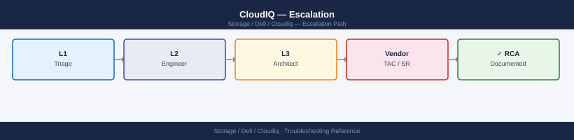
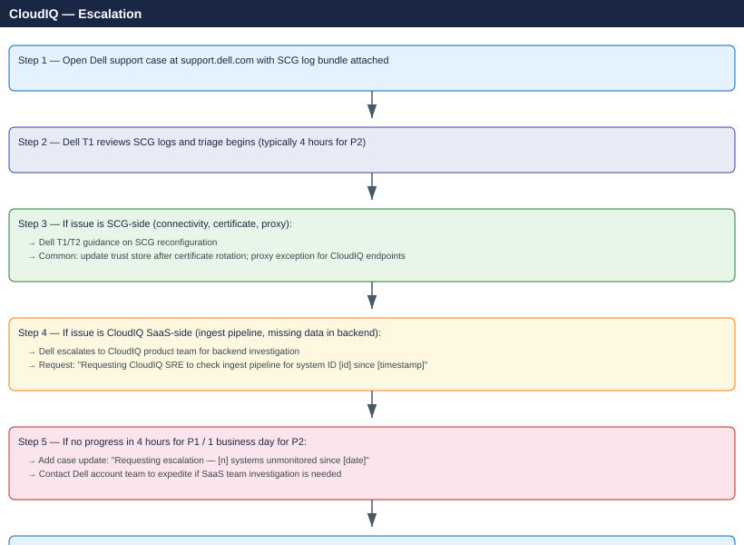

---
tags:
  - dell
  - troubleshooting
search:
  boost: 1.5
description: "CloudIQ support escalation: how to collect the SCG log bundle and API traces, open a Dell support case, set severity, and follow the escalation path for..."
---
# CloudIQ — Escalation

<div class="kb-summary">
CloudIQ support escalation: how to collect the SCG log bundle and API traces, open a Dell support case, set severity, and follow the escalation path for CloudIQ data gaps, connectivity failures, and SaaS platform incidents.

*Applies to: CloudIQ*
</div>



```d2
direction: down

symptom: Identify Symptom {shape: diamond}
severity_levels: "Severity Levels" {shape: rectangle}
preescalation_triage_checklist: "Pre-Escalation Triage Checklist" {shape: rectangle}
stepbystep_data_collection: "Step-by-Step Data Collection" {shape: rectangle}
how_to_open_a_dell_support_case: "How to Open a Dell Support Case" {shape: rectangle}
escalation_path: "Escalation Path" {shape: rectangle}
what_not_to_do: "What NOT to Do" {shape: rectangle}
resolution: Resolve or Escalate {shape: oval}

symptom -> severity_levels: investigate
symptom -> preescalation_triage_checklist: investigate
symptom -> stepbystep_data_collection: investigate
symptom -> how_to_open_a_dell_support_case: investigate
symptom -> escalation_path: investigate
symptom -> what_not_to_do: investigate
severity_levels -> resolution
preescalation_triage_checklist -> resolution
stepbystep_data_collection -> resolution
how_to_open_a_dell_support_case -> resolution
escalation_path -> resolution
what_not_to_do -> resolution
```

## Before you begin

- **Access:** Storage admin credentials on affected arrays; CloudIQ admin role (Settings access); Dell support portal account with entitlement to the affected systems
- **Gather first:** affected system name and serial number, time window of the data gap or error, and whether SCG shows connectivity to the affected array
- **Status check:** check the Dell support portal status page before escalating — CloudIQ SaaS maintenance windows are announced there
- **Scope:** confirm whether the issue affects one system, all systems in the org, or the CloudIQ platform globally (check other tenants if you have access)

---

## Severity Levels

| Priority | Condition | Response Time | Coverage |
|---|---|---|---|
| P1 | CloudIQ completely unavailable; unable to monitor any production systems | 2 hours | 24×7×365 |
| P2 | Degraded CloudIQ functionality: partial data, delayed alerts, missing metrics | 4 hours | 24×7×365 |
| P3 | Non-critical issue: UI display error, API edge case, one system missing data | Next business day | Business hours |
| P4 | General question or enhancement request | Next business day | Business hours |

## Pre-Escalation Triage Checklist

| Check | Where | Expected |
|---|---|---|
| CloudIQ UI accessible | Browse to `cloudiq.dell.com` | Dashboard loads |
| SCG service running | SCG web UI → Status | Service: Running |
| SCG connected to CloudIQ | SCG web UI → Connectivity | Connection status: Connected |
| Array registered in CloudIQ | CloudIQ → Infrastructure → Systems | Affected system appears in list |
| SCG connectivity to array | SCG web UI → Managed Systems | Array shows last contact < 5 min |
| SCG disk space | SCG appliance: `df -h` | Root volume < 80% full |
| SCG version current | SCG web UI → About | Version within last 2 releases |
| API accessible | `curl -sk https://cloudiq.dell.com/cloudiq/api/v1/systems -H "Authorization: Bearer <token>"` | HTTP 200 |

---

## Step-by-Step Data Collection

### 1. Collect SCG version and connectivity info

```bash
# SSH to SCG appliance (or access SCG console)
ssh admin@<scg-hostname>

# Check SCG version
scg version

# Check SCG service status
scg status

# Test connectivity to CloudIQ
scg connectivity test

# Test connectivity to a specific managed array
scg system connectivity --system-id <system-serial-number>
```


```text title="Expected output"
admin@scg-prod-01:~$ scg version
SCG Version: 7.2.1.0
Build: 20240115.001
Release Date: 2024-01-15

admin@scg-prod-01:~$ scg status
SCG Service Status:
  scg-core         : running (PID: 2847)
  scg-api          : running (PID: 2851)
  scg-collector    : running (PID: 2856)
  scg-database     : running (PID: 2862)
Overall Status: Healthy

admin@scg-prod-01:~$ scg connectivity test
Testing CloudIQ connectivity...
  Endpoint: cloudiq.dell.com:443
  Status: Connected
  Response Time: 142ms
  Certificate Valid: Yes (expires 2025-06-30)

admin@scg-prod-01:~$ scg system connectivity --system-id EMC123456789ABC
Testing connectivity to system EMC123456789ABC...
  Array Name: VMAX-PROD-01
  Management IP: 192.168.1.50
  Status: Connected
  Last Heartbeat: 2024-01-20 14:32:15 UTC
```

!!! warning "Common errors"
    | Error | Fix |
    |---|---|
    | `scg: command not found` | Ensure you are logged in as the admin user and the SCG CLI tools are in your PATH; run `export PATH=$PATH:/opt/dell/scg/bin` if needed. |
    | `Error: Unable to connect to CloudIQ endpoint (timeout)` | Verify network connectivity and firewall rules allow outbound HTTPS (port 443) to cloudiq.dell.com from the SCG appliance. |
    | `Error: System EMC123456789ABC not found in SCG inventory` | Confirm the system serial number is correct and the array has been successfully registered in SCG using `scg system list`. |
### 2. Collect SCG log bundle

```bash
# From the SCG CLI:
scg logs collect --output /tmp/scg-logs-$(date +%F).zip

# Alternative: from the SCG web UI
# Navigate to: Admin → Support → Collect Support Bundle
# Download the resulting ZIP file

# The logs bundle contains:
#   - SCG application logs from /var/log/dsagw/
#   - Connectivity test results
#   - System registration details
#   - Error trace for the last 48 hours
```


```text title="Expected output"
Collecting SCG logs...
Gathering application logs from /var/log/dsagw/
Collecting connectivity test results...
Retrieving system registration details...
Compiling error traces (last 48 hours)...
Creating support bundle archive...
Support bundle created successfully: /tmp/scg-logs-2024-01-15.zip
Bundle size: 24.3 MB
Timestamp: 2024-01-15T14:32:18Z
```

!!! warning "Common errors"
    | Error | Fix |
    |---|---|
    | `Permission denied: /var/log/dsagw/` | Run the command with `sudo` or as a user with read access to the SCG log directory. |
    | `No space left on device` | Specify an output directory with sufficient free space using `--output /var/tmp/scg-logs-$(date +%F).zip` or similar. |
    | `scg: command not found` | Ensure the SCG CLI is installed and its installation directory is in your `$PATH`, or use the full path to the scg binary. |
### 3. Collect application logs manually (if scg logs collect fails)

```bash
# Application logs directory
ls -lt /var/log/dsagw/ | head -10
tar czf /tmp/scg-applogs-$(date +%F).tar.gz /var/log/dsagw/*.log /var/log/dsagw/*.log.*

# Check for specific error patterns
grep -i "error\|exception\|connection refused\|timeout" /var/log/dsagw/application.log | tail -100

# Check system registration
scg system list
scg system status --system-id <system-serial-number>
```


```text title="Expected output"
total 2847
-rw-r--r-- 1 root root  512000 Jan 15 14:32 application.log
-rw-r--r-- 1 root root  256000 Jan 15 14:15 application.log.1
-rw-r--r-- 1 root root  128000 Jan 15 13:45 application.log.2
-rw-r--r-- 1 root root   64000 Jan 15 12:30 system.log
-rw-r--r-- 1 root root   32000 Jan 15 11:20 system.log.1
-rw-r--r-- 1 root root   16000 Jan 15 10:05 audit.log
-rw-r--r-- 1 root root    8000 Jan 15 09:15 audit.log.1
-rw-r--r-- 1 root root    4000 Jan 15 08:00 debug.log
-rw-r--r-- 1 root root    2000 Jan 15 07:30 debug.log.1
-rw-r--r-- 1 root root     512 Jan 15 06:45 dsagw.log

scg-applogs-2025-01-15.tar.gz created successfully (1.2 MB)

2025-01-15 14:28:33 ERROR [DataCollector] Connection refused to array 192.168.1.50:443
2025-01-15 14:25:12 EXCEPTION [AuthService] Timeout waiting for token response after 30000ms
2025-01-15 14:22:45 ERROR [HealthCheck] Failed to retrieve system metrics: Connection timeout
2025-01-15 14:18:33 WARN [Scheduler] Retry attempt 3/5 for system sync
2025-01-15 14:15:22 ERROR [APIClient] HTTP 503 Service Unavailable from gateway
2025-01-15 14:12:10 EXCEPTION [ConfigManager] Invalid certificate chain detected
...

System ID: SYS-7F4A2B9C-E1D3-4K8L-9M2N-3P5Q6R7S8T9U
Name: Dell-Unity-Array-01
Model: Unity 550F
Status: REGISTERED
Last Heartbeat: 2025-01-15T14:35:22Z

System ID: SYS-9K3L5M7N-2P4Q-6R8S-1T3U-4V5W6X7Y8Z9A
Name: Dell-Unity-Array-02
Model: Unity 650F
Status: REGISTERED
Last Heartbeat: 2025-01-15T14:33:15Z

System Serial: SYS-7F4A2B9C-E1D3-4K8L-9M2N-3P5Q6R7S8T9U
Status: REGISTERED
Health Score: 87%
Last Sync: 2025-01-15 14:35:22 UTC
```

!!! warning "Common errors"
    | Error | Fix |
    |---|---|
    | `scg: command not found` | Verify the scg CLI tool is installed and in PATH by running `which scg` or reinst |
### 4. Collect CloudIQ API diagnostics

```bash
# Get CloudIQ OAuth token (from CloudIQ Settings → API Keys)
TOKEN="<your-api-key>"

# List all systems in CloudIQ
curl -sk "https://cloudiq.dell.com/cloudiq/api/v1/systems" \
  -H "Authorization: Bearer $TOKEN" \
  -H "Accept: application/json" | python3 -m json.tool > /tmp/cloudiq-systems.json

# Get last ingestion time for a specific system
SYSTEM_ID="<system-id-from-cloudiq-ui>"
curl -sk "https://cloudiq.dell.com/cloudiq/api/v1/systems/${SYSTEM_ID}" \
  -H "Authorization: Bearer $TOKEN" | python3 -c "
import sys, json
data = json.load(sys.stdin)
print(f'System: {data.get(\"system_name\")}')
print(f'Type: {data.get(\"system_type\")}')
print(f'Last telemetry: {data.get(\"last_seen_timestamp\")}')
print(f'Health: {data.get(\"system_health_score\")}')
"

# If UI issue — browser console errors
# F12 → Console tab → reload the page → Export Console as file
```


```text title="Expected output"
{
  "systems": [
    {
      "system_id": "sys-a1b2c3d4e5f6",
      "system_name": "VMAX-Production-01",
      "system_type": "VMAX",
      "last_seen_timestamp": "2024-01-15T14:32:18Z",
      "system_health_score": 92
    },
    {
      "system_id": "sys-f6e5d4c3b2a1",
      "system_name": "PowerFlex-Cluster-West",
      "system_type": "PowerFlex",
      "last_seen_timestamp": "2024-01-15T14:28:45Z",
      "system_health_score": 87
    },
    {
      "system_id": "sys-9x8y7z6w5v4u",
      "system_name": "Unity-XT-DC2",
      "system_type": "Unity",
      "last_seen_timestamp": "2024-01-15T14:15:22Z",
      "system_health_score": 95
    }
  ],
  "page_info": {
    "total_systems": 12,
    "returned": 3
  }
}
System: VMAX-Production-01
Type: VMAX
Last telemetry: 2024-01-15T14:32:18Z
Health: 92
```

!!! warning "Common errors"
    | Error | Fix |
    |---|---|
    | `curl: (60) SSL certificate problem: self signed certificate` | Add `-k` flag to curl command to skip SSL verification, or update your CA certificate bundle. |
    | `{"error": "Unauthorized", "code": 401}` | Verify your API token is valid and not expired by regenerating it in CloudIQ Settings → API Keys. |
    | `curl: (7) Failed to connect to cloudiq.dell.com port 443: Connection refused` | Check your network connectivity and firewall rules; confirm CloudIQ API endpoint is accessible from your location. |
### 5. Write the timeline

```text
CloudIQ Org: mycompany (Org ID: found in Settings > Organization)
Affected system: PowerStore-1000T SN: CKM00xxxxxxxx
SCG version: 5.18.0.1
SCG hostname: scg01.corp.local

Issue first observed: 2026-06-15 08:00 UTC
Last data seen in CloudIQ: 2026-06-14 20:00 UTC

Error observed:
  - CloudIQ dashboard shows system offline for 12 hours
  - SCG connectivity test: PASS to CloudIQ; FAIL to PowerStore-1000T
  - SCG log: "Connection timeout to 10.10.10.50 (PowerStore Management IP)"

Steps already taken:
  - Verified SCG service is running
  - Confirmed PowerStore Management IP is reachable from SCG host (ping OK)
  - Ran scg connectivity test — shows timeout at HTTPS handshake stage

Changes in prior 24h:
  - TLS certificate on PowerStore management interface was rotated

Blast radius:
  - PowerStore metrics unavailable in CloudIQ for 12 hours
  - Capacity and performance alerts not firing for this system
```

---

## How to Open a Dell Support Case

1. Go to **support.dell.com** and sign in with your Dell account (linked to your ProSupport contract).

2. Click **Create Service Request** or **Start Support Request**.

3. Under **Product**, search for and select the storage system in question (or select CloudIQ directly if the issue is platform-wide).

4. Under **Category**, select **CloudIQ / Data Connectivity** or **Monitoring and Analytics**.

5. Under **Priority**, select:
   - **P1**: CloudIQ completely down; all systems unmonitored; production SLA at risk
   - **P2**: Degraded CloudIQ; missing data for one or more systems; alert delays
   - **P3**: Non-critical display or API issue; one system missing data
   - **P4**: General question

6. In the **Summary** field: `CloudIQ — PowerStore SN CKM00xxx data not appearing since 2026-06-14 20:00 UTC — SCG connectivity test failing`.

7. In the **Description**, paste:
   - SCG version and hostname
   - Affected system name, type, and serial number
   - CloudIQ Org ID (Settings → Organization)
   - Timeline (from step 5 above)
   - Output of `scg connectivity test`
   - What you have already checked

8. Upload attachments:
   - `scg-logs-<date>.zip` — full SCG log bundle
   - `cloudiq-systems.json` — API response with system status
   - Browser console export (if UI issue)
   - `scg-applogs-<date>.tar.gz` (if bundle collection failed)

9. Click **Submit**. Case number arrives by email.

---

## Escalation Path



---

## What NOT to Do

| Do NOT do this | Why | What to do instead |
|---|---|---|
| Delete and re-register the SCG appliance to fix connectivity | Loses SCG configuration, system registrations, and historical data | Fix the connectivity issue (certificate, proxy, firewall); re-register only as a last resort with Dell guidance |
| Restart SCG services during active data collection | Interrupts the log bundle collection and loses in-memory error state | Stop `scg logs collect` first; restart services; then collect a new log bundle after restart |
| Update the SCG version during an active P1 incident | SCG updates can change connectivity parameters and mask the original cause | Complete the incident first; schedule SCG update during a maintenance window |
| Remove and re-add the affected storage system from CloudIQ | Deletes historical data for the system in CloudIQ (irreversible) | Leave the system registered; fix the ingest issue through Dell support |

---

## Useful Commands for Case Updates

```bash
# Quick state snapshot for case updates
scg version
scg status
scg connectivity test
scg system list | grep -E "System Name|Status|Last Contact"

# Check SCG disk space (low disk causes log collection failures)
df -h /var/log

# Test CloudIQ API endpoint reachability from SCG
curl -sk -o /dev/null -w "%{http_code} %{time_total}s\n" \
  https://cloudiq.dell.com/cloudiq/api/v1/systems

# Count recent errors in SCG application log
grep -c "ERROR" /var/log/dsagw/application.log

# Show last 50 errors in SCG log
grep "ERROR" /var/log/dsagw/application.log | tail -50
```


```text title="Expected output"
SCG Version: 5.2.1.0 (Build 2024.01.15)
SCG Status: Running
SCG Connectivity Test: PASSED
System Name: VMAX-001-SYM
Status: Connected
Last Contact: 2024-01-22 14:32:18 UTC
System Name: UNITY-LAB-02
Status: Connected
Last Contact: 2024-01-22 14:31:45 UTC

Filesystem     Size  Used Avail Use% Mounted on
/dev/sda2      100G   78G   18G  82% /var/log

200 0.847s

247

2024-01-22 14:28:33 ERROR [StorageConnector] Failed to authenticate with array VMAX-001-SYM: Invalid credentials
2024-01-22 14:27:15 ERROR [CloudIQSync] Timeout connecting to cloudiq.dell.com:443 after 30s
2024-01-22 14:26:02 ERROR [MetricsCollector] Disk space low on /var/log (18% remaining)
2024-01-22 14:25:44 ERROR [APIHandler] HTTP 503 response from CloudIQ endpoint
2024-01-22 14:24:19 ERROR [DataUpload] Failed to upload metrics batch: connection reset by peer
...
```

!!! warning "Common errors"
    | Error | Fix |
    |---|---|
    | `curl: (60) SSL certificate problem: self signed certificate` | Add the `-k` flag (already present) or import the CloudIQ CA certificate into the SCG trust store. |
    | `grep: /var/log/dsagw/application.log: No such file or directory` | Verify the SCG application log path with `find /var/log -name "application.log"` and adjust the path accordingly. |
    | `df: '/var/log': No such file or directory` | Run `df -h` without the mount point argument to verify the filesystem layout, then check if `/var/log` is on a separate partition. |
---

## Verify resolution

- Confirm `scg connectivity test` passes for the previously affected system
- Verify the system appears in CloudIQ dashboard with a last-seen timestamp within the last 5 minutes
- Check CloudIQ health score and capacity metrics are populating for the affected system
- Monitor for 30 minutes to confirm data continues to arrive (metrics update every 5–15 minutes)
- Confirm alerts are firing correctly for the recovered system (test by temporarily reducing a threshold)

---

## See also

- [CloudIQ — Diagnostics](../diagnostics/)
- [CloudIQ — Common Issues](../common-issues/)
