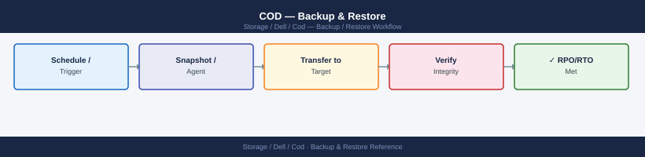

---
tags:
  - dell
  - operations
---
# COD — Backup & Restore

Dell CoD (Capacity on Demand) backup and restore: licence file backup, configuration export via SYMCLI, and procedure to restore capacity entitlements after hardware replacement.

*Applies to: Cloud for Desktop (COD)*

> Part of the [COD](../index.md) reference.

---

COD does not manage data backup directly. Key items to protect:

- **COD license files**: store downloaded license key files (`.xml`/`.dat`) in a secure, backed-up location — a secrets vault or a protected network share accessible only to storage admins. Lost license files require re-issuance from the Dell License Portal, which can cause delays during emergency activations.
- **COD inventory record**: maintain and back up the COD inventory tracking spreadsheet or CMDB records for each array including SID, activation dates, and headroom.
- **SYMCLI audit log exports**: periodically export `symaudit -sid <SID> list` output to a file and retain for compliance purposes.

## Before you begin

- **Access:** Storage admin credentials (cluster admin or equivalent)
- **Timing:** safe to run during business hours unless a step is marked ⚠ (causes interruption)
- **Dependencies:** no active upgrades or migrations on the same infrastructure
- **Logging:** capture command output — paste into the change record on completion

---

---

## Verify

- Confirm the operation completed without errors in the log or management UI
- Verify the expected state change is visible (service running, object created, config applied)
- Document the outcome in the change record

---

## See also

- [Cod — Procedures](../procedures/)
- [Cod — Health Checks](../health-checks/)
- [Cod — Common Issues](../../troubleshooting/common-issues/)
