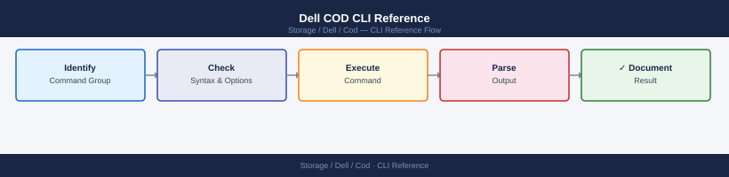

---
tags:
  - dell
  - operations
---
# Dell COD CLI Reference

*Applies to: Dell Cloud Object Detachment*


```bash
# --- Discover all arrays reachable from this host ---
symcfg discover

# List all known arrays (short form)
symcfg list

# List arrays with extended info (model, microcode, cache, licensed capacity)
symcfg list -v

# Show full array configuration for a specific SID
symcfg list -v -sid <sid>

# Full detailed configuration dump (includes all pools, directors, FE ports)
symcfg show -v -sid <sid>

# --- Storage Resource Pools (SRP) — where COD capacity surfaces ---
# Show all SRPs and their capacity by service level tier
symcfg -sid <sid> show -pool

# Show emulation/thin pool details (raw COD capacity lives here)
symcfg -sid <sid> show -pool -thin

# Show disk group capacity breakdown (identifies locked/unlocked disks)
symcfg -sid <sid> list -disk

# Show only thin/EFD disks with capacity summary
symcfg -sid <sid> list -disk -thin
```


```text title="Expected output"
Symmetrix ID: 000296900111
Symmetrix ID: 000296900222
Symmetrix ID: 000296900333

Symmetrix ID          Microcode     Cache  Model
000296900111          5978.669.669  384GB  VMAX250F
000296900222          5978.669.669  768GB  VMAX450F
000296900333          5978.669.669  1.5TB  VMAX850F

Symmetrix ID: 000296900111
Model: VMAX250F
Microcode: 5978.669.669
Cache: 384 GB
Licensed Capacity: 100.0 TB
Pools: 4
Directors: 8
Front-End Ports: 32

SRP_1 (Performance):        45.2 TB allocated, 12.8 TB free
SRP_2 (Capacity):           78.5 TB allocated, 8.3 TB free
SRP_3 (Archive):            22.1 TB allocated, 3.2 TB free
SRP_4 (Thin):               15.6 TB allocated, 5.9 TB free

Pool Name          Type        Capacity    Allocated   Free
SRP_1_Thin         Thin        50.0 TB     42.3 TB     7.7 TB
SRP_2_Thin         Thin        85.0 TB     71.2 TB     13.8 TB
SRP_3_EFD          EFD         25.0 TB     18.5 TB     6.5 TB

Disk Group 0       Type: SAS    Capacity: 120 TB    Status: Unlocked
Disk Group 1       Type: SAS    Capacity: 120 TB    Status: Locked
Disk Group 2       Type: EFD    Capacity: 50 TB     Status: Unlocked
Disk Group 3       Type: EFD    Capacity: 50 TB     Status: Locked
...
```

!!! warning "Common errors"
    | Error | Fix |
    |---|---|
    | `Symmetrix ID <sid> does not exist` | Verify the SID with `symcfg discover` and ensure the array is reachable on the network. |
    | `SYMAPI Server connection failed` | Restart the Symmetrix management daemon with `sudo /opt/emc/SYMAPI/bin/symapi_control restart` and verify network connectivity to the array. |
    | `Insufficient privileges to execute command` | Run the command with `sudo` or ensure your user is in the `symapi` group with `sudo usermod -a -G symapi $USER`. |
```bash
UNISPHERE="https://<unisphere_host>:8443"
SID="<sid>"
USER="smc"
PASS="<password>"

# --- Get array system capacity (licensed, configured, COD available) ---
curl -s -k -u "${USER}:${PASS}" \
  "${UNISPHERE}/univmax/restapi/100/system/symmetrix/${SID}/system_capacity" \
  | python3 -m json.tool

# Key response fields:
#   system_capacity.usable_total_tb         – Total usable (licensed) TB
#   system_capacity.usable_used_tb          – Currently used TB
#   system_capacity.subscribed_total_tb     – Thin-provisioned (subscribed) TB
#   system_capacity.subscribed_allocated_tb – Allocated to host devices TB

# --- Get array system info (includes license model and COD tier) ---
curl -s -k -u "${USER}:${PASS}" \
  "${UNISPHERE}/univmax/restapi/100/system/symmetrix/${SID}" \
  | python3 -m json.tool

# --- Get SRP details (capacity broken down by service level) ---
curl -s -k -u "${USER}:${PASS}" \
  "${UNISPHERE}/univmax/restapi/100/sloprovisioning/symmetrix/${SID}/srp" \
  | python3 -m json.tool

# Get a specific SRP
SRP_ID="SRP_1"
curl -s -k -u "${USER}:${PASS}" \
  "${UNISPHERE}/univmax/restapi/100/sloprovisioning/symmetrix/${SID}/srp/${SRP_ID}" \
  | python3 -m json.tool

# Key SRP fields:
#   srp_capacity.usable_total_tb
#   srp_capacity.usable_used_tb
#   srp_capacity.subscribed_total_tb
#   emulation                     – disk type (FBA, EFD)
#   diskGroupId[]                 – disk group list (add from COD activation shows here)

# --- List all disk groups (confirm COD groups are formatted) ---
curl -s -k -u "${USER}:${PASS}" \
  "${UNISPHERE}/univmax/restapi/100/system/symmetrix/${SID}/disk_group" \
  | python3 -m json.tool
```

```text title="Expected output"
{
  "system_capacity": {
    "usable_total_tb": 450.5,
    "usable_used_tb": 287.3,
    "subscribed_total_tb": 612.8,
    "subscribed_allocated_tb": 298.1
  }
}
{
  "symmetrix": [
    {
      "symmetrixId": "000296802151",
      "model": "PowerMax 8000",
      "ucode": "5978.1221.1221",
      "local_user_name": "smc",
      "license_model": "CAPACITY_ON_DEMAND",
      "cod_tier": "TIER_2"
    }
  ]
}
{
  "srp": [
    {
      "srpId": "SRP_1",
      "srp_capacity": {
        "usable_total_tb": 450.5,
        "usable_used_tb": 287.3,
        "subscribed_total_tb": 612.8
      },
      "emulation": "FBA",
      "diskGroupId": ["DG_001", "DG_002", "DG_003"]
    },
    {
      "srpId": "SRP_2",
      "srp_capacity": {
        "usable_total_tb": 200.0,
        "usable_used_tb": 145.6,
        "subscribed_total_tb": 280.0
      },
      "emulation": "EFD",
      "diskGroupId": ["DG_004"]
    }
  ]
}
{
  "srp": [
    {
      "srpId": "SRP_1",
      "srp_capacity": {
        "usable_total_tb": 450.5,
        "usable_used_tb": 287.3,
        "subscribed_total_tb": 612.8,
        "subscribed_allocated_tb": 298.1
      },
      "emulation": "FBA",
      "diskGroupId": ["DG_001", "DG_002", "DG_003"]
    }
  ]
}
{
  "disk_group": [
    {
      "diskGroupId": "DG_001",
      "disk_count": 14,
      "disk_type": "SSD",
      "capacity_gb": 153600
    },
    {
      "diskGroupId": "DG_002",
      "disk_count": 14,
      "disk_type": "SSD",
      "capacity_gb": 153600
    },
    {
      "diskGroupId": "DG_003",
      "disk_count": 14,
      "disk_type": "SSD",
      "capacity_gb": 153600
    },
    {
      "diskGroupId": "DG_004",
      "disk_count": 10,
      "disk_type": "NL-SAS",
      "capacity_gb": 102400
    }
  ]
}
```

!!! warning "Common errors"
    | Error | Fix |
    |---|---|
    | `curl: (60) SSL certificate problem: self signed certificate` | Add `-k` flag to curl command to skip certificate verification (already present in the example, but |
```bash
# List all licenses with status
symcfg -sid <sid> list -license

# Show license for a specific feature
symcfg -sid <sid> list -license -feature "TimeFinder/SnapVX"

# Import a new license key file
symlmf -sid <sid> import -file /tmp/license_file.dat

# Export current license information to a file
symlmf -sid <sid> report -out /tmp/current_licenses.txt

# Check Solutions Enabler version (license compatibility)
symcfg -version

# Verify Solutions Enabler can communicate with the array
symcfg list -sid <sid> -v 2>&1 | head -5
```


```text title="Expected output"
Symmetrix ID: 000123456789012
License Information:
  Feature Name              Status    Expiration Date    Capacity
  TimeFinder/SnapVX         Licensed  2025-12-31         Unlimited
  SRDF/Metro                Licensed  2025-12-31         Unlimited
  RecoverPoint              Not Lic.  N/A                N/A
  Unisphere Management      Licensed  2026-06-15         Unlimited

Feature: TimeFinder/SnapVX
  Status: Licensed
  Expiration: 2025-12-31
  Capacity: Unlimited
  License Key: ABC123XYZ789DEF456

License file /tmp/license_file.dat imported successfully.
Symmetrix ID 000123456789012 updated.

Report written to /tmp/current_licenses.txt
Total licenses exported: 4

Solutions Enabler Version: 9.2.1.0 (Build 123.456)

Symmetrix ID: 000123456789012
Symmetrix Model: PowerMax 8000
Director Count: 4
Capacity: 50 TB
```

!!! warning "Common errors"
    | Error | Fix |
    |---|---|
    | `symcfg: error: Invalid SID format` | Verify the SID is 12 digits and set correctly with `-sid` parameter or `SYMCFG_CONNECT` environment variable. |
    | `symlmf: error: License file not found: /tmp/license_file.dat` | Confirm the license file path exists and is readable with `ls -la /tmp/license_file.dat`. |
    | `symcfg: error: Cannot connect to array` | Ensure the Symmetrix array is reachable and Solutions Enabler daemon is running with `sudo /opt/emc/SYMCLI/bin/stordaemon start`. |
## Before you begin

- **Access:** Storage admin credentials (cluster admin or equivalent)
- **Timing:** safe to run during business hours unless a step is marked ⚠ (causes interruption)
- **Dependencies:** no active upgrades or migrations on the same infrastructure
- **Logging:** capture command output — paste into the change record on completion

---

---

## Verify

- Confirm the operation completed without errors in the log or management UI
- Verify the expected state change is visible (service running, object created, config applied)
- Document the outcome in the change record

---

## See also

- [Cod — Procedures](../procedures/)
- [Cod — Scripts](../scripts/)
- [Cod — Health Checks](../health-checks/)
