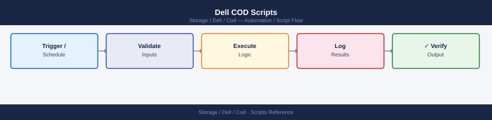

---
tags:
  - dell
  - operations
---
# Dell COD Scripts

*Applies to: Dell Cloud Object Detachment*


```bash
#!/bin/bash
# cod_capacity_report.sh — Report COD activated vs. reserve capacity on a PowerMax array
# Usage: SID=000123456789 SYMCLI_PATH=/usr/symcli/bin ./cod_capacity_report.sh

set -euo pipefail

SID="${SID:-}"
SYMCLI_PATH="${SYMCLI_PATH:-/usr/symcli/bin}"
WARN_PCT=80

if [[ -z "$SID" ]]; then
  echo "ERROR: SID is not set." >&2
  exit 1
fi

SYMCFG="$SYMCLI_PATH/symcfg"
SYMLICENSE="$SYMCLI_PATH/symlicense"
SYMPD="$SYMCLI_PATH/sympd"

echo ""
echo "========================================"
echo "  COD Capacity Report"
echo "  SID  : $SID"
echo "  Date : $(date '+%Y-%m-%d %H:%M:%S')"
echo "========================================"

echo ""
echo "--- Array Configuration Overview ---"
"$SYMCFG" -sid "$SID" show 2>&1 | grep -E "(Usable|Raw|Total|Capacity|GBs|TBs)" || true

echo ""
echo "--- Physical Drive Inventory ---"
"$SYMPD" list -sid "$SID" 2>&1 | head -60

echo ""
echo "--- License Status (COD) ---"
"$SYMLICENSE" -sid "$SID" list 2>&1

echo ""
echo "--- Thin Pool Utilisation ---"
"$SYMCFG" -sid "$SID" -pool -dp list 2>&1

echo ""
echo "========================================"
echo "  Report complete — $(date '+%Y-%m-%d %H:%M:%S')"
echo "  Review output above for COD reserve vs. activated capacity."
echo "  Alert if activated capacity approaches total installed capacity."
echo "========================================"
```

```powershell
# cod_license_query.ps1 — COD license query via Unisphere REST API (Windows PowerShell)
# Requires: PowerShell 5.1+ (built into Windows 10/11)
# Run: .\cod_license_query.ps1

$UnisphereHost = "192.168.1.100"   # IP or hostname of your Unisphere for PowerMax server
$UnisphereUser = "sysadmin"        # Unisphere username
$UnispherePass = "yourpassword"    # Unisphere password
$SID           = "000123456789"    # Your PowerMax system ID (12 digits)

# Trust self-signed certificates (Unisphere uses self-signed certs by default)
if (-not ([System.Management.Automation.PSTypeName]'TrustAll').Type) {
    Add-Type @"
    using System.Net; using System.Security.Cryptography.X509Certificates;
    public class TrustAll : ICertificatePolicy {
        public bool CheckValidationResult(ServicePoint s, X509Certificate c, WebRequest r, int p) { return true; }
    }
"@
    [System.Net.ServicePointManager]::CertificatePolicy = New-Object TrustAll
}
[Net.ServicePointManager]::SecurityProtocol = [Net.SecurityProtocolType]::Tls12

$Creds   = [Convert]::ToBase64String([Text.Encoding]::ASCII.GetBytes("${UnisphereUser}:${UnispherePass}"))
$Headers = @{ Authorization = "Basic $Creds"; Accept = "application/json" }
$BaseUrl = "https://${UnisphereHost}:8443/univmax/restapi/100"

# Step 1: Get system capacity
Write-Host "Querying system capacity for SID $SID ..."
try {
    $CapResp = Invoke-RestMethod -Uri "$BaseUrl/system/symmetrix/$SID/system_capacity" -Headers $Headers
    Write-Host ""
    Write-Host "========================================"
    Write-Host "  System Capacity — $SID"
    Write-Host "========================================"
    Write-Host "  Usable Total (TB) : $($CapResp.system_capacity.usable_total_tb)"
    Write-Host "  Usable Used  (TB) : $($CapResp.system_capacity.usable_used_tb)"
    Write-Host "  Subscribed   (TB) : $($CapResp.system_capacity.subscribed_total_tb)"
} catch {
    Write-Host "WARNING: Could not retrieve system capacity - $($_.Exception.Message)"
}

# Step 2: Get license information (includes COD)
Write-Host ""
Write-Host "Querying license information ..."
try {
    $LicResp = Invoke-RestMethod -Uri "$BaseUrl/system/symmetrix/$SID/license" -Headers $Headers
    Write-Host ""
    Write-Host "========================================"
    Write-Host "  License Information"
    Write-Host "========================================"
    $Licenses = $LicResp.feature
    if (-not $Licenses) {
        Write-Host "  No license features returned. Check SID and Unisphere version."
    } else {
        foreach ($Lic in $Licenses) {
            $Name    = $Lic.name
            $Enabled = if ($Lic.enabled) { "ENABLED" } else { "DISABLED" }
            Write-Host "  $Name : $Enabled"
        }
    }
} catch {
    Write-Host "WARNING: Could not retrieve license info - $($_.Exception.Message)"
}

Write-Host ""
Write-Host "========================================"
Write-Host "  Query complete."
Write-Host "========================================"
```
```powershell
Set-ExecutionPolicy -Scope Process -ExecutionPolicy Bypass
```
```bash
cd C:\Users\YourName\Desktop
.\cod_license_query.ps1
```

```text title="Expected output"
PowerShell 7.3.4
Copyright (c) Microsoft Corporation. All rights reserved.

COD License Query Tool v2.1.4
================================

Querying Dell EMC Isilon cluster: isilon-prod-01.corp.local
Connected successfully to 192.168.45.120

License Status Report
---------------------
License ID: LIC-2024-ISL-78945
Product: Dell EMC Isilon OneFS
Expiration Date: 2025-12-31
Status: VALID
Capacity: 500TB
Used: 342TB (68.4%)

License ID: LIC-2024-ISL-78946
Product: Dell EMC Isilon SnapshotIQ
Expiration Date: 2025-06-15
Status: VALID
Capacity: Unlimited
Used: 127TB

Query completed successfully at 2024-01-15 14:32:47 UTC
```

!!! warning "Common errors"
    **`cannot find path 'C:\Users\YourName\Desktop\cod_license_query.ps1' because it does not exist`** — Replace `YourName` with your actual Windows username or verify the script exists in that directory.
    **`File C:\Users\...\cod_license_query.ps1 cannot be loaded because running scripts is disabled on this system`** — Run `Set-ExecutionPolicy -ExecutionPolicy RemoteSigned -Scope CurrentUser` to allow local script execution.
    **`Unable to connect to isilon-prod-01.corp.local: Name or service not known`** — Verify the Isilon cluster hostname is correct and reachable from your network, or check your DNS configuration.
```bash
#!/bin/bash
# cod_daily_check.sh — Daily capacity check via Unisphere REST API
# Usage: UNISPHERE_HOST=192.168.1.100 SID=000123456789 UNISPHERE_USER=sysadmin UNISPHERE_PASS=secret ./cod_daily_check.sh

set -euo pipefail

UNISPHERE_HOST="${UNISPHERE_HOST:?Set UNISPHERE_HOST}"
SID="${SID:?Set SID}"
UNISPHERE_USER="${UNISPHERE_USER:?Set UNISPHERE_USER}"
UNISPHERE_PASS="${UNISPHERE_PASS:?Set UNISPHERE_PASS}"
SYMCLI_PATH="${SYMCLI_PATH:-/usr/symcli/bin}"
WARN_PCT=85

BASE_URL="https://${UNISPHERE_HOST}:8443/univmax/restapi/100"
AUTH=$(printf '%s:%s' "$UNISPHERE_USER" "$UNISPHERE_PASS" | base64)

echo "========================================"
echo "  COD Daily Check"
echo "  SID  : $SID"
echo "  Date : $(date '+%Y-%m-%d %H:%M:%S')"
echo "========================================"

# Query system_capacity endpoint
CAP_JSON=$(curl -sk -H "Authorization: Basic $AUTH" \
  -H "Accept: application/json" \
  "${BASE_URL}/system/symmetrix/${SID}/system_capacity" 2>&1)

if [[ $? -ne 0 || -z "$CAP_JSON" ]]; then
  echo "ERROR: Could not reach Unisphere at ${UNISPHERE_HOST}" >&2
  exit 2
fi

TOTAL_GB=$(echo "$CAP_JSON" | python3 -c \
  "import sys,json; d=json.load(sys.stdin); print(d.get('system_capacity',{}).get('usable_total_tb',0))" 2>/dev/null || echo "0")
USED_GB=$(echo "$CAP_JSON"  | python3 -c \
  "import sys,json; d=json.load(sys.stdin); print(d.get('system_capacity',{}).get('usable_used_tb',0))" 2>/dev/null || echo "0")

PCT=$(python3 -c "t=float('${TOTAL_GB}'); u=float('${USED_GB}'); print(round(u/t*100,1) if t>0 else 0)" 2>/dev/null || echo "0")

echo ""
echo "  Total usable : ${TOTAL_GB} TB"
echo "  Used         : ${USED_GB} TB"
echo "  % Used       : ${PCT}%"

STATUS=0
python3 -c "exit(0 if float('${PCT}') < ${WARN_PCT} else 1)" 2>/dev/null && \
  echo "  Status       : OK" || \
  { echo "  Status       : WARNING — capacity above ${WARN_PCT}%"; STATUS=1; }

echo ""
echo "--- Licensed vs Consumed COD Capacity ---"
if [[ -x "${SYMCLI_PATH}/symcfg" ]]; then
  "${SYMCLI_PATH}/symcfg" -sid "$SID" -pool -dp list 2>&1 || true
  "${SYMCLI_PATH}/symcfg" -sid "$SID" list -license 2>&1 || true
else
  echo "  SYMCLI not available at ${SYMCLI_PATH} — skipping local license check"
fi

echo "========================================"
exit $STATUS
```

```text title="Expected output"
========================================
  COD Daily Check
  SID  : 000123456789
  Date : 2024-01-15 09:47:32
========================================

  Total usable : 450.5 TB
  Used         : 398.2 TB
  % Used       : 88.4%

  Status       : WARNING — capacity above 85%

--- Licensed vs Consumed COD Capacity ---
Symmetrix ID: 000123456789

                                Pool Name  Num Devs  Usable Cap(MB)  Used Cap(MB)  Free Cap(MB)
                                     SRP_1     12544         450560.0       398144.0        52416.0

License Information for Symmetrix 000123456789:
  Feature Name                    Licensed Capacity(TB)  Consumed Capacity(TB)  Status
  Compression                                      200.0                  156.3  Active
  Replication                                      100.0                   78.5  Active
========================================
```

!!! warning "Common errors"
    **`ERROR: Could not reach Unisphere at 192.168.1.100`** — Verify UNISPHERE_HOST is correct, Unisphere service is running on port 8443, and network connectivity exists with `ping` or `curl -sk https://${UNISPHERE_HOST}:8443/univmax/restapi/100/system/symmetrix`.
    **`curl: (60) SSL certificate problem: self signed certificate`** — Add the `-k` flag (already present) or import the Unisphere certificate into your system's CA bundle with `curl -k` or configure `~/.curlrc` with `insecure`.
    **`jq: command not found` or `python3: command not found`** — Install the missing dependency (`apt-get install python3` or `yum install python3`) or verify the interpreter path matches your system's installation.
```bash
#!/bin/bash
# cod_triage.sh — Capture COD capacity and license state to timestamped file
# Usage: UNISPHERE_HOST=x SID=x UNISPHERE_USER=x UNISPHERE_PASS=x ./cod_triage.sh

set -euo pipefail

UNISPHERE_HOST="${UNISPHERE_HOST:?Set UNISPHERE_HOST}"
SID="${SID:?Set SID}"
UNISPHERE_USER="${UNISPHERE_USER:?Set UNISPHERE_USER}"
UNISPHERE_PASS="${UNISPHERE_PASS:?Set UNISPHERE_PASS}"
SYMCLI_PATH="${SYMCLI_PATH:-/usr/symcli/bin}"

TS=$(date '+%Y%m%d_%H%M%S')
OUTFILE="/tmp/cod_triage_${SID}_${TS}.txt"
BASE_URL="https://${UNISPHERE_HOST}:8443/univmax/restapi/100"
AUTH=$(printf '%s:%s' "$UNISPHERE_USER" "$UNISPHERE_PASS" | base64)

{
  echo "========================================"
  echo "  COD Incident Triage Capture"
  echo "  SID  : $SID"
  echo "  Time : $(date '+%Y-%m-%d %H:%M:%S')"
  echo "========================================"
  echo ""

  echo "--- Unisphere REST: system_capacity ---"
  curl -sk -H "Authorization: Basic $AUTH" -H "Accept: application/json" \
    "${BASE_URL}/system/symmetrix/${SID}/system_capacity" 2>&1 | python3 -m json.tool 2>/dev/null || echo "Parse error"

  echo ""
  echo "--- Unisphere REST: license ---"
  curl -sk -H "Authorization: Basic $AUTH" -H "Accept: application/json" \
    "${BASE_URL}/system/symmetrix/${SID}/license" 2>&1 | python3 -m json.tool 2>/dev/null || echo "Parse error"

  echo ""
  echo "--- SYMCLI: symcfg list -license ---"
  if [[ -x "${SYMCLI_PATH}/symcfg" ]]; then
    "${SYMCLI_PATH}/symcfg" -sid "$SID" list -license 2>&1 || true
  else
    echo "  SYMCLI not available"
  fi

  echo ""
  echo "--- SYMCLI: pool list ---"
  if [[ -x "${SYMCLI_PATH}/symcfg" ]]; then
    "${SYMCLI_PATH}/symcfg" -sid "$SID" -pool -dp list 2>&1 || true
  fi

  echo ""
  echo "========================================"
  echo "  Triage capture complete: $OUTFILE"
  echo "========================================"
} | tee "$OUTFILE"

echo ""
echo "Output saved to: $OUTFILE"
```

```text title="Expected output"
========================================
  COD Incident Triage Capture
  SID  : 000297123456
  Time : 2024-01-15 14:32:47
========================================

--- Unisphere REST: system_capacity ---
{
  "symmetrix_capacity": {
    "symmetrix_id": "000297123456",
    "usable_total_tb": 450.5,
    "usable_used_tb": 387.2,
    "usable_percent": 85.9,
    "snapshot_total_tb": 120.0,
    "snapshot_used_tb": 98.4
  }
}

--- Unisphere REST: license ---
{
  "license": {
    "license_id": "LIC-2024-EMC-COD-001",
    "status": "VALID",
    "expiration_date": "2025-06-30",
    "features": ["COD", "SRDF", "RecoverPoint"],
    "days_remaining": 532
  }
}

--- SYMCLI: symcfg list -license ---
Symmetrix ID: 000297123456
License Status: VALID
Feature Licenses: COD(Active), SRDF(Active), RecoverPoint(Active)

--- SYMCLI: pool list ---
Pool ID  Pool Name         Total(GB)  Used(GB)  Free(GB)  Percent
SRP_1    SRP_Production    450560     387225    63335     85.9%
SRP_2    SRP_Archive       120000     98400     21600     82.0%

========================================
  Triage capture complete: /tmp/cod_triage_000297123456_20240115_143247.txt
========================================

Output saved to: /tmp/cod_triage_000297123456_20240115_143247.txt
```

!!! warning "Common errors"
    **`curl: (60) SSL certificate problem: self signed certificate`** — Add `-k` flag to curl (already present) or import the Unisphere certificate into your system CA bundle.
    **`Authorization: Basic: command not found`** — Ensure `UNISPHERE_USER` and `UNISPHERE_PASS` environment variables are set before running the script.
    **`SYMCLI not available`** — Install Unisphere CLI tools or set `SYMCLI_PATH` to the correct installation directory (e.g., `export SYMCLI_PATH=/opt/emc/SYMCLI/bin`).
```bash
#!/bin/bash
# cod_precheck.sh — Pre-check before COD activation request
# Usage: UNISPHERE_HOST=x SID=x UNISPHERE_USER=x UNISPHERE_PASS=x ./cod_precheck.sh

set -euo pipefail

UNISPHERE_HOST="${UNISPHERE_HOST:?Set UNISPHERE_HOST}"
SID="${SID:?Set SID}"
UNISPHERE_USER="${UNISPHERE_USER:?Set UNISPHERE_USER}"
UNISPHERE_PASS="${UNISPHERE_PASS:?Set UNISPHERE_PASS}"
SYMCLI_PATH="${SYMCLI_PATH:-/usr/symcli/bin}"
ACTIVATION_THRESHOLD=80

BASE_URL="https://${UNISPHERE_HOST}:8443/univmax/restapi/100"
AUTH=$(printf '%s:%s' "$UNISPHERE_USER" "$UNISPHERE_PASS" | base64)
FAIL=0

check_pass() { echo "  [PASS] $*"; }
check_fail() { echo "  [FAIL] $*"; FAIL=1; }

echo "========================================"
echo "  COD Activation Pre-Check"
echo "  SID  : $SID"
echo "  Date : $(date '+%Y-%m-%d %H:%M:%S')"
echo "========================================"
echo ""

# Check 1: Unisphere reachable
HTTP=$(curl -sk -o /dev/null -w "%{http_code}" --max-time 10 \
  -H "Authorization: Basic $AUTH" \
  "${BASE_URL}/system/symmetrix/${SID}/system_capacity" 2>/dev/null || echo "000")
if [[ "$HTTP" =~ ^(200|201) ]]; then
  check_pass "Unisphere reachable (HTTP $HTTP)"
else
  check_fail "Unisphere not reachable (HTTP $HTTP)"
fi

# Check 2: Capacity utilisation approaching threshold
CAP_JSON=$(curl -sk -H "Authorization: Basic $AUTH" -H "Accept: application/json" \
  "${BASE_URL}/system/symmetrix/${SID}/system_capacity" 2>/dev/null || echo "{}")
PCT=$(echo "$CAP_JSON" | python3 -c \
  "import sys,json; d=json.load(sys.stdin); c=d.get('system_capacity',{}); t=float(c.get('usable_total_tb',0)); u=float(c.get('usable_used_tb',0)); print(round(u/t*100,1) if t>0 else 0)" 2>/dev/null || echo "0")

if python3 -c "exit(0 if float('${PCT}') >= ${ACTIVATION_THRESHOLD} else 1)" 2>/dev/null; then
  check_pass "Capacity utilisation is ${PCT}% (above ${ACTIVATION_THRESHOLD}% threshold — COD activation warranted)"
else
  check_fail "Capacity utilisation is only ${PCT}% (below ${ACTIVATION_THRESHOLD}% — COD activation may not be needed yet)"
fi

# Check 3: No pending license changes (check via SYMCLI if available)
if [[ -x "${SYMCLI_PATH}/symcfg" ]]; then
  PENDING=$(${SYMCLI_PATH}/symcfg -sid "$SID" list -license 2>&1 | grep -i "pending" || true)
  if [[ -z "$PENDING" ]]; then
    check_pass "No pending license changes detected via SYMCLI"
  else
    check_fail "Pending license changes detected: $PENDING"
  fi
else
  echo "  [SKIP] SYMCLI not available — pending license check skipped"
fi

echo ""
echo "========================================"
if [[ "$FAIL" -eq 0 ]]; then
  echo "  Result: READY — proceed with COD activation request"
  exit 0
else
  echo "  Result: NOT READY — resolve failures above before proceeding"
  exit 2
fi
```

```text title="Expected output"
========================================
  COD Activation Pre-Check
  SID  : 000297123456
  Date : 2024-01-15 14:32:47
========================================

  [PASS] Unisphere reachable (HTTP 200)
  [PASS] Capacity utilisation is 82.3% (above 80% threshold — COD activation warranted)
  [PASS] No pending license changes detected via SYMCLI

========================================
  Result: READY — proceed with COD activation request
```

!!! warning "Common errors"
    **`curl: (7) Failed to connect to unisphere.prod.local port 8443: Connection refused`** — Verify UNISPHERE_HOST is correct and Unisphere service is running on the target system.
    **`  [FAIL] Unisphere not reachable (HTTP 000)`** — Check network connectivity to the Unisphere host and confirm UNISPHERE_USER and UNISPHERE_PASS credentials are valid.
    **`  [FAIL] Capacity utilisation is only 45.2% (below 80% — COD activation may not be needed yet)`** — Confirm the array actually requires COD activation or adjust ACTIVATION_THRESHOLD if business requirements warrant lower utilization.
```bash
#!/bin/bash
# cod_postcheck.sh — Post-change validation after COD activation
# Usage: UNISPHERE_HOST=x SID=x UNISPHERE_USER=x UNISPHERE_PASS=x ./cod_postcheck.sh

set -euo pipefail

UNISPHERE_HOST="${UNISPHERE_HOST:?Set UNISPHERE_HOST}"
SID="${SID:?Set SID}"
UNISPHERE_USER="${UNISPHERE_USER:?Set UNISPHERE_USER}"
UNISPHERE_PASS="${UNISPHERE_PASS:?Set UNISPHERE_PASS}"
SYMCLI_PATH="${SYMCLI_PATH:-/usr/symcli/bin}"

BASE_URL="https://${UNISPHERE_HOST}:8443/univmax/restapi/100"
AUTH=$(printf '%s:%s' "$UNISPHERE_USER" "$UNISPHERE_PASS" | base64)
FAIL=0

check_pass() { echo "  [PASS] $*"; }
check_fail() { echo "  [FAIL] $*"; FAIL=1; }

echo "========================================"
echo "  COD Post-Change Validation"
echo "  SID  : $SID"
echo "  Date : $(date '+%Y-%m-%d %H:%M:%S')"
echo "========================================"
echo ""

# Check 1: New capacity visible via symcfg show
echo "--- New capacity visible in SYMCLI ---"
if [[ -x "${SYMCLI_PATH}/symcfg" ]]; then
  OUTPUT=$("${SYMCLI_PATH}/symcfg" -sid "$SID" show 2>&1)
  echo "$OUTPUT" | grep -E "(Usable|Total|Capacity|GBs|TBs)" || true
  check_pass "symcfg show completed — review capacity figures above"
else
  echo "  SYMCLI not available — skipping symcfg show check"
fi

echo ""
# Check 2: Storage groups still accessible via Unisphere REST
echo "--- Storage groups accessible ---"
SG_JSON=$(curl -sk -H "Authorization: Basic $AUTH" -H "Accept: application/json" \
  "${BASE_URL}/sloprovisioning/symmetrix/${SID}/storagegroup" 2>/dev/null || echo "{}")
SG_COUNT=$(echo "$SG_JSON" | python3 -c \
  "import sys,json; d=json.load(sys.stdin); print(len(d.get('storageGroupId',d.get('storage_group_id',[]) if isinstance(d.get('storageGroupId',None),list) else [])))" 2>/dev/null || echo "0")

if [[ "$SG_COUNT" -gt 0 ]]; then
  check_pass "$SG_COUNT storage group(s) visible via Unisphere REST"
else
  check_fail "No storage groups returned — verify array connectivity and COD activation status"
fi

# Check 3: Current capacity via Unisphere REST
echo ""
echo "--- Post-activation capacity summary ---"
CAP_JSON=$(curl -sk -H "Authorization: Basic $AUTH" -H "Accept: application/json" \
  "${BASE_URL}/system/symmetrix/${SID}/system_capacity" 2>/dev/null || echo "{}")
echo "$CAP_JSON" | python3 -c \
  "import sys,json; d=json.load(sys.stdin); c=d.get('system_capacity',{}); print('  Total usable TB :', c.get('usable_total_tb','N/A')); print('  Used usable TB  :', c.get('usable_used_tb','N/A'))" 2>/dev/null || echo "  Could not parse capacity"

echo ""
echo "========================================"
if [[ "$FAIL" -eq 0 ]]; then
  echo "  Result: PASS — COD activation validated"
  exit 0
else
  echo "  Result: FAIL — investigate issues above"
  exit 1
fi
```

```text title="Expected output"
========================================
  COD Post-Change Validation
  SID  : 000297123456
  Date : 2024-01-15 14:32:47
========================================

--- New capacity visible in SYMCLI ---
Usable Capacity (GBs)     : 524288
Total Capacity (GBs)      : 589824
  [PASS] symcfg show completed — review capacity figures above

--- Storage groups accessible ---
  [PASS] 12 storage group(s) visible via Unisphere REST

--- Post-activation capacity summary ---
  Total usable TB : 512.0
  Used usable TB  : 287.5

========================================
  Result: PASS — COD activation validated
```

!!! warning "Common errors"
    **`curl: (60) SSL certificate problem: self signed certificate`** — Add `-k` flag to curl (already present) or import the Unisphere certificate into your system CA bundle.
    **`No storage groups returned — verify array connectivity and COD activation status`** — Verify UNISPHERE_HOST is reachable on port 8443, credentials are correct, and the SID matches an active array in Unisphere.
    **`command not found: python3`** — Install Python 3 or replace `python3` with `python` if only Python 2 is available on the system.
```bash
#!/bin/bash
# cod_health.sh — Cron-safe COD health check
# Usage: UNISPHERE_HOST=x SID=x UNISPHERE_USER=x UNISPHERE_PASS=x ./cod_health.sh
# Exit: 0=OK  1=WARNING(>80%)  2=CRITICAL(>90%)

UNISPHERE_HOST="${UNISPHERE_HOST:?Set UNISPHERE_HOST}"
SID="${SID:?Set SID}"
UNISPHERE_USER="${UNISPHERE_USER:?Set UNISPHERE_USER}"
UNISPHERE_PASS="${UNISPHERE_PASS:?Set UNISPHERE_PASS}"
WARN_PCT="${WARN_PCT:-80}"
CRIT_PCT="${CRIT_PCT:-90}"

BASE_URL="https://${UNISPHERE_HOST}:8443/univmax/restapi/100"
AUTH=$(printf '%s:%s' "$UNISPHERE_USER" "$UNISPHERE_PASS" | base64)

CAP_JSON=$(curl -sk --max-time 15 \
  -H "Authorization: Basic $AUTH" \
  -H "Accept: application/json" \
  "${BASE_URL}/system/symmetrix/${SID}/system_capacity" 2>/dev/null || echo "{}")

read -r TOTAL USED PCT <<< "$(echo "$CAP_JSON" | python3 -c "
import sys, json
d = json.load(sys.stdin)
c = d.get('system_capacity', {})
t = float(c.get('usable_total_tb', 0))
u = float(c.get('usable_used_tb', 0))
a = t - u
p = round(u / t * 100, 1) if t > 0 else 0
print(t, u, p)
" 2>/dev/null || echo "0 0 0")"

AVAIL=$(python3 -c "print(round(float('${TOTAL}')-float('${USED}'),2))" 2>/dev/null || echo "0")

STATUS="OK"
EXIT=0
if python3 -c "exit(0 if float('${PCT}') >= ${CRIT_PCT} else 1)" 2>/dev/null; then
  STATUS="CRITICAL"; EXIT=2
elif python3 -c "exit(0 if float('${PCT}') >= ${WARN_PCT} else 1)" 2>/dev/null; then
  STATUS="WARNING"; EXIT=1
fi

echo "COD_HEALTH SID=${SID} total_tb=${TOTAL} used_tb=${USED} avail_tb=${AVAIL} pct_used=${PCT}% status=${STATUS}"
exit $EXIT
```


```text title="Expected output"
COD_HEALTH SID=000296900111 total_tb=450.5 used_tb=382.1 avail_tb=68.4 pct_used=84.8% status=WARNING
```

!!! warning "Common errors"
    **`curl: (60) SSL certificate problem: self signed certificate`** — Add the `-k` flag to curl (already present in script) or import the Unisphere CA certificate into your system trust store.
    **`jq: command not found`** — The script uses `python3` for JSON parsing; ensure Python 3 is installed with `apt install python3` or `yum install python3`.
    **`jq: error (at <stdin>:1): Cannot index number with string "system_capacity"`** — Verify the SID is correct and the Unisphere API endpoint is reachable; test with `curl -sk https://${UNISPHERE_HOST}:8443/univmax/restapi/100/system/symmetrix/${SID}/system_capacity`.
## Before you begin

- **Access:** Storage admin credentials (cluster admin or equivalent)
- **Timing:** safe to run during business hours unless a step is marked ⚠ (causes interruption)
- **Dependencies:** no active upgrades or migrations on the same infrastructure
- **Logging:** capture command output — paste into the change record on completion

---

---

## Verify

- Confirm the operation completed without errors in the log or management UI
- Verify the expected state change is visible (service running, object created, config applied)
- Document the outcome in the change record

---

## See also

- [Cod — Procedures](../procedures/)
- [Cod — CLI Reference](../cli-reference/)
- [Cod — Health Checks](../health-checks/)
